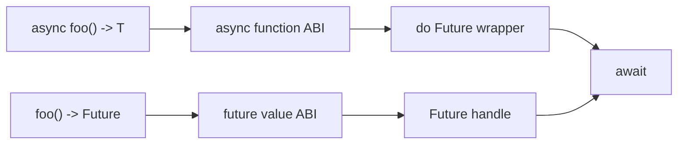
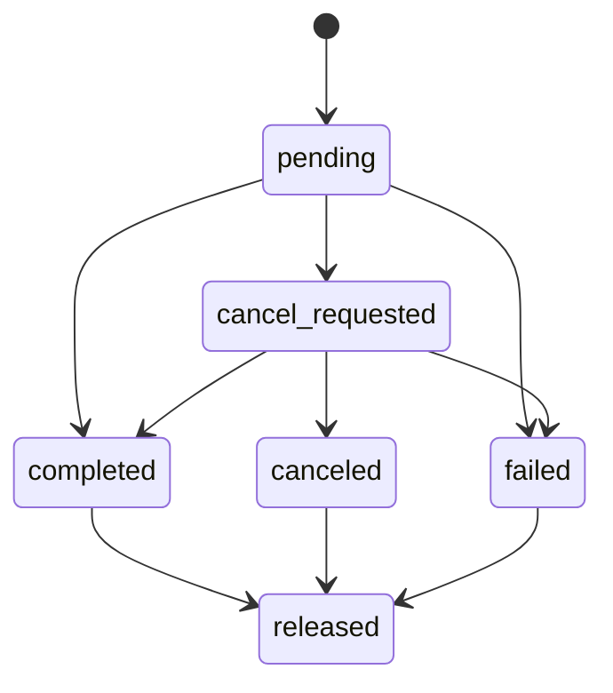
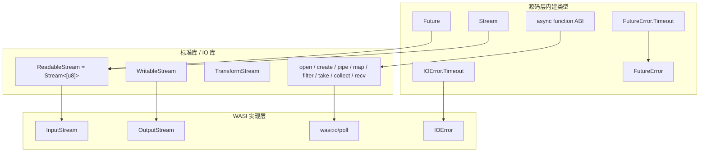

# 异步、Future 与 Host ABI 设计

**状态:** 未来设计计划 / 未授权实现。本文定义目标语法、类型规则、ABI 契约和 runtime 行为，不表示当前 compiler、codegen 或 runtime 已实现。

## 设计原则

- **显式异步**：同步函数、异步函数和显式 `Future<T>` 返回值有清晰边界
- **ABI 对齐**：异步函数 ABI 与 `future<T>` 值 ABI 独立建模，不互相伪装
- **类型边界**：`nil` 是空值/无值返回标记，不是类型；任何泛型参数位置都不能写入 `nil`
- 控制流用关键字，操作用函数
- `await`、`await_all`、`await_any`、`detach` 和 `yield` 是保留的 compiler/runtime special form；显式 runtime operation（例如 `@cancel`）使用 `@` 前缀

---

## 命名规则

| 大小写       | 类型                    | 例子                                                                          |
| :----------- | :---------------------- | :---------------------------------------------------------------------------- |
| **小写**     | 基础内置类型 / 类型语法 | `i8`, `u32`, `text`, `bool`, `[u8]`                                           |
| **大写开头** | 源码层命名类型          | `Tuple<T, U>`, `Future<T>`, `Stream<T>`, `StreamReader<T>`, `StreamWriter<T>` |

`Tuple<T, U>`、`Future<T>`、`Stream<T>` 跟 `i8`、`text` 一样都是编译器认识的内建类型，不需要通过声明来引入。它们使用大写，是因为它们是源码层的命名泛型类型；WIT/host ABI 中的 `future<...>`、`stream<...>`、`tuple<...>` 仍然只作为宿主类型名使用，不能泄漏为普通 do 源码类型。

`nil` 不作为类型参与泛型实例化：禁止 `Future<T | nil>`、`Stream<T | nil>`、`Tuple<T | nil>` 以及其他任何泛型参数中的 `nil`。函数可以使用 `() -> nil` 表示无返回值或返回空；异步序列的结束和错误通过 reader endpoint 的结果协议表达，不把 `nil` 当作元素或类型。需要在 Future 中表达“成功无值”时，使用专门的无值结果 ABI，不把 `nil` 塞入 `Future<T>` 的 `T`。

`InputStream`、`StreamError` 等通过 `@wasi_resource`、`@host` 声明的类型用大写开头，跟用户定义的类型一致。

---

## 函数形式

do 语言保留两种异步函数形式。它们都可以通过 `await` 使用，但用途和 ABI 不同：

```do
// 编译器管理异步调用边界；对应 async function ABI
async fetch(url text) -> [u8] | IOError { ... }

// 普通函数显式返回一个 Future 值；对应 future value ABI
make_fetch(url text) -> Future<[u8] | IOError> { ... }
```

两种形式的外部调用结果都可表示为 `Future<T>`，但编译器内部必须保留独立的函数效果标记：

```do
async foo() -> i8 { return 42 }

f Future<i8> = foo()
x i8 | FutureError = await(f)
```

约束：

```text
async foo() -> T          // async function ABI
foo() -> Future<T>        // future value ABI
async foo() -> Future<T>  // 禁止，避免 Future<Future<T>> 歧义
```

`async foo() -> T` 适合包含异步调用和挂起点的函数；`foo() -> Future<T>` 适合转发、组合或构造一个已有 Future。普通异步调用是 eager 的：调用即提交执行，不需要额外的启动操作。

### FutureError 的隐式传播

语言没有 `try` 关键字。`await` 的运行时错误分支不要求重复写入每个 async 函数的业务返回签名：当 `await` 的目标类型没有声明 `FutureError` 时，compiler 自动将 `FutureError` 传播到当前 async 函数返回的 Future；当调用方显式把 `FutureError` 写入局部结果类型时，代码可以用现有的 union 检查逻辑主动处理它。

```do
async fetch(url text) -> [u8] | IOError {
    // FutureError 不写入业务签名；失败时自动传播到 fetch 的 Future
    data [u8] | IOError = await(host_http_get(url))
    return data
}
```

该规则只适用于 `FutureError` 等 runtime 控制错误；`IOError`、`StreamError` 等业务错误仍然属于显式 union 分支，必须按正常返回值处理。

---

## 并发内建操作

以下操作需要编译器和运行时参与，属于内建 special form，不参与普通函数重载：

```do
await(foo())
await_all(f1, f2, ...)
await_any(f1, f2, ...)
detach foo()
yield()
@cancel(f1, f2, ...)
```

`await`、`await_all`、`await_any`、`detach` 和 `yield()` 都是 compiler/runtime 识别的 special form，不参与普通函数重载；其中等待和组合操作保留函数调用外形，以便表达参数和返回值。`@cancel` 是显式运行时协作取消操作。未来新增的 runtime intrinsic 必须遵循同一规则：影响控制流的保留关键字优先使用关键字形式，独立运行时操作使用 `@` 前缀。

---

## Future 等待

### `await(f)` / `await(f, timeout_ms)`

等待一个 Future 结束。它只挂起当前协程，不阻塞 OS 线程。

```do
// 无限等
r i8 | FutureError = await(f)

// 等待最多 5000ms；超时结束本次等待，并按 Future 能力发出取消请求
r i8 | FutureError = await(f, 5000)

```

签名：

```
await:       (Future<T>)                       → T | FutureError
await:       (Future<T>, u64)                  → T | FutureError
```

超时参数的最终解析优先级必须由 grammar 固定；本设计要求它仍然从 `await` 表达式开始时计时。

### `await_all(fs...)` / `await_all(fs..., timeout_ms)`

等待所有 Future 结束，不因某一个 Future 失败而提前返回。每个位置保留自己的成功或错误结果。带超时时使用一次共享 deadline，计时从 `await_all` 调用时开始。

参数列表是编译期固定的异构 Future 列表，返回值是同样固定布局的 Tuple；它不是运行时数组，也不是当前同类型 variadic 的隐式扩展。compiler 必须为每个具体参数列表检查类型、生成结果布局和组合控制块。

```do
// 等全部结束，成功和错误都保留
x i8 | FutureError, y text | FileError | FutureError = await_all(f1, f2)

// 未完成项返回 FutureError.Timeout
x i8 | FutureError, y text | FileError | FutureError = await_all(f1, f2, 5000)

```

签名：

```
await_all:   (Future<A | E1>, Future<B | E2>, ...)          → (A | E1 | FutureError, B | E2 | FutureError, ...)
await_all:   (Future<A | E1>, Future<B | E2>, ..., u64)     → (A | E1 | FutureError, B | E2 | FutureError, ...)
```

返回值按参数顺序对应。

`await_all` 的实际返回值是固定布局的 `Tuple`；示例中的多变量绑定是 compiler 提供的 Tuple 解构语法，不是运行时数组，也不是未定义的多返回值扩展：

```do
all_results = await_all(f1, f2)
x, y = all_results
```

### `await_any(fs...)` / `await_any(fs..., timeout_ms)`

等待任意一个 Future 结束。成功或错误都算结束；第一个结束的结果立即返回，并取消其他未完成 Future。

```do
idx usize, val i8 | FileError | text | NetworkError | FutureError = await_any(f1, f2)

// 5000ms 内没有 Future 完成则取消未完成项
idx usize, val i8 | FileError | text | NetworkError | FutureError = await_any(f1, f2, 5000)

```

签名：

```
await_any:   (Future<A | E1>, Future<B | E2>, ...)   → (usize, A | E1 | B | E2 | ... | FutureError)
await_any:   (Future<A | E1>, Future<B | E2>, ..., u64)
             → (usize, A | E1 | B | E2 | ... | FutureError)
```

返回 `(idx, result)`，`idx` 指示哪个 Future 先完成，`result` 保留该 Future 的成功或错误分支。

`await_any` 的 `(idx, result)` 同样是固定布局的 Tuple 解构；`idx` 是稳定的零基参数位置，`result` 的业务分支按该位置的 Future 类型生成。多个位置具有相同类型时，`idx` 仍然保留来源信息。

---

### 参数总结

| 函数        | 参数                        | 返回值                                                       |
| :---------- | :-------------------------- | :----------------------------------------------------------- |
| `await`     | `(f)`                       | `T \| FutureError`                                           |
| `await`     | `(f, timeout_ms)`           | `T \| FutureError`                                           |
| `await_all` | `(f1, f2, ...)`             | `Tuple<A \| E1 \| FutureError, B \| E2 \| FutureError, ...>` |
| `await_all` | `(f1, f2, ..., timeout_ms)` | `Tuple<A \| E1 \| FutureError, B \| E2 \| FutureError, ...>` |
| `await_any` | `(f1, f2, ...)`             | `(usize, A \| E1 \| B \| E2 \| ... \| FutureError)`          |
| `await_any` | `(f1, f2, ..., timeout_ms)` | `(usize, A \| E1 \| B \| E2 \| ... \| FutureError)`          |

---

## `Future<T>` 类型

`Future<T>` 是源码层一等类型，主要由以下机制产生或消费：

1. `async` 函数调用的源码层结果；
2. 显式返回 `Future<T>` 的用户函数；
3. host 函数返回的 WIT `future<T>` 值。

`async` 函数和显式 `Future<T>` 函数在源码层都可被 `await`，但 ABI 绑定不能混淆：前者使用 async function ABI，后者使用 future value ABI。普通同步函数不能在其调用边界上阻塞；需要异步调用时必须显式声明为 `async` 或返回 `Future<T>`。

### 源码到 WIT/ABI 的映射

| do 源码形式          | WIT 形式              | ABI 含义                                                          |
| :------------------- | :-------------------- | :---------------------------------------------------------------- |
| `async foo() -> T`   | `async func() -> T`   | 异步函数调用效果；调用可能挂起，结果通过 async function ABI 交付  |
| `foo() -> Future<T>` | `func() -> future<T>` | 普通函数返回显式 future 值；Future 句柄通过 future value ABI 交付 |
| `foo() -> T`         | `func() -> T`         | 同步函数调用，不允许在调用边界阻塞                                |

第一行和第二行的 ABI 不可直接互换。语言绑定可以提供 adapter，但 adapter 必须显式承担调度、Future 创建或结果转发成本。



`async foo() -> T` 的 do 调用结果由 compiler/runtime 包装为一个可 `await` 的语言 Future；这个 wrapper 持有 Component Model 的 async subtask，并负责完成、取消、超时和释放。`foo() -> Future<T>` 则直接传递显式 future value。两种 wrapper 不能共享同一套释放协议。

`FutureError` 是 do runtime 层的控制/生命周期错误，不是 host ABI 的业务 result。它由 `await`、Future 组合操作和取消/运行时协议产生，并在 async 函数边界隐式传播；源码函数的业务返回类型只声明业务错误，例如 `IOError`。compiler 在 host binding 边界不会把 `FutureError` 加入 WIT `result<...>` 或 `future<...>` 类型。导出到 WIT 的 async 函数若产生 `FutureError`，adapter 必须按 Component Model 的 cancellation/trap 策略结束调用，不能伪造为业务 variant。

无值函数使用：

```do
async close() -> nil
```

`nil` 只作为函数结果语法中的空值标记，runtime 内部用 unit/`void` 结果表示可等待的完成，不生成 `Future<nil>`。

```do
// async function ABI
async foo() -> i8 { return 42 }

// future value ABI
make_foo() -> Future<i8> { return 42 }

x i8 | FutureError = await(foo())
y i8 | FutureError = await(make_foo())
```

### Future 所有权

`Future<T>` 是一次性消费句柄，不是可复制的普通值：

1. `await`、`await_all`、`await_any` 消费传入的 Future；
2. 同一个 Future 不能被两个等待操作同时消费；
3. `await_any` 返回后，落选 Future 由组合操作负责请求取消和最终释放；
4. `@cancel` 幂等，但不会让已消费的 Future 重新可用；
5. Future 完成、取消或错误后，底层结果只能交付一次；
6. Future 不能被静默丢弃、覆盖或带出作用域而不转移所有权。编译器必须报告未消费的 Future。

编译器必须对 Future 句柄执行 move/use-after-wait 检查；runtime 仍需用原子状态转换保护跨线程竞争。

普通异步调用已经是 eager 的：

```do
a Future<i8> = foo()     // 立即启动
x i8 | FutureError = await(a) // 消费并完成 a 的生命周期
```

因此不再需要额外的启动操作。需要并发执行多个任务时，先保存多个 Future，再分别等待或组合等待即可：

```do
a Future<A> = foo()
b Future<B> = bar()

x A | FutureError, y B | FutureError = await_all(a, b)
```

需要故意脱离当前作用域、由 scheduler 接管生命周期的后台任务，必须显式使用 `detach`：

```do
detach refresh_cache()
```

`detach` 不返回可等待的 Future，并将 Future 的所有权转移给 runtime。runtime 负责持有任务 frame、处理完成/取消/错误，并在底层资源确认释放后回收任务。后台任务的业务错误必须发送到 runtime 的 detached-task error sink；没有配置 sink 时至少输出诊断，不得静默丢弃。`FutureError.Canceled` 不作为错误报告，`FutureError.Broken`、未处理的业务错误和安全 trap 必须按 runtime 的错误策略报告；trap 仍保持不可捕获的 Wasm 终止语义。

除 `detach` 外，普通 Future 的所有权必须最终通过 `await`、Future 组合操作、显式取消后的清理流程，或转移给调用者来闭合。`detach` 只适用于调用方不再需要结果或错误的后台任务。

### Future 组合生命周期

`await_all` 和 `await_any` 在 runtime 内部创建临时的组合控制块。该控制块不暴露为源码类型，但必须覆盖等待者、Future 注册、deadline 和迟到回调的完整生命周期。

```text
FutureGroup
├── waiter 状态
├── remaining_count 或 winner
├── deadline
└── 每个 Future 回调持有一个 group 引用
```

`await_all` 必须等所有 Future 都完成、取消或失败后才释放组合控制块。某个 Future 失败不会提前结束组合等待；每个位置都保留自己的成功或错误结果。

`await_any` 选择第一个完成的 Future 作为 winner，并立即向其他未完成 Future 发出取消请求。调用方收到 winner 后，loser 的迟到完成只能执行清理，不能再次唤醒已经返回的等待者。所有 loser 的 host handle、协程 frame 和回调引用完成清理后，组合控制块才能释放。

组合等待超时后，等待者可以先返回 `FutureError.Timeout`；未完成 Future 仍由 runtime 持有，直到取消被确认或底层操作最终完成。迟到结果只能释放或丢弃，不能重新交付给已返回的等待者。

### `defer` 与跨 `await` 的资源生命周期

`await` 只保存当前 coroutine frame 并挂起执行，不触发词法作用域的 `defer`。注册的清理动作必须在对应作用域正常离开时按 LIFO 顺序执行：

```do
async read_data() -> nil {
    data = open_data()
    defer close_data(data)

    await(read_async())
    return nil
}
```

编译器必须分析每个 `await` 之后仍然存活的局部值：

1. `await` 之后仍会使用的 managed value 提升到 coroutine frame；
2. 只在挂起前使用完的值在挂起前释放；
3. 已注册的 `defer` 动作和其所需值一并保存在 frame；
4. 正常返回、错误返回和协作取消在最终退出路径执行尚未执行的 `defer`；
5. Wasm safety trap 或宿主硬终止不承诺执行语言层 `defer`。

Future、Stream endpoint 和 host resource 都遵守同一条规则。语言不提供指针或引用，并不改变跨 `await` 的 ownership 约束；它只意味着这些值必须通过编译器生成的 frame 和 release plan 管理。

### `Future`/`Stream` 与 Go channel 的对比

|           | Go channel              | do Future / Stream                   |
| :-------- | :---------------------- | :----------------------------------- |
| 方向      | 收发成对                | 只消费一次（Future）或多次（Stream） |
| 同步/异步 | 阻塞式 channel 通信     | 通过 `await` 挂起协程                |
| 超时      | `select` + `time.After` | `await(f, timeout_ms)`               |
| 取消      | 关闭 channel + 传播     | `@cancel(fs...)` 内建                |
| 多路复用  | `select` 语句           | `await_all` / `await_any`            |
| 底层模型  | CSP（通信顺序进程）     | Future/Promise（一次性结果）         |

Go 的 `chan T` 是双向通信管道，适合生产者-消费者场景。`Future<T>` 是一次性结果的容器，适合 RPC、IO 等单次异步操作。两者不冲突。

### Stream endpoint 生命周期

Stream 暂时不暴露 `recv(stream)` 语法，也不把 reader/writer 当作普通 `InputStream` / `OutputStream` 资源。`newStream<T>` 返回一对 compiler-managed endpoint handle：源码层分别视为 `StreamReader<T>` 和 `StreamWriter<T>` 能力值。reader 每次调用请求下一项，writer 每次调用提交一项；两者的调用结果都通过 `await` 消费。它们不是捕获闭包；当前语言没有捕获闭包，endpoint 的状态由 runtime handle 持有，调用语法由专门 lowering 处理。

构造签名固定为：

```text
newStream<T>(capacity: u32) -> (StreamReader<T>, StreamWriter<T>)
```

`StreamReader<T>` 和 `StreamWriter<T>` 是 compiler-managed opaque capability 类型：可以传递、保存和进入 coroutine frame，但不能由源码直接构造、转换或伪造。`StreamWriter<T>` 是可复制的共享 capability；每个副本对应一个独立 producer lease。

endpoint 的调用结果布局固定如下：

```text
StreamRead<T> = Item(value: T) | Done
StreamWriteResult = Accepted | StreamError
reader()      -> Future<StreamRead<T> | StreamError>
writer(T)     -> Future<StreamWriteResult>
```

`StreamRead<T>.Done` 是终止分支，不携带 `T` 值；源码层的 `is_done` 只是在循环 sugar 和显式 lowering 中对该分支的布尔投影。`FutureError` 由 `await` 按隐式传播规则处理，不重复嵌入 endpoint 的业务结果。这样 EOF 不需要伪造 `nil` 元素，也不会让 `T` 泛型参数包含 `nil`。

`Stream<T>` 是异步序列的抽象协议类型，不是 `StreamReader<T>` 或 `StreamWriter<T>` 的别名，也不能直接调用。源码构造器返回 endpoint pair；标准库或 host adapter 可以把外部 `Stream<T>` 接口适配成 reader/writer pair。WIT 的 `stream<...>` 只在 host ABI 边界映射到抽象 `Stream<T>`，实际源码消费仍使用对应 endpoint。

```do
reader, writer = newStream<i8>(capacity: 16)

await(writer(123))

a = produce_a(writer)
b = produce_b(writer)
await_all(a, b)

defer close(writer)

loop {
    item, err = await(reader())

    if @is(err, StreamError) {
        return err
    }

    if @is(err, FutureError) {
        return err
    }

    if @is(item, Done) {
        break
    }

    v = @get(item, .value)
    use(v)
}
```

暂定约束：

1. reader 只允许单 consumer；writer 默认支持多 producer；
2. `writer` 是可直接传递的共享 `StreamWriter<T>` handle，不需要显式 `clone_writer`。writer 是 Stream endpoint 的例外：赋值、参数传递、返回和跨 `await` 保存都会隐式创建一个 producer lease；这些 lease 指向同一个 endpoint，但每个 lease 都有独立的关闭状态；
3. `reader()` 和 `writer(value)` 都是 eager 异步调用，调用后立即提交对应操作；
4. reader 无数据时挂起当前协程，writer 受背压时也可以挂起；
5. `close(writer)` 消费当前 producer lease；关闭后该 handle 不能再次调用。只有所有 producer lease 都关闭或释放后，reader 才收到 EOF；
6. endpoint 离开作用域或 consumer 被取消时，runtime 必须取消 producer、关闭另一端并释放底层 handle；
7. `abort(writer, err)` 的签名是 `(StreamWriter<T>, StreamError) -> nil | StreamError`；它消费当前 writer lease，并尝试将整个 endpoint 从 `open` 原子转换为 `aborted(err)`；所有其他 writer 立即失效，等待中的 writer 返回 `StreamError.Closed`；
8. EOF 不是 `nil` 元素；它必须通过 reader 的结果协议表达，并且不能与普通 `StreamError` 混淆。

### 容量、背压与多生产者

`newStream<T>(capacity)` 的 `capacity` 是 endpoint 的元素缓冲容量，不是 Future 数量或线程数量：

1. `capacity > 0` 创建有界缓冲区；缓冲区满时，`writer(value)` 进入 runtime 写入等待队列并挂起当前协程，恢复后的线性化顺序以 runtime 入队顺序为准，直到有空间、endpoint 终止或 writer lease 失效；
2. `capacity == 0` 创建 rendezvous stream；只有 reader 已经等待同一项时，`writer(value)` 才能成功线性化，不缓存元素；
3. 多个 writer 的公平性只保证 runtime 入队后的 FIFO 线性化顺序，不保证源码提交顺序、OS 线程抢占顺序或跨 producer 的严格轮询；
4. abort 不丢弃已经成功入队的值；buffer 排空后交付终止错误，尚未线性化的写入按 `StreamError.Closed` 失败；
5. `capacity` 必须在构造时校验为 `u32`；超过 runtime 配额时构造失败，不隐式改成无界缓冲。

`close(writer)` 只结束当前 lease，不会关闭其他 producer 的 lease。未显式关闭的 lease 在其所有者作用域离开时执行 release；runtime 只有在 producer lease 计数归零后才关闭写端并发布 EOF。

Stream endpoint 状态只能按以下方向转换：

```text
open -> eof                  // 所有 writer lease 关闭，缓冲区排空
open -> aborted(StreamError) // 任意 writer 显式 abort
```

`aborted` 是终态。已经在线性化点提交到 buffer 的值必须先按 FIFO 交付，buffer 排空后 reader 返回 `StreamRead<T>.Done` 和保存的终止错误；尚未提交的 `writer(value)` 和背压等待者返回 `StreamError.Closed`。之后的 `writer(value)` 也返回 `StreamError.Closed`。`eof` 是另一终态，之后的 `reader()` 立即返回 `StreamRead<T>.Done`。循环 sugar 将该分支投影为 `is_done = true`。`abort` 与最后一个 `close` 竞争时使用原子 CAS，只有一个终态转换生效；对已终止 endpoint 的 abort 返回 `StreamError.Closed`。

`writer(value)` 的线性化点是“endpoint 仍为 `open` 时成功入队”。如果 abort 先完成 CAS，写入不得入队；如果写入先成功入队，abort 不能撤销该次成功写入，只能在 buffer 排空后交付终止错误。

`Future<T>` 的消费入口是 `await(f)`；stream endpoint 的消费入口是 `await(reader())`。二者不允许互换。`Future<T>` 完成前不可读取 payload；reader 的每次调用只交付一个元素或一个明确的终止/错误结果。

### Stream 循环语法糖

Stream 提供一个高层消费形式，用于最常见的“逐项读取直到 EOF”场景：

```do
loop value, err = reader() {
    if @is(err, StreamError) {
        return err
    }

    if @is(err, FutureError) {
        return err
    }

    use(value)
}
```

编译器将其 lower 为显式 endpoint 等待：

```do
loop {
    item, err = await(reader())

    if @is(err, StreamError) {
        return err
    }

    if @is(err, FutureError) {
        return err
    }

    if @is(item, Done) {
        break
    }

    value = @get(item, .value)
    use(value)
}
```

循环语法隐藏 `is_done`，但不隐藏 `StreamError` 或 `FutureError`。它只适用于单 reader 的顺序消费；需要超时、取消、手动交错读取或观察终止状态时，使用显式 `await(reader())`。该语法是源码层 sugar，不新增 host ABI。

### Future 返回值糖

显式返回 `Future<T>` 的函数可以用普通 `T` 返回值表示一个立即完成的 Future：

```do
ready() -> Future<i8> {
    return 42
}
```

编译器将 `return 42` lower 为已完成的 `Future<i8>`。Future 不提供源码字面量或内部句柄构造；异步 Future 只能来自异步函数、host binding、标准库或其他 Future 组合操作。

### Directory Stream 示例

目录读取可以返回一个 reader endpoint；条目、EOF 和错误通过每次 reader 调用的异步结果协议交付。`Tuple` 是内建类型；也可以用多返回值包装，避免调用方手动拆 Tuple：

```do
read_directory(dir Dir) -> StreamReader<DirEntry> | DirError {
    reader, writer = newStream<DirEntry>(capacity: 16)
    host_bind_directory_producer(dir, writer)
    return reader
}

// host_bind_directory_producer 保留 writer lease，并负责最终 close/abort。

list_dir_names(dir Dir) -> [text] | DirError | FutureError {
    reader = read_directory(dir)
    if @is(reader, DirError) {
        return reader
    }
    names [text] = []

    loop entry, err = reader() {
        if @is(err, DirError) {
            return err
        }
        if @is(err, FutureError) {
            return err
        }
        names = append_name(names, @get(entry, .name))
    }
    return names
}
```

`host_bind_directory_producer` 是一个 host adapter 边界操作：它必须保留传入 writer copy 对应的 producer lease，并在目录枚举正常结束时调用 `close(writer)`，在目录错误或 host 取消时调用 `abort(writer, err)`。`read_directory` 的局部 writer lease 离开作用域只关闭本地 lease，不得关闭 adapter 持有的 lease；adapter 必须保证无论成功、失败还是取消都最终结束该 lease。

---

## 异步 Host ABI

通用 host 声明、资源、variant、常量和库导入见 [host-binding-design.md](host-binding-design.md)。本节只规定异步函数与 `Future<T>` 的 ABI 映射。

WIT 的 `async func(...) -> T` 与 `func(...) -> future<T>` 是两种独立 ABI。前者在 do 中写成 `async (...) -> T`，后者写成 `(...) -> Future<T>`；二者不能直接互换。编译器必须从 WIT registry 校验声明的函数效果和结果类型。

下面的 member 名称是 ABI 形态占位符，不代表正式 WASI 接口名称。

设计依据：

- Component Model: <https://github.com/WebAssembly/component-model/blob/main/design/mvp/Explainer.md#asynchronous-value-types>
- WIT function types: <https://github.com/WebAssembly/component-model/blob/main/design/mvp/WIT.md>
- Canonical ABI: <https://github.com/WebAssembly/component-model/blob/main/design/mvp/CanonicalABI.md>
- WASI IO streams: <https://github.com/WebAssembly/wasi-io/blob/main/wit/streams.wit>

### `@host_func`

函数签名中的 `async` 与 `Future<T>` 分别对应两种 ABI：

```do
// WIT: async func(...) -> result<list<u8>, stream-error>
host_async_read = @host_func(
    "package",
    "async-member",
    async (InputStream, u64) -> [u8] | StreamError
)

// WIT: func(...) -> future<result<list<u8>, stream-error>>
host_future_read = @host_func(
    "package",
    "future-member",
    (InputStream, u64) -> Future<[u8] | StreamError>
)
```

二者都可以这样消费：

```do
data [u8] | StreamError | FutureError = await(host_async_read(stream, 4096))
data [u8] | StreamError | FutureError = await(host_future_read(stream, 4096))
```

但它们的组件类型和 Canonical ABI 不同，不能把一个声明直接替换成另一个。`@host_func` 只表示“声明一个 host 函数”；异步效果或 `Future<T>` 结果由签名决定。

---

## 超时与取消

所有等待操作的超时时间都从等待函数调用时开始计算。这个 timeout 只约束当前等待者，不是对底层副作用的事务回滚保证：

```do
a = foo()
result i8 | FutureError = await(a, 5000)
```

这里的 `5000` 是当前等待操作的 deadline，不是从 `foo()` 启动时计算。Future 必须在创建时记录 `started_at`，用于运行时统计、诊断和后续调度策略，但不能把它混入等待超时的起算点。超时不能撤销已经提交的 host 副作用；如果具体 Future 不支持安全取消，底层操作继续由 runtime 持有并完成清理。

操作级超时必须由具体操作定义，而不是假设 `await` 可以回滚操作：

```do
f = write(data, timeout: 5000)
result = await(f)
```

可能部分提交的 host I/O 必须在自身结果中报告进度，例如 `written` 字节数和 `IOError.Timeout`；不能只返回一个没有进度信息的 `FutureError.Timeout`。只有明确以完整 `T` 为线性化单元的 `StreamWriter<T>` 入队，才允许规定为“完整提交或未提交”。

`await_all(f1, f2, 5000)` 使用一个从调用时开始的共享 deadline；未完成位置返回 `FutureError.Timeout`。`await_any(f1, f2, 5000)` 在 deadline 前没有任何 Future 完成时请求取消所有未完成项并返回 `FutureError.Timeout`。

---

## 取消

### `@cancel(fs...)`

取消一个或多个 future。支持多参数。

```do
@cancel(f)              // 请求取消一个
@cancel(f1, f2, f3)     // 请求取消多个
```

签名：

```
@cancel: (Future<A>, Future<B>, ...) → void
```

取消是 cooperative cancellation：只发出取消请求，不承诺立即终止底层 host I/O。Future 必须最终进入 `completed`、`canceled` 或错误状态；取消操作幂等。显式取消并在之后等待时，取消结果通过 `FutureError.Canceled` 交付。

### 完成、取消与超时的竞态

Future 的底层完成/取消状态和当前等待者的 timeout 状态必须分开管理。两者都需要原子状态转换决定 winner：

```text
pending -> completed          // Future 结果先提交
pending -> cancel_requested   // await/await_all/await_any/cancel 发出请求
cancel_requested -> canceled  // 可取消边界确认取消
cancel_requested -> completed // waiter 仍在等待时交付，否则仅清理并丢弃
pending -> failed             // Future 自身失败或 runtime 交付失败
cancel_requested -> failed    // 取消请求后底层报告错误
```



runtime 必须明确维护两套状态：

```text
FutureState:
pending -> completed
pending -> cancel_requested -> canceled
pending -> cancel_requested -> failed
pending -> failed

WaitState:
waiting -> completed
waiting -> timed_out
waiting -> returned
```

Future 的终态表示底层任务和资源的状态；`WaitState` 只表示本次等待者是否已经得到结果。两者不能互相覆盖：等待者超时后，Future 仍可以稍后进入 `completed`、`canceled` 或 `failed`，但迟到结果只能执行清理，不能再次唤醒 `returned` 的等待者。

完成、取消请求、取消确认和 deadline 竞争时，使用原子 CAS 选择唯一 winner。Future 结果提交成功后，等待者必须通过 acquire 读看到完整 payload；结果发布方使用 release 写发布状态和 payload。`await`、`@cancel`、`await_all` 和 `await_any` 都必须复用这一套转换协议。

等待注册必须使用握手，不能采用“先检查未完成、再异步注册”的无保护顺序：

```text
await worker:
  1. 为本次等待分配 waiter_id + generation
  2. 将 waiter 状态 CAS 为 registering
  3. 向 io_coordinator.command_queue 提交 register_wait
  4. 挂起当前 coroutine

coordinator:
  5. 处理 register_wait，并注册 poll/timer
  6. 重新检查 FutureState
  7. 如果 Future 已经完成，直接完成 waiter，不等待下一次事件

Future completion / timeout:
  8. 通过 waiter_id + generation CAS 唤醒唯一 waiter
```

Future 可以在第 2 步之后、第 5 步之前完成；coordinator 的重新检查保证这种完成不会丢失。迟到的 registration 或 timer 通过 generation 校验后丢弃。

等待者的超时不把底层 Future 伪装成 `completed`：

```text
wait_pending -> wait_timed_out -> waiter_returned
```

超时返回后，runtime 继续持有未完成 Future、协程 frame 和 host handle，直到取消被确认或 host 最终完成；迟到结果只能被释放/丢弃，不能重新唤醒已返回的等待者。只有在底层资源清理完成后，Future 控制块才能释放。

```do
// 等待操作超时；可取消的 Future 会收到 cancel 请求
r i8 | FutureError = await(f, 5000)
```

---

## FutureError 与 IOError

两者都可以作为 Future 的错误分支，但来源不同：

```do
FutureError = Canceled | Timeout | Broken
IOError = Timeout | NotFound | PermissionDenied | ...
```

`FutureError.Timeout` 表示 `await`、`await_all` 或 `await_any` 自己的等待 deadline 到期；它不要求底层操作是 I/O。`IOError.Timeout` 只表示 host I/O 操作自身报告超时，例如文件、网络或 WASI 调用超时。

`FutureError.Canceled` 表示取消请求已经在可取消边界生效。`panic`、数组越界和 Wasm safety trap 不转换为 `FutureError` 或 `IOError`，直接终止当前执行。

`FutureError.Broken` 只表示 runtime 无法完成 Future 协议，但仍能安全交付一个 typed error，例如 host future 协议返回非法终态、已注册的 host resource 在操作期间失效，或 coordinator 拒绝一个仍有效的 registration。此时 runtime 执行 `pending -> failed(Broken)`，释放相关 payload 和 host handle，并唤醒等待者。compiler/runtime 内部 invariant 破坏、Wasm safety trap 和进程级终止不转换为 `Broken`。

`FutureError` 不能被静默丢弃。async 函数中由 `await` 触发的 `FutureError` 按上述规则自动传播；显式保存为 union 值时，调用方必须检查它或将它作为当前函数的结果返回。语言不提供 `try` 关键字。

---

## 对照 JS Promise

| JS                   | do                 | 语义                             |
| :------------------- | :----------------- | :------------------------------- |
| `Promise.allSettled` | `await_all(fs...)` | 等所有完成，收集结果             |
| `Promise.race`       | `await_any(fs...)` | 第一个完成，取消其余             |
| -                    | `await(f)`         | 等单个 Future                    |
| -                    | `await(f, ms)`     | 等待指定时间，超时按能力请求取消 |
| -                    | `@cancel(fs...)`   | 主动请求取消                     |

---

## 内置类型 `Timeout`

超时按来源分为两类：`FutureError.Timeout` 表示 `await`、`await_all` 或 `await_any` 的等待 deadline 到期；`IOError.Timeout` 表示 host I/O 操作自身超时。Future 的取消或 panic 仍属于 Future 生命周期错误；两类 timeout 不能互相替代。

```do
IOError error = NotFound | PermissionDenied | Timeout | ...
```

用户不需要显式导入或声明 `Timeout`。`IOError.Timeout` 默认出现在 host I/O 结果中；`FutureError.Timeout` 默认出现在带 deadline 的等待结果中。

---

### 分层架构



核心类型（`Future<T>`、`Stream<T>`）是编译器认识的源码层内建泛型，IO 库的类型和函数是标准库提供的。WASI 绑定中的 WIT `future<...>` / `stream<...>` 只在 host ABI 边界出现；WIT 的 `async` 函数效果则映射为 do 函数签名中的 `async` 标记。WASI 只是 IO 库的一种实现来源——同一套接口也可以对接浏览器文件、原生文件系统。

---

## 完整示例

```do
// async function ABI
async foo() -> i8 {
    return 42
}

// future value ABI
make_bar() -> Future<text> {
    return "hello"
}

// 异步调用立即提交
a Future<i8> = foo()
b Future<text> = make_bar()

// 等其中一个先完成，等待从 await_any 调用时开始计时
idx usize, val i8 | FileError | text | NetworkError | FutureError = await_any(a, b, 5000)

// 或者使用另一批 Future 等全部完成，分别保留成功或错误
c Future<i8> = foo()
d Future<text> = make_bar()
x i8 | FutureError, y text | FutureError = await_all(c, d)

// 另一批尚未等待的 Future 可以主动取消
c Future<i8> = foo()
d Future<text> = make_bar()
@cancel(c, d)
await_all(c, d)
```

---

## 运行时设计

### 设计目标

- 用户不需要手动管理线程/协程
- 异步函数调用立即提交一个协程，`await` 只挂起当前协程但不阻塞 OS 线程
- 单线程模式仍然支持异步 I/O；等待期间把控制权交还 host event loop，不是无异步能力的降级模式
- **支持两种运行模式：**
    - **单线程模式**：浏览器、WASI 无线程支持、`THREADS=1`
    - **多线程模式（M:N）**：原生、WASI with threads，N = CPU 核心数
- 编译到 WASM + WASI 0.3，以及浏览器和原生平台

实现阶段边界：本文描述未来目标语义和 backend。当前仓库 v1 只承诺 `THREADS=1` 的单线程 runtime；多线程 coordinator、worker、work-stealing、Wasm threads 和 `wait32/notify` 属于后续 backend。增加多线程 backend 不得改变源码层 `Future`、`Stream`、`await`、取消和超时语义。

### 无栈协程方案

Go 的 goroutine 是 runtime 管理的、带可增长独立栈的 stackful goroutine。这里的异步任务不是 fiber，而是由编译器生成 frame 的 stackless coroutine；它只能在 `await` 等已知挂起点暂停。

这里采用 **无栈协程（stackless coroutine）**——编译器将含异步调用/`await` 的函数编译成状态机：

```
含有 async 调用/await 的函数 → 编译器拆成状态机
                        每个 yield 点是一个状态
                        运行时维护协程的唤醒队列
```

```do
// 用户代码——看起来像 goroutine
async fetch(url text) -> [u8] | IOError {
    data [u8] | IOError = await(host_http_get(url))  // yield 点；FutureError 自动传播
    return data
}

run() {
    f1 Future<[u8] | IOError> = fetch("/a")
    f2 Future<[u8] | IOError> = fetch("/b")
    r1 | FutureError = await(f1)   // yield 点
    r2 | FutureError = await(f2)
}
```

编译器把 `run` 翻译成状态机：

```
状态 0: 调用 fetch("/a") → 创建第一个协程，跳到状态 1
状态 1: 调用 fetch("/b") → 创建第二个协程，跳到状态 2
状态 2: await(f1) → 如果 f1 未完成，注册唤醒回调，让出
状态 3: await(f2) → 如果 f2 未完成，注册唤醒回调，让出
状态 4: 完成
```

无栈协程的好处：在所有平台上编译方案一致，区别只在于底层的调度器实现。

### 状态机与回调的关系

回调不是状态机的替代物，而是 continuation 的另一种表示。下面两种形式都必须保存恢复所需的局部变量和下一步执行位置：

```text
显式状态机：frame.state + frame.locals + resume(frame)
回调形式：   callback/closure + captured locals + callback(data)
```

因此，compiler 可以先把 `await` lower 为 callback，也可以直接生成 `state_N` 函数；两者的 runtime 仍然需要 Future、frame/closure 和 resume 入口。do 的规范不暴露这层实现选择，Wasm 目标默认采用显式 stackless frame/state machine。

### 单线程异步边界

单线程模式可以并发推进多个异步 I/O，但不能并行执行 CPU 代码：

```do
f1 Future<Data> = read_async(file_a)
f2 Future<Data> = read_async(file_b)
a Data | FutureError = await(f1)
b Data | FutureError = await(f2)
```

两个 I/O 操作可以同时交给 host，scheduler 在 `await` 处交还 event loop。相反，未包含 `await` 或 `yield()` 的 CPU 密集协程会一直运行到结束，可能独占单线程 scheduler。

### 调度公平性

v1 使用协作式调度，不承诺自动抢占：

```do
async compute() -> i8 {
    loop {
        heavy_work()
        yield()
    }
}
```

`await(...)` 和 `yield()` 都是让出点。`yield()` 只重新把当前 coroutine 放入 ready queue，不等待外部事件。没有让出点的 CPU 协程可能独占单线程 scheduler；调用方必须拆分 CPU 工作或显式调用 `yield()`。

后续可以增加 compiler safepoint 或 instruction budget，实现更强的协作式公平调度，但不得改变 `Future` / `await` 的语义。

当前只定义无参数的调度让出：

```text
yield() -> nil
├── 保存跨 yield 存活的局部值到 coroutine frame
├── 将当前 coroutine 放回 ready queue
└── 返回 scheduler
```

`yield(value)` 不属于当前异步设计，也不能在普通 async 函数中作为重载使用。将来如果增加 generator，生成器的产值语法必须在独立的 generator 上下文中单独定义；Stream 当前通过 `writer(value)` 发送数据。

### THREADS

`THREADS` 决定 worker 数量，不包含独占 poll/timer 的 coordinator：

| 平台       | 检测方式                             |
| :--------- | :----------------------------------- |
| **浏览器** | `navigator.hardwareConcurrency`      |
| **WASI**   | 编译期常量或 `wasi:threads` 的线程数 |
| **原生**   | `std:thread.availableCores()`        |

v1 默认值为 `1`。`THREADS=1` 时 coordinator 与唯一 worker 合并为一个 OS 线程；`THREADS > 1` 时总 OS 线程数为 `THREADS + 1`，即一个 coordinator 加 `THREADS` 个 worker。自动检测 CPU 逻辑核心数不属于 v1 默认行为。

## 运行模式对比

|                 | 单线程异步模式             | 多线程模式（M:N）                  |
| :-------------- | :------------------------- | :--------------------------------- |
| OS 线程数       | 1                          | `THREADS + 1`（未来显式配置）      |
| 协程队列        | 1 个全局队列               | 每线程 1 个本地队列 + 1 个全局队列 |
| 负载均衡        | 不需要                     | work-stealing                      |
| 线程同步        | 无需锁                     | atomics / mutex                    |
| 异步等待        | host poll/callback + yield | host poll + worker park/unpark     |
| `wait32/notify` | 不使用                     | 只用于 OS 线程 park/unpark         |
| 适用场景        | 浏览器、无线程 WASI        | 原生、WASI with threads            |
| 设置方式        | `THREADS=1`                | 显式 `THREADS > 1`（未来 backend） |

### 平台适配

| 平台                         | 线程支持                     | 默认模式                        |
| :--------------------------- | :--------------------------- | :------------------------------ |
| **WASI（无 threads）**       | ❌ OS 多线程                 | 单线程异步                      |
| **WASI with threads**        | ✅ `wasi:threads` + 共享内存 | v1 单线程；未来可启用多线程 M:N |
| **浏览器**                   | ✅ Web Worker                | v1 单线程 host event loop       |
| **原生 Linux/macOS/Windows** | ✅ pthread / Win32           | v1 单线程；未来可启用多线程 M:N |

### 主线程与 worker 线程

多线程模式使用独立的 coordinator + worker：coordinator 独占宿主事件、timer、Future 完成和任务分发，不执行 worker coroutine；worker 线程从本地队列或全局队列取任务并执行，没有任务时通过 `wait32` 休眠。单线程模式由同一个线程兼任 coordinator 和 processor。

```text
coordinator 线程
├── 接收 host I/O 和 timer 完成事件
├── 将 ready coroutine 放入队列
├── notify 唤醒休眠 worker
└── 独占 poll_set 和 timer_heap

worker 线程
├── 执行本地队列中的 coroutine
├── 必要时从全局队列取任务或 work-stealing
├── await 后把 frame 交回 scheduler
└── 无任务时 wait32 休眠
```

coordinator 是否使用主线程是平台启动策略，不是语言语义。多线程模式下 coordinator 不加入 worker processor 集合，以保持 `poll_set` 和 `timer_heap` 的单一 owner；这会保留一个专用事件线程，但避免多个 scheduler 并发访问宿主 poll 状态。单线程模式不额外创建 coordinator 线程。

调度约束：

1. 一个 coroutine frame 同一时刻只能由一个 OS 线程执行；
2. `await` 返回后，frame 可以由不同 worker 恢复，不默认绑定创建线程；
3. Future 完成、队列入队和取消请求使用原子状态转换；
4. 需要线程亲和性的 host resource 必须由 binding 显式标记并限制调度。

### 核心数据结构

```
// 每个异步调用分配一个，存跨 yield 需要的所有状态
struct coroutine_frame {
    state: u32,              // 当前执行到哪一段
    // 跨 yield 存活的局部变量
    url_ptr: i32,            // fetch 的参数
    url_len: i32,
    data_ptr: i32,           // future 结果
    data_len: i32,
    future_id: i32,          // 正在等的 future
}


// future——底层 i32 句柄；状态通过原子 CAS 转换
struct future_handle {
    id: i32,
    coroutine_id: i32,       // 等待此 future 的协程
    pollable: i32,           // WASI pollable 句柄
    started_at_ms: i64,      // Future 创建时记录的单调时钟
    state: atomic<FutureState>,
}

enum FutureState {
    pending,
    cancel_requested,
    completed,
    canceled,
    failed,
}

// 线程调度上下文
struct processor {
    local_queue: lock_free_queue,
    wait_table: hash_table,
}

// I/O coordinator 独占宿主事件和 deadline 索引
struct io_coordinator {
    poll_set: wasi_poll_set,
    timer_heap: min_heap,
    command_queue: lock_free_queue,
}
```

`poll_set` 和 `timer_heap` 只能由 `io_coordinator` 访问。worker 通过 `command_queue` 提交注册、取消和 deadline 更新请求；coordinator 负责 poll、timer 到期和 Future 唤醒，再把 ready coroutine 放回全局或本地队列。

每个 poll/timer 注册项都带有 `future_id + generation`。Future 完成、取消或超时后先使注册项逻辑失效；timer heap 允许保留无效旧条目，在弹出时检查 generation 并丢弃。Future 控制块只有在所有 callback、poll registration 和 timer entry 都不再引用后才能释放。

### 调度器设计（M:P:G 模型）

跟 Go 一样，一套调度器通吃单线程和多线程。区别只在 P 的数量。

```
G (coroutine) = 协程
P (processor) = 调度上下文，持有本地队列
M (machine)   = OS 线程

THREADS = 1  → 1 个合并的 coordinator/worker M，没有 work-stealing
THREADS > 1  → 1 个 coordinator M + THREADS 个 worker M/P
```

```
THREADS=1:               THREADS=N:

 M ── P ── 本地队列          M0 coordinator ── poll_set / timer_heap
       │                    M1 ── P1 ── 本地队列1 ──┐
       wait_table           M2 ── P2 ── 本地队列2 ──┤── steal
       host poll/callback  ...                     ┘
                             workers wait32/notify
```

worker 使用同一个 scheduler 循环；单线程模式额外由同一线程执行 coordinator poll：

```
fn scheduler(pid) {
    loop {
        // 1. 从本地队列取就绪协程
        g = local_queue.pop()
        if g != null { g.resume(); continue }

        // 2. 尝试 steal（N=1 时 steal 总是空，快速跳过）
        for other in processors {
            g = steal(other.local_queue)
            if g != null { g.resume(); continue }
        }

        // 3. 全局队列
        g = global_queue.pop()
        if g != null { g.resume(); continue }

        // 4. 都没有 → 是否还有协程在等待？
        if wait_table.not_empty() {
            if N == 1 {
                // 单线程：不能 block（会卡死自己），先检查一次 ready()
                ready = io_coordinator.poll_ready()
                if ready != null { wake(ready); continue }
                // 仍在等待外部事件：注册宿主回调并把控制权交还宿主
                io_coordinator.register_host_resume()
                return yield_to_host()
            } else {
                // 多线程 worker 不访问 poll_set；coordinator 负责 poll
                park()
                continue
            }
        }

        // 5. 没任何事情可做了
        if N == 1 {
            return runtime_idle()  // 无就绪任务、无外部等待；由入口决定是否结束
        } else {
            // 多线程 → park（休眠后被 unpark 唤醒）
            if all_parked() && wait_table.empty() {
                return runtime_idle()  // 由入口决定是否结束
            }
            park()
        }
    }
}
```

启动时：

```
fn runtime_start(user_main) {
    n = THREADS
    if n == 1 {
        enqueue_global(create_root_task(user_main))
        scheduler(0)  // 单线程：同一线程兼任 coordinator 和 processor
        return
    }

    enqueue_global(create_root_task(user_main))
    for i in 1..=n {
        create_thread(scheduler, i)  // worker 线程
    }
    io_coordinator_loop()  // 主线程作为唯一 coordinator
}
```

runtime shutdown 由 root task 的终态触发，不由任意 worker 自行退出：

```text
root task completed/failed
├── coordinator 停止接收新的 Future/Stream 注册
├── 对 detached task 发出取消请求
├── 等待所有 Future、Stream lease、FutureGroup、poll registration 和 timer entry 清理完成
├── notify 所有 worker，并等待 worker join
├── 释放 coordinator 和 runtime 全局资源
└── 返回 root task 的最终结果
```

`detach` 不延长 root task 的生命周期；root task 结束后，detached task 进入统一 shutdown cancellation。只有资源清理完成，`runtime_start` 才能返回。shutdown 阶段产生的取消结果不重复发送到 detached-task error sink。

### async / await / await_all / await_any / @cancel 实现

```
async foo() -> T
├── 分配一个协程控制块
├── 初始状态设为 0
├── 立即放入本地队列（多线程）或全局队列（单线程）
└── 调用方得到一个 Future<T> 句柄
```

显式 Future 函数可以转发已有 Future，而不创建第二层 Future：

```
foo() -> Future<T>
└── 返回 host 或其他函数产生的 Future<T>
```

```
await(f) → T | FutureError
├── 检查 f 是否已完成
│   ├── 已完成 → 直接取结果返回
│   └── 未完成 →
│       ├── 当前协程注册到 f 的等待列表
│       ├── 保存当前状态机的下一个状态
│       └── yield（让出执行权给调度器）
├── 被唤醒后 → 取结果返回
```

```
await_all(f1, f2, ...) → Tuple<T1 | E1 | FutureError, T2 | E2 | FutureError, ...>
├── 为每个 future 注册唤醒回调
├── 计数器 = future 数量
├── 每完成一个 → 原子操作减 1
│   └── 计数器到 0 → 唤醒调用者
└── yield
```

```
await_any(f1, f2, ...) → (usize, A | E1 | B | E2 | ... | FutureError)
├── 为每个 future 注册唤醒回调
├── 第一个完成的 → 原子选择 winner
├── 请求取消其他未完成 future
└── 返回 (index, value/error)
```

```
@cancel(fs...) → void
├── 标记 future 为 cancel_requested
├── 唤醒等待者，让协程在可取消边界观察取消状态
├── 底层 host I/O 可能稍后才真正结束
└── Future 最终进入 completed/canceled/error 状态
```

```
await(f, timeout_ms) → T | FutureError
├── deadline = monotonic_now() + timeout_ms
├── 向 io_coordinator.command_queue 提交 register_wait(f, waiter, deadline)
├── coordinator 将 deadline 写入 timer_heap
├── deadline 到期 → 请求取消 f
└── 返回 FutureError.Timeout；迟到结果不得再次交付

```

await_all(f1, f2, ..., timeout_ms)
├── deadline = monotonic_now() + timeout_ms
├── 向 io_coordinator.command_queue 提交 register_group_deadline(group, deadline)
├── coordinator 将共享 deadline 写入 timer_heap
├── deadline 到期 → 对未完成项发出 cancel 请求
└── 未完成位置以 FutureError.Timeout 返回

```
await_any(f1, f2, ..., timeout_ms)
├── deadline = monotonic_now() + timeout_ms
├── 向 io_coordinator.command_queue 提交 register_group_deadline(group, deadline)
├── coordinator 将共享 deadline 写入 timer_heap
├── deadline 前有 Future 完成 → 取消其他并返回 winner
├── deadline 到期 → 取消全部未完成 Future
└── 返回 FutureError.Timeout
```

### 多线程线程休眠：`wait32` / `notify`

`wait32` / `notify` 只用于多线程 scheduler 的 OS 线程 park/unpark，不负责保存或恢复 Wasm 调用栈，也不直接实现 Future 或协程。Future 的挂起和恢复由编译器生成的 stackless frame/state machine 实现；单线程模式使用 host poll/callback，把控制权交还宿主。

```
memory.atomic.wait32(addr, expected, timeout)    // 线程休眠，等通知
memory.atomic.notify(addr, count)                 // 唤醒等待线程
```

它们提供类似 Linux futex 的等待/通知能力：

| 操作         | 实现                                        |
| :----------- | :------------------------------------------ |
| `park()`     | `memory.atomic.wait32(&park_flag, 0, -1)`   |
| `unpark()`   | `memory.atomic.notify(&park_flag, 1)`       |
| `@cancel(f)` | 设置取消请求，并通过 scheduler 唤醒相关线程 |

```
// park——当前线程休眠
fn park() {
    park_flag.store(0, release)
    // 如果没有其他工作要做，线程在此休眠
    memory.atomic.wait32(&park_flag, 0, -1)
    // 被 unpark 唤醒后继续
}

// unpark——唤醒指定线程
fn unpark(thread_id) {
    park_flag.store(1, release)
    memory.atomic.notify(&park_flag, 1)
}
```

**不会空转。** 多线程 scheduler 没有可运行协程时，OS 线程通过 `wait32` 休眠；新任务或取消请求到达时，通过 `notify` 唤醒线程。单线程 scheduler 不调用 `wait32`，而是返回宿主事件循环。

当前设计不依赖 Wasm Stack Switching Proposal 的 continuation 指令；如果未来需要 stackful coroutine/fiber，可作为独立 backend，不改变 Future/await 语义。

### 设计参考：Zig 0.16 开发线

Zig 官方当前语言参考说明，async functions 在 0.11.0 回归，后续计划以更底层的 stackless coroutine primitive 重新引入。相关提案使用 async frame buffer 和 `@asyncInit`、`@asyncResume`、`@asyncSuspend` 等 primitive；它仍然要求 compiler 在暂停时把存活值 spill 到 frame，只是没有把完整的高级 `async/await` 语法作为第一层实现。

这与 do 的边界一致：

- `async`、`await` 和 `Future<T>` 是 do 的用户层语义；
- frame、resume 和 scheduler 是 compiler/runtime 的内部实现；
- `wait32/notify` 只负责多线程 worker 的 park/unpark；
- native 平台将来可以增加 fiber backend，但 Wasm 主 backend 仍是 stackless。

Zig 资料仅作为架构参考，不是 do 的实现依赖：

- Zig language reference: <https://ziglang.org/documentation/master/#Async-Functions>
- Zig stackless coroutine proposal: <https://github.com/ziglang/zig/issues/23446>

### 无栈协程切换原理

无栈协程的核心：**编译器把含 async 调用/`await` 的函数拆成状态机，每个 yield 点之间的片段是一个状态。**

#### 协程控制块（线性内存中）

```
// 每个异步调用分配一个，存跨 yield 需要的所有状态
struct coroutine_frame {
    state: u32,              // 当前执行到哪一段
    // 跨 yield 存活的局部变量
    url_ptr: i32,            // fetch 的参数
    url_len: i32,
    data_ptr: i32,           // future 结果
    data_len: i32,
    future_id: i32,          // 正在等的 future
}
```

#### 编译产物（WAT 伪代码）

```wat
;; 用户代码：
;;   async fetch(url) { data = await(host_http_get(url)); return data }
;;
;; 编译成三段状态：

;; 状态 0：启动异步操作
(func $fetch_state_0 (param $frame i32))
    ;; 调用 host_http_get，拿到 future
    local.get $frame
    call $host_http_get
    ;; 结果写入 frame.future_id

    ;; 检查是否已就绪
    frame.future_id  call $future_is_ready
    if (i32.eqz)
        ;; 未就绪 → 存帧状态，yield
        frame.state = 1
        yield  ;; ← 回到调度器
    end
    ;; 已就绪 → 直接走 state_1
    fallthrough

;; 状态 1：取 future 结果
(func $fetch_state_1 (param $frame i32))
    frame.future_id  call $future_take_result
    ;; 结果写入 frame.data_ptr / frame.data_len
    frame.state = 2
    yield  ;; ← 回到调度器，让调用者拿结果

;; 状态 2：返回给调用者
(func $fetch_state_2 (param $frame i32))
    frame.state = 3  ;; 终态
    ;; 释放 Future、frame 和剩余 ownership
    return frame.data_ptr, frame.data_len
```

#### 切换流程

```
调度器                        fetch 协程
 │                              │
 ├─ resume(frame) ──────────►  state=0：调 host_http_get
 │                              │ future 未完成
 │                              │ frame.state = 1
 │  ◄── yield ───────────────  │ ← 回到调度器
 │                              │ 帧在线性内存里，状态=1
 │  ... 调度其他协程 ...
 │  coordinator 等到了 future
 │
 ├─ resume(frame) ──────────►  查 state=1
 │                              │ 跳 state_1，取 future 结果
 │                              │ frame.state = 2
 │  ◄── yield ───────────────  │
 │
 ├─ resume(frame) ──────────►  state=2：设置终态并返回结果
 │                              │ frame.state = 3（结束）
 │  ◄── return ──────────────  │
```

#### yield 时做了什么

```
yield 三件事：
  1. frame.state = 下一段的编号    ← 记住从哪继续
  2. 跨 yield 的变量写回 frame     ← 保存局部变量
  3. return 到调度器               ← 交出控制权

resume 时：
  1. 读 frame.state              ← 知道从哪继续
  2. 跳到对应的 state_N           ← 继续执行
  3. 从 frame 恢复局部变量         ← 数据还在
```

#### 跟栈式协程的对比

|            | 栈式（Go goroutine）     | 无栈协程                        |
| :--------- | :----------------------- | :------------------------------ |
| 协程内存   | 2-8KB 栈空间             | 几十字节的 frame                |
| 切换代价   | 保存/恢复寄存器 + 栈指针 | 改一个 state 字段               |
| 栈深度限制 | 无（动态增长）           | 不能跨 yield 深调用             |
| 编译器处理 | 不需要 frame 提升        | 统一分析并提升跨 yield 存活变量 |
| 实现复杂度 | 运行时管理栈             | 编译器静态分析                  |

### WASM 导出结构

```
// 编译产物
(func (export "_start"))
    call runtime_init
    call runtime_start     // runtime_start 将 user_main 放入 root task

// 调度器让出点（编译器在 async/await 边界插入）
(func (export "yield"))
    // 保存当前状态机状态
    // 将当前协程放回队列或 wait_table
    // 返回调度器
```
