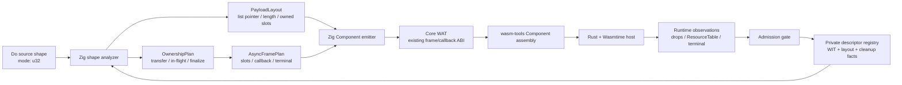
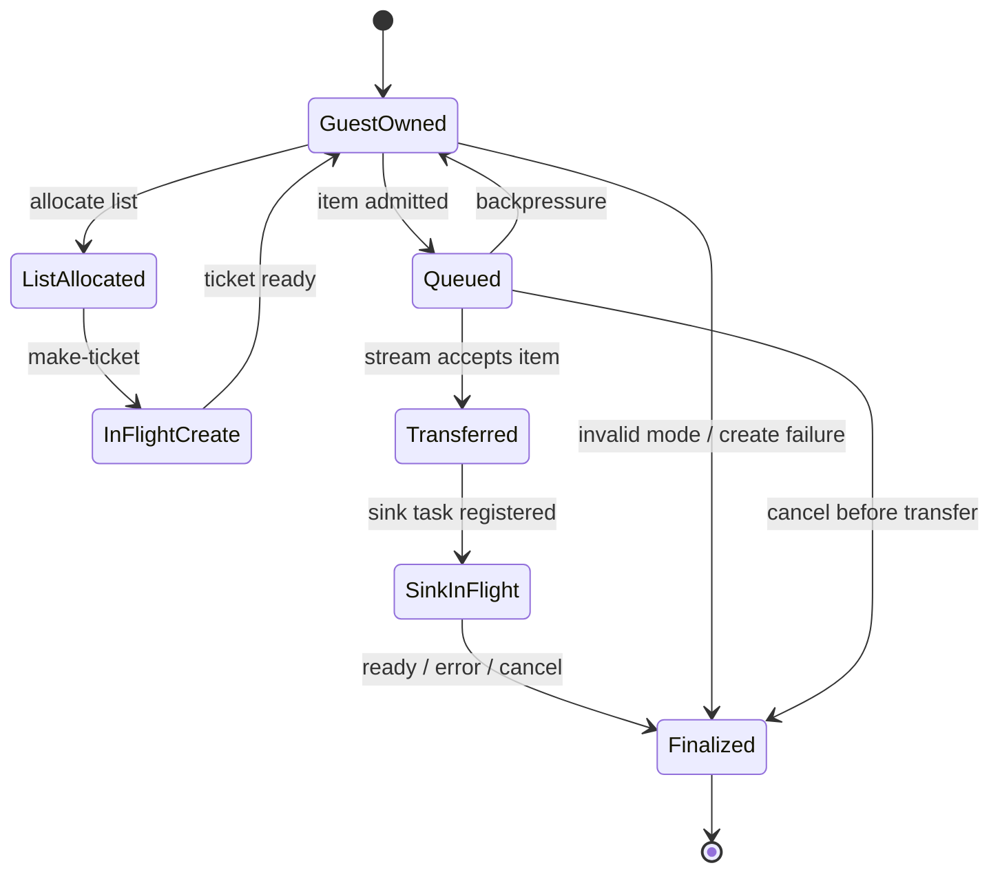

# G6.2 C-min List/Resource Producer Architecture

**状态:** Gate 1 canonical probe、Gate 2 layout/ownership/frame plan、Gate 3 registry/manifest/sema admission 与 Gate 4 compiler/runtime promotion 已完成；generic producer 能力仍保持关闭

**规范:** [`docs/superpowers/specs/2026-08-07-g6-2-c-min-list-resource-producer-design.md`](../../docs/superpowers/specs/2026-08-07-g6-2-c-min-list-resource-producer-design.md)

## 决策

C-min 是一个私有、descriptor-backed 的 producer slice：一个 guest-owned
`StreamWriter` 发送一个 `list<resource-entry>` stream item；每个 entry
包含一个 WIT 内部 `own<ticket>`。Do 源码不增加公开 `own<T>`、`borrow<T>`、
`ref<T>` 或生命周期语法。

外层继续复用现有 frame/callback ABI；list 的 pointer/length、owned slot、
allocation/release 和 transfer 状态由统一的内部计划提供。

## 架构图



## 所有权路径



清理顺序固定为：

```text
ticket slots -> list allocation -> stream/future child
-> waitable membership -> parent frame
```

已转移给 stream/host 的 ticket 不得由 guest 再次 drop；尚未转移的 list
和 ticket 必须由 guest exactly once cleanup。

## 组件职责

| 组件 | 责任 |
| --- | --- |
| WIT/WAT probe | 独立测量 producer input stream/list canonical ABI |
| `p3_async_registry` | 保存私有 descriptor、签名、布局和 cleanup facts |
| `OwnershipPlan` | 统一记录 owner、transfer、in-flight、terminal 状态 |
| `PayloadLayout` | 统一记录 list words、stride、owned slots、realloc/drop |
| `AsyncFramePlan` | 统一记录 frame slots、callback 和 child-first cleanup |
| Zig compiler | source admission、plan 构造和 WAT emission |
| Rust/Wasmtime runner | pending/ready/error/cancel、drop 和 `ResourceTable` 观察 |

## 边界

- probe 的 list 长度矩阵为 `0/1/3`；不是任意运行时 list 长度。
- compiler 只接受一个注册 descriptor、一个 stream item、一个 sink terminal。
- nested list、variant item、borrowed field、第二次写入和通用 producer
  expression 均保持拒绝。
- C-min 通过前不新增 public ownership syntax，也不宣称 generic list 或
  generic async lowering。

## 入口

完整目标、数据流、错误/取消语义和四阶段 gate 见配套 spec。四个 gate 均已
通过：独立 producer probe、内部 layout/ownership/frame plans、registry/manifest/
sema admission，以及 exact Do admission、Component emitter 和 Rust/Wasmtime
runtime gate。该闭合只覆盖一个 private、capacity-one、cardinality `0/1/3`
descriptor；generic list/producer 与公开 ownership syntax 仍不在范围内。

## Gate 1 证据

- WIT: `wasm-tools component wit examples/p3-runtime/wit/g6-2-c-min-list-resource-producer.wit`，`wasm-tools 1.255.0 (76e20611d 2026-07-30)`，exit 0。
- WIT source hash: `8decd27aeca4a1f1863544860caec230a1fc50259336a893de79413c6f9ec3f7`。
- Canonical gate: `bash examples/p3-runtime/test_g6_2_c_min_list_resource_producer_abi.sh`，通过 `0/1/3`、pending、sink error、early drop、invalid mode、transfer 前后取消和两种重复/畸形释放 trap。
- Measured facts: `ptr=64`, `len=68`, `element-stride=4`, `ticket-offset=0`, `stream-capacity=1`；成功、错误和取消路径均观察到 `table-empty=true`。
- 取消语义仍与 WIT/Wasmtime 对齐：transfer 前由 guest subtask cleanup 释放未转移资源，transfer 后由 host child-drop 负责；不宣称丢弃 root `call_concurrent` future 会取消 store 内 guest task。

这些证据只关闭 producer canonical ABI probe，不关闭 generic list/producer、
borrowed payload、public ownership syntax 或 root hard-cancel。

## Gate 3 当前证据

`do:g6-2-c-min-producer@0.1.0 / consume-via-stream` 已登记为唯一的
`record_resource_list_stream_producer` lowering shape。manifest 校验固定 WIT
hash、world、source `make-ticket`、sink canonical imports、list layout、owned
ticket drop、capacity `1` 与 `result-area` terminal；`sema_imports` 只接受
`StreamWriter<[ResourceEntry]> -> Result<nil, ErrorCode>`，漂移元素、错误类型
和未注册 locator 均 fail-closed。manifest `79/79`、sema `122/122`；Do emitter
和正负 fixture 已在 Gate 4 通过。

## Gate 2 当前证据

`src/build/wit_abi_layout.zig` 已提供纯 `ListLayoutMeasurement`/
`ListLayoutPlan`：固定 record 仅允许一个 `own` resource slot，校验 pointer/length
word、stride/alignment、capacity 和闭合长度集合 `0/1/3`，并提供
`OwnedSlotIterator`。nested list、borrowed resource、missing owned slot、零
stride、错位 word 和越界长度均 fail-closed。focused list producer tests 为
`6/6`，完整 layout suite 为 `19/19`，`wit_abi_types` 为 `5/5`。

该 plan 已由 private producer adapter 消费；它仍是内部实现计划，不转化为
公开 `list<T>` producer 或 ownership 语法。

`src/build/wit_abi_ownership.zig` 的 `ListProducerOwnershipPlan` 已覆盖
`allocate -> create-ticket -> enqueue -> transfer -> clear-source-slot ->
release-list -> terminal-finalize`，以及 partial creation、backpressure、
transfer 前后 cancel、duplicate release 和 `maybe` join rejection。focused
list-producer ownership tests 为 `6/6`，完整 ownership suite 为 `17/17`；
transferred ticket 只允许 source-slot clear，不生成 guest release action。

`src/build/wit_abi_async.zig` 的 `ListProducerFramePlan` 已覆盖一个 writer、
一个 list storage slot、一个 sink future、一个 queue slot、waitable membership、
callback state 和 terminal action。focused frame tests 为 `4/4`，完整 async
suite 为 `13/13`，现有 `codegen_component_async_plan` 为 `156/156`；second
queue item、未 transfer 的 await、重复 terminal 和 early-drop 均 fail-closed。

## Gate 4 证据

- `zig test build/codegen_component_list_resource_producer.zig`：`139/139`；exact-shape 正负 admission、纯 layout/ownership/frame validation、WAT marker 和 WIT export assertions 通过。
- `zig test build/codegen_component_async.zig`：`438/438`；统一 dispatcher 将唯一 producer descriptor 路由到 `record_resource_list_stream_producer`。
- `bash examples/p3-runtime/test_do_g6_2_c_min_list_resource_producer.sh`：Do WAT marker、`wasm-tools parse` 和 C-min WIT 输出通过。
- `bash examples/p3-runtime/test_rust_g6_2_c_min_list_resource_producer.sh`：compiler-generated Component 的 ready `0/1/3`、pending、sink error、early drop、invalid mode、transfer 前/后 cancellation 均通过，所有 admitted terminal path `table-empty=true`。
- `./src/build/test/run_tests.sh`：`pass=1120 fail=0 skip=3`；`zig build -Doptimize=ReleaseSmall` 与 `git diff --check` 通过。

负向边界为 `UnknownP3AsyncHostDescriptor`、`P3AsyncHostSignatureMismatch` 和
`UnsupportedP3AsyncComponent`；generic list/producer、arbitrary producer
expression、nested/borrowed payload、public `own<T>`/`borrow<T>`/`ref<T>` 与
root hard-cancel 仍保持拒绝。
