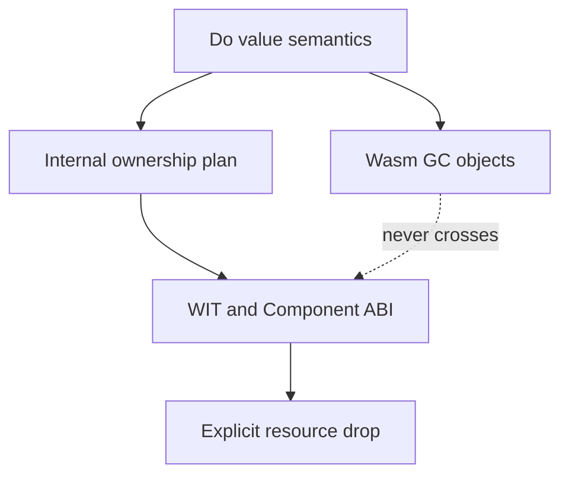

# GC-First Memory Decision

**Status:** Active language and runtime target. Documentation decision only; the
current compiler implementation still contains ARC-specific code that must be
replaced in a later implementation phase.

## Decision

Do selects Wasm GC as its only managed-memory backend. ARC is no longer an
active runtime target.

This decision preserves the existing source contract:

1. Source values use value semantics.
2. `text`, lists, large structs, and structs containing managed values pass as
   internal GC references. Read-only assignment, argument passing, and returns
   do not copy their payloads.
3. A published value is immutable. `@set`, `@put`, field update, and library
   update operations return a new logical value. The compiler may reuse storage
   only after proving uniqueness and non-escape.
4. Source does not expose pointers, references, `ref<T>`, `own<T>`, or
   `borrow<T>`.

WIT resources are not GC values. Their owned transfer, direct-call borrow,
and exactly-once drop are internal ABI contracts. GC manages Do allocations;
it never closes or drops a host resource.

## Consequences

- The public language remains pointer-free and reference-free.
- `Future<T>` and `Stream<T>` continue to use their existing source contract;
  their runtime representation must become GC-managed during the implementation
  migration.
- Canonical ABI values remain copied or marshaled at the Component boundary.
- Existing source-level copy-on-write semantics remain valid. They are a value
  semantics rule, not an ARC requirement.
- New WIT binding work records `owned` and `borrowed` in internal ABI metadata,
  not in public Do types.

## Migration Boundary

The following are implementation debt, not evidence that ARC remains selected:

- `src/build/runtime_arc_wat.zig`
- `src/build/runtime_prelude_wat.zig`
- `src/build/codegen_ownership.zig`
- ARC-specific storage tests and generated WAT assertions

Until those modules are replaced, `do build` remains an implementation
transition state. Documentation must describe Wasm GC as the selected target
and must not claim that the implementation migration is complete.

## Superseded Direction

Any earlier document that calls ARC the active v1 backend or describes an
ARC-to-GC switch as a future product decision is superseded by this document.
Historical ARC layouts, tests, commands, and pass counts remain evidence of
previous implementation work and are not rewritten.
