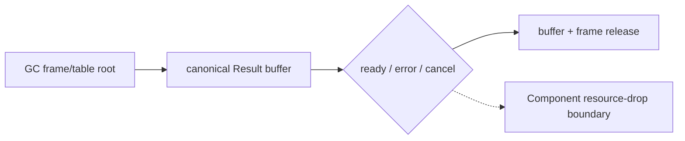

# Roadmap 执行状态

更新时间: 2026-09-04

**本文只保留当前状态与阻断。** 历史小任务勾选与逐条 gate 证据已从仓库移除; 追溯用 git 历史与 `CHANGELOG.md`。
总规划: `doc/master_plan.md`。接手入口: `doc/start_here.md`。
G5b async/resource coverage ledger: `doc/g5b_async_resource_coverage.md`。

2026-09-04 增量: G6.2 general producer/resource internal contract consolidation
已闭环。不可变 `ProducerContract` 统一 source/sink、measured payload layout、ownership
path、transfer commit 和 terminal cleanup facts；direct record、fixed pair、
parameterized pair、triple、nested、list-resource、dynamic-list、batched-list、
scalar-list 九条既有 private route 通过 route-specific adapters 重放，未改变
WAT/WIT/template/hash/marker。consolidated Component/Rust/Wasmtime gate 为
`routes=9 canonical-parity=5 lifecycle=9 table-empty=true`；有效与无效 cleanup、
cancel、pending future 计数保持既有 contract，四条 source/lease 负例均在 WAT 前拒绝。
当前工具链仍为锁定的 `wasm-tools 1.258.0` / Wasmtime `48.0.1`；fresh checks 为默认
`pass=1070 fail=0 skip=3`、`RUN_WASM=1 pass=1072 fail=0 skip=3`、
`zig test main.zig 785/785`、`RUN_GC_CORE=1` `14/14 steps; 51/51 tests`，
ReleaseSmall/release smoke 通过，inventory 保持 `complete_rows=15 pending_rows=15`
且预期 exit `1`。该整理不开放 public ownership、generic/arbitrary producer、
borrowed/list/variant async payload 或 unmeasured shape；后续扩大仍须另立 design/gate。

2026-09-02 工具链/测试编排增量: current-only `do-toolchain` 锁定并实测
`wasm-tools 1.258.0 (5c6d31c78 2026-08-24)`、Wasmtime `48.0.1`；Task 9
Step 1 active gate、Task 8 Step 3 Rust host adapter 与 Step 4/5
Shell-to-Zig parity 均闭合。`src/build/test/run_tests.sh` 已缩减为
`cd src && zig build test --summary all` 的薄入口，`RUN_WASM` 与
`RUN_GC_CORE` 由 Zig harness 继承；默认及两种 opt-in 回归均为 `14/14`
steps、`51/51` tests。WIT map parser/model/manifest/registry schema 已完成；
精确同步 `map<u32,u32>` manifest-backed Component lower/lift、`wit_abi_types`
与 bounded Core WAT probe 已覆盖 `u32` key + `u32`/`text` value 的 lower/lift，
并通过 current toolchain parse/validate 与 Rust/Wasmtime host gate；通用
Component/WIT map lowering、async 参数 copy、Stream 跨 poll buffer 与生命周期
扩展仍阻断。历史段落中的
`wasm-tools 1.255.0` 仅作历史证据，不是当前 active adapter 版本。

2026-09-03 增量: 精确同步 `map<u32,u32>` lower/lift route 已由
manifest-owned measured pair-list layout、`HashMap<u32,u32>` host boundary、Do
fixtures、负例签名漂移、Rust/Wasmtime host oracle 和 Zig harness gate 闭环。
lower/lift 各观察一次 host call 与一次 allocation/free；该固定 shape 不扩展
通用 map key/value、async 参数 copy、Stream 跨 poll owned buffer 或 cleanup
authority。

2026-08-30 增量: G6.2 新增私有、hash-pinned 的 nested-owned-record producer
compiler admission，descriptor 为
`do:g6-2-owned-record-nested-producer@0.1.0`，仅准入
`consume-via-stream`。WIT hash 为
`9662440709b01044544d4c4350f3e6f783a8f06aaa5c884a96a1e43a935a7543`；精确
形状为 `Outer { inner: Inner }` 与 `Inner { ticket: own<Ticket> }`，outer 为
4 bytes/alignment 4，语义路径 `inner.ticket` 在 canonical ABI 中为 offset `0`
的 `i32`，stream capacity 为 `1`，source ABI 为 `(i32) -> (i32)`，seed 为
`111`。独立 ownership mask 为 `guest=1 transferred=2`，完整 record 写入前
按 nested path exactly once 清理，成功转移后由 host exactly once 释放；不以
handle `0` 表示缺失。manifest/source matcher、生成 WAT/WIT、Component
validate、21 个负例 fixture (`725`–`745`)、Rust/Wasmtime 十模式 lifecycle
与 canonical/generated parity gate 均通过；取消/早退模式为零 completion、一次
cancel 与 pending-future drop，repeat 为 `[111,111]`，所有模式
`table-empty=true`。该增量记录的 pre-fix checkpoint 为 `pass=1446 fail=0 skip=3`、
`zig test main.zig` `697/697`；当前 post-fix standard regression 为
`pass=1446 fail=0 skip=3`、`zig test main.zig` `701/701`，扩展的
`RUN_WASM=1` 为 `pass=1448 fail=0 skip=3`，ReleaseSmall/release smoke 与
current-only `wasm-tools 1.258.0` 均通过。该 route 是 private fixed-shape evidence，不开放
公共 ownership syntax、generic/arbitrary producer、general async/resource，也
不新增 GC inventory row；inventory 仍为 `complete_rows=15 pending_rows=15`、
预期 exit `1`。

2026-08-28 增量: G6.2 完成固定三字段 `ResourceTriple` 的私有 compiler
admission。精确 manifest/source matcher/lowering、13 个负例 fixture
(`712`–`724`)、生成 WAT/WIT、Component validate、Rust/Wasmtime lifecycle
与 canonical/generated parity gate 均通过。canonical WIT package
`do:g6-2-owned-record-triple-producer@0.1.0` 的 hash 为
`73fd57dc8f34f13023b48f2b82e439b212eab52192886f0d07a37d86e63658b1`；record
为 12 bytes、alignment 4，`left/middle/right: own<ticket>` 位于 offset
`0/4/8`，stream capacity 为 `1`，producer 输入为
`(mode,left-seed,middle-seed,right-seed)` 四个 `u32` words。独立 presence mask
只在完整 record 写入后原子转移三个 handle，转移前按
`right -> middle -> left` 释放，转移后 host 各释放一次，handle `0` 不作为
absence sentinel。canonical/generated WAT/WIT byte-identical；Rust/Wasmtime
十模式 valid/invalid lifecycle 观察 valid `3/3` cleanup、repeat `6/6`、
取消/早退各一次 cancel 与 pending-future drop、invalid 不创建资源，所有模式
`table-empty=true`。fresh verification 为 `zig test main.zig` `695/695`、
full regression `pass=1424 fail=0 skip=3`、ReleaseSmall/release smoke 和
全部 triple gates 通过，inventory 仍为 `complete_rows=15 pending_rows=15`
且预期 exit `1`。该私有 route 不计入 ARC/GC equivalence matrix，不开放
generic/arbitrary producer、borrowed/list/variant payload、general
async/resource lowering、公开 ownership syntax 或 GC inventory row。

2026-08-28 增量: G6.2 新增私有、hash-pinned 的参数化双 owned-field record
producer descriptor `do:g6-2-owned-record-pair-parameterized-producer@0.1.0`。
它只准入 `stream<resource-pair>`，record 为 8 bytes，`left/right: own<ticket>`
位于 offset `0/4`，stream capacity 为 `1`，producer 输入为
`(mode, left-seed, right-seed)` 三个 `u32` words；WIT hash 为
`e7abd3cf7b7543325865a0b4be4b32ae50a2470ac5083169250719f89b7ce53a`。独立
presence mask 只在完整 record 写入成功后原子转移两个 handle，转移前按
`right -> left` 释放，转移后 host 各释放一次，handle `0` 不作为 absence
sentinel。canonical ABI、Do/Component、十个 fail-closed negative fixtures、
generated Rust/Wasmtime lifecycle 与 canonical/generated equivalence gates 均
通过；valid 模式保持 `2/2` ticket cleanup、repeat 为 `4/4`，所有模式
`table-empty=true`，invalid 不创建资源。fresh release-candidate verification
为 full regression `pass=1410 fail=0 skip=3`、`zig test main.zig` `692/692`、
ReleaseSmall 与 release smoke 通过，GC migration inventory 仍为
`complete_rows=15 pending_rows=15`、exit `1`。该独立 Component 生命周期证据
不计入 ARC/GC equivalence matrix。固定三字段 `ResourceTriple` 的 private
compiler admission 已通过；generic producer、arbitrary expression、
borrowed/list/variant/general async-resource、公开 ownership syntax 与 full GC
cutover 继续 pending。

2026-08-27 增量: G6.2 新增私有、hash-pinned 的双 owned-field record
producer descriptor `do:g6-2-owned-record-pair-producer@0.1.0`。它只准入
`stream<resource-pair>`，record 为 8 bytes，`left/right: own<ticket>` 位于
offset `0/4`，stream capacity 为 `1`，producer seeds 为 `111/222`；独立
presence mask 保证完整 record 写入成功后才原子转移两个 handle，转移前按
`right -> left` 释放，转移后 host 各释放一次。WIT hash 为
`89345a5213936735d7f065cd54ed42b83d159b80305a1a900ae00df2e811704d`。
canonical ABI、Do/Component、negative admission、generated Rust/Wasmtime
生命周期及 canonical/generated equivalence gates 均通过十种
ready/pending/error/cancel/early-drop/repeat/invalid 模式；valid 模式保持
`2/2` ticket cleanup、repeat 为 `4/4`，所有模式 `table-empty=true`，invalid
不创建资源。Rust/Wasmtime 还观测到每次有效 host import 一次
`callback-calls`；普通模式 `poll-calls=1`、`pending` 为 `2`、转移前取消/早退
为 `0`、转移后取消/早退为 `1`；所有模式 `finish-calls=0`。四种取消/早退模式各有
一次 `cancel-calls`、一次 `pending-future-drops` 且 future 未完成，正常/错误模式
future 各完成一次，repeat 为两次。该独立 Component 生命周期证据不计入 ARC/GC equivalence matrix。
新增 gate 为 `test_g6_2_owned_record_pair_producer_abi.sh`、
`test_do_g6_2_owned_record_pair_producer.sh`、
`test_do_g6_2_owned_record_pair_producer_negative.sh`、
`test_rust_g6_2_owned_record_pair_producer.sh` 和
`test_g6_2_owned_record_pair_producer_equivalence.sh`。本轮还验证 full
regression `pass=1400 fail=0 skip=3`、`zig test main.zig` `688/688`、default
GC `86 fixtures`、semantic-equivalence `26 rows; 0 pending`、ReleaseSmall 与
release smoke，均使用 pinned `wasm-tools 1.255.0`。通用 producer、arbitrary
expression、borrowed/list/variant/general async-resource、公开 ownership
syntax 与 full GC cutover 继续 pending。

2026-08-18 增量: 新增私有 parser-backed Component marshal route；同时闭合
bounded managed-struct list append 的 compiled-test/G5b 等价行
(`src/build/codegen_component_marshal_route.zig`)。它从 WIT source 解析并绑定
measured layout，派生 canonical import，再生成 bounded scalar-record `lift`
Core WAT；不接受调用方伪造的 import identity。record assembly、真实 host
execution 和 ARC/GC equivalence gates 现在都消费该生成路径，分别观察
`sum=42` 与 `42/42`。默认 host/WIT route 仍保持 ARC；bounded flat scalar-record
lower（含 `u32/u32` 与 `u32/u64/s64` measured shapes）以及 pinned 17-field `u64`
indirect lower（136 bytes, alignment 8, canonical `(i32)` pointer）已闭合，
two-level nested scalar-record lift（header=16 bytes, reading=32 bytes,
canonical `(i32)` result-area pointer）and the three-level nested scalar-record
lower（header=16 bytes, detail=32 bytes, writing=48 bytes, canonical
`(i32, i64, i64, i64)`）也已闭合；indirect layouts beyond this
shape、deeper/general aggregate lower、
Option/Result/Variant、async/resource 和 G5c cutover 仍 pending。

2026-08-22 增量: C14 four-level scalar-record lift/lower、C15-D
multi-managed-text lower 与 C16-D multi-managed-text lift 已从 private
explicit route 提升到普通 `do build`
的精确 manifest-backed GC/WIT route。mixed lower 的 canonical ABI 为
`(i32, i64, i64)`，并通过默认 host/equivalence/negative gates；其余默认
host/equivalence/negative gates、
Component assembly 与 pinned `wasm-tools 1.255.0` 验证通过；C15-D 的
`allocations=2/frees=2` 与 C16-D 的 `value=17` 运行结果及等价结果均已锁定。
这仍是固定形状同步 descriptor 的有界 promotion，通用 aggregate、
async/resource、ownership 和 full GC cutover 继续 pending。

2026-08-23 增量: 新增固定的
`demo:marshal-record-u32-list-lift/api.read@1.0.0/lift` manifest-backed
descriptor。它只接受同步 `@host_func` 与
`Reading { code: u32, payload: [u32] }`，测得 12-byte result area、capacity
`3`、accepted lengths `0..3`，canonical ABI 为一个 `(i32)` result-area
pointer。lift 会校验 result-area/list span，将线性 `u32` payload 复制到
`$do_u32`，只释放一次并构造 GC record；普通 default route、显式 route、
Component host、ARC/GC equivalence 和 609-614 六个负例均通过 pinned
`wasm-tools 1.255.0`，host 观察 `result=67`，等价结果为 `67/67`。
default GC build/parse gate 现覆盖 74 fixtures。通用 list-record lift、
async/resource、ownership 与 full G5c cutover 继续 pending。

2026-08-23 增量: 新增固定的
`demo:marshal-record-byte-list-lift/api.read@1.0.0/lift` manifest-backed
descriptor。它只接受同步 `@host_func` 与
`Reading { code: u32, payload: [u8] }`，使用 12-byte result area、payload
capacity `3`、accepted lengths `0..3` 和 canonical `(i32)` result-area
pointer。lift 将线性 byte payload 复制到 `$do_bytes`，只释放一次并构造 GC
record；canonical import 不携带 GC reference。普通 default route、显式 route、
Component host、ARC/GC equivalence 和 616-621 六个负例均通过 pinned
`wasm-tools 1.255.0`；host 观察 `code=7`、`payload=[10,20,30]`、`result=67`、
`stats=17`、一次 callback 与一次 allocation/free，等价结果为
`67/67`、`17/17`、`1/1`。default GC build/parse gate 现覆盖 75 fixtures，
G5c residual gate 已纳入该 descriptor 的 host/equivalence/negative 三个
phase。该 promotion 仍是固定形状；通用 list-record lift、async/resource、
 ownership 与 full G5c cutover 继续 pending。

2026-08-23 增量: 新增固定的
`demo:marshal-record-mixed-scalar-list-lower/api.write@1.0.0/lower`
manifest-backed descriptor。它只接受同步 `@host_func` 与
`Writing { code: u32, label: text, payload: [u8] }`，测得 20-byte root，
字段偏移为 `0/4/12`，canonical lower ABI 为五个 `i32` words：
`code`、`label.ptr`、`label.len`、`payload.ptr`、`payload.len`。lowerer 将
text 与 byte-list 两个 GC span 复制到线性内存，调用 host 一次并按
payload -> label 顺序各释放一次；host 观察 `code=7`、`label=hello`、
`payload=[10,20,5]`、两次 allocation 与两次 free，ARC/GC equivalence
结果一致。普通 default route、Component host、ARC/GC equivalence、七个
源级负例和无 ARC marker gate 均通过 pinned `wasm-tools 1.255.0`；default
GC build/parse gate 现覆盖 76 fixtures。通用 record/list、lift、
async/resource、ownership 与 full G5c cutover 继续 pending，migration
inventory 保持 `complete_rows=15 pending_rows=15`、exit 1。

2026-08-25 增量: 新增 `examples/gc-p3-runtime/scalar-leaf.do`，包含纯
`u32` identity 与 arithmetic 的同步 scalar-leaf functions。普通 `do build`
现在对该精确形状走 typed GC route；独立 gate 验证 `;; gc-sync`、无
`__arc_`、`wasm-tools 1.255.0` parse 和函数输出存在。递归、loop、defer
与 scalar `@host_func` binding 的负向边界均保持 fallback/fail-closed；默认
GC build/parse gate 现覆盖 79 fixtures。该 slice 不关闭 migration row，
inventory 仍为 `complete_rows=15 pending_rows=15`、exit 1。

2026-08-25 增量: `examples/gc-p3-runtime/scalar-call-graph.do` 新增一个
三层、同模块、同步且无环的 scalar helper call chain。typed GC admission
保留 `call $leaf` 与 `call $middle`；self-recursion、mutual recursion 和
更长环路在 WAT 前 fail-closed。独立 gate、默认 79-fixture build/parse gate
和 `zig test build/codegen_pipeline.zig --test-filter scalar` 的 `130/130`
 focused tests 均通过 pinned `wasm-tools 1.255.0`；该 slice 不改变语法，
 不关闭 migration row，inventory 仍为 `complete_rows=15 pending_rows=15`、
 exit 1。

2026-08-25 增量: 新增精确 descriptor
`demo:marshal-record-mixed-text-u32-list-lower/api.write@1.0.0/lower`，仅准入
同步 `@host_func` 的 `Writing { code: u32, label: text, payload: [u32] }`。
测得 root 20 bytes、字段偏移 `0/4/12`、`list<u32>` capacity `3`、stride `4`，
canonical lower ABI 为五个 `i32` words，且没有 GC reference 跨边界。GC lower
按 label、payload 分配并复制线性 span，调用 host 后按 payload -> label exactly
once 释放；host 观察 `code=7`、`label=hello`、`payload=[10,20,5]`、
`allocations=2/frees=2`、`write-calls=1`，ARC/GC equivalence 观察
`2/2` cleanup 与 `1/1` callback。8 个源级负例在 WAT 前拒绝；default
GC build/parse gate、residual host/equivalence/negative gate、ReleaseSmall
release smoke 均通过 pinned `wasm-tools 1.255.0`，默认 gate 现覆盖 80
fixtures。该 slice 仍是固定形状 promotion，不扩大通用 aggregate、
async/resource、ownership 或 full G5c cutover；inventory 仍为
`complete_rows=15 pending_rows=15`、exit 1。

2026-08-25 增量: 新增精确 descriptor
`demo:marshal-record-mixed-text-u32-list-lift/api.read@1.0.0/lift`，仅准入
同步 `@host_func` 的 `Reading { code: u32, label: text, payload: [u32] }`。
测得 result area 为 20 bytes，字段偏移为 `0/4/12`，`list<u32>` capacity 为
`3`、stride 为 `4`，canonical lift ABI 为单个 `(i32)` result-area pointer，
且没有 GC reference 跨边界。lift 校验 result area 与两条线性 span，将 label
复制为 `$do_bytes`、payload 复制为 `$do_u32`，按 payload -> label 顺序各释放
一次并构造 `Reading`。Host 观察 `code=7`、`label=hello`、
`payload=[10,20,5]`、`result=47`、`stats=34`、`read-calls=1`、
`allocations=2/frees=2`；ARC/GC equivalence 观察 `47/47`、`34/34`、
`1/1`。负例 `640–647` 在 WAT 前拒绝，default GC build/parse gate 实际覆盖
`83 fixtures`，residual、ReleaseSmall 和 release smoke 均使用 pinned
`wasm-tools 1.255.0` 通过。该 slice 仍是固定形状 promotion，不扩大通用
aggregate、list、async/resource、ownership 或 full G5c cutover；inventory
保持 `complete_rows=15 pending_rows=15`、exit 1。

2026-08-25 增量: 新增精确 descriptor
`demo:marshal-record-mixed-text-byte-list-lift/api.read@1.0.0/lift`，仅准入
同步 `@host_func` 的
`Reading { code: u32, label: text, payload: [u8] }`。测得 result area 为
20 bytes，字段偏移为 `0/4/12`，`list<u8>` capacity 为 `4`、stride 为 `1`，
canonical lift ABI 为单个 `(i32)` result-area pointer，且没有 GC reference
跨边界。lift 校验 result area 与两条线性 span，将 label 和 payload 都复制
为 `$do_bytes`，按 payload -> label 顺序各释放一次并构造 `Reading`。Host
观察 `code=7`、`label=hello`、`payload=[10,20,5]`、`result=47`、`stats=17`、
`read-calls=1`、`allocations=2/frees=2`；ARC/GC equivalence 观察 `47/47`、
`17/17`、`1/1`。负例 `649–656` 在 WAT 前拒绝，default GC build/parse gate
实际覆盖 `83 fixtures`，residual、ReleaseSmall 和 release smoke 均使用
pinned `wasm-tools 1.255.0` 通过。该 slice 仍是固定形状 promotion，不扩大
通用 aggregate、list、async/resource、ownership 或 full G5c cutover；inventory
保持 `complete_rows=15 pending_rows=15`、exit 1。

2026-08-25 增量: G5c C14–C20 route consolidation 已完成验证闭环。`LoadedRequest`
现在承载同一次 manifest/source-hash/WIT/layout/host-boundary 解析结果；default
host route 与显式 marshal route 共用 descriptor registry、owned boundary facts
和 measured `SyncValuePlan`，不会在生产路径重复解析同一 request。已登记
locator 但 member 漂移的默认路由在 WAT 前 fail-closed（`GcWitHostMemberMismatch`），
未知 locator 仍保留既有 ARC fallback。当前新鲜证据为：C14–C20 focused
host/equivalence/negative 矩阵及 residual gate 通过，`run_tests.sh` 为
`pass=1398 fail=0 skip=3`，`zig test main.zig` 为 `686/686`，default GC gate
为 `86 fixtures`，ReleaseSmall/release smoke 通过；migration inventory 仍为
`complete_rows=15 pending_rows=15`、预期 exit 1。span guard、canonical import
无 GC reference 和 exactly-once cleanup 继续由现有 plan/emitter 单测及路线 gate
覆盖。
本轮没有扩大 descriptor allowlist，也没有关闭任何 migration row；span guard、
canonical import 无 GC reference 和 exactly-once cleanup 继续由现有 plan/emitter
单测及路线 gate 覆盖。

2026-08-25 增量: 新增固定 descriptor
`demo:marshal-record-mixed-text-two-u32-lists-lower/api.write@1.0.0/lower`，仅准入
同步 `@host_func` 的
`Writing { code: u32, label: text, first: [u32], second: [u32] }`。root 为 28
bytes，字段偏移为 `0/4/12/20`，两个 `list<u32>` capacity 为 `3/2`、stride
为 `4`，canonical lower ABI 为七个 `i32` words，且无 GC reference 跨边界。
GC lower 在三条线性 span copy 前校验范围，host call 一次，按
`second -> first -> label` exactly once 释放。Host 观察
`code=7`、`label=hello`、`first=[10,20,5]`、`second=[3,4]`、
`allocations=3/frees=3`、`write-calls=1`；ARC/GC equivalence 观察
`3/3` cleanup 与 `1/1` callback。负例 `666–672` 在 WAT 前拒绝；default
GC build/parse gate 覆盖 `85 fixtures`，residual、semantic-equivalence、
ReleaseSmall 和 release smoke 均通过。该 slice 仍是固定形状 promotion，
inventory 仍为 `complete_rows=15 pending_rows=15`、exit 1。

2026-08-25 增量: 新增精确 descriptor
`demo:marshal-record-mixed-text-two-u32-lists-lift/api.read@1.0.0/lift`，仅准入
同步 `@host_func` 的
`Reading { code: u32, label: text, first: [u32], second: [u32] }`。测得
result area 为 28 bytes，字段偏移为 `0/4/12/20`，两个 `list<u32>` capacity
为 `3/2`、stride 为 `4`，canonical lift ABI 为单个 `(i32)` result-area pointer，
且没有 GC reference 跨边界。lift 校验 result area 与三条线性 span，将 label
复制为 `$do_bytes`、两个 payload 复制为 `$do_u32`，按
`second -> first -> label` 顺序各释放一次并构造 `Reading`。Host 观察
`code=7`、`label=hello`、`first=[10,20,5]`、`second=[3,4]`、`result=54`、
`stats=51`、`read-calls=1`、`allocations=3/frees=3`；ARC/GC equivalence
观察 `54/54`、`51/51`、`1/1`。负例 `674–681` 在 WAT 前拒绝，default GC
build/parse gate 覆盖 `85 fixtures`，residual、ReleaseSmall 和 release smoke
均使用 pinned `wasm-tools 1.255.0` 通过。

2026-08-25 下一阶段设计门: mixed text + two `list<u32>` lower/lift 已完成
独立 probe/spec、默认 route、Component/Rust/Wasmtime、negative、ARC/GC
equivalence 与全量验证，不再重复选择。15-row residual capability matrix 与
inventory 仍全部 pending；下一轮重新读取 inventory 与
`doc/host_abi_blockers.md`，只允许同步、manifest-backed、可测量、canonical ABI
无 GC reference 且可复用 `LoadedRequest`/`SyncValuePlan` 的单一候选。若需要通用
aggregate/list、async/resource 或 ownership/borrowed 契约，则记录阻断并停止该
候选，不扩大默认 route。

2026-08-23 增量: G5c bounded record lower 的内部实现已收敛为一个
`ManagedScalarListField` route。外部 manifest 仍保留 `byte_list` 与 `list`
两种输入 kind，内部只按 measured element kind、stride 和 capacity 选择
`$do_bytes`/`$do_u32` 及对应 load/store；当前固定事实为 `u8` capacity `4`
和 stride `1`、`u32` capacity `3` 和 stride `4`。length/multiplication/span
guard、`cabi_realloc`、canonical call 与 exactly-once free 顺序保持不变，
canonical ABI 未变化；这是同步 bounded lower 的内部去重，不新增 descriptor
或扩大 list/async/resource/ownership admission。full G5c inventory 仍为
`complete_rows=15 pending_rows=15`。

2026-08-22 增量: 新增固定的
`demo:marshal-record-byte-list-lower/api.write@1.0.0/lower` 私有
`--gc-wit-marshal` evidence。它只接受 `Writing { code: u32, payload: [u8] }`，
测得 12-byte root 与 canonical `(i32, i32, i32)` lower，Component host、
ARC/GC equivalence 和六个源级负例均通过 pinned `wasm-tools 1.255.0`。
该 descriptor 的精确普通 `@host_func` route 已随 default gate 提升；通用
list-record lower、async/resource、ownership 与 full G5c cutover 继续
pending。

2026-08-22 增量: 新增固定的
`demo:marshal-record-u32-list-lower/api.write@1.0.0/lower` manifest-backed
descriptor。它只接受 `Writing { code: u32, payload: [u32] }`，测得 12-byte
root、`list<u32>` capacity `3`、accepted lengths `0..3`，并使用 canonical
`(i32, i32, i32)` lower。普通 `@host_func`、显式
`--gc-wit-marshal`、Component host、ARC/GC equivalence 和六个源级负例均
通过 pinned `wasm-tools 1.255.0`；host 观察 `code=7`、`payload=[10,20,30]`
和 `result=42`，等价 gate 观察 `42/17` 与 `1/1` cleanup。默认 GC
build/parse gate 现覆盖 74 fixtures。通用 list-record lower、async/resource、
ownership 与 full G5c cutover 继续 pending。

2026-08-22 增量: parsed synchronous GC route 新增第四个 managed segment 的
直接 nested field path (`@get/@set(outer, .inner, .middle, .leaf, .core, ...)`)。
该路径按 terminal、leaf、inner、middle、outer 的顺序重建 GC struct，并保持
未修改字段与原 payload 可观察；新增 compiled fixture、独立 Wasmtime GC probe
和 ARC/GC semantic equivalence 行均通过 `wasm-tools 1.255.0`、Wasmtime GC
与 `27815` oracle。默认 GC build/parse gate 现为 71 fixtures，等价矩阵现为
25 行、0 pending；更深 producer expression、async/resource、host/WIT 通用
aggregate 与 G5c full cutover 仍 fail-closed/pending。

2026-08-22 增量: parsed synchronous GC route 再新增第五个 managed segment 的
直接 nested field path (`@get/@set(top, .outer, .inner, .middle, .leaf, .core, ...)`)。
该路径按 terminal、leaf、middle、inner、outer、top 的顺序重建 GC struct，并保持
未修改字段与原 `[u8]` payload reference 可观察；第六个 managed segment 的负例仍
在 WAT 前拒绝。新增 compiled fixture、独立 Wasmtime GC probe 和 ARC/GC
semantic equivalence 行均通过 pinned `wasm-tools 1.255.0`、Wasmtime GC 与
`27815` oracle；focused `codegen_gc_sync.zig` 为 `245/245`、`gc_sync_probe.zig`
为 `65/65`，默认 GC build/parse gate 为 72 fixtures，等价矩阵为 26 行、0 pending。
通用 nested aggregate、producer expression、async/resource、host/WIT 通用
lowering 与 G5c full cutover 仍 fail-closed/pending；migration inventory 保持
`complete_rows=15 pending_rows=15`、exit 1。

2026-08-22 增量: G5a nested managed-struct path 的内部实现已收敛为一个
固定容量五-link 的 `GenericNestedFieldPath` record，以及 loop-based parser、
`@get` chain emitter 和 `@set` terminal-to-root rebuild emitter；原先按深度
复制的 records/parsers 已删除。该 refactor 不改变公开语法、ABI 或一至五层
admission，六层仍在 WAT 前拒绝；focused `codegen_gc_sync.zig` 现为
`245/245`，`gc_sync_probe.zig` 仍为 `65/65`。producer expression、六层及更深
路径、async/resource、通用 host/WIT lowering 与 G5c full cutover 继续
fail-closed/pending。

## 推进协议

1. 每次只做一个可验证小任务。
2. 完成后更新本文「当前状态」与 `doc/start_here.md` 基线。
3. 阻塞时写清证据、停止点与恢复条件。
4. 语法/语义变更同步 `doc/spec_rules.md`、`doc/grammar.peg`、syntax 与回归。

## 当前状态

| 项 | 状态 |
| --- | --- |
| v1 子集 | 发布候选已收口 |
| GC-first memory migration | `doc/memory.md` 和 `doc/design/2026-08-11-gc-first-memory-decision.md` 是 v1 source/runtime target. G5a 当前已闭合 parsed fixed-index、参数化 `[u8] @set`、全部当前 scalar-list literal/update slices、registered scalar-list one-value `@put`、bounded `[text]` managed-element one-value `@put`、全部当前 scalar-array managed-field payload rebuild、direct-local nested struct、一层、两层、三层、四层与五层直接 nested managed-struct `@get/@set`、单一直接同步单返回 `[u8]`/`text` managed-field call producer、bounded `Tuple<text,[u8]>` rewrite、bounded imported managed identity、payload-union、resolved generic、bounded managed-struct-list append，以及 `--p3-wait-for-component` 的 bounded `Future<nil>` GC frame/table slice; G5b 已关闭全部 26 个当前 admitted synchronous executable rows（含 payload-union、resolved generic、`[Box]` one-value `@put`、nested field paths 与 direct call producer），并以同一 WIT/Rust/Wasmtime runner 完成 bounded two-await GC/linear Future frame equivalence；Task 3 已把默认同步 pipeline 的已准入 managed candidates（含 bounded synchronous `defer`、`return nil` no-result cleanup、推断出的 `text` body binding、推断出的 `[u8]` body storage `@put`，以及 body-only managed-struct storage ctor/field update）接到 typed GC/root 输出，GC path 不再声明旧 storage compiler locals，未准入 shape、普通 GC sync async 和 host/WIT 仍保持 ARC fallback; `runtime_arc_wat.zig`, `runtime_prelude_wat.zig` 和 `codegen_ownership.zig` 仍是待替换的 implementation debt; generic async/resource G5b/G5c 与 full GC migration 尚未完成. |
| GC-first scalar-leaf default route | `examples/gc-p3-runtime/scalar-leaf.do` 的纯同步 scalar identity/arithmetic 已走默认 typed GC route；递归、loop、defer、host/WIT、managed、async/resource 形状保持 fallback/fail-closed。独立 gate、默认 83-fixture build/parse gate 和 focused negative tests 已锁定；这不是 migration row closure 或 full G5c cutover。 |
| GC-first scalar control-flow default route | `examples/gc-p3-runtime/scalar-control-flow.do` 的纯同步 scalar `if/else`、`else-if` 与 guard-return 已走默认 typed GC route，输出含 `branch_join`/`guard_join` 且无 `__arc_`；loop、`defer`、递归、导入模块、host/WIT、managed、async/resource 与任意 producer expression 保持 fallback/fail-closed。该 slice 不改变语法、不关闭 migration row 或 full G5c cutover。 |
| GC-first scalar call-graph boundary | `examples/gc-p3-runtime/scalar-call-graph.do` 的同模块、同步、无环 scalar helper calls 已走默认 typed GC route；self/mutual/longer recursion 在 WAT 前 fail-closed。独立 gate、`130/130` scalar focused tests 和默认 83-fixture build/parse gate 已锁定；imported graph、host/WIT、managed、async/resource 与任意 producer expression 仍不准入。 |
| 阶段 A–F、H | done |
| 阶段 D | 可推进项 done; D2.1 按 B 方案绿色 regression 收口 |
| D2 真实 host smoke | in progress; real local filesystem preopen/read-directory, CLI pipe, compiler-generated TCP/UDP socket create/bind/drop loopback, and the private pinned `descriptor.get-type`/`descriptor.sync`/`descriptor.get-flags`/`descriptor.stat`/`descriptor.sync-data`/`descriptor.metadata-hash`/`descriptor.metadata-hash-at`/`descriptor.stat-at`/`descriptor.open-at`/`descriptor.set-size` async method gates are green; the method-level recovery matrix is documented, while general filesystem async and external HTTP remain blocked |
| 阶段 G | G1–G5、G6.1、G6.2 bounded read-directory slice + generic consumer + multi-owned-resource + one-/two-/three-/four-/five-/six-level nested-owned-resource + multiple nested-owned-resource paths checkpoints + descriptor-bounded single-read `stream<list<resource-entry>>` ownership lowering/runtime checkpoint + bounded scalar producer + scalar-argument async-call + inline scalar-argument async-call + **private bounded async host scalar-argument compiler promotion** + helper-mediated lease（含六跳 forwarding）+ fixed/parameterized `u64` countdown producer + parameterized helper（含六跳 forwarding）producer + reordered helper lease + branch-selected terminal checkpoints + path-sensitive `StreamWriter<T>` lease semantic foundation + registry record-layout/source-mirror lowering/runtime checkpoints + bounded root-owned local-frame async-call slice + private owned-future compiler slice + private closed/dynamic-count/batched C-min list/resource producer slices + **private bounded scalar `stream<list<u32>>` producer promotion** + **private direct owned-record `stream<resource-entry>` producer lifecycle checkpoint** + **private bounded two-owned-field `stream<resource-pair>` producer lifecycle checkpoint** + **private parameterized two-owned-field `stream<resource-pair>` producer lifecycle checkpoint** + **private fixed three-owned-field `ResourceTriple` compiler admission** + private D2 `descriptor.get-type`/`descriptor.sync`/`descriptor.get-flags`/`descriptor.stat`/`descriptor.sync-data`/`descriptor.metadata-hash`/`descriptor.metadata-hash-at`/`descriptor.stat-at`/`descriptor.open-at`/`descriptor.set-size` slices、G6.3、G6.4 done; generic list/producer、borrowed payload、general async-call、D2 general methods 与 root hard-cancel 仍 pending |
| Colorless async / WIT bindgen | canonical `@async/@await/@cancel` surface, legacy `async` deprecation, schema 1/2 generated manifest checks, automatic discovery for the admitted schema 2 unit and scalar capabilities, plus opt-in v2 variant/scalar-i64 slices, the `--p3-async-call-component` root-owned local-frame slice including one inline `u32` scalar argument, the private `--p3-async-host-arg-component` scalar-argument compiler slice, and the private `--p3-owned-future-component` `Future<Ticket>` -> `future<own<ticket>>` slice verified; general async-call promotion and D2 recovery designs are frozen without compiler widening; unrestricted generated WIT lowering remains pending |
| 阶段 I | **closed** (I1 递归/self-tail TCO + I2 `Tuple<...>` 第一版) |
| 架构扁平拆分 | 已落地: `diagnostics` / `type_name` / `sema_error` / codegen 域竖切 / **`sema_*` 域竖切** (`sema_tokens`/`sema_shapes`/`sema_function_*`/`sema_structures`/`sema_type_checks`/`sema_imports`/`sema_control`) |
| 目录 | 标准库 `lib/`; 工具链 `src/` (原 `tool/`) |
| active Component tooling | `wasm-tools 1.258.0 (5c6d31c78 2026-08-24)` only; SHA-256 `282e0014d38daf233cb10fb92815813b339e2b7f8b4734f6698f0176c7d99424`; `--dummy-names legacy` is the current async naming mode and all migrated gates use `bin/do-toolchain` |

当前 host/WIT GC route 例外：普通 `do build` 仅对精确的 C14 lift/lower、
C15-B/C15-D lower、C16-C/C16-D lift、bounded mixed scalar-record lower、
bounded byte-list record lower/lift、bounded `list<u32>` record lower 与 bounded
`list<u32>` record lift、bounded mixed scalar-list record lower、bounded mixed
text/u32-list record lower/lift、bounded mixed text/byte-list record lift、bounded
mixed text/two-u32-list record lower/lift、精确同步 `map<u32,u32>` lower/lift
使用
manifest-backed GC/WIT lowering；未被这些精确的
descriptor 精确准入的 host/WIT
shape 仍保留
ARC fallback。

这里的 ARC fallback 仅指未准入 host/WIT shape；这些精确同步 descriptor
已经走默认 manifest-backed GC route。

当前默认 GC build/parse gate 基线为 86 fixtures；较早段落中的 79/80/81/82/83/84/85 为
历史 checkpoint，不代表当前 gate 覆盖范围。

当前增量: G5a 默认同步候选新增推断 `[u8]/[u32]` 列表存储形状 (`seed [u8]/[u32]` + 单值 `@put`) 与一层、两层、三层、四层、五层直接 nested managed-struct field path; 默认 build/parse manifest 为 79 fixtures, 这些形状仍为 G5a-only. G5c residual baseline gate 已建立; bounded parser-backed text marshal 已通过 Core/WIT assembly、单一 host-driven lower gate 和固定 text ARC/GC equivalence gate（两条路径均为一次 allocation/free），C3 manifest-backed text lower、C4 manifest-backed `list<u32>` lower、C5 manifest-backed `list<u32>` lift、C6 manifest-backed flat scalar-record lower、C7 manifest-backed scalar-record lift、C8 manifest-backed mixed scalar-record lift、C9 manifest-backed 17-field indirect scalar-record lower、C10 manifest-backed two-level nested scalar-record lift、C11 manifest-backed two-level nested scalar-record lower 与 C12 manifest-backed three-level nested scalar-record lower、C13 manifest-backed three-level scalar-record lift 现在均由哈希固定 descriptor 生成并纳入等价门禁；C16-C 又将 C15-A 的 managed-record lift 接入真实 compiler opt-in，并以独立 host/equivalence/negative gate 验证 fail-closed 与 ARC 默认路由；固定 `list<u32>` 也已通过 lower/lift host gates 与独立 ARC/GC equivalence gate；fixed `list<u32>` record lower/lift 与 fixed byte-list record lower/lift 也已通过普通 host/equivalence/negative gate；flat/mixed/indirect/nested scalar-record 也已有普通 host/equivalence evidence；mixed scalar-list record lower 现在也已通过普通 host/equivalence/negative gate；scalar-leaf default route 现在另有独立 fixture 与 no-ARC gate；但 host/WIT inventory 的通用 lift、一般 aggregate、compiler wiring 与 full GC cutover 仍被 pending rows 阻断.
当前增量: G5a 默认同步候选新增推断 `[u8]/[u32]` 列表存储形状 (`seed [u8]/[u32]` + 单值 `@put`) 与一层、两层、三层、四层、五层直接 nested managed-struct field path; 默认 build/parse manifest 为 79 fixtures, 这些形状仍为 G5a-only. G5c residual baseline gate 已建立; bounded parser-backed text marshal 已通过 Core/WIT assembly、单一 host-driven lower gate 和固定 text ARC/GC equivalence gate（两条路径均为一次 allocation/free），C3 manifest-backed text lower、C4 manifest-backed `list<u32>` lower、C5 manifest-backed `list<u32>` lift、C6 manifest-backed flat scalar-record lower、C7 manifest-backed scalar-record lift、C8 manifest-backed mixed scalar-record lift、C9 manifest-backed 17-field indirect scalar-record lower、C10 manifest-backed two-level nested scalar-record lift、C11 manifest-backed two-level nested scalar-record lower 与 C12 manifest-backed three-level nested scalar-record lower、C13 manifest-backed three-level scalar-record lift 现在均由哈希固定 descriptor 生成并纳入等价门禁；C16-C 又将 C15-A 的 managed-record lift 接入真实 compiler opt-in，并以独立 host/equivalence/negative gate 验证 fail-closed 与 ARC 默认路由；固定 `list<u32>` 也已通过 lower/lift host gates 与独立 ARC/GC equivalence gate；fixed `list<u32>` record lower/lift 与 fixed byte-list record lower/lift 也已通过普通 host/equivalence/negative gate；flat/mixed/indirect/nested scalar-record 也已有普通 host/equivalence evidence；mixed scalar-list record lower 现在也已通过普通 host/equivalence/negative gate；scalar-leaf、scalar-control-flow 与 acyclic scalar-call-graph default routes 现在另有独立 fixture 与 no-ARC gate；recursive call graphs、host/WIT inventory 的通用 lift、一般 aggregate、compiler wiring 与 full GC cutover 仍被 pending rows 阻断.

上句的 pending compiler wiring 仅指 C15-B/C16-C 之外的通用或未准入
host/WIT shape；新增精确 descriptor 的默认 route 由 2026-08-22 专项 gate
单独覆盖。

2026-08-20 增量: 第三个 managed segment 的直接同步 nested field path (`@get/@set(outer, .inner, .middle, .leaf, ...)`) 已接入 typed GC lowering；第四层、更深 producer expression、async/resource 与 host/WIT 仍 fail-closed。新增 compiled fixture、独立 Wasmtime GC probe 与 ARC/GC semantic equivalence 行均通过 `wasm-tools 1.255.0`、Wasmtime GC 和 `27815` oracle；默认 GC build/parse gate 现为 69 fixtures，等价矩阵现为 24 行。G5c full cutover 仍 pending.

2026-08-21 增量: C15-B 私有 manifest-backed `record { code: u32, label: string }` lower 已闭合独立 Component host/equivalence gate。`wasm-tools 1.255.0` 实测 canonical import 为 `(i32, i32, i32)`，参数依次为 `code`, `label.ptr`, `label.len`；GC lower 路径严格执行一次 `cabi_realloc`、字节复制、host call、一次释放，且 canonical boundary 不携带 GC reference。host 观察到 `code=7`, `label=hello`, `write-calls=1`, `allocations=1`, `frees=1`，ARC/GC equivalence 同样通过。该证据仍为私有固定形状，不改变默认 host/WIT 路由；通用 managed-record lower、text/list record lower、async/resource 与 G5c full cutover 继续保持 pending。

2026-08-16 增量: `nested-byte-list-put.do` 的精确 `[[u8]]` 单值 `@put` producer 已加入默认 58-fixture manifest 和 G5b 等价矩阵。
2026-08-18 增量: `compiled_ok/100_compiled_test_managed_struct_list_append_gc_migration.do` 通过真实
`ModuleGraph` compiled-test 路由进入 typed GC；`check_gc_semantic_equivalence.sh`
现报告 21 行、0 pending。仅闭合 `[Box]` 单值 `@put` 和 bounded 两层 nested
field path，通用 managed/nested producer、host/WIT compiler wiring 与 G5c 仍保持
pending。

2026-08-19 增量: `@get(outer, .inner, .leaf)` 与
`@set(outer, .inner, .leaf, value)` 的一层直接 nested managed-struct 路径已接入
typed GC lowering。随后 `@get(outer, .inner, .leaf, .value)` 与
`@set(outer, .inner, .leaf, .value, value)` 的两层路径也已接入，按最内层向外
重建并保持旧 middle/leaf 可观察。新增 compiled fixture、独立 Wasmtime probe 和
等价矩阵行均通过 `wasm-tools 1.255.0`、Wasmtime GC 与 `27815` oracle；默认
GC build/parse gate 现为 60 fixtures，ARC/GC semantic equivalence matrix 现为
21 行。第三个 managed segment、更深 producer expression、async/resource、
host/WIT 和 G5c full cutover 仍 pending。

同日继续推进: `managed-field-call-producer.do` 与
`managed-text-field-call-producer.do` 现在共同覆盖 managed `[u8]`/`text`
字段的直接同步单返回调用 producer；调用结果必须精确匹配字段类型，嵌套、多返回、异步、host/WIT 与任意表达式仍在 WAT 前拒绝。新增 compiled fixture、Wasmtime GC probe 与 ARC/GC 等价行均通过 `wasm-tools 1.255.0` 和 `27815` oracle；当前默认 GC build/parse gate 为 62 fixtures，等价矩阵为 23 行、0 pending，G5c full cutover 仍 pending。

同日继续推进: `202_arc_field_reflection_get_return_fresh_local_move_lower.do` 的
静态 field-reflection getter 现在也准入 typed GC。根必须是反射循环之前直接构造的同类型
managed struct 局部；任意 producer 仍保持 ARC fallback。随后，`197` 的同步 `defer`
也复用同一 typed GC reflection route；`198_arc_field_reflection_get_return_live_source_inc_lower.do`
已补齐 inferred managed local、参数根和有界标量 guard 的 typed GC lowering；`203` 的
fresh local with one zero-argument synchronous `defer` 也已接入同一路由，带 managed
参数的 `defer`、任意 producer 和更一般 field reflection 仍保持 ARC，G5c full cutover
仍 pending。

2026-08-18 增量: `test_gc_async_frame_component.sh` 锁定
`two-await-component.do` 的 bounded `Future<nil>` `--p3-wait-for-component`
路径。生成物使用 GC-traced `$async-frame` table、无 `__arc_` 或线性 frame
allocator，并通过 `wasm-tools 1.255.0` parse、Wasmtime `-W gc=y` compile 和
Component validate。这是 `future_stream_frames` 的 G5a Future-only 证据；随后
`test_gc_async_frame_equivalence.sh` 在 2026-08-21 以同一 WIT、同一 Rust/Wasmtime
runner 对 GC-traced frame 和固定 linear-frame oracle 完成 G5b 等价，观察到
`pending-polls=4`、`external-wakes=4`、`completions=4`。普通 GC sync async
入口仍为 `UnsupportedGcSyncAsync`，Stream/general async、任意 async producer
和 G5c 仍 pending。

2026-08-17 增量: measured canonical marshal boundary now admits direct
`i32`/`i64`/`f32`/`f64` scalar lower/lift plans. The operation plan contains
only the canonical call; the core WAT/module path emits a one-word ABI
signature and does not allocate linear memory or expose GC references.
Aggregate,
option/result/variant, resource, async, Component host execution, default-route
wiring, and G5c remain pending.

2026-08-17 增量: the measured synchronous `list<u32>` marshal slice now has
independent lower and result-area lift host gates plus an ARC/GC equivalence
runner. Both backends observe `[10, 20, 30]`, with one allocation and one free
per path. This is bounded Core/WIT evidence only; parser-backed compiler
wiring, arbitrary records/lists, and the `host_wit_marshalling`/G5c inventory
rows remain pending. A bounded scalar-record result-lift slice is now also
validated independently: one result-area pointer, measured `u32` field loads,
GC `struct.new`, a pinned host runner observing `sum=42`, and a paired
linear-memory semantic-equivalence runner observing the same `sum=42`; flat
scalar-record lower now has a separate checkpoint below, while indirect record
lower outside the pinned 17-field slice and general aggregate/default-route
support remain pending. The
parser-backed registry-to-module test now covers that same scalar-record lift
shape through `emit_sync_marshal_module`, while it remains a plan/emitter
contract test rather than compiler default-route wiring.
The new `test_gc_marshal_record_component.sh` gate now generates the record
Core module from that parser-backed path and passes pinned
`wasm-tools 1.255.0` parse/embed/new/validate/component-wit checks, including
member drift and canonical GC-reference negative probes. This is assembly
evidence only; the existing host runner remains a separate hand-authored
execution fixture and the default host/WIT route stays ARC-backed.

2026-08-16 增量: 默认 candidate scan 现在也准入 body-only managed struct 的直接字段替换（构造 `Box` 后以已绑定局部值执行 `box = @set(box, .value, next)`）。`50_arc_managed_struct_set_lower.do` 已从 ARC residual 推进为 typed GC WAT；动态 producer 仍 fail-closed，pre-cutover residual gate 已移到 `53_arc_managed_struct_overwrite_release_lower.do`。这只是已准入同步切片，不改变 G5c/full GC pending 状态。

同日继续推进: body-only managed struct 的直接别名赋值（`box = next_box`）也已接入 typed GC route；`53_arc_managed_struct_overwrite_release_lower.do` 现已无 ARC marker。需要 producer call 的 RHS 仍不准入，residual gate 已前移到 `58_arc_managed_struct_set_rhs_tmp_lower.do`。

随后，精确的同字段 `@get` RHS producer、body-only managed struct 的直接字段读取、bounded `[u8]` literal overwrite、bounded guard-return cleanup、bounded `[u8]` block-return cleanup，以及 no-result fallthrough binding 也已接入 typed GC route；`58_arc_managed_struct_set_rhs_tmp_lower.do`、`49_arc_managed_struct_get_lower.do`、`52_arc_storage_overwrite_release_lower.do`、`54_arc_guard_return_releases_managed_locals.do`、`55_arc_fallthrough_releases_managed_locals.do` 和 `62_arc_if_block_return_releases_managed_locals.do` 的回归契约现在要求 typed GC operations。
2026-08-18 继续增量：`63_arc_if_else_return_releases_managed_locals.do` 的精确两分支
return 形状已接入默认 typed GC route；随后，精确三分支 `else-if` 形状的
`64_arc_else_if_return_releases_managed_locals.do` 也已接入递归 typed GC lowering，
并由 G5c residual gate 做 GC-only + parse 断言。本轮已将跨作用域
`break #outer` 的 `153_arc_break_cross_scope_release_chain_lower.do` 接入默认
typed GC route，保留外层 block 目标并通过 `wasm-tools 1.255.0` parse；其相同
源码的 release-dedup 回归 `156_arc_loop_control_release_dedup_lower.do` 同步
改为 GC 契约；随后，跨作用域 `continue #outer` 的
`154_arc_continue_cross_scope_release_chain_lower.do` 也接入默认 typed GC，保留
外层 loop 目标并通过 `wasm-tools 1.255.0` parse；因此
residual baseline 前移到仍实际输出
ARC 的 `186_arc_unmanaged_struct_error_return_call_last_use_move_lower.do`；此外，
`176_arc_storage_multi_result_assignment_call_last_use_move_lower.do` 与其 live-source
变体 `177_arc_storage_multi_result_assignment_call_live_source_inc_lower.do` 已接入 bounded
managed `[u8], i32` 多结果调用赋值的 typed GC route；显式
managed `[u8]` alias `157_arc_storage_dead_alias_binding_elided_lower.do` 也已
接入 GC route，保留同一 typed array reference 并移除 storage/ARC 期望；其后，
`178_arc_managed_arg_unmanaged_struct_binding_call_last_use_move_lower.do` 与 live-source
变体 `179_arc_managed_arg_unmanaged_struct_binding_call_live_source_inc_lower.do` 也已接入
纯标量 unmanaged struct ABI 的 typed GC route；同步 `defer` 的 bounded multi-result
返回 `185_arc_storage_multi_result_return_call_defer_keeps_inc_lower.do` 也已接入 GC，
因此 residual baseline 继续前移到 186；
本轮随后将纯标量 `Point | LoadError` union 的返回、guard-return、defer 和绑定形状
`186`-`192` 接入扁平 typed GC ABI（payload slots + tag），并以 `@is` tag narrowing
和 `wasm-tools 1.255.0` parse 回归覆盖；随后，精确的 managed union `[u8] | Error | nil`
直接调用与 `nil` tag 比较形状 `193_arc_union_nil_expr_call_last_use_move_lower.do`
已接入 typed GC carrier（`$do_union`）并移除 ARC 期望；随后，同一 carrier 的同步
`defer` 与后续 `@len` 形状 `194`/`195` 也已接入 GC；`203` 的
`fresh_local_defer` 形状也已接入 typed GC；`196` 的具体
struct、静态 `field_name` 条件和 `field_get` 返回形状已通过编译期展开接入 typed GC，
输出包含 `field-reflect-gc` 与 typed `struct.get`，`197` 的 bounded `defer`、`198` 的
inferred live-source binding 与 `202` 的直接构造局部根也已接入同一路由；动态/generic
field reflection、带 managed 参数的 `defer` 和任意 producer 形状仍保持 ARC。
managed-struct alias `158_arc_managed_struct_dead_alias_binding_elided_lower.do`
也以同一 typed reference 规则接入 GC；managed `[u8]` local overwrite
`159_arc_storage_overwrite_last_use_move_lower.do` 随后接入 GC，并以
`gc-root overwrite` 保持目标 local 的 typed reference 更新。此前，嵌套同步
`if` fallthrough 的 `152_arc_fallthrough_nested_scope_release_order_lower.do` 及其
相同源码的 release-dedup 回归 `155_arc_fallthrough_release_dedup_lower.do` 已接入
typed GC；此前，混合
`[u8], i32` 多结果中含未返回 managed local 的
`151_arc_return_partial_multi_move_lower.do` 已接入 typed GC；随后，`70_multi_return_scalar_lower.do`
的 bounded scalar-only multi-result 形状已接入 typed GC lowering：签名发射多个 Core
结果，直接多值 `return` 按声明顺序压栈，多结果调用赋值按逆序写入 scalar locals。
多结果 passthrough、bounded `[u8], [u8]` storage carrier、无参数直接构造并返回两个
managed struct 的 multi-result carrier，以及重复同一 managed local 的 multi-result carrier
已补入同一 GC slice；
managed union/aggregate
multi-result、动态 producer 和未覆盖形状仍保持 ARC fallback；G5c/full GC 仍 pending。

### 2026-08-18 bounded indirect scalar-record lower

私有 parser-backed route 现在额外闭合一个 measured indirect record lower
形状：WIT `writing` record 含 17 个 `u64` 字段，`wit_abi_layout` 测得
136 bytes、alignment 8，pinned `wasm-tools 1.255.0` 的 canonical Core import
为单个 `(i32)` pointer。GC emitter 通过 `cabi_realloc` 分配临时 buffer，按
measured offsets 写入字段，调用 host，再释放 buffer；canonical import 不暴露
GC reference。

`test_gc_marshal_record_indirect_lower_host.sh` 的 Component/Rust/Wasmtime
gate 观察 `result=42 write-calls=1`；配对的
`test_gc_marshal_record_indirect_lower_equivalence.sh` 观察
`results=42/42 write-calls=1/1`。这只是 pinned 17-field indirect lower 与
GC/flat equivalence 证据；更一般的 indirect layout、nested/text/list aggregate、
默认 host/WIT compiler wiring、async/resource 与 G5c cutover 仍 pending。

### 2026-08-16 bounded synchronous Component marshal assembly

`src/build/codegen_component_marshal_module.zig` now wraps the existing
measured synchronous marshal fragment in a valid Core Wasm module for the
single `string` lower shape. The wrapper emits only the GC declarations it
needs, a linear memory, a typed `cabi_realloc`, and the canonical import
derived from the parser-backed descriptor (`demo:marshal/api@1.0.0::send`);
canonical parameters/results remain scalar pointer/length words, never GC
references. The structural unit is part of `codegen_gc_plans_test.zig` and
rejects descriptor import drift.

`examples/gc-p3-runtime/test_gc_marshal_text_component.sh` is the pinned
assembly gate. It parses `marshal-text-core.wat`, embeds
`marshal-text-assembly.wit`, creates and validates a Component, checks the
declared `send: func(value: string)` world surface, and proves negative
member-identity and GC-reference-import checks. This is a Core/WIT assembly
checkpoint only: no host execution, ARC/GC equivalence, general record/list
marshalling, or default-route change is claimed. `host_wit_marshalling` and
G5c remain pending.

### 2026-08-16 bounded synchronous text host execution

`examples/gc-p3-runtime/test_gc_marshal_text_host.sh` now assembles a separate
probe world with an explicit `run` export and executes it through the pinned
Rust/Wasmtime host runner
`examples/p3-runtime/rust-host-runner/src/bin/gc_marshal_text.rs`. The guest
constructs one fixed GC `text` value (`hello`), copies it through the bounded
linear-memory marshal path, and the host observes the canonical `string`
argument. The gate therefore proves one host-driven lower/copy/call path in a
valid Component; it does not claim compiler default routing, arbitrary source
values, lift, records/lists, or ARC/GC semantic equivalence. The
`host_wit_marshalling` row and G5c remain pending.

### 2026-08-16 bounded text ARC/GC equivalence

`examples/gc-p3-runtime/test_gc_marshal_text_equivalence.sh` assembles the
same `demo:marshal-equivalence/api@1.0.0` WIT world twice: once with the GC
text lower/copy path and once with a linear-memory ARC-style path. The shared
Rust/Wasmtime runner observes `hello` from both host calls and checks the
reported cleanup counters are `allocations=1/1` and `frees=1/1`. This closes
the equivalence evidence for this fixed synchronous text probe only; it does
not wire the plan into `do build`, prove lift or aggregate shapes, or close
the `host_wit_marshalling`/G5c inventory rows.

### 2026-08-17 bounded synchronous `list<u32>` host execution

The measured marshal operation plan now admits the bounded scalar-list shape
`list<u32>` in addition to the existing byte-list path. The plan preserves a
four-byte element stride, computes the copied byte count with checked 64-bit
arithmetic, and keeps the canonical ABI as `(ptr, len)` where `len` counts
elements. The WAT emitter selects `$do_u32`, `array.get/set $do_u32`, aligned
`i32.load/store`, and frees the temporary linear span with the measured byte
size and alignment.

`examples/gc-p3-runtime/test_gc_marshal_u32_host.sh` and
`test_gc_marshal_u32_lift_host.sh` are the independent gates. They parse and
embed pinned Core/WIT pairs, create and validate Components, and run the
Rust/Wasmtime adapters. The lower host observes `[10, 20, 30]`; the lift host
returns the same list through a measured result area and the guest observes
checksum `60`. This proves one concrete lower/copy/call path and one concrete
lift/result-area/copy path. It does not claim records, arbitrary lists,
compiler wiring, ARC/GC equivalence, or G5c closure; those remain pending.

### GC migration admission ledger (2026-08-13)

`src/build/test/check_gc_migration_inventory.sh` is the machine-readable
admission ledger for every default managed path. It accepts only evidence-backed
`complete` G5a rows: the four parsed `[u8]` slices (fixed/parameterized `@set`,
numeric literal, and one-value `@put`), direct `[u8]` managed-field payload
rebuild, one bounded pure payload-union carrier, and resolved generic managed
identity/field update. The checker verifies linked source fixtures and
bash-invokable probe scripts exist, then deliberately exits non-zero while any
G5a, G5b ARC/GC equivalence, or G5c default-routing row is `pending`.

`text` now admits direct identity/literal construction and exact text-field
rebuild in the parsed synchronous entry. `[text]`, declared managed-struct
element lists, and the bounded nested `[[u8]]` list shape admit bounded
literal/`@len`/`@get`/collection-loop slices.
Nested structs admit only direct-local
child replacement and direct child `@get`; `Tuple<text, [u8]>` admits one
direct immutable rewrite shape; other nested aggregate shapes, unsupported
other list shapes,
Tuple/storage shapes, general unions, generic layout instantiation, unsupported
import graphs, host/WIT marshalling, unproven synchronous control flow, and Future/Stream
frames remain pending. Resource terminal cleanup now has a bounded G5a Component
gate, while its G5b/G5c cells remain pending. Their current parsed-entry
failure boundaries are recorded in the ledger from `codegen_gc_sync.zig`; this
is a current implementation record, not a claim that the checker verified
negative error boundaries or that a token-profile `--gc-core` probe widens the
parsed G5a entry. The normal `do build` route now dispatches only
evidence-backed synchronous managed candidates through the GC entry;
unsupported shapes and host/WIT boundaries keep the existing ARC fallback.
The ledger still has pending G5a/G5b/G5c cells, so this is not the default
full-GC cutover.

### 2026-08-18 bounded GC resource terminal cleanup

`resource_terminal_cleanup` is now a bounded G5a row in
`src/build/test/check_gc_migration_inventory.sh`. The gate
`examples/gc-p3-runtime/test_gc_resource_terminal_cleanup.sh` builds
`async-resource-result-component.do` with the pinned `wasm-tools 1.255.0`,
compares the generated WIT sidecar with the registered probe, rejects ARC
markers and the linear-memory `$frame-next` allocator, and requires the
GC-traced `$async-frame`/`$async-frames` root, canonical Result buffer, error
terminal marker, frame release, and Component-boundary resource-drop imports.
The guest Core output must not call the resource-drop imports directly.

The same gate parses, compiles with Wasmtime `-W gc=y`, embeds/creates/validates
the Component, then runs the existing Rust/Wasmtime pending, immediate, error,
cancel, and invalid-terminal-shape probes. These probes observe exactly-once
request/response ownership cleanup and an empty resource table on the valid
terminal paths.



This is bounded Component/WIT evidence only. Ordinary GC synchronous async
admission, general resource shapes, and G5c default one-backend cutover remain
pending. The cancellation gate now also runs the same Rust/Wasmtime host
against the generated GC Component and the hand-authored linear Component, then
compares request consumption, pending polls, future drops, response creation/
drop, and final table state. The two observations are equal, closing the
backend-neutral G5b cancellation equivalence for this bounded resource shape.

The G5b boundary remains explicit: the normal `do build` path for this async
fixture still returns `error[AsyncLoweringUnavailable]`. The closed G5b cell is
therefore a backend-neutral cancellation oracle, not ordinary ARC lowering; it
does not admit general async lowering or change the default backend.

### 2026-08-15 synchronous GC body-local routing

The normal candidate scan now includes explicit body-only `text` bindings whose
initializer is a direct string literal, which already has typed GC lowering.
It also admits a standalone body-only scalar-list literal and a following
single-value `@put` or a single-index `@set` when the function ends with
`return`; the typed GC emitter already has the required array
literal/copy/set paths. Multi-value or spread `@put`, dynamic/non-literal
`@set`, producer expressions, and list/managed-struct storage with other
control flow remain outside this admission. Focused fixtures verify typed GC
locals, typed array copy/set and the absence of `__arc_` markers for these
bounded forms. This closes routing gaps only; full normal-pipeline root
transitions, calls/storage conversion, G5b equivalence, and G5c cutover remain
pending.

### 2026-08-15 GC admission fail-closed gate

The default candidate scan now validates the complete source header set before
selecting the synchronous GC route. Parameter/result unions, unsupported
overloads, unmanaged struct results, field reflection, and calls containing
multiple managed field reads remain on the ARC path until their GC lowering is
closed. Bounded synchronous `defer` bodies are admitted with LIFO cleanup and
`return nil` no-result handling. Scalar-only compiled tests likewise retain
the ARC/TCO backend; managed test-local shapes use the GC bridge only when the
whole test source is admitted.

Focused pipeline coverage passes `763/763`. After migrating the affected
implementation-specific expectations to typed GC/root assertions, the
standard harness with repository-local `TMPDIR` reports `pass=1259 fail=0
skip=3`; `RUN_WASM=1` reports `pass=1261 fail=0 skip=3`. The remaining G5c
work is residual ARC removal and coverage of paths that are not yet admitted,
not an unresolved regression in the current harness.

### 2026-08-15 payload-union typed locals and resolved generic substitution

The synchronous GC emitter now lowers a bounded `Unit | Bytes([u8])` carrier
through a real typed local, including assignment, return, and one managed GC
root. The old decomposed payload/tag locals are not emitted on this GC path.
Resolved generic instances that bind `T` to the same payload union are admitted
after the binding is validated against the bounded carrier layout; `T`-typed
locals are substituted before body-local collection. Mixed, resource, unresolved,
or multi-managed-arm unions remain fail-closed.

Focused GC module/pipeline tests pass `164/164` and `761/761`. This expands the
positive G5a lowering evidence only; G5b equivalence and G5c default cutover
remain pending.

### 2026-08-15 G5a nested managed-list evidence

The parsed synchronous GC entry now admits one nested `[[u8]]` shape. The
`nested-byte-list.do` fixture constructs an outer typed GC array containing the
inner `$do_bytes` array, reads both levels, and iterates the outer collection.
Its Wasmtime/`wasm-tools 1.255.0` probe returns the `27815` oracle and checks
the three inner bytes. The type-name encoder uses `$do_list_list_u8`, and the
prelude emits the inner array before the outer array.

This closes only the bounded nested byte-list evidence. A companion
`nested-byte-list-put.do` probe now also admits one direct `@put(rows, row)`
producer for `[[u8]]`; it checks source preservation and the appended inner
row under the same `27815` Wasmtime oracle. General producer expressions,
arbitrary nested aggregate combinations, spread/multi-value `@put`, host/WIT
marshalling, async frames, resource cleanup, G5b pending rows, and G5c remain
pending.

### 2026-08-14 G5a scalar-list float evidence

The parsed synchronous GC entry now has executable evidence for `[f32]` and
`[f64]` list literals and fixed-index `@set` updates. Their typed GC arrays are
parsed by `wasm-tools 1.255.0` and compiled/executed by Wasmtime with the
`27815` value oracle. This closes only the float literal/update evidence
boundary; float `@put`, other scalar updates, nested lists, and producer-shaped
lists remain outside admission. Declared managed-struct element and `[text]`
list literal/`@len`/`@get`/collection-loop lowering are tracked separately
below.

### 2026-08-14 G5a scalar-list bool update evidence

The parsed synchronous GC entry now has executable evidence for a fixed-index
`[bool]` update. `bool-list-set.do` copies the source typed GC array before
`array.set`; its probe verifies that the original `false` element is preserved
and the returned element is `true`. `wasm-tools 1.255.0` parsing and Wasmtime
`-W gc=y` compilation/execution both pass with the `27815` value oracle.
The default `do build` route for this admitted shape also emits the typed
`$do_bool` GC array with `array.copy`/`array.set` and no `__arc_` symbol.

This extends the scalar-list evidence boundary only to the recorded boolean
literal/update shape. Boolean `@put`, parameterized or producer updates, and
general nested lists remain outside admission; the bounded `[[u8]]` shape is
tracked separately. Declared managed-struct element and
`[text]` list literal/`@len`/`@get`/collection-loop lowering are tracked
separately below.

### 2026-08-15 G5a remaining scalar-list evidence

The parsed synchronous GC entry now admits literal and fixed-index immutable
update slices for `[i8]`, `[u16]`, `[u64]`, `[isize]`, and `[usize]`.
`codegen_gc_layout` registers their typed GC array layouts, and the shared
`test_do_gc_remaining_scalar_lists.sh` wrapper emits one probe for each
literal and update function. `wasm-tools 1.255.0` parsing and Wasmtime
`-W gc=y` execution pass all ten new probes with the `27815` oracle. The
focused suites are now `codegen_gc_sync.zig 142/142` and
`gc_sync_probe.zig 52/52`.

This closes only the scalar literal/fixed-index update boundary. Registered
scalar-list `@put` is covered by the later checkpoint; producer expressions
and general nested lists remain outside admission; the
bounded `[[u8]]` shape is tracked separately; declared
managed-struct element and `[text]` list literal/`@len`/`@get`/collection-loop
lowering are admitted by the current GC candidate path. G5b/G5c and the
default GC cutover remain pending.

### 2026-08-15 G5a managed-struct element list evidence

`managed-struct-list.do` now exercises one declared managed-struct element list
through literal construction, `@len`, indexed `@get`, and a collection loop.
`test_do_gc_managed_struct_list.sh` generates the typed `$do_list_box` module,
parses it with `wasm-tools 1.255.0`, compiles and executes it with Wasmtime
`-W gc=y`, and verifies the `27815` oracle. The original element's `[u8]`
payload and scalar tag are checked after the list is returned.

This evidence is limited to declared managed-struct elements. Nested managed
arrays, producer expressions, and managed-element `@put` remain rejected; `[text]` list
coverage is recorded separately below. G5b/G5c and the default GC cutover
remain pending.

### 2026-08-15 G5a managed-element list append evidence

The parsed synchronous GC entry now admits the bounded `[text]` one-value
`@put` shape. `text-list-put.do` copies the published typed array into a new
`$do_list_text` array, appends one managed text reference, and leaves the source
array unchanged. Its probe parses with `wasm-tools 1.255.0`, compiles with
Wasmtime GC, and verifies the `27815` oracle plus old-element reference reuse.

This closes only the `[text]` managed-element append slice. Managed-struct and
nested-list `@put`, spread/multi-value `@put`, producer expressions, host/WIT
marshalling, async frames, resource cleanup, G5b pending rows, and G5c remain
pending.

### 2026-08-15 G5a text-element list evidence

The parsed synchronous GC entry now admits one `[text]` list shape through
literal construction, `@len`, indexed `@get`, and collection-loop lowering.
`text-list.do` returns two GC-managed text values from `$do_list_text`; its
probe checks both text lengths and first bytes after `wasm-tools 1.255.0`
parsing and Wasmtime `-W gc=y` execution, with the `27815` oracle.

General nested managed arrays, producer expressions, managed-struct list `@put`, and
Component/WIT boundaries remain outside this slice. G5b/G5c and the default GC cutover
remain pending.

### 2026-08-16 G5b equivalence closure and GC admission guards

The ARC/GC semantic-equivalence checker now executes 17 backend-neutral rows,
including the bounded payload-union construction and resolved generic managed
identity rows. Normal compiled tests and independent Wasmtime GC probes all
pass with zero pending admitted rows. The migration inventory marks G5b
complete for every currently admitted synchronous path, while G5c remains
pending.

The same pass found two routing hazards. Scalar-list types used only by a
`start`-local binding were emitted without their typed prelude declaration;
token-wide scalar-array discovery now emits the required `$do_i32` (and other
registered scalar) type. `recv(...)` loops are not yet lowered by the GC body
emitter, so candidate selection now keeps them on the ARC route instead of
emitting an uninitialized loop value. Focused pipeline tests cover both guards.

The parsed GC emitter also admits one exact nested producer: a managed struct
`[u8]` field may be rebuilt from a same-field direct `@get` followed by one
fixed-index `@set`. The old array and outer struct remain unchanged; arbitrary
managed producers, nested paths, calls, resources, and async shapes still fail
closed.

### 2026-08-16 default GC build/parse gate

`src/build/test/check_gc_default_build_gate.sh` now freezes the current
admitted synchronous GC fixture set as an exact 58-file manifest. For every
fixture it runs the ordinary `do build` route, requires the `;; gc-sync` and
`$do_` GC markers, rejects `__arc_`, and parses the result with the pinned
`wasm-tools 1.255.0`. The gate also has negative self-checks for ARC and
missing-GC markers. It does not execute Wasm and does not close G5c: host/WIT,
async-frame, resource cleanup, and other unadmitted paths remain pending.

### 2026-08-16 inferred managed list storage

The normal synchronous candidate path now admits bounded inferred scalar-list
storage shapes: an explicit `[u8]` or `[u32]` seed followed by
`values = @put(seed, 2)` and a no-result return. The collector records `values`
as a fresh managed root, so the typed GC emitter copies the published typed
array before the append and emits `gc-root local_bind` after the result binding.
The `inferred-list-storage.do` and `inferred-u32-list-storage.do` fixtures and
dedicated gates pass `wasm-tools 1.255.0` parsing and Wasmtime GC execution; the
default build gate now covers 58 fixtures. Dynamic producers, inferred
non-scalar lists, multi-value/spread `@put`, additional storage control flow,
host/WIT marshalling, async frames, resource cleanup, and G5c remain outside
this admission.

### 2026-08-16 G5a managed-struct list append

The existing typed managed-array lowering is now covered by a second operation
on `managed-struct-list.do`: `append(boxes [Box], value Box) -> [Box]` performs
one-value `@put`. The probe verifies the original one-element list and its
payload remain unchanged while the result contains the appended `Box`; both
typed `array.copy $do_list_box $do_list_box` and `array.set $do_list_box` are
present, and `wasm-tools 1.255.0` plus Wasmtime GC execution return `27815`.

This is G5a-only evidence. The normal compiled/ARC entry currently rejects the
same `[Box]` list shape with `NoMatchingCall`, so no G5b equivalence row is
claimed. The bounded `[[u8]]` nested-list `@put` is tracked separately above;
other nested-list forms, spread/multi-value `@put`, dynamic producers, host/WIT
marshalling, async frames, resource cleanup, and G5c remain pending.

### 2026-08-16 synchronous root transition marker placement

Task 3 now distinguishes GC locals bound at function entry from explicit body
bindings. Parameter/import roots keep their `gc-root local_bind` marker in the
function prologue; a managed body binding emits the marker immediately after
its `local.set`, while later assignments retain the separate `gc-root overwrite`
marker. This makes the root evidence follow the source-value transition without
adding ARC retain/release operations. The focused pipeline and GC-sync suites
pass; general inferred bindings, storage conversion, host/WIT marshalling,
async frames, resource cleanup, and G5c one-backend cutover remain pending.

### 2026-08-16 G5c host/WIT residual boundary

The G5c residual gate now includes the managed
`wasi:filesystem/preopens/get-directories` fixture. The ordinary route keeps
the `wasi-bind` manifest record and canonical `cm32p2` import, parses with
`wasm-tools 1.255.0`, and remains ARC-backed without a `gc-sync` marker. This
is a fail-closed boundary and generated-output regression guard, not GC
host/WIT marshalling evidence. The `host_wit_marshalling` inventory row stays
pending until the design gate
`doc/superpowers/specs/2026-08-16-gc-canonical-marshal-plan-design.md` is
implemented, boundary-negative tests exist, and an independent GC/ARC
equivalence runner exists.

### 2026-08-16 host/WIT typed pre-admission plan

`src/build/codegen_component_marshal_plan.zig` now provides a bounded,
pre-admission type tree for scalar, `text`, `list<T>`, and record shapes. It
carries a descriptor schema hash and an `AbiPlan` validated by
the shared no-GC-reference canonical-slot checker. The unit suite covers
descriptor rejection, resource rejection, nested children, and wide-scalar
alignment. `build_sync_value_plan_with_layout` now consumes measured
`wit_abi_layout` facts for scalar and record nodes, text ptr/len containers, and
the bounded `list<u32>`/`list<u8>` layouts, including field offsets, sizes,
alignment, and element stride. The new
`src/wit/marshal_registry.zig` plus
`src/build/codegen_component_marshal_registry.zig` path resolves one bounded
value-only member from parser-backed WIT source, derives its package/world/
member/hash identity, and binds the converted ABI type to this measured plan.
For a one-value plan, `lower` uses the member's single parameter and a
canonical argument slot; `lift` uses the member result and a canonical result
slot.
This does not emit linear-memory lift/lower, validate runtime pointer/length
ranges, assemble a Component, execute a host, or change the ARC-backed
`274_wasi_preopens` route; the `host_wit_marshalling` inventory row remains
pending.
Fresh verification after the parser-backed `lift` result and ABI-result-slot
fix: `cd src && zig test main.zig` passed `466/466`; the repository harness
passed `1260/1260` with `3` skips; and
`check_gc_g5c_residual_gate.sh baseline` passed with the pinned
`wasm-tools 1.255.0`. The gate still records `host_wit_marshalling` and the
remaining G5c rows as pending.

### 2026-08-18 parser-backed scalar-record lower checkpoint

The private measured scalar-record lower route now resolves `write(value:
writing)` from WIT, binds the two measured `u32` fields, and emits a Core import
with the pinned canonical ABI shape `(i32, i32)`. The Component adapter still
delivers one `writing` record to the host. Core/WIT assembly, Rust/Wasmtime host
execution, and GC/flat equivalence all pass with `{code: 7, count: 35}`, result
`42`, and exactly one callback per path. The route emits no GC reference at the
boundary and no temporary linear allocation for this flat shape.

Indirect records beyond the pinned 17-field shape, nested/text/list aggregates,
default host/WIT compiler routing, async/resource shapes, and the G5c cutover
remain pending.

The pure `src/build/codegen_component_marshal_ops.zig` boundary now records the
fixed synchronous operation order for measured `text` and `list<u8>` lower/lift
plans and validates pointer/length and copy-size arithmetic.
`src/build/codegen_component_marshal_wat.zig` now emits the bounded core-WAT
lower/lift fragment: GC byte extraction/construction, 64-bit linear span
guards, `cabi_realloc`, byte copy, canonical call, and temporary-buffer
cleanup. The fragment parses with the pinned `wasm-tools 1.255.0`, but is not
wired into Component assembly or a host runner; ARC/GC equivalence and the G5c
cutover remain pending.
The pre-admission layer now rejects malformed `sha256:` identities and exact
descriptor drift through `build_sync_value_plan_with_registry`; the operation
plan recursively rechecks hidden GC-reference markers before emitting any
fragment. The parser-backed source adapter now supplies the bounded identity
and type facts without exposing a public fabricated registry entry. Component
assembly, host execution, and ARC/GC equivalence are still required before
host/WIT admission.

### 2026-08-16 inferred synchronous text root transition

The normal synchronous GC candidate path now admits a bounded inferred body
binding whose initializer is a direct `text` literal or an already typed
`text` expression. The shared body-local collector records the inferred local
as a fresh managed root; the first `local.set` emits `gc-root local_bind`, and
later assignments emit `gc-root overwrite`. Focused pipeline coverage is
`769/769`, and the GC-sync module remains green at `166/166`.

This closes only the inferred `text` binding transition. General inferred lists,
general inferred bindings, nested storage conversion, host/WIT marshalling, async frames, resource
cleanup, and G5c one-backend cutover remain pending.

The compiled-test candidate scan now recognizes the same bounded inferred
`text` binding when it appears directly in a `test` body. Fixture
`compiled_ok/99_compiled_test_inferred_text_gc_migration.do` verifies that the
compiled artifact uses the typed GC local/root route and contains no ARC
marker; unsupported expressions still fall back through the existing
admission boundary.

### 2026-08-16 body-only managed-struct storage routing

The ordinary synchronous pipeline now admits a body-only managed-struct storage
slice when a local is initialized by a direct struct constructor. Field
`@set` rebuilds the typed GC struct, and field `@get` reads the typed child
reference while preserving the old object. The GC locals boundary filters
compiler-generated ARC/linear-storage temporaries, so this slice emits no
`__storage_*`, `__struct_literal_tmp`, or `__arc_` markers. The compiled
fixture and default build/parse/Wasmtime gate cover the source-preserving
update. Inferred lists, nested/general storage producers, host/WIT marshalling,
async frames, resource cleanup, G5b expansion, and G5c one-backend cutover
remain pending.

### 2026-08-15 G5b remaining scalar-list equivalence evidence

The semantic-equivalence checker now includes one backend-neutral compiled
fixture covering `[i8]`, `[u16]`, `[u64]`, `[isize]`, and `[usize]` immutable
fixed-index updates, paired with the ten-probe
`test_do_gc_remaining_scalar_lists.sh` GC oracle. The normal compiled test and
all ten GC probes pass independently; the checker result is `13` green rows
with the bounded payload-union and resolved generic rows still explicitly
pending. This adds evidence for the remaining scalar-list group only; it does
not change G5c routing or admit producer, host/WIT, async, or resource paths.

The same matrix now includes a backend-neutral `[u32]`/`[f64]` append fixture
paired with `test_do_gc_scalar_list_put.sh`. Both normal and GC artifacts
preserve the source list and observe the appended value; this is bounded
scalar-list `@put` evidence, not general producer or managed-element `@put`
admission. A second row covers the bounded `[text]` managed-element one-value
append with `test_do_gc_text_list_put.sh`; both artifacts preserve the source
list and observe the appended text, bringing the matrix to 14 green rows while
the payload-union and resolved generic rows remain pending.

The same checkpoint now covers direct managed-struct replacement for every
registered scalar-array field type. The shared remaining-field probe validates
`[i8]`, `[u16]`, `[u64]`, `[isize]`, and `[usize]` in addition to the existing
seven field fixtures, preserving the old array and the unchanged `tag` field.
All five new Wasm probes pass `wasm-tools 1.255.0` and Wasmtime GC execution;
the `gc_sync_probe.zig` focused suite is now `52/52`.

### 2026-08-14 G5a managed struct scalar-array field evidence

The parsed synchronous GC entry now has executable evidence for direct
managed-struct field replacement where the field types are `[bool]`, `[u32]`,
and `[i16]`. The probes construct distinct original and replacement `Box`
objects, verify the old arrays remain unchanged, and store replacement arrays,
and preserve `tag == 7`. `wasm-tools 1.255.0` parsing and Wasmtime `-W gc=y`
compilation/execution pass with the `27815` oracle. This is a G5a admission
only; it does not add an ARC/GC equivalence row or change the default ARC
fallback for unsupported struct shapes. Focused unit totals at this checkpoint
are `codegen_gc_sync.zig` `140/140` and `gc_sync_probe.zig` `50/50`.

The bounded union carrier and resolved generic managed-call slices are now
linked as executable G5a rows. They cover only `Unit | Bytes([u8])` and
concrete substitutions such as `T = Box`; generic struct layout instantiation,
general variants, arbitrary union payloads, and unsupported generic bindings
remain outside the admission.

The normal pipeline retains the private migration-only `EmitOptions.gc_sync`
route for direct tests, and its default `.{} ` route now dispatches
evidence-backed synchronous managed candidates to the same typed GC entry.
The bridge is covered for managed-field rebuild, bounded payload-union
construction, resolved generic managed identity, control-flow roots, and
direct managed-struct identity. Unsupported candidates fall back to ARC until
the remaining root/storage conversion and G5c residual gate are complete.

### 2026-08-14 G5b ARC/GC semantic equivalence checkpoint

The executable checker `src/build/test/check_gc_semantic_equivalence.sh` runs
the normal compiled-test path and the independent parsed GC probe path in
separate artifacts. It compares only Do-level observable outcomes: the normal
test runner must report `... ok`, and each GC probe must pass its `27815`
old/new-value oracle. It does not compare WAT text, backend symbol names, or
allocation identity.

At this checkpoint the matrix was green for eleven rows with both backend
paths admitted, including nested managed-struct old/new-value preservation and
a file-backed imported text identity plus `[f32]`/`[f64]` list updates.
The later remaining-scalar-list checkpoint below extends that matrix.

The bounded `Unit | Bytes([u8])` carrier and resolved concrete generic managed
call remain G5a-only. The normal ARC test entry currently rejects the managed
payload union at `NoMatchingCall`, and rejects the unconstrained generic
managed field update at `InvalidTypeRef`; those exact failures are recorded in
the blocker ledger instead of being treated as equivalence evidence.

The two pending G5b cells remain the bounded payload union and resolved generic
managed call; text beyond the admitted list/struct slices, general
tuple/storage, host/WIT marshalling, async frames, and resource cleanup remain
pending. The default route uses this bounded GC entry for admitted synchronous
managed candidates and keeps ARC for unconverted paths; G5c is not started.

### 2026-08-14 Task 3 synchronous root guard checkpoint

The first synchronous-root guard unit now marks managed and bounded payload-union
call results with `gc-root call_result`, rejects `[u8]` literals above `u8`
range before WAT, and keeps scalar-list admission limited to the recorded
 literal/fixed-index slices plus the existing bool literal/update slice.
Focused pipeline tests (`31/31`), synchronous GC tests (`126/126`), and the full regression
(`pass=1252 fail=0 skip=3`) are green. This is a guard checkpoint only; the
ordinary pipeline emits GC for these admitted synchronous candidates and
retains ARC for unconverted paths. The GC migration inventory remains
incomplete.

### 2026-08-14 G5a/G5b bounded aggregate and import evidence

The admission ledger now links executable evidence for the direct-local nested
managed-struct replacement, the single `Tuple<text, [u8]>` rewrite, and a
reachable imported managed identity. The imported route collects managed
declarations with typed GC result ABI facts and keeps host/WIT imports outside
this admission. The nested and tuple probes pass `wasm-tools 1.255.0` parsing
and Wasmtime GC execution with the `27815` old/new-value oracle.

At this checkpoint the ARC/GC matrix reported eleven green rows with two
intentionally pending ARC-admission rows (`payload-union` and
`generic-managed-identity`). The remaining-scalar-list checkpoint below adds
the fifth scalar-list group without changing those pending rows. This is still
bounded equivalence evidence; imported managed text identity is covered by a
file-backed module graph, while host/WIT imports remain outside admission.
The default route uses the same bounded GC entry for admitted synchronous
managed candidates and keeps ARC for unconverted paths; G5c is not started.

### 2026-08-14 GC compiled-test bridge checkpoint

`emit_test_wat` now attempts the same typed GC entry for compiled tests whose
body is within the admitted synchronous surface. The emitted artifact contains
typed GC locals, `gc-root` markers, compiled-test exports and the test `_start`
dispatcher without `__arc_` symbols. Unsupported test expressions continue to
use the existing ARC transition path until the G5c residual gate closes; this
is an explicit migration bridge, not a default-backend cutover.

Evidence: the pipeline unit `compiled test route emits admitted managed test
bodies with GC` passes, fixture `compiled_ok/91_compiled_test_gc_sync_bridge`
passes through the CLI/harness, `zig test main.zig` passes `405/405`, the full
harness passes `1253` with `0` failures and `3` skips, and `RUN_WASM=1` passes
`1255` with `0` failures and `3` skips. The GC semantic matrix remains `11` green
rows with `2` explicitly pending ARC-admission rows.

### 2026-08-13 G5a parsed text/list/producer boundaries

The parsed synchronous GC entry now admits direct `text` identity, string
literal rebuild, direct `text` field replacement, list literals through typed
locals, and one direct call whose result is already classified `gc_managed`.
Managed-field producers are explicit: nested calls, non-direct nested managed
struct producers, non-`u8` lists, multi-value `@put`, and call-produced managed
replacements outside the admitted direct `[u8]`/`text` single-result shape fail
closed before WAT as `UnsupportedGcSync*` errors. No ARC symbols are emitted.

`gc_sync_probe.zig` validates the selected function body and derives managed
struct type/field order and field types from parsed declarations; an inexact
probe shape is rejected instead of constructing a hard-coded wrapper.

Evidence: `zig test build/codegen_gc_sync.zig` passed `90/90`,
`zig test build/gc_sync_probe.zig` passed `30/30`, the focused GC emitter and
root suites passed, and all eight current parsed GC probes passed with result
`27815`. `check_gc_migration_evidence_test.sh` also verifies that future G5b/G5c
evidence links carry an explicit verification marker.

The normal `do build` route remains ARC. The bounded pure payload-union slice
also only proves `Unit | Bytes([u8])` carrier construction and immutable
replacement; additional/mixed/resource/nested-union/Tuple/storage payloads,
generic/imported/async values, Component/WIT lowering, and `Result`/`Option`
remain pending. The nested-struct slice only proves
`@set(outer, .child, child_local) -> Outer` and `@get(outer, .child)` for a
declared GC-managed child; it rebuilds the outer value, preserves the old outer
and child, and reuses the direct child reference in the new outer. Nested paths,
list elements, resource-containing aggregates, general producers, generic
producers, imports, async, G5b equivalence, and G5c cutover remain pending.

### 2026-08-13 G5a typed aggregate layout checkpoint

The GC prelude now emits nested managed struct layouts in dependency order and
rejects missing child layouts, direct dependency cycles, resource fields, and
names that collide after lowering. The pure parsed GC entry rejects any
standalone `@wasi_resource` declaration before WAT emission, so WIT resources
remain outside the Core-GC child graph. The bounded direct-local nested-child
and `Tuple<text, [u8]>`, pure payload-union, and resolved concrete generic-call
carriers remain admitted; general tuple/storage, nested paths,
list-of-managed-struct values, generic layout instantiation, imports,
Component/WIT marshalling, async frames, and arbitrary producers remain
pending.

Fresh evidence: `codegen_gc_layout.zig` `8/8`,
`runtime_gc_prelude_wat.zig` `18/18`, `codegen_gc_sync.zig` `114/114`,
`gc_sync_probe.zig` `36/36`, `zig test main.zig` `404/404`, and the full
harness `pass=1243 fail=0 skip=3`. These are bounded Core-GC evidence only;
the migration inventory remains red and default routing remains ARC.

The Tuple slice only proves
`Tuple<text, [u8]>{@get(pair, 0), @set(@get(pair, 1), 0, 65)}` for one
`Tuple<text, [u8]>` parameter/result. It preserves the text reference, creates
a new tuple and a fresh byte-array backing, and leaves the original tuple and
byte array observable. General tuple construction/indexing, nested tuples,
tuple storage, resource-containing tuples, arbitrary indices/values, and calls
remain pending.

### 2026-08-13 G5a parsed `[u8]` slices

`codegen_gc_sync.zig` now lowers both the fixed
`update(input [u8]) -> [u8] { return @set(input, 0, 65) }` and parameterized
`replace(bytes [u8], offset usize, next u8) -> [u8] { return @set(bytes,
offset, next) }` complete synchronous source shapes from parsed function and
expression facts. `codegen_gc_core.zig` no longer has either `[u8] @set` token
profile. Lowering allocates a private GC array with the runtime source length,
copies the source payload, and applies the sole `array.set` to that new backing.
The old source array therefore remains observable and unchanged. Compiler
temporary local names are chosen away from source bindings.

The fixed and two parameterized Core-GC probes now call the non-CLI test helper
`src/build/gc_sync_probe.zig`, which invokes
`emit_gc_wat_for_supported_program` and appends a WAT-only old/new value probe.
They do not add a public CLI backend selector. On 2026-08-13,
  `zig test build/codegen_pipeline.zig` passed `102/102`,
`zig test build/codegen_gc_core.zig` passed `48/48`,
`zig test build/gc_sync_probe.zig` passed `26/26`, and
`WASMTIME_BIN="$(command -v wasmtime)" WASM_TOOLS_BIN="$(command -v wasm-tools)" bash src/build/test/check_gc_core_oracles.sh`
passed all twelve probes with result `27815`.

The next parsed slice is managed-struct field payload rebuild: update one
managed `[u8]` field by rebuilding the outer GC struct while directly reusing
the new field reference and preserving every unchanged field. It must retain
the same immutable source-value boundary as the existing scalar-field update;
the default `do build` path remains ARC until G5b/G5c.

Boundary: the parsed literal slice admits only numeric inferred aggregate
literal expressions whose expected type is `[u8]` inside an otherwise admitted
synchronous GC program. The separate `@put` and direct managed-field payload
slices are recorded below; other list element types, nested or non-literal
elements, new call/producer admission, nested managed-field producers,
Tuple/storage, general unions, generic layout instantiation, module imports, host/Component
marshalling, async, G5b ARC/GC equivalence, and G5c default cutover remain
separate work. Default `do build` still emits ARC.

### 2026-08-13 G5a parsed `[u8]` `@put` slice

The parsed synchronous GC entry now admits exactly one append form:
`append_byte(input [u8], value u8) -> [u8] { return @put(input, value) }`.
It reads the source runtime length, allocates a private array of `length + 1`,
copies the old payload, and writes one checked `u8` at the old length. Empty and
non-empty source lists are covered; the old source remains unchanged and two
results are distinct GC references. Values `256` and `-1` fail before WAT as
`GcSyncTypeMismatch`; multi-value, spread, non-`u8`, and general producer forms
remain rejected.

Focused evidence on 2026-08-13:
`zig test build/codegen_pipeline.zig` passed `102/102`,
`zig test build/codegen_gc_sync.zig` passed `0/0`,
`zig test build/gc_sync_probe.zig` passed `26/26`, and
`examples/gc-p3-runtime/test_do_gc_list_put.sh` passed after
`wasm-tools parse` and Wasmtime GC compilation/execution with result `27815`.
The normal `do build` path still emits ARC; G5b equivalence and G5c default
cutover remain pending.

### 2026-08-13 G5a parsed managed-field payload slice

The parsed synchronous GC entry admits exactly
`@set(box, .value, value)` when `box` is a managed struct, `.value` is `[u8]`,
and `value` is a direct `[u8]` local. It rebuilds the outer struct, reuses the
replacement GC reference, preserves unchanged fields, and leaves the old
object and payload unchanged. The focused unit suite passed `102/102`; the
managed-struct payload probes passed `wasm-tools parse`, Wasmtime GC
compilation, and execution with result `27815`, including renamed type/field/
function bindings and reversed field order. Text payloads, nested producers,
resources, and default GC routing remain rejected.

### 2026-08-09 colorless inline scalar async-call gate

`--p3-async-call-component` now accepts four exact root-owned forms:
child-only and one-leading-inline unit calls, plus child-only and
one-leading-inline calls whose helper has one `u32` parameter and a literal at
each call site. The inline and child phases execute sequentially through one
20-byte root frame; external cancellation handles event `6` by cancelling and
dropping the active subtask, dropping the waitable set, clearing context, and
freeing the frame before `[task-cancel]`. Ordinary functions remain colorless;
a normal call is inline and only `@async(call)` creates a user-function Future.
The Component and Rust/Wasmtime gates pass ready, pending, `cancel-inline`,
and `cancel-child`, with exactly-once host-Future cleanup and an empty
`ResourceTable`; the legacy child-only scalar runner also remains green. The
default/v1 and v2 dispatch paths are unchanged. Any broader payload, resource,
Stream/list, branch, loop, recursion, multiple-child or arbitrary producer
shape remains pending and must fail closed before WAT.

### 2026-08-09 bounded async-call descriptor-only consolidation gate

The five already-admitted bounded async-call forms now carry a private,
allocator-free `BoundedAsyncShape` fact set. Child, inline, and host admission
remain independent; emitters validate the supplied frame and cleanup contract
before selecting the unchanged WAT templates. No generic `Future<T>` lowering,
arbitrary producer expression, payload/resource/list/stream shape, public
`own<T>`/`borrow<T>`/`ref<T>` syntax, or default dispatch path was added.

The differential test pins the current WAT and WIT bytes and the source-order
`guest-*` marker sequences. The five WAT hashes and the two WIT hashes are:

| shape | WAT SHA-256 | WIT SHA-256 |
| --- | --- | --- |
| child unit (`check/441`) | `bec944caece221821f43a79041e2989281f9f9b90d59547f9348ef641e1b2e03` | `ecf47e1e33b3a0d14761a1341f3b749f4ba072051c018083db2d5cda356c101f` |
| child scalar (`compile_ok/466`) | `7402916ce09060ca63e792498dc1523923b6a1545004d91c61f1a037496f2fc1` | `ecf47e1e33b3a0d14761a1341f3b749f4ba072051c018083db2d5cda356c101f` |
| inline unit (`async-call-component.do`) | `0e362d90a30c38de5e5900783b7474ddac05292f50c402a20786c0a940598dcc` | `ecf47e1e33b3a0d14761a1341f3b749f4ba072051c018083db2d5cda356c101f` |
| inline scalar (`compile_ok/477`) | `7edf6a66095c3c24b8c5440ebcad5a7f5dfcc5fea3c943a8e4d28453bb96fe83` | `ecf47e1e33b3a0d14761a1341f3b749f4ba072051c018083db2d5cda356c101f` |
| host scalar (`compile_ok/490`) | `e9e2330a75430b569b538d15d676d92492c952f89c5cc135a38343670da01553` | `b9f5f8355e87231317ec05cccf692ee465c6f339bd509640aedc196e58f81e61` |

Focused Zig output is green: shape `14/14`, differential `105/105`, call
emitter `111/111`, and host emitter `107/107`. Component gates pass the pinned
current wasm-tools route; the child-only v1 isolation probe is rejected before WAT. The
Rust/Wasmtime matrices observe exactly-once child/future cleanup and
`table-empty=true` for unit/inline and scalar ready/pending/cancel rows. The
host scalar rows observe `argument=7`, one Future drop in every mode, a
cancellation-only pending drop, and `table-empty=true`.

Final gates: `zig test main.zig` reports `All 339 tests passed`,
`./src/build/test/run_tests.sh` reports `pass=1190 fail=0 skip=3`, and
`./src/build/test/run_release_smoke.sh` passes ReleaseSmall build, build,
test, compiled-test, check, fmt, run, and LSP smoke. This closes only the
private bounded internal reuse layer; generic async-call lowering, arbitrary
producer expressions, payload/resource/list/stream futures, borrowed values,
root hard-cancel, and public ownership syntax remain pending.

### 最近验证

```text
2026-08-09 async host scalar-argument ABI probe (ABI baseline)
  → private `do:async-call-arg-probe@0.1.0` WIT hash
    `b9f5f8355e87231317ec05cccf692ee465c6f339bd509640aedc196e58f81e61`;
    current `wasm-tools 1.255.0` (`6e431ad26863c697cc30733aae69cbd9248f83811d9e63e4eb01061fc2ece013`)
    assembles and validates the hand-authored Component. The measured
    root frame is 20 bytes with one `u32` argument at offset `12`; the
    Rust/Wasmtime oracle observes `7` and an empty `ResourceTable` in every
    mode: ready `calls=1 polls=1 external-wakes=0 completions=1 future-drops=1
    pending-drops=0 guest-completed=true`, pending `calls=1 polls=3
    external-wakes=1 completions=1 future-drops=1 pending-drops=0
    guest-completed=true`, cancel `calls=1 polls=2 external-wakes=0
    completions=0 future-drops=1 pending-drops=1 guest-completed=false`.
    This is ABI evidence only; no registry, sema, codegen, public ownership
    syntax, arbitrary producer expression, payload/resource/list/stream
    future, general async-call lowering, or root hard-cancel promotion was
    added. The ABI probe is retained as the canonical baseline for the
    compiler promotion recorded below.

```

```text
2026-08-10 private filesystem descriptor.sync-data promotion
  → `test_d2_wasi_filesystem_sync_data_abi.sh` passes the pinned
    `wasm-tools 1.255.0` binary (SHA-256
    `6e431ad26863c697cc30733aae69cbd9248f83811d9e63e4eb01061fc2ece013`),
    upstream WIT hash `8421d2ac1b15d121ccce9e3596ee342a641043a8b4558f7a4f2893a3eee6359f`,
    regular/cancel mirror hashes
    `ffc10164efb9a457637d56df111bb92844eef7b3258fec5dfb075b8e68dff8bb` /
    `2107a6283e8ae2b6f2cea296d91269c65d543456e39376ef4e70b0b69fd974e3`,
    and the measured `(i32,i32) -> i32` method import with unit/error-code Result.
  → The opt-in `--p3-async-component` compiler gate admits fixture `511`,
    emits the canonical template (`3269e6f8c61a34dbea99f2637a257d582d79ab860f812d6ddfc46392e4fc3e7b`),
    emits WIT hash `df3c055bab6ecff3d3b77435ba67df6c4d207eb786e243d41f1301873fabfed9`,
    and rejects fixtures `512`-`515` before WAT.
  → `test_rust_wasi_filesystem_sync_data.sh` passes hand-authored and generated
    ready/pending/error/repeat rows plus hand-authored explicit cancel and
    Store-disposal early-drop; cleanup is exactly once, with the early-drop
    boundary explicitly `descriptor-drops=0` and `table-empty=not-applicable`.
  → This closes only the private method-specific target. Generic filesystem
    async, host-future-drop cancellation, external HTTP, and public ownership
    syntax remain pending.
```

```text
2026-08-10 private filesystem descriptor.metadata-hash promotion
  → `test_d2_wasi_filesystem_metadata_hash_abi.sh` passes the pinned
    `wasm-tools 1.255.0` binary (SHA-256
    `6e431ad26863c697cc30733aae69cbd9248f83811d9e63e4eb01061fc2ece013`),
    upstream WIT hash `8421d2ac1b15d121ccce9e3596ee342a641043a8b4558f7a4f2893a3eee6359f`,
    regular/cancel mirror hashes
    `6976359b3a4813d6771b3ef9a7fdcfb2ee9323e70c33b9ac7d6b628519fecfed` /
    `b6e98cf2ae6f76e105f53c7ea09666b1c5684d33edb9838d034862a27b09f5c3`,
    and the measured `(i32,i32) -> i32` import with `(i32,i64,i64)` task-return
    and `metadata-hash-value { lower:u64, upper:u64 } | error-code` result.
  → The opt-in `--p3-async-component` compiler gate admits fixture `516`,
    rejects fixtures `517`-`519` before WAT, and uses Core template SHA-256
    `f51c82887174a7ed1adf95a1cbe0e333f80a487962a2a8478334ca9750933b6b`.
  → `test_rust_wasi_filesystem_metadata_hash.sh` passes generated
    ready/pending/error/repeat and the hand-authored cancel/Store-disposal
    early-drop oracle rows. Cancellation remains cleanup-only; no host rollback
    is claimed. `metadata-hash-at` and general filesystem async remain pending.
  → `./src/build/test/run_tests.sh` passes `pass=1199 fail=0 skip=3`; the
    `RUN_WASM=1 SKIP_BUILD=1` rerun passes `pass=1201 fail=0 skip=3` with WASM
    smoke `6/6`; `cd src && zig test main.zig` passes `347/347`.
```

```text
2026-08-11 private filesystem descriptor.metadata-hash-at promotion
  → `test_d2_wasi_filesystem_metadata_hash_at_abi.sh` and
    `test_rust_wasi_filesystem_metadata_hash_at.sh` pass with the pinned
    `wasm-tools 1.255.0` binary (SHA-256
    `6e431ad26863c697cc30733aae69cbd9248f83811d9e63e4eb01061fc2ece013`),
    upstream WIT hash `8421d2ac1b15d121ccce9e3596ee342a641043a8b4558f7a4f2893a3eee6359f`,
    and regular/cancel mirror hashes
    `95e24b70eeed89407706c18a6e4cd13a8bc4dce72d1e56638436b03287d23412` /
    `aca9c5933786a00a2dd20b1ad1ddbb6d0a79ab5b3bdbd5bd61e14b100a3b6e0a`.
  → The opt-in `--p3-async-component` compiler gate admits fixture `520`,
    rejects `521`-`529` before WAT, and uses the five-i32 method import
    `(i32,i32,i32,i32,i32) -> i32`, task-return `(i32,i64,i64)`, and Core
    template SHA-256
    `6056d1e6f42d6ab4edce60e2bb1ef61f358bfd6d03e6aa1e3c35daf08672713f`.
  → Generated WIT/Core embeds and validates; the Rust host-owned UTF-8 path
    copy survives a delayed pending poll. Ready/pending/error/cancel,
    Store-disposal early-drop, and repeat cleanup rows pass; cancellation is
    cleanup-only and does not claim host rollback.
  → `./src/build/test/run_tests.sh` passes `pass=1209 fail=0 skip=3`,
    `RUN_WASM=1 SKIP_BUILD=1 ./src/build/test/run_tests.sh` passes
    `pass=1211 fail=0 skip=3` with WASM smoke `6/6`,
    `cd src && zig test main.zig` passes `351/351`, and ReleaseSmall build
    succeeds. Generic filesystem async, host-future-drop cancellation,
    external HTTP, and public ownership syntax remain pending.
```

```text
2026-08-11 private filesystem descriptor.stat-at promotion
  → `test_d2_wasi_filesystem_stat_at_abi.sh` and
    `test_rust_wasi_filesystem_stat_at.sh` pass with the pinned
    `wasm-tools 1.255.0` binary (SHA-256
    `6e431ad26863c697cc30733aae69cbd9248f83811d9e63e4eb01061fc2ece013`),
    upstream WIT hash `8421d2ac1b15d121ccce9e3596ee342a641043a8b4558f7a4f2893a3eee6359f`,
    regular/cancel mirror hashes
    `92afa427efedc960fd60ce2edbd3ced26521225ae8857377554956646a1059bd` /
    `420fb95fae7505e568414e55f19dc2f89f5b32e015e8d999166e38b48e4a4a49`,
    and the five-argument path/result ABI.
  → The opt-in `--p3-async-component` compiler gate admits fixture `530`,
    rejects `531`-`539` before WAT, and uses Core template SHA-256
    `4503fa7634560c66463f96ac142bcc7cfb7b90cca93a8b705c1d1eb05040ddef`.
    The generated WIT/Core Component embeds and validates; two Core memory
    pages preserve the canonical UTF-8 path allocation at the heap boundary.
  → Rust/Wasmtime observes the copied relative path and `symlink-follow` flag;
    generated ready/pending/error/repeat plus hand-authored cancel and
    Store-disposal early-drop rows pass with exactly-once cleanup. Cancellation
    remains cleanup-only; generic filesystem async, external HTTP, and public
    ownership syntax remain pending.
```

```text
2026-08-11 private filesystem descriptor.open-at promotion
  → `test_d2_wasi_filesystem_open_at_abi.sh`,
    `test_d2_wasi_filesystem_open_at_compiler.sh`, and
    `test_rust_wasi_filesystem_open_at.sh` pass with the pinned
    `wasm-tools 1.255.0` binary (SHA-256
    `6e431ad26863c697cc30733aae69cbd9248f83811d9e63e4eb01061fc2ece013`),
    upstream WIT hash `8421d2ac1b15d121ccce9e3596ee342a641043a8b4558f7a4f2893a3eee6359f`,
    and regular/cancel mirror hashes
    `1e5f9131387015c4e650a64e02bb9f112d8266f4755aa6b605af038407ef807a` /
    `1c48fba03b569d91617efd834232fcccc553ca3001ffb0e0834b4134f93e4f52`.
  → The private `--p3-async-component` compiler gate admits fixture `540`,
    rejects `541`-`551` before WAT, and uses the indirect
    `(i32,i32) -> i32` descriptor.open-at import with six-word parameters,
    `(i32,i32)` task-return, and Core template SHA-256
    `a05a8e90cfb553658a8a5337e026a0fa1304aa42f0b33558a3d6ecfc17623201`.
  → Generated regular WIT/Core Components validate. The Rust host copies the
    UTF-8 path before returning its future and passes ready/pending/error,
    test-only cancel, Store-disposal early-drop, and repeat rows with
    exactly-once parent/child cleanup. Immediate parent drop during cancel is
    rejected by Wasmtime because the open-at receiver remains borrowed; the
    cancel path therefore defers parent cleanup to unified termination.
    Cancellation is cleanup-only and does not claim host rollback.
  → Generic filesystem async, host-future-drop cancellation, external HTTP,
    arbitrary producer expressions, and public ownership syntax remain pending.
  → Full repository gates after rebuilding `bin/do`: `NODE_BIN=/home/_/.local/bin/bun
    ./src/build/test/run_tests.sh` passes `pass=1231 fail=0 skip=3`,
    `cd src && zig test main.zig` passes `355/355`, and ReleaseSmall build
    succeeds.
```

```text
2026-08-11 private filesystem descriptor.set-size promotion
  → `test_d2_wasi_filesystem_set_size_abi.sh` passes the pinned
    `wasm-tools 1.255.0` binary (SHA-256
    `6e431ad26863c697cc30733aae69cbd9248f83811d9e63e4eb01061fc2ece013`),
    upstream WIT hash `8421d2ac1b15d121ccce9e3596ee342a641043a8b4558f7a4f2893a3eee6359f`,
    regular/cancel mirror hashes
    `f09241f8fcf4b94e1a684553b439b592f254c83c7d23a3708930040a2324c3f4` /
    `7030161e35a18fe40220cb2701864141a00a6c8d897cdfc8291839f2b742cc67`,
    and the measured `(i32,i64,i32) -> i32` import with `(i32,i32)` task-return
    and `unit | error-code` result.
  → The opt-in `--p3-async-component` compiler gate admits fixture `552`,
    rejects `553`-`563` before WAT, enforces the declared host binding name,
    and uses Core template SHA-256
    `db09b4c2fe6f1f0a8c26f582759e9937249e352b6c852c40dc88ff753ce29385`;
    generated WIT hash is
    `201038081bc51c5aeae77eca36fc4f873522e2357c2ec25c222e3ce31f486bef`.
  → `test_rust_wasi_filesystem_set_size.sh` passes hand-authored
    ready/pending/error/cancel/early-drop/repeat and generated
    ready/pending/error/repeat. Cancellation preserves the issued mutation;
    Store-disposal early-drop records `descriptor-drops=0` and
    `table-empty=not-applicable`.
  → `zig test main.zig` passes `359/359`; the default full harness passes
    `pass=1243 fail=0 skip=3`; `RUN_WASM=1` passes `pass=1245 fail=0 skip=3`
    with WASM smoke `6/6`; ReleaseSmall smoke passes.
```

```text
2026-08-10 D2 sync-data full regression closeout
  → `cd src && zig test main.zig` passes `343/343`; the corrected default
    `./src/build/test/run_tests.sh` passes `pass=1195 fail=0 skip=3`.
  → `RUN_WASM=1 SKIP_BUILD=1 ./src/build/test/run_tests.sh` passes
    `pass=1197 fail=0 skip=3` with WASM smoke `6/6`.
  → `./src/build/test/run_release_smoke.sh` passes ReleaseSmall build,
    build, test, compiled-test, check, fmt, run, and LSP smoke.
```

```text
2026-08-09 private async host scalar-argument compiler promotion (green)
  → `--p3-async-host-arg-component` admits only the pinned
    `do:async-call-arg-probe/host@0.1.0 / work` shape with one `u32` helper
    argument and the root literal `@async(helper(7))`; negative
    `compile_err/490`–`497` fixtures reject descriptor, marker, type, arity,
    topology, dynamic-root, and payload drift before WAT. The generated WIT hash remains
    `b9f5f8355e87231317ec05cccf692ee465c6f339bd509640aedc196e58f81e61` and
    the measured root frame remains `20` bytes with argument slot `+12`.
  → `test_do_async_host_scalar_argument.sh` passes current `1.255.0`
    Component assembly/validation; the generated Component
    Rust/Wasmtime gate passes ready, pending, and cancel with `calls=1`,
    `argument=7`, exactly one Future drop, cancellation-only pending drop,
    and `table-empty=true`.
  → This closes one private bounded compiler capability only. General
    async-call lowering, arbitrary producers, payload/resource/list/stream
    futures, borrowed values, root hard-cancel, D2 general methods, and public
    `own<T>`/`borrow<T>`/`ref<T>` remain pending.

```

```text
2026-08-09 scalar-list promotion and boundary refresh
  → borrow matrix on wasm-tools 1.255.0: direct/list borrow rows accepted;
    future<borrow<T>> and borrowed stream records rejected at component embed
  → scalar-list producer: private registry/sema/codegen promotion and generated
    Component/Rust/Wasmtime gate passed count 0..3, invalid count 4,
    pending/error/drop/cancel rows; ptr=64, len=68, stride=4, max=3,
    stream capacity=1, exactly-once list release, empty ResourceTable
  → general async-call and D2 method-level promotion designs recorded;
    no registry/sema/codegen widening
```

```text
2026-08-10 private filesystem descriptor.stat promotion
  → `test_d2_wasi_filesystem_stat_abi.sh` passes the pinned
    `wasm-tools 1.255.0` binary (SHA-256
    `6e431ad26863c697cc30733aae69cbd9248f83811d9e63e4eb01061fc2ece013`),
    upstream WIT hash `8421d2ac1b15d121ccce9e3596ee342a641043a8b4558f7a4f2893a3eee6359f`,
    regular mirror hash `4f5ee39cad9280cdcd308550978ba0006503f5952d61304fc5130a74df5ea121`,
    cancel mirror hash `caf50d3fb78cca697ed05cbe02aa86794359ba1e8d576ba5156857d2ffb5af28`,
    and the measured record/task-return/option layout.
  → `test_do_wasi_filesystem_stat.sh` passes fixture `498`: default build
    fails closed with `AsyncLoweringUnavailable`, opt-in Core WAT equals the
    canonical template (`b7aee0221318c857817859c5e849fa98da9909c2151b09c6dea9b964c986a69a`),
    generated WIT hash is `4a2e5055c2ec06c772660b211c3e3ab3e3e15d8b5931c8e7def804e56d5175da`,
    Component embed/new/validate passes, and fixtures `499`-`510` reject before WAT.
  → `test_rust_wasi_filesystem_stat.sh` passes generated regular Component
    `ready`/`pending`/`error`/`repeat` plus hand-authored cancel and
    Store-disposal early-drop, with exactly-once cleanup and the documented
    `table-empty=not-applicable` early-drop boundary.
  → This closes only the private method-specific stat target
    `--p3-wasi-filesystem-stat-component`; generic filesystem async,
    host-future-drop cancellation, external HTTP, and public ownership syntax
    remain pending.
```

```text
bash examples/p3-runtime/test_rust_wasi_filesystem_real.sh
bash examples/p3-runtime/test_rust_wasi_filesystem_read_directory_real.sh
bash examples/p3-runtime/test_rust_cli_stream_stdin_real.sh
  → real local file, directory stream, and CLI pipe gates passed in pending/ready matrices
```

```text
cd src && zig test main.zig
  → All 339 tests passed.

./src/build/test/run_tests.sh
  → pass=1190 fail=0 skip=3 (Bun Node-compatible runner)

./src/build/test/run_release_smoke.sh
  → ReleaseSmall build, build/test/compiled-test/check/fmt/run/LSP smoke passed

G6.2 scalar-list producer promotion (2026-08-09)
  → `test_do_g6_2_scalar_list_producer.sh` and
    `test_rust_g6_2_scalar_list_producer.sh` pass the generated WIT/Core
    Component and all ten ready/pending/error/drop/cancel/invalid rows;
    seven negative fixtures reject before WAT and no resource-drop import or
    ResourceTable entry is created.

Inline scalar async-call focused gates (2026-08-09)
  → shape 14/14, call planner 113/113, host planner 107/107, call emitter 111/111,
    host emitter 107/107, and differential 105/105 Zig tests; pinned
    `wasm-tools` 1.255.0 Component assembly passed for
    child-only, inline, and host scalar fixtures; Rust/Wasmtime passed inline
    `ready`/`pending`/`cancel-inline`/`cancel-child` and scalar
    `ready`/`pending`/`cancel`, with empty `ResourceTable`.

RUN_WASM=1 SKIP_BUILD=1 ./src/build/test/run_tests.sh
  → pass=1192 fail=0 skip=3; wasm run summary: pass=6 fail=0 (Bun Node-compatible runner)

Generated async manifest Component/Rust/Wasmtime gate (2026-08-06)
  → Zig 0.16.0, wasm-tools 1.255.0, Wasmtime 47.0.2, Rust/Cargo 1.97.1;
    schema 2 `component-async-unit-v1` generated binding passed pending,
    immediate, and cancel modes with exact cleanup markers; module/WIT hash,
    signature, async import, completion, and capability drift rejected before
    WAT emission

Generated async scalar Component/Rust/Wasmtime gate (2026-08-06)
  → `component-async-scalar-u32-v1`, package hash
    `30f2b42501e9047f441628d21b4db1916b572ab830ef02763f86e7ac2c7f9945`,
    payload `offset=12 byte-size=4 alignment=4 encoding=core-u32`; generated
    project-root module passed ready/pending/cancel with exact markers
    (`polls=2/3/3`, `completions=2/2/1`, `future-drops=2`, empty table), and
    module/WIT/payload/signature/import/completion/capability drift rejected
    before WAT emission

Generated async scalar i64 Component/Rust/Wasmtime gate (2026-08-06)
  → `component-async-scalar-i64-v1`, package hash
    `861990fea33b55fecd08573ef94f4088296b2cb2bca3356813a2d2157251f3ba`,
    payload `offset=16 byte-size=8 alignment=8 encoding=core-s64`; generated
    project-root module passed ready/pending/cancel with `value=42`, exact
    future cleanup, and an empty resource table. Payload/signature/import
    drift was rejected before WAT emission. This remains a bounded scalar
    companion, not generic generated WIT async lowering.

Bounded general async-call Component/Rust/Wasmtime gate (2026-08-07)
  → `--p3-async-call-component` admits only a no-parameter, `nil` helper
    called by one root `@async(helper())` and containing one registered
    `host.work: async func()` call. The compiler emits a root-owned local
    helper frame with `[guest-async-child]`, `[guest-async-parent-resume]`,
    `[guest-async-child-drop]`, and `[guest-async-root-terminal]`; it never
    exports or synthesizes an independent helper task. Pinned
    `wasm-tools 1.255.0 (76e20611d 2026-07-30)`, Wasmtime `47.0.2`, and Rust
    `1.97.1` gates pass `ready`, `pending`, and `cancel` with exactly-once
    child/future cleanup and an empty `ResourceTable`; payload, multiple-child,
    and nested-helper forms reject as `UnsupportedP3AsyncCallComponent` before
    WAT, while the normal target remains `AsyncLoweringUnavailable`.

Private owned-future Component/Rust/Wasmtime gate (2026-08-07)
  → `--p3-owned-future-component` admits only the registered ordinary Do
    source shape `Future<Ticket>` plus one `@await`, and emits the private
    `future<own<ticket>>` WIT sidecar. The compiler-generated Component passes
    current `wasm-tools 1.255.0` parsing and async assembly/validation, and
    Wasmtime `47.0.2` ready/pending/cancel with
    representation `0`, exactly-once future/resource cleanup, and an empty
    `ResourceTable`. Unknown descriptor, scalar payload, and second-await
    fixtures reject before WAT as `UnsupportedP3OwnedFutureComponent`; public
    `own<T>`/`borrow<T>`/`ref<T>` syntax and generic owned/borrowed async
    lowering remain pending.

G6.2 C-min producer canonical ABI probe (2026-08-07)
  → `bash examples/p3-runtime/test_g6_2_c_min_list_resource_producer_abi.sh`
    passed the hand-authored producer WIT/Core-WAT/Rust/Wasmtime gate. The
    pinned WIT parses with `wasm-tools component wit`; source hash
    `8decd27aeca4a1f1863544860caec230a1fc50259336a893de79413c6f9ec3f7`.
    Producer layout is `ptr=64`, `len=68`, element stride `4`, ticket offset
    `0`, stream capacity `1`, with only `0/1/3` admitted. Ready/pending/error/
    early-drop/invalid-mode and pre-/post-transfer cancellation pass with
    exactly-once cleanup and `table-empty=true`; malformed length and duplicate
    release variants trap with the expected unknown-handle diagnostics. This
    closes only Gate 1 evidence; no registry entry or compiler lowering is
    enabled, and generic list/producer, borrowed payload, public ownership
    syntax, and root hard-cancel remain pending.

G6.2 C-min producer registry/sema admission (2026-08-08)
  → `cd src && zig test build/p3_async_manifest.zig && zig test build/sema_imports.zig`
    passed `79/79` and `122/122`. The private descriptor is now validated against
    the producer WIT hash, source/sink canonical imports, list/resource layout,
    capacity and terminal metadata. Sema admits only
    `StreamWriter<[ResourceEntry]> -> Result<nil, ErrorCode>` and rejects drifted
    elements/error types and unregistered locators. This closes Gate 3 admission;
    the exact Do emitter and compiler runtime gate are recorded below. Generic
    list/producer, borrowed payload, public ownership syntax, and root hard-cancel
    remain pending.

G6.2 C-min pure list layout slice (2026-08-08)
  → `cd src && zig test build/wit_abi_layout.zig --test-filter 'list resource producer'`
    passed `6/6`; the full layout suite passed `19/19`, and
    `zig test build/wit_abi_types.zig` passed `5/5`. The plan validates the
    measured pointer/length words, stride/alignment, ticket slot, capacity `3`,
    and closed lengths `0/1/3`; nested/borrowed/missing-owned-slot and invalid
    layout cases remain fail-closed. This internal plan is consumed by the
    private producer adapter and does not add public ownership syntax.

G6.2 C-min pure list ownership slice (2026-08-08)
  → `cd src && zig test build/wit_abi_ownership.zig --test-filter 'list producer'`
    passed `6/6`; the full ownership suite passed `17/17`. The plan enforces
    single-slot queueing, closed cardinality `0/1/3`, child-before-parent
    cleanup, pre-transfer guest releases, post-transfer source-slot clearing,
    duplicate-release rejection, and `maybe` branch-join rejection. It remains
    an internal plan and does not add public ownership syntax.

G6.2 C-min bounded async frame slice (2026-08-08)
  → `cd src && zig test build/wit_abi_async.zig --test-filter 'list producer frame'`
    passed `4/4`; full `wit_abi_async` passed `13/13`, and
    `codegen_component_async_plan` passed `156/156`. The plan enforces one
    queue slot, transfer-aware source-slot cleanup, waitable/future lifecycle,
    cancellation before/after transfer, early drop, and child-before-parent
    terminal ordering. It is consumed by the private producer adapter.

G6.2 C-min producer compiler/runtime promotion (2026-08-08)
  → `zig test build/codegen_component_list_resource_producer.zig` passed `139/139`,
    `zig test build/codegen_component_async.zig` passed `453/453`, and the
    dispatcher routes only the registered descriptor. The Do positive gate,
    three negative compile fixtures, and the existing consumer boundary gate all
    pass. `bash examples/p3-runtime/test_rust_g6_2_c_min_list_resource_producer.sh`
    passes compiler-generated Component/Rust/Wasmtime ready `0/1/3`, pending,
    sink error, early drop, invalid mode, and transfer-before/after cancellation;
    admitted terminal paths end with `table-empty=true`. `run_tests.sh` reports
    `pass=1126 fail=0 skip=3`, ReleaseSmall and `git diff --check` pass. C-min is
    closed as a private bounded slice; generic producer/list, arbitrary producer
    expressions, nested/borrowed payloads, public ownership syntax, and root
  hard-cancel remain pending.

G6.2 bounded dynamic list producer compiler/runtime promotion (2026-08-08)
  → the private descriptor `do:g6-2-c-min-dynamic-producer@0.1.0` is pinned to
    WIT hash `95f6d2d616e80248a8710e10199fa3674aa80b76247f25c2e71d3d87ea4afe76`.
    The adapter tests pass `147/147`; the generic async dispatcher passes
    `453/453`; and `bash examples/p3-runtime/test_rust_g6_2_c_min_dynamic_list_producer.sh`
    passes compiler-generated Component/Rust/Wasmtime counts `0/1/2/3`, invalid
    count `4`, pending, sink error, early drop, source failure, and both
    transfer-boundary cancellation variants. Layout is `ptr=64`, `len=68`,
    `stride=4`, ticket offset `0`, stream capacity `1`; every admitted path
    ends with `table-empty=true`. Fixtures `450`–`453` reject drifted version,
    count type, second stream binding, and borrowed entry before WAT.
    Generic/unbounded producer expressions, borrowed async payloads, public
    ownership syntax, and root hard-cancel remain pending.

G6.2 batched list resource producer compiler/runtime promotion (2026-08-08)
  → the private descriptor `do:g6-2-batched-list-producer@0.1.0 /
    consume-via-stream` is pinned to WIT hash
    `a0717b2ac8525c4b1f684a4222f66939312a19c959c66b0ace5ebca16f45299f` and
    canonical Core WAT hash
    `1114696249c4fd9142005ed3b7703c2642741e22e4832494df05bfc635cbd71c`.
    Manifest/sema admission is fail-closed; the isolated adapter passes
    `146/146` and the async dispatcher passes `462/462`. The generated Do
    Component gate and Rust/Wasmtime gate pass `ready`, `pending`,
    `sink-error-first`, `sink-error-second`, `cancel-before-first`, and
    `cancel-after-first`: batches are `[111,222]` then `[333]` where admitted,
    layout is `ptr=64/72`, `len=68/76`, `stride=4`, ticket offset `0`, stream
    capacity `1`, with three resources created/dropped, two list allocations/
    releases, one stream drop, one future drop, and `table-empty=true` on every
    row. Fixtures `454`–`458` reject unregistered version, wrong mode type,
    second sink, borrowed entry, and non-empty producer body before WAT.
    `run_tests.sh` is `pass=1132 fail=0 skip=3`; generic producer expressions,
    generic/unbounded lists, borrowed async payloads, public ownership syntax,
    root hard-cancel, and general filesystem/HTTP async remain pending.

D2 private filesystem `descriptor.get-type` compiler/runtime promotion
(2026-08-08)
  → `bash examples/p3-runtime/test_d2_wasi_filesystem_get_type_abi.sh` passed
    current `wasm-tools 1.255.0` gate. The pinned WIT
    hash is `8421d2ac1b15d121ccce9e3596ee342a641043a8b4558f7a4f2893a3eee6359f`;
    the method import is `[async-lower][method]descriptor.get-type` with
    `(i32,i32)->i32`, two `i32` task-return completion words, a component
    variant Result, and `[resource-drop]descriptor`.
    `bash examples/p3-runtime/test_rust_wasi_filesystem_get_type.sh` passes
    the hand-authored Component in ready-directory, ready-regular, pending,
    error, and cancel modes, and the compiler-generated Component in
    ready-directory, ready-regular, pending, and error modes, with matching
    exactly-once future/descriptor cleanup and `table-empty=true`. Fixtures `459`–`461`
    reject unregistered, wrong-result, and borrowed-payload drift before WAT.
    This closes only this private method; other filesystem async methods,
    generic producer expressions, borrowed payloads, and public ownership
    syntax remain blocked.

D2 private filesystem `descriptor.sync` compiler/runtime promotion (2026-08-08)
  → `bash examples/p3-runtime/test_d2_wasi_filesystem_sync_abi.sh` passed
    current `wasm-tools 1.255.0`; upstream WIT hash
    `8421d2ac1b15d121ccce9e3596ee342a641043a8b4558f7a4f2893a3eee6359f`, regular
    mirror hash `18ce7dc9efb991cd8e5f945797aea73edeed79f0cfc51ea664cb81537e54e719`,
    cancel mirror hash `9898cd734708a2ab14760da706d69063e5cd6262a5e03d07d8eedd8074745f36`.
    The method import is `[async-lower][method]descriptor.sync` with
    `(i32,i32)->i32`, unit/error-code component-variant completion, and
    `[resource-drop]descriptor (i32)->nil`. Fixtures `462`–`465` reject
    unregistered, wrong-result, borrowed-payload, and second-await drift.
    Hand-authored ready/pending/error/cancel and generated ready/pending/error
    Components pass the Rust/Wasmtime matrix with exactly-once cleanup and
    `table-empty=true`; other filesystem methods and general async producer or
    payload shapes remain pending.

D2 private filesystem `descriptor.get-flags` compiler/runtime promotion (2026-08-08)
  → `bash examples/p3-runtime/test_d2_wasi_filesystem_get_flags_abi.sh` passed
    current `wasm-tools 1.255.0`; upstream WIT hash
    `8421d2ac1b15d121ccce9e3596ee342a641043a8b4558f7a4f2893a3eee6359f`, WIT
    mirror hash `12afdb48b07d7160c76f04231fb8da4862350d42f6170174e6e27264b7307be9`.
    The method import is `[async-lower][method]descriptor.get-flags` with
    `(i32,i32)->i32`; canonical result storage is `u8`, flat task-return is
    promoted `i32`, the Result is `descriptor-flags | error-code`, and the
    receiver uses `[resource-drop]descriptor`. Fixtures `471`-`474` reject
    unregistered, wrong-result, and borrowed-payload drift. Hand-authored
    ready/pending/error/cancel and generated ready/pending/error Components
    pass the Rust/Wasmtime matrix with exactly-once cleanup and
    `table-empty=true`; other filesystem methods and general async producer or
    payload shapes remain pending.

bash examples/p3-runtime/test_task8_step3_baseline.sh
  → all seven registered Component/Rust/Wasmtime runtime gates passed

zig test src/build/codegen_component_record_stream.zig
zig test src/build/codegen_component_record_resource_list_stream.zig
zig test src/build/codegen_component_wasi_filesystem_read_directory.zig
  → scanner suites passed; canonical ordinary-function + `@await` syntax is
    accepted while legacy scanner fixtures remain covered

cd src && zig build -Doptimize=ReleaseSmall
  → passed; run_tests.sh accepts explicit Zig cache directories when `/tmp` quota
    would return DiskQuota

cd src && zig test build/sema_stream_lease.zig
  → All 16 tests passed; reordered helper binding and path-sensitive lease diagnostics 405-410 verified

cd src && zig test build/codegen_component_async_plan.zig
  → All 136 tests passed; branch-selected close/abort plan is verified

cd src && zig test build/codegen_component_stream_writer.zig
  → All 188 tests passed; waitable-set handle and exactly-once terminal cleanup are verified

Rust/Wasmtime G6.2 positive matrix
  → 24 producer/consumer/StreamMirror gates passed; StreamMirror pending/ready/source-eof/error/cancel/early-drop all passed

bash examples/p3-runtime/test_record_resource_list_stream_abi.sh
bash examples/p3-runtime/test_do_record_resource_list_stream_lowering.sh
bash examples/p3-runtime/test_do_record_resource_list_stream_boundary.sh
  → canonical and compiler-generated `stream<list<resource-entry>>` matrices passed for `0/1/3`, pending, `Err(io)`, early cleanup, malformed length, duplicate release, and 6000 same-instance sequential calls; unknown locator stayed rejected

bash examples/p3-runtime/test_do_variant_resource_stream_lowering.sh
  → private `variant-resource-stream` registry/sema/emitter and generated Component/Rust/Wasmtime matrix passed for `ticket`, `idle`, `failed(io)`, pending, and completion-error; generic variant/borrowed shapes remain blocked

Independent Generic ABI v2 variant emitter (2026-08-06)
  → opt-in adapter rendered a separate v2 WAT template from the pinned
    descriptor/measurement plan; `wasm-tools` parse/embed/new/validate passed,
    followed by the Rust/Wasmtime ticket/idle/failed/pending/completion-error
    cleanup matrix. The unified `--p3-async-component-v2` profile now routes
    this exact shape; default component dispatch remains v1.

Independent Generic ABI v2 scalar-i64 emitter (2026-08-06)
  → `--p3-async-v2-scalar-i64` rendered a separate scalar-i64 WAT template from
    the generated-manifest payload and measured `offset=16`, `byte-size=8`,
    `alignment=8`, `core-s64` layout. `wasm-tools` parse/embed/new/validate and
    the Rust/Wasmtime ready/pending/cancel matrix passed with exact `value=42`
    and empty resource table; a manifest payload mutation was rejected before
    WAT emission. The unified `--p3-async-component-v2` profile also routes
    this exact shape; the legacy single-shape flag remains compatible and
    default dispatch remains v1.

Borrow capability matrix refresh (2026-08-06)
  → the capability matrix was rerun against `wasm-tools 1.255.0` using
    `WASM_TOOLS_EXPECT_VERSION=1.255.0`. Direct `borrow<ticket>`, borrowed
    record, borrowed variant, and `list<borrow<ticket>>` still embed/new
    successfully; `stream<record { ticket: borrow<ticket> }>` and
    `future<borrow<ticket>>` still reject at `component embed` with
    `contains a \`borrow<T>\` which is not supported`.

Generic ABI v2 registry/runtime promotion profile (2026-08-06)
  → `bash examples/p3-runtime/test_generic_abi_v2_promotion.sh` passed both
    independent Component/Rust/Wasmtime matrices and the generated scalar-u32
    fail-closed negative. `--p3-async-component-v2` admits only these two
    measured private shapes; all other targets reject before WAT emission.

bash examples/p3-runtime/test_do_g6_general_boundary_rejection.sh
bash examples/p3-runtime/test_do_borrowed_resource_rejection.sh
cd src && zig test build/p3_async_manifest.zig
  → seventh-forwarding/arbitrary-producer rejected by Do, borrowed stream rejected by pinned wasm-tools, manifest 74/74 passed

bash examples/p3-runtime/test_do_async_resource_result.sh
bash examples/p3-runtime/test_rust_async_resource_result.sh
  → private `Result<own<Response>, HttpError>` resource probe passed pending, immediate, and ready `Err(failed)` completion; success consumes and drops one response per call, while error creates/drops no response.

bash examples/p3-runtime/test_http_service_abi_surface.sh
bash examples/p3-runtime/test_rust_http_service_empty_request.sh
cd src && zig test build/codegen_component_wasi_http.zig
  → generic HTTP service and request-construction/send emitters expand the
    no-body future event handler; pinned Component assembly, empty-request
    Rust/Wasmtime execution, and all 189 emitter tests pass.

WASI HTTP payload-error pending/ready gate
  → compiler-generated `InternalError(None)`, `InternalError(Some("x"))`, and
    `DnsError(rcode=Some("EAI"),info-code=Some(7))` pass pending and ready
    Component/Rust execution with zero response creation and `table-empty=true`;
    immediate `Status::Returned` completion no longer enters `waitable-join`.

bash examples/p3-runtime/test_do_resource_cancellation_shape.sh
bash examples/p3-runtime/test_rust_resource_cancellation_shape.sh
  → explicit `@cancel(completion)` lowers through the private resource emitter;
    positive and negative Do boundaries, generated and hand-written Component
    assembly, and Rust/Wasmtime runtime pass `pending-future-drops=1`, zero
    response create/drop, and `table-empty=true`.

TMPDIR="$PWD/.tmp/do-tmp" bash examples/p3-runtime/test_do_http_payload_cancellation.sh
  → pinned `wasi:http` service-world Component/Rust/Wasmtime gate passes the
    explicit `@cancel(completion)` HTTP payload path: pending has one request
    consumption and one pending-future drop; immediate `Ok(response)` has one
    response creation/drop; immediate `Err(DnsTimeout)` has no resource; every
    ready host Future polls/drops once and every admitted mode finishes with
    `table-empty=true`. The compiler now discards one bounded immediate
    `DNS-error` payload with `rcode=Some(nonempty string)` through its verified
    canonical allocation/free protocol; the runtime gate covers distinct DNS
    string lengths, both `info-code` option states, and the no-payload
`rcode=None` / `InternalError(None)` cases. `None` validates only the option
discriminant and does not read or free pointer/length fields. A second sequential
nonempty DNS error in the same component instance reuses the slot after its
first exact release. Empty strings and all other immediate payload errors remain
compiler traps.

bash examples/p3-runtime/test_do_wasi_filesystem_read_directory_abi.sh
  → WASI G6.2 read-directory ABI probe passed; fixed lowering/runtime slice is verified

bash examples/p3-runtime/test_do_wasi_filesystem_read_directory_lowering.sh
bash examples/p3-runtime/test_rust_wasi_filesystem_read_directory.sh
  → one directory entry, pending/ready completion, exactly-once cleanup, table-empty=true

bash examples/p3-runtime/test_do_wasi_filesystem_read_directory_bounded_lowering.sh
bash examples/p3-runtime/test_rust_wasi_filesystem_read_directory_bounded.sh
  → bounded two-entry read plus EOF, registry-owned record offsets, pending/ready completion, exactly-once cleanup

bash examples/p3-runtime/test_do_record_stream_probe_lowering.sh
bash examples/p3-runtime/test_rust_record_stream_probe.sh
  → generic record-stream consumer: dynamic @next loop, scalar/string record lifting, pending/ready/error completion, exactly-once cleanup, table-empty=true

bash examples/p3-runtime/test_do_record_resource_stream_multi_probe_lowering.sh
bash examples/p3-runtime/test_rust_record_resource_stream_multi_probe.sh
  → two own<ticket> fields, one deduplicated drop import, four resource drops across pending/ready/error, table-empty=true

bash examples/p3-runtime/test_do_record_resource_stream_nested_probe_lowering.sh
bash examples/p3-runtime/test_rust_record_resource_stream_nested_probe.sh
  → one-level nested own<ticket> field, canonical nested handle slot, two resource drops across pending/ready/error, table-empty=true; borrow<ticket> remains rejected by pinned wasm-tools

bash examples/p3-runtime/test_do_record_resource_stream_nested_two_level_probe_lowering.sh
bash examples/p3-runtime/test_rust_record_resource_stream_nested_two_level_probe.sh
  → two-level nested own<ticket> path, recursive WIT/decode/release, two resource drops across pending/ready/error, table-empty=true

bash examples/p3-runtime/test_do_record_resource_stream_nested_three_level_probe_lowering.sh
bash examples/p3-runtime/test_rust_record_resource_stream_nested_three_level_probe.sh
  → three-level nested own<ticket> path, recursive WIT/decode/release, two resource drops across pending/ready/error, table-empty=true

bash examples/p3-runtime/test_do_record_resource_stream_nested_four_level_probe_lowering.sh
bash examples/p3-runtime/test_rust_record_resource_stream_nested_four_level_probe.sh
  → four-level nested own<ticket> path, recursive WIT/decode/release, two resource drops across pending/ready/error, table-empty=true

bash examples/p3-runtime/test_do_record_resource_stream_nested_five_level_probe_lowering.sh
bash examples/p3-runtime/test_rust_record_resource_stream_nested_five_level_probe.sh
  → five-level nested own<ticket> path, recursive WIT/decode/release, two resource drops across pending/ready/error, table-empty=true

bash examples/p3-runtime/test_do_record_resource_stream_nested_six_level_probe_lowering.sh
bash examples/p3-runtime/test_rust_record_resource_stream_nested_six_level_probe.sh
  → six-level nested own<ticket> path, recursive WIT/decode/release, two resource drops across pending/ready/error, table-empty=true

bash examples/p3-runtime/test_do_record_resource_stream_multiple_nested_probe_lowering.sh
bash examples/p3-runtime/test_rust_record_resource_stream_multiple_nested_probe.sh
  → two top-level nested own<ticket> paths, Core handle slots at offsets 0/4, one deduplicated drop import, four resource drops across pending/ready/error, table-empty=true

cd src && zig test build/p3_filesystem_wit_manifest.zig
cd src && zig test build/sema_imports.zig --test-filter 'pinned read-directory'
  → pinned filesystem WIT hashes/record fields and @wasi_record source-mirror drift rejection pass

bash examples/p3-runtime/test_do_http_request_body_lowering.sh
bash examples/p3-runtime/test_do_http_request_body_await_completion_lowering.sh
bash examples/p3-runtime/test_rust_http_request_body.sh
bash examples/p3-runtime/test_rust_http_request_body_await_completion.sh
  → all HTTP request-body lowering and Rust/Wasmtime gates passed

bash examples/p3-runtime/test_do_stream_writer_guest_producer_helper_two_hop_descriptor.sh
bash examples/p3-runtime/test_rust_stream_writer_guest_producer_helper_two_hop.sh
  → one forwarding helper hop, bounded [65,66], pending/ready/Err(pipe), exactly-once stream drop

bash examples/p3-runtime/test_rust_stream_writer_guest_producer_dynamic.sh
  → bounded count=0/1/3 producer, pending/ready/Err(pipe), ordered bytes, one host callback, one stream drop

bash examples/p3-runtime/test_do_stream_writer_guest_producer_parameterized.sh
bash examples/p3-runtime/test_rust_stream_writer_guest_producer_parameterized.sh
  → parameterized count=0/1/3, value=90 producer, `(i64, i32)` async entry, pending/ready/Err(pipe), ordered bytes, one host callback, one stream drop

bash examples/p3-runtime/test_do_stream_writer_guest_producer_parameterized_helper.sh
bash examples/p3-runtime/test_rust_stream_writer_guest_producer_parameterized_helper.sh
  → parameterized helper count=0/1/3, value=90, one root export, pending/ready/Err(pipe), one host callback, one stream drop

bash examples/p3-runtime/test_do_stream_writer_guest_producer_parameterized_forwarding_helper.sh
bash examples/p3-runtime/test_rust_stream_writer_guest_producer_parameterized_forwarding_helper.sh
  → parameterized one-hop forwarding helper, count=0/1/3, value=90, one root export, pending/ready/Err(pipe), one host callback, one stream drop

bash examples/p3-runtime/test_do_stream_writer_guest_producer_parameterized_two_hop.sh
bash examples/p3-runtime/test_rust_stream_writer_guest_producer_parameterized_two_hop.sh
  → parameterized two-hop forwarding helper, count=0/1/3, value=90, one root export, pending/ready/Err(pipe), one host callback, one stream drop

bash examples/p3-runtime/test_do_stream_writer_guest_producer_parameterized_three_hop.sh
bash examples/p3-runtime/test_rust_stream_writer_guest_producer_parameterized_three_hop.sh
  → parameterized three-hop forwarding helper, count=0/1/3, value=90, one root export, pending/ready/Err(pipe), one host callback, one stream drop

bash examples/p3-runtime/test_do_stream_writer_guest_producer_parameterized_four_hop.sh
bash examples/p3-runtime/test_rust_stream_writer_guest_producer_parameterized_four_hop.sh
  → parameterized four-hop forwarding helper, count=0/1/3, value=90, one root export, pending/ready/Err(pipe), one host callback, one stream drop

bash examples/p3-runtime/test_do_stream_writer_guest_producer_parameterized_five_hop.sh
bash examples/p3-runtime/test_rust_stream_writer_guest_producer_parameterized_five_hop.sh
  → parameterized five-hop forwarding helper, count=0/1/3, value=90, one root export, pending/ready/Err(pipe), one host callback, one stream drop

bash examples/p3-runtime/test_do_stream_writer_guest_producer_parameterized_reordered_helper.sh
bash examples/p3-runtime/test_rust_stream_writer_guest_producer_parameterized_reordered_helper.sh
  → typed helper parameter reorder, count=0/1/3, value=90, pending/ready/Err(pipe), one host callback, one stream drop

bash examples/p3-runtime/test_do_stream_writer_guest_producer_branch_terminal.sh
bash examples/p3-runtime/test_rust_stream_writer_guest_producer_branch_terminal.sh
  → helper-mediated branch-selected close/abort, pending/ready/abort, one host callback and one stream drop; stream-only runner has no ResourceTable assertion

bash src/build/test/run_release_smoke.sh
  → ReleaseSmall build, build/test/check/fmt/run/lsp smoke passed
```

剩余 skip: `16_loop_recv_value`、`96_file_lib_resource_shape`、`118_wasi_p3_std_wrappers` (recv / WASI 后置)。

### 阶段 I 边界 (已关闭)

- I1: 直接/互递归; 参数侧已定型泛型递归; self-tail scalar / `if-else` / guard / generic / imported TCO。
  仅靠左侧目标类型反推的泛型递归仍 `NoMatchingCall`; `defer` / storage / managed / 多返回 / cleanup 不 TCO。
- I2: `Tuple<T0,T1,...>` 位置构造 + `@get` 数字索引; local/struct/return/param/nested/标量与 managed 叶子 storage + path chain + loop get。
  pure-scalar struct 与含 managed 字段的 struct 直接子槽 storage 已支持 (永不拍平; managed struct 为句柄叶子)。

## 当前阻断与待处理

**回归 harness 环境注记 (2026-08-06):** 当前 `/snap/bin/node` 为
`v24.19.0`；在本机执行 `node -e 'console.log("x")' > file` 会产生空文件，
`process.stdout.write` 在重定向路径还会报告 `EBADF`。因此
`run_tests.sh` 中依赖 stdout 重定向的 `compiled_must_pass`、WIT manifest tool
和 `do run` marker 会批量失败。设置 `NODE_BIN=/home/_/.local/bin/bun`
后，当前完整回归已恢复为 `pass=1109 fail=0 skip=3`；`do run` 现在也会优先
使用这个显式 runtime。该项是测试环境/Node launcher 注意事项，不是 compiler
或 borrow capability 阻断。

Bun regression refresh (2026-08-06)
  → `NODE_BIN=/home/_/.local/bin/bun WASM_TOOLS=/home/_/.local/bin/wasm-tools
     SKIP_BUILD=1 ./src/build/test/run_tests.sh`
    passed with `pass=1109 fail=0 skip=3`; `zig test main.zig --test-filter
    find_node_runtime` passed all 4 runtime-selection tests.

权威清单 (blocked / pending / deferred / skip): **`doc/pending_blocked.md`**。

摘要:

| 类 | 项 |
| --- | --- |
| blocked | G6.2 general producer-lease/borrowed-resource/list extensions; path-sensitive `StreamWriter<T>` lease semantic foundation is done (branch/loop joins, defer, transfer, write, finalization, exit diagnostics 405-410); 06.2→G6.2 (multi-owned consumer, multiple nested paths, one-/two-/three-/four-/five-/six-level nested resource consumer, descriptor-bounded single-read list-owned resource stream, bounded scalar producer, fixed/parameterized `u64` countdown producer, parameterized helper including six forwarding hops and typed-parameter reorder, helper-mediated lease, branch-selected close/abort terminal, descriptor-bounded StreamMirror, private resource Result cancellation, pinned HTTP payload cancellation pending/immediate-`Ok`/immediate-`DnsTimeout` plus bounded immediate `DNS-error` optional-string (`Some`/`None`) lowering/runtime cleanup, and fixed three-owned-field `ResourceTriple` compiler admission done; private D2 `descriptor.get-type`/`descriptor.sync`/`descriptor.get-flags`/`descriptor.stat`/`descriptor.sync-data`/`descriptor.metadata-hash`/`descriptor.metadata-hash-at`/`descriptor.stat-at`/`descriptor.open-at`/`descriptor.set-size` slices are closed; empty payload strings, other payload-bearing immediate errors, seventh forwarding hop, seventh nested level, and general resource/list/filesystem shapes remain pending) |
| pending | P2 左侧反推泛型 (默认不放开); skip 16/96/118 |
| deferred | GC runtime migration (replace the current ARC transition implementation), ownership IR、真 host I/O、JSON 扩展、LSP/fmt、wasm emitter 等 (见该文件 §3) |

## 下一步

1. 发布候选维护 (回归 / 文档漂移 / 独立小修)。
2. 推进 G6.2 后续 gates；generic consumer、多个顶层 nested paths、一-/两层/三层/四层/五层/六层 nested resource、descriptor-bounded single-read list-owned resource stream、bounded scalar producer、固定/参数化 `u64` countdown producer、参数化 helper（含六跳 forwarding 与 typed-parameter reorder）、受限 helper-mediated lease、branch-selected terminal、固定 read-directory、StreamMirror、private resource Result cancellation、HTTP payload cancellation、pinned negative gates、ownership invariant 复核与固定三字段 `ResourceTriple` compiler admission 均已闭环；一般 producer lease、通用 list、borrowed/variant、第七跳 forwarding、第七层或更一般 nested resource fields 与更广泛 async method 仍需独立设计/批准和验证，不绕过剩余边界扩 codegen。
3. 可选授权项见 `doc/pending_blocked.md` 与 README「下一阶段计划」。

### 2026-08-20 G5c A gate: fixed WASI random `list<u8>` GC lift

The first bounded G5c host/WIT gate is executable through
`src/build/gc_wasi_random_probe.zig` and
`examples/gc-p3-runtime/test_gc_wasi_random_list_lift.sh`. It resolves the
checked-in `wasi:random` source with the WIT parser, verifies the existing
`codegen_wasi_registry` signature for
`random/random/get-random-bytes` (`u64 -> list<u8>`), emits a GC byte-array lift
with a fixed probe length of 16, and assembles it with the versioned WIT import
using pinned `wasm-tools 1.255.0`. The Rust/Wasmtime runner invokes the host
callback and observes one 16-byte result and a 16-byte guest length.

The gate deliberately separates two names: the existing `cm32p2|wasi:*`
strings remain the legacy host-core lowering route, while Component assembly
uses the versioned WIT identity (`wasi:random/random@0.3.0-rc-2025-09-16`).
No GC reference crosses the canonical import, and the normal `do build`
host/WIT route remains ARC-backed. This is one fixed synchronous admission
slice, not general host/WIT, async/resource, or G5c default cutover evidence.

With A closed, the next step is B: add a descriptor manifest carrying the
WIT source/package/world/member/version and content hash, then make future
host/WIT GC admissions consume that manifest and fail closed on drift. B starts
immediately after this A gate; G5c cutover remains deferred until B, the
host/WIT inventory, and same-fixture ARC/GC equivalence are green.

### 2026-08-20 G5c B gate: descriptor manifest provenance

The bounded A slice now consumes `doc/wit/gc_descriptor_manifest.json` through
`codegen_component_descriptor_manifest.zig`. Exact source provenance is pinned
by SHA-256 over the two source fragments with newline separators; parser-backed
package/version, world/member, WIT signature, direction, and versioned
canonical import claims are compared before marshal planning. Hash, member,
package, signature, canonical-import, path, and unsupported-shape drift are
negative-tested. The A shell gate also mutates a temporary source copy and
requires `SourceHashMismatch` before Component assembly.

Evidence: `cd src && zig test main.zig` (`532/532`),
`./src/build/test/run_tests.sh`,
`bash examples/gc-p3-runtime/test_gc_wasi_random_list_lift.sh`, and
`bash src/build/test/check_gc_g5c_residual_gate.sh baseline` pass. This is a
descriptor/provenance gate, not a default GC cutover: the host/WIT inventory,
same-fixture ARC/GC equivalence, general aggregate shapes, async/resource
paths, and the normal ARC-backed route remain pending.

### 2026-08-20 G5c C1 gate: manifest-backed WASI random ARC/GC equivalence

`examples/gc-p3-runtime/test_gc_wasi_random_list_lift_equivalence.sh` now
assembles the manifest-generated GC lift and a hand-authored linear-memory ARC
reference under the same versioned `wasi:random` WIT package. The shared
Rust/Wasmtime runner invokes both Components with the same callback and
requires `lengths=16/16`, `bytes=16/16`, and `calls=1/1`. Core parsing,
Component assembly, validation, and host execution pass with
`wasm-tools 1.255.0`.

This closes one canonical-boundary equivalence row and adds it to the machine-
readable `host_wit_marshalling` inventory. It does not claim same-Do-source
default-route equivalence: ordinary `do build` host/WIT lowering remains
ARC-backed, and general host/WIT shapes plus G5c cutover remain pending.

### 2026-08-20 G5c C2 gate: private manifest-backed compiler route

`src/build/codegen_component_manifest_route.zig` now connects the checked-in
descriptor manifest to the parser-backed measured marshal emitter. The private
entry point accepts only a descriptor id, so source paths, WIT identity,
signature, canonical import, and hash remain owned by the provenance loader.
The focused route tests pass for the pinned random `list<u8>` lift and reject
an unknown descriptor before WAT emission.

This closes one compiler-side private route slice only. The normal `do build`
host/WIT route remains ARC-backed; general aggregates, default route wiring,
and G5c cutover remain pending.

### 2026-08-20 G5c C3 gate: private manifest-backed text lower

The second measured manifest shape is now a `string` lower. The descriptor
manifest pins `demo:marshal-equivalence/api.send@1.0.0/lower` to a package and
world fragment whose exact concatenated source hash is checked before planning.
`src/build/gc_marshal_text_probe.zig` emits the parser-backed GC text
lower/copy/call module, with optional probe-only allocation/free counters; its
canonical import is `(i32, i32)` and no GC reference crosses the boundary.

`examples/gc-p3-runtime/test_gc_marshal_text_equivalence.sh` now generates the
GC module from that manifest route, assembles it beside the existing linear
memory ARC reference under the same WIT world, and runs both through the pinned
Rust/Wasmtime host. The gate observes `hello` and exactly one allocation/free
on each route. This is still a private measured text slice: ordinary
`do build` host/WIT routing remains ARC-backed, broader aggregate/lift shapes
and G5c default cutover remain pending.

### 2026-08-20 G5c C4 gate: private manifest-backed `list<u32>` lower

The descriptor manifest now also pins
`demo:marshal-u32-equivalence/api.send@1.0.0/lower` to a package/interface
fragment plus a package-less `probe` world fragment. The loader verifies the
concatenated source hash and `list<u32>` lower signature before the measured
route emits the typed GC array copy/call module with canonical `(i32, i32)`
parameters; the canonical import has no GC reference.

`src/build/gc_marshal_u32_probe.zig` is the probe-only entry point and
`examples/gc-p3-runtime/test_gc_marshal_u32_equivalence.sh` now generates the
GC module through that manifest route, then assembles it beside the existing
linear-memory ARC reference. The pinned Rust/Wasmtime runner observes
`[10, 20, 30]` and exactly one allocation/free on both paths. This closes the
measured `list<u32>` lower compiler/provenance/equivalence row only; ordinary
`do build` host/WIT routing remains ARC-backed and general lift/aggregate,
async/resource, and G5c cutover remain pending.

### 2026-08-20 G5c C5 gate: private manifest-backed `list<u32>` lift

The descriptor manifest now also pins
`demo:marshal-u32-lift-host/api.receive@1.0.0/lift` to a package/interface
fragment plus a package-less `probe` world fragment. The loader verifies the
concatenated source hash and `list<u32>` lift signature before the measured
route emits the typed GC-array result-area copy module with canonical `(i32)`
input; the canonical import has no GC reference.

`src/build/gc_marshal_u32_lift_probe.zig` is the probe-only entry point.
`test_gc_marshal_u32_lift_host.sh` covers manifest-backed Component assembly
and host execution, while `test_gc_marshal_u32_lift_equivalence.sh` compares
the generated GC Component with the existing linear-memory ARC reference.
Both paths produce checksum `60`. This closes the measured `list<u32>` lift
compiler/provenance/equivalence row only; ordinary `do build` host/WIT routing,
arbitrary lift/aggregate shapes, async/resource, and G5c cutover remain
pending.

### 2026-08-20 G5c C6 gate: private manifest-backed scalar-record lower

The descriptor manifest now also pins
`demo:marshal-record-lower/api.write@1.0.0/lower` to a package/interface
fragment plus a package-less `probe` world fragment. The loader verifies the
concatenated source hash and `writing` record signature before the private
route emits the typed GC record lower module with canonical `(i32, i32)`
parameters; no GC reference crosses the canonical import.

`test_gc_marshal_record_lower_manifest_host.sh` covers manifest-backed
Component assembly, a mutated-source `SourceHashMismatch` negative case, and
Rust/Wasmtime host execution (`result=42`, `write-calls=1`). The paired
`test_gc_marshal_record_lower_manifest_equivalence.sh` compares the generated
GC Component with the flat linear-memory reference and observes `42/42` with
one callback per path. This closes only the measured scalar-record lower
compiler/provenance/equivalence row; ordinary host/WIT routing, nested/general
aggregates, async/resource paths, and G5c cutover remain pending.

### 2026-08-20 G5c C7 gate: private manifest-backed scalar-record lift

The descriptor manifest now also pins
`demo:marshal-record-host/api.read@1.0.0/lift` to a package/interface
fragment plus a package-less `probe` world fragment. The loader verifies the
concatenated source hash and `reading` record signature before the private
route emits the typed GC result-area lift module with canonical `(i32)` input;
no GC reference crosses the canonical import.

`test_gc_marshal_record_lift_manifest_host.sh` covers manifest-backed
Component assembly, a mutated-source `SourceHashMismatch` negative case, and
Rust/Wasmtime host execution (`sum=42`). The paired
`test_gc_marshal_record_lift_manifest_equivalence.sh` compares the generated
GC Component with a linear-memory reference under the same WIT package and
observes `42/42`. This closes only the measured scalar-record lift
compiler/provenance/equivalence row; ordinary host/WIT routing, nested/general
aggregates, async/resource paths, and G5c cutover remain pending.

### 2026-08-20 G5c C8 gate: private manifest-backed mixed scalar-record lift

The descriptor manifest now also pins
`demo:marshal-record-mixed-host/api.read@1.0.0/lift` to a package/interface
fragment plus a package-less `probe` world fragment. The loader verifies the
concatenated source hash and `reading { code: u32, count: u64, status: s64 }`
signature before the private route emits the typed GC result-area lift module.
The measured record is 24 bytes with alignment 8 and field offsets `0/8/16`;
the canonical import is `(i32)` and no GC reference crosses the import.

`test_gc_marshal_record_mixed_lift_manifest_host.sh` covers Component assembly,
source-hash drift rejection, and Rust/Wasmtime host execution (`sum=37` for
`{7, 35, -5}`). The paired
`test_gc_marshal_record_mixed_lift_manifest_equivalence.sh` compares the
generated GC Component with a linear-memory reference and observes `37/37`.
This closes only the measured mixed scalar-record lift compiler/provenance/
equivalence row; ordinary host/WIT routing, nested/general aggregates,
async/resource paths, and G5c cutover remain pending.

### 2026-08-20 G5c C9 gate: private manifest-backed indirect scalar-record lower

The descriptor manifest now also pins
`demo:marshal-record-indirect-lower/api.write@1.0.0/lower` to a
package/interface fragment plus a package-less `probe` world fragment. The
loader verifies the concatenated source hash and the 17-field `u64` `writing`
record signature before the private route emits the typed GC indirect lower
module. The measured record is 136 bytes with alignment 8; its canonical
import is a single `(i32)` pointer to the canonical record area, and no GC
reference crosses the import.

`test_gc_marshal_record_indirect_lower_manifest_host.sh` covers Component
assembly, source-hash drift rejection, and the Rust/Wasmtime host adapter
(`result=42`, `write-calls=1`). The paired
`test_gc_marshal_record_indirect_lower_manifest_equivalence.sh` compares the
generated GC Component with the linear-memory reference and observes `42/42`
and `1/1` callback counts. This closes only the measured indirect
scalar-record lower compiler/provenance/equivalence row; layouts beyond the
pinned 17-field shape, ordinary host/WIT routing, nested/general aggregates,
async/resource paths, and G5c cutover remain pending.

### 2026-08-20 G5c C10 gate: private manifest-backed nested scalar-record lift

The descriptor manifest now also pins
`demo:marshal-record-nested-host/api.read@1.0.0/lift` to a package/interface
fragment plus a package-less `probe` world fragment. The parser-backed route
binds a two-level `reading { header: header, status: s64 }` value and the
measured layout: `header` is 16 bytes/alignment 8 with fields at offsets `0`
and `8`, while `reading` is 32 bytes/alignment 8 with `status` at offset `16`.
The canonical import remains a single `(i32)` result-area pointer and no GC
reference crosses the Component boundary.

`test_gc_marshal_record_nested_lift_manifest_host.sh` covers Component
assembly, source-hash drift rejection, measured-depth rejection through the
route tests, and Rust/Wasmtime host execution (`sum=37`). The paired
`test_gc_marshal_record_nested_lift_manifest_equivalence.sh` compares the
generated recursive GC record construction with the linear-memory reference
under the same WIT world and observes `37/37`. This closes only the pinned
two-level nested lift compiler/provenance/equivalence row; deeper/general
aggregates, nested lower, ordinary host/WIT routing, async/resource paths, and
G5c cutover remain pending.

### 2026-08-20 G5c C11 gate: private manifest-backed nested scalar-record lower

The descriptor manifest now also pins
`demo:marshal-record-nested-lower/api.write@1.0.0/lower` to a package/interface
fragment plus a package-less `probe` world fragment. The parser-backed route
binds a two-level `writing { header: header, status: s64 }` value and the
measured layout: `header` is 16 bytes/alignment 8 with fields at offsets `0`
and `8`, while `writing` is 32 bytes/alignment 8 with `status` at offset `16`.
The WIT-derived canonical import is `(i32, i64, i64)`; recursive GC field
flattening emits no GC reference at the Component boundary.

`test_gc_marshal_record_nested_lower_manifest_host.sh` covers Component
assembly, source-hash drift rejection, measured child-count rejection through
the route tests, and Rust/Wasmtime host execution (`result=42`,
`write-calls=1`). The paired
`test_gc_marshal_record_nested_lower_manifest_equivalence.sh` compares the
generated recursive GC lower path with the linear-memory reference and
observes `42/42` and `1/1` callback counts. This closes only the pinned
two-level nested lower compiler/provenance/equivalence row; deeper/general
aggregates, indirect nested layouts, ordinary host/WIT routing, async/resource
paths, and G5c cutover remain pending.

### 2026-08-20 G5c C12 gate: private manifest-backed three-level nested scalar-record lower

The descriptor manifest now also pins
`demo:marshal-record-nested-lower-deep/api.write@1.0.0/lower` to a
package/interface fragment plus a package-less `probe` world fragment. The
parser-backed route binds `writing { detail: detail, tail: s64 }`, where
`detail { header: header, status: s64 }` and
`header { code: u32, count: u64 }`. The measured layouts are `header=16`,
`detail=32`, and `writing=48` bytes, with nested offsets `0/8`, `header@0`,
`status@16`, and `tail@32`. The WIT-derived canonical import is
`(i32, i64, i64, i64)`; no GC reference crosses the Component boundary.

`test_gc_marshal_record_nested_lower_deep_manifest_host.sh` covers Component
assembly, source-hash and measured-shape route checks, and Rust/Wasmtime host
execution (`result=42`, `write-calls=1`). The paired
`test_gc_marshal_record_nested_lower_deep_manifest_equivalence.sh` compares
the generated three-level GC flattening with the linear-memory reference and
observes `42/42` and `1/1` callback counts. This closes only the pinned
three-level nested scalar lower compiler/provenance/equivalence row; deeper or
general aggregates, indirect nested layouts beyond this shape, ordinary
host/WIT routing, async/resource paths, and G5c cutover remain pending.

### 2026-08-20 G5c C13 gate: private manifest-backed three-level nested scalar-record lift

The descriptor manifest now also pins
`demo:marshal-record-nested-lift-deep/api.read@1.0.0/lift` to a
package/interface fragment plus a package-less `probe` world fragment. The
parser-backed route binds `reading { detail: detail, tail: s64 }`, where
`detail { header: header, status: s64 }` and
`header { code: u32, count: u64 }`. The pinned canonical result-area layout
is `header=16`, `detail=24`, and `reading=32` bytes, with leaf offsets
`code@0`, `count@8`, `status@16`, and `tail@24`; the canonical import remains
one `(i32)` result-area pointer and no GC reference crosses the Component
boundary.

`test_gc_marshal_record_nested_lift_deep_manifest_host.sh` covers Component
assembly, source-hash and measured-shape route checks, and Rust/Wasmtime host
execution (`sum=42`). The paired
`test_gc_marshal_record_nested_lift_deep_manifest_equivalence.sh` compares the
generated recursive GC construction with the linear-memory reference and
observes `42/42`. This closes only the pinned three-level nested lift
compiler/provenance/equivalence row; deeper/general aggregates, indirect
nested layouts beyond this shape, ordinary host/WIT routing, async/resource
paths, and G5c cutover remain pending.

### 2026-08-20 G5c C14 gate: private manifest-backed four-level nested scalar-record lift/lower

The descriptor manifest now pins two additional private shapes:
`demo:marshal-record-nested-lift-deeper/api.read@1.0.0/lift` and
`demo:marshal-record-nested-lower-deeper/api.write@1.0.0/lower`. The parser-backed
route validates the source hashes and the four-level tree
`reading.detail.header.leaf`; the measured layouts are `leaf=16`, `header=24`,
`detail=32`, and `reading=40` bytes, all aligned to 8. The flattened leaf
offsets are `code@0`, `count@8`, `status@16`, `marker@24`, and `tail@32`.
The lower canonical import is `(i32, i64, i64, i64, i64)` and the lift import
is `(i32)`, with no GC reference crossing either Component boundary.

`test_gc_marshal_record_nested_lift_deeper_manifest_host.sh` and
`test_gc_marshal_record_nested_lower_deeper_manifest_host.sh` pass pinned
Component assembly, source-hash drift rejection, and Rust/Wasmtime host
execution (`sum=42` and `result=42`, one lower callback). The paired
`*_deeper_manifest_equivalence.sh` gates compare each generated GC Component
with a linear-memory ARC reference and observe `42/42` plus callback counts
`1/1`. This closes only the private four-level scalar-record
compiler/provenance/host/equivalence rows; arbitrary/deeper/general
aggregates, default host/WIT compiler routing, async/resource paths, and G5c
full cutover remain pending.

### 2026-08-22 G5c C14 default synchronous host/WIT route promotion

The ordinary `do build` compiler path now admits only the exact C14 lift and
lower descriptors through the manifest-backed synchronous `@host_func` route.
Before emitting WAT, the adapter recursively validates the four-level Do record
tree, ordered scalar fields, synchronous host shape, and WIT locator/member.
The canonical imports remain `(i32)` for lift and `(i32, i64, i64, i64, i64)`
for lower, with no GC reference crossing either boundary. The explicit
`--gc-wit-marshal` route remains private measured coverage for the same shape.

The default host/equivalence/negative gates pass; focused C14 emitter tests are
`3/3` green. The full Zig suite, repository regression, residual baseline,
ReleaseSmall, release smoke, and inventory results are recorded after the
current verification run. This closes only the exact C14 default route;
arbitrary aggregates, async/resource, ownership syntax, and full G5c cutover
remain pending.

### 2026-08-20 G5c C15-A gate: private manifest-backed scalar-plus-text record lift

The descriptor manifest now pins
`demo:marshal-record-managed-lift/api.read@1.0.0/lift` for
`reading { code: u32, label: string }`. The parser-backed route validates the
source hash and the measured 12-byte result-area layout: `code@0`,
`label.ptr@4`, and `label.len@8`, all aligned to 4. The canonical import remains
one `(i32)` result-area pointer. The GC emitter copies the temporary text bytes
into `$do_bytes`, constructs `$do_text`, then constructs the enclosing record;
no GC reference crosses the Component boundary.

`test_gc_marshal_record_managed_lift_manifest_host.sh` verifies pinned Core and
Component assembly, source-hash drift rejection, and Rust/Wasmtime host
execution (`value=12`, code `7` plus five-byte label). The paired
`test_gc_marshal_record_managed_lift_manifest_equivalence.sh` compares the GC
Component with a linear-memory reference and observes `12/12`. A measured
child-count negative route test and the residual baseline gate also pass. This
closes only the private scalar-plus-text lift row; text/list record lower,
arbitrary managed aggregates, default host/WIT routing, async/resource paths,
and G5c cutover remain pending.

### 2026-08-21 G5c C15-B gate: private manifest-backed scalar-plus-text record lower

The descriptor manifest pins
`demo:marshal-record-managed-lower/api.write@1.0.0/lower` for
`writing { code: u32, label: string }`. The measured record layout is 12 bytes
with `code@0`, `label.ptr@4`, and `label.len@8`; the canonical lower import is
the flat `(i32, i32, i32)` tuple `(code, label.ptr, label.len)`. No GC
reference crosses the Component boundary.

The GC emitter validates the text length, allocates one temporary linear span
with `cabi_realloc`, copies the GC bytes, calls the host once, and frees the
span once after the call. The host gate observes `code=7`, `label=hello`,
`write-calls=1`, `allocations=1`, and `frees=1`; the ARC/GC equivalence gate
observes identical fields, callback count, and cleanup counts. This closes
only the private fixed `{u32,string}` lower row; general managed-record lower,
text/list record lower, default host/WIT routing, async/resource paths, and
G5c full cutover remain pending.

### 2026-08-21 G5c C15-C gate: explicit compiler host/WIT wiring for C15-B

The compiler now exposes the private opt-in
`--gc-wit-marshal demo:marshal-record-managed-lower/api.write@1.0.0/lower`.
The CLI rejects missing or duplicate descriptor values and rejects the option
with other special targets or WIT sidecar outputs. With the option present,
`do build` dispatches to the existing manifest-backed route; without it, the
ordinary `compile_program_wat` path is unchanged.

The compiler-generated Core WAT passes the pinned `wasm-tools 1.255.0`
parse/embed/component-new/validate/component-wit sequence. The canonical
import remains `(i32, i32, i32)`, no GC reference crosses the boundary, and
the measured allocation/copy/call/free order remains unchanged. The compiler
output host gate observes `code=7`, `label=hello`, one callback, one
allocation, and one free. The compiler-output ARC/GC equivalence gate observes
`allocations=1/1`, `frees=1/1`, and `write-calls=1/1`.

This closes only the explicit private compiler wiring for the one C15-B
descriptor. Default `@host`/WIT routing remains ARC-backed; general managed
records, text/list aggregates, async/resource lowering, public ownership
syntax, and G5c full cutover remain pending.

### 2026-08-21 G5c C15-D gate: private multi-managed-text record lower

The descriptor manifest now pins
`demo:marshal-record-managed-lower-multi/api.write@1.0.0/lower` for
`writing { code: u32, label: string, note: string }`. The measured root is
20 bytes/alignment 4 with `code@0`, `label@4..11`, and `note@12..19`; the
canonical lower import is `(i32, i32, i32, i32, i32)` in
`code, label.ptr, label.len, note.ptr, note.len` order. No GC reference crosses
the canonical boundary. The direct-root admission remains fail-closed for
nested records, text-list fields, indirect layouts, and unsupported text
positions.

The GC emitter validates each text length, allocates and copies both spans,
calls the canonical host once, and frees the spans in reverse order after the
call. The standalone and real-compiler host gates observe
`code=7`, `label=hello`, `note=world`, `write-calls=1`, `allocations=2`, and
`frees=2`; the standalone and compiler ARC/GC equivalence gates observe
`allocations=2/2`, `frees=2/2`, and `write-calls=1/1`. The commands are:

```bash
bash examples/gc-p3-runtime/test_gc_marshal_record_managed_lower_multi_manifest_host.sh
bash examples/gc-p3-runtime/test_gc_marshal_record_managed_lower_multi_manifest_equivalence.sh
bash examples/gc-p3-runtime/test_gc_marshal_record_managed_lower_multi_compiler_host.sh
bash examples/gc-p3-runtime/test_gc_marshal_record_managed_lower_multi_compiler_equivalence.sh
```

This is private, explicit, single-descriptor evidence. It does not change the
default `@host` route, and does not close general managed-record/text-list
marshalling, async/resource lowering, public ownership syntax, or G5c full
cutover.

### 2026-08-21 G5c C16-A gate: real source-level host boundary

The private compiler adapter now consumes the dedicated, host-first fixture
`src/build/test/compile_ok/564_gc_wit_managed_record_host_boundary.do` before
emitting descriptor
`demo:marshal-record-managed-lower-multi/api.write@1.0.0/lower`. The token
validator admits exactly one top-level synchronous `@host_func` with locator
`demo:marshal-record-managed-lower-multi/api@1.0.0`, member `write`, one
`Writing` parameter, and `nil` result. The record must be exactly
`code: u32`, `label: text`, and `note: text` in declaration order. Unknown,
mismatched, duplicate, extra, or unsupported declarations fail closed; the
full CLI's async negative reaches the existing frontend registry guard and
reports `UnknownP3AsyncHostDescriptor`, while the focused validator reports
`AsyncGcWitHostDeclaration`.

The emitted boundary remains the measured 20-byte root with offsets
`code@0`, `label@4`, and `note@12`, and canonical lower
`(i32, i32, i32, i32, i32)` in `code`, `label.ptr`, `label.len`, `note.ptr`,
`note.len` order. No GC reference crosses the import. Compiler host and
equivalence gates observe `code=7`, `label=hello`, `note=world`, one callback,
two allocations, and two frees; equivalence is `2/2`, `2/2`, and `1/1`.
The negative/default gate also confirms no WAT artifact on rejection and the
ordinary fixture build remains ARC-backed.

This is private and explicit only. It does not change default `@host` routing,
does not admit general aggregate, async, resource, or ownership lowering, and
does not close the G5c cutover or either host/WIT inventory row.

### 2026-08-21 G5c C16-B gate: fixed-descriptor host validator expansion

C16-B extends the source-level admission validator used by the explicit
`--gc-wit-marshal` route to both fixed record descriptors. C15-B is admitted
only for locator `demo:marshal-record-managed-lower/api@1.0.0`, member `write`,
and `Writing { code: u32, label: text }`; C16-A keeps its separate
`code/u32`, `label/text`, `note/text` field table. The validator chooses a
descriptor-specific specification rather than inferring arbitrary Do-to-WIT
types. Unknown descriptors, async markers, locator/member drift, shape drift,
duplicates, and extra host declarations remain fail-closed before WAT.

The C15-B compiler host and ARC/GC equivalence gates pass with one callback
and `1/1` allocation/free counters. The new
`test_gc_marshal_record_managed_lower_compiler_boundary_negative.sh` gate
confirms the C15-B async and locator-mismatch fixtures fail with no WAT
artifact, while the default host-first fixture still contains the ARC layout
marker (`managed_count=1`, `payload_bytes=8`) and no private GC canonical
import. This only broadens the private fixed-descriptor validator; default
`@host`, general aggregate inference, ownership syntax, async/resource
lowering, inventory pending rows, and G5c cutover are unchanged.

### 2026-08-21 G5c C16-C gate: managed-record lift compiler boundary

C16-C adds the private explicit compiler route for the measured C15-A lift
descriptor `demo:marshal-record-managed-lift/api.read@1.0.0/lift`. The source
validator requires one synchronous `@host_func`, zero parameters, `Reading`
result, and ordered `code: u32` / `label: text` fields. The manifest-backed
emitter reuses the 12-byte result-area layout and emits the canonical
`(func (param i32))` import; the generated wrapper copies the managed text into
GC values and returns `code + label.length`.

Focused tests pass `3/3`. The compiler Component host gate returns `12`, and
the compiler ARC/GC equivalence gate returns `12/12`. Async and locator
mismatch fixtures fail before WAT, while the default fixture remains
ARC-backed and has no private canonical import. Full verification also passes
Zig `589/589`, `run_tests.sh` `pass=1276 fail=0 skip=3`, ReleaseSmall build,
release smoke, and `git diff --check`.

This closes only the fixed C16-C compiler boundary. It does not alter default
`@host`, general aggregate or default host/WIT GC lowering, async/resource
lowering, ownership syntax, the 15-row migration inventory, or G5c cutover.

### 2026-08-21 G5c C16-D gate: multi-managed-field lift compiler boundary

C16-D adds the private explicit compiler route for the measured descriptor
`demo:marshal-record-managed-lift-multi/api.read@1.0.0/lift`. The source
validator admits exactly one synchronous `@host_func`, zero parameters, and
ordered `Reading { code: u32, label: text, note: text }` fields. The
manifest-backed emitter measures a 20-byte result area (`code@0`,
`label.ptr@4`, `label.len@8`, `note.ptr@12`, `note.len@16`) and emits the
canonical `(func (param i32))` import; both managed text spans are copied into
GC values and the fixed wrapper returns `17`.

The compiler host gate passes with `value=17`; the ARC/GC equivalence gate
passes with `17/17`. The pinned `wasm-tools 1.255.0` parse/embed/component-new/
validate path passes, no GC reference crosses the canonical import, and the
negative/default gate rejects async and locator mismatch before WAT while the
ordinary build remains ARC-backed. Full verification passes Zig `591/591`,
`run_tests.sh` `pass=1279 fail=0 skip=3`, ReleaseSmall, release smoke, and
`git diff --check`.

This closes only the private fixed C16-D compiler boundary. General aggregate
inference, default host/WIT GC routing, text/list records outside the pinned
descriptor, async/resource lowering, ownership syntax, the 15-row migration
inventory, and G5c cutover remain pending.

### 2026-08-21 G5b gate: GC/linear Future frame equivalence

The bounded `future_stream_frames` G5b slice now has backend-neutral evidence.
`examples/gc-p3-runtime/test_gc_async_frame_equivalence.sh` assembles the
generated GC-traced frame/table Component and the fixed 40-byte linear-frame
oracle from the same WIT, imports, callback state machine, and frame slots.
The pinned `wasm-tools 1.255.0` parse/embed/component-new/validate sequence and
the same Rust/Wasmtime runner pass for both Components; both observe
`pending-polls=4`, `external-wakes=4`, and `completions=4`.

This closes only G5b for two sequential `Future<nil>` awaits. It does not admit
ordinary GC sync async lowering, generic async producers, `Stream<T>`, arbitrary
async frames, resource shapes beyond their bounded rows, or G5c default
routing/cutover. The migration inventory records the evidence while retaining
those boundaries as pending.

### 2026-08-21 G5c manifest-driven bounded compiler route closeout

The four private synchronous managed-record routes now load their measured
layouts from `doc/wit/gc_descriptor_manifest.json` and derive the host boundary
from resolved WIT records and the actual Do `@host_func` tokens. The route is
still explicit `--gc-wit-marshal` opt-in and the ordinary `@host` route remains
ARC-backed. Eight compiler host/equivalence gates and four negative/default
gates pass; full Zig is `598/598`, `run_tests.sh` is
`pass=1279 fail=0 skip=3`, ReleaseSmall and release smoke pass, and
`wasm-tools` is pinned to `1.255.0`. The inventory remains intentionally
`complete_rows=15 pending_rows=15` with exit 1. General aggregates,
async/resource lowering, ownership syntax, and full G5c cutover remain
pending.

### 2026-08-22 G5c residual gate coverage

`check_gc_g5c_residual_gate.sh baseline` now reruns the verified bounded Future
G5b GC/linear equivalence script before the manifest host/equivalence and ARC
residual checks. A focused static wiring test protects that coverage and is
executed by `run_release_smoke.sh`; the baseline still intentionally ends with
`complete_rows=15 pending_rows=15` because the full G5c cutover and remaining
host/WIT residual rows are not closed.

### 2026-08-22 G5c default host/WIT route promotion

The ordinary `do build` pipeline now loads and validates the exact manifest
routes for C14 lift/lower, C15-B/C15-D lower, C16-C/C16-D lift, bounded mixed
scalar-record lower, and bounded byte-list record lower. The eight default paths emit
`;; gc-sync`, contain no `__arc_` marker, and keep GC references out of the
canonical imports. Async and locator-mismatch inputs fail before WAT, and the
focused emitter test protects compiler-root numeric field access. The C15-D
default host/equivalence gates observe `allocations=2/frees=2` and `2/2`; the
C16-D gates observe `value=17` and `17/17`.

General aggregates, async/resource lowering, ownership syntax, and the 15-row
migration inventory remain pending. The dedicated default, equivalence, and
negative gates are green; full repository verification is also green:
`zig test main.zig` `609/609`, `run_tests.sh` `pass=1297 fail=0 skip=3`,
ReleaseSmall, release smoke, residual baseline, and `git diff --check` pass.
The inventory intentionally remains `complete_rows=15 pending_rows=15` with
exit 1.

### 2026-08-25 G5c two `list<u32>` record lower default route

普通同步 `@host_func` 现准入唯一精确 descriptor
`demo:marshal-record-two-u32-lists-lower/api.write@1.0.0/lower`，对应
`Writing { code: u32, first: [u32], second: [u32] }`。root 为 20 bytes，
字段偏移为 `code@0`、`first.ptr@4`/`first.len@8`、
`second.ptr@12`/`second.len@16`；两个 list capacity 分别为 `3/2`，
stride 为 `4`，canonical lower ABI 为五个 `i32` words，且无 GC reference
跨边界。两个 linear span 均在 copy 前做范围校验，host call 一次，释放顺序
为 `second` 后 `first`，各一次。

Host gate 观察 `code=7`、`first=[10,20,5]`、`second=[3,4]`、
`allocations=2/frees=2`、`write-calls=1`；ARC/GC equivalence 观察相同
payload 与 `2/2` cleanup；7 个 descriptor drift negative fixtures 在
WAT 写出前拒绝。默认 GC build/parse gate 已覆盖 `83 fixtures`，residual
baseline 通过，工具链为 pinned `wasm-tools 1.255.0`。这是固定 bounded
promotion，不开放通用 aggregate/list、async/resource、ownership syntax，
也不关闭 migration row；inventory 仍为 `complete_rows=15 pending_rows=15`。

### 2026-08-26 G5c current batch verification refresh

The current mixed-text/two-`list<u32>` lower and lift batch was rerun with
focused marshal module/operation/WAT suites at `90/90`, `43/43`, and `66/66`.
Host execution, ARC/GC equivalence, and descriptor-drift negative gates pass
with pinned `wasm-tools 1.255.0`. Fresh repository evidence is
`run_tests.sh` `pass=1398 fail=0 skip=3`, `zig test main.zig` `686/686`,
default GC gate `86 fixtures`, residual and semantic-equivalence gates,
ReleaseSmall, and release smoke all passing. The migration inventory still
reports `complete_rows=15 pending_rows=15` with deliberate exit `1`.

This is verification refresh only; it closes no inventory row and does not
open general aggregate/list, async/resource, ownership, or full GC cutover.
The residual capability matrix and design gate are now recorded in
`doc/superpowers/specs/2026-08-26-g5c-residual-capability-matrix.md`.

### 2026-08-26 G5c residual capability matrix and exact candidate closeout

The matrix contains all 15 inventory rows exactly once: one row is an exact
candidate and the other 14 remain blocked by missing general contracts. The
candidate is the synchronous, manifest-backed descriptor
`demo:marshal-record-mixed-text-byte-u32-lists-lower/api.write@1.0.0/lower`
for `Writing { code: u32, label: text, bytes: [u8], values: [u32] }`.
Its source/WIT hash matches the manifest at
`sha256:2d966dfc68f27f42ba7ce5f44c471907cf2ebe922a9af24d3cfc810847cce9c3`;
the measured root is 28 bytes with field offsets `0/4/12/20`, and the
canonical lower import is seven scalar `i32` words with no GC reference.

The candidate-specific host, ARC/GC equivalence, and negative gates pass in
the current checkout: host observes `code=7`, `label=hello`,
`bytes=[10,20,5]`, `values=[3,4]`, `write-calls=1`, and `allocations=3/frees=3`;
equivalence observes `3/3` cleanup and `1/1` callback; seven drift cases reject
before WAT. Focused suites remain `90/90`, `43/43`, and `66/66`; the default
GC gate covers `86 fixtures`; full regression is `pass=1398 fail=0 skip=3`,
Zig is `686/686`, and residual, semantic-equivalence, ReleaseSmall, and
release smoke pass with the pinned toolchain.

This is still a fixed-shape promotion. The inventory remains
`complete_rows=15 pending_rows=15` with deliberate exit `1`; general
aggregate/list, dynamic producers, async/resource, ownership syntax, and full
GC cutover remain pending. The next executable work is release-candidate
maintenance followed by a fresh single-candidate admission review; no generic
route or new public syntax is authorized by this closeout.

### 2026-08-26 G6.2 parameterized six-hop forwarding

The existing parameterized `StreamWriter<u8>` producer now admits exactly six
static helper forwarding edges. The Do source keeps the same descriptor,
`(writer, count, value)` helper parameters, countdown/write/close sequence, and
single `produce` export; the analyzer change is limited to the hop bound
`5 -> 6`. No new descriptor, WIT member, ownership syntax, or generic producer
route was added.

The analyzer suite passes all five parameterized-hop checks (three-, four-,
five-, and six-hop acceptance plus seventh-hop rejection). The positive
Component gate and the general-boundary rejection gate pass with pinned
`wasm-tools 1.255.0`. Rust/Wasmtime covers `count=0/1/3`, `value=90`,
pending/ready/`Err(pipe)`, early drop, and cancel-after-transfer; each row has
one host callback, one stream drop, expected payload, an empty `ResourceTable`,
and exactly-once cleanup. The canonical import remains free of Wasm GC
references, and cancellation does not claim rollback of an external effect.

This closes only the bounded six-hop forwarding capability. Seventh-hop,
arbitrary producer expressions, general producer leases, borrowed/list/variant
payloads, broader filesystem async methods, and full GC cutover remain pending;
the migration inventory stays `complete_rows=15 pending_rows=15` with deliberate
exit `1`.

### 2026-08-26 Release-candidate maintenance and residual recheck

The release-candidate maintenance pass is green when the gates use a project-local
`TMPDIR` and Zig cache paths; the default `/tmp` tmpfs otherwise returns
`DiskQuota` during Debug/ReleaseSmall cache writes. The rerun passed the parameterized
six-hop Do and Rust/Wasmtime gates, focused marshal module/operation/WAT suites at
`90/90`, `43/43`, and `66/66`, full regression `pass=1398 fail=0 skip=3`,
`zig test main.zig` `686/686`, GC default `86 fixtures`, G5c residual,
semantic-equivalence `26 rows; 0 pending`, ReleaseSmall, and release smoke.

The residual inventory remains `complete_rows=15 pending_rows=15` with deliberate
exit `1`. The matrix still has one exact candidate and fourteen blocked rows; the
candidate-specific mixed-text/byte-u32-list lower host, equivalence, and negative
gates are green, and the matrix Markdown escape for `Unit \| Bytes([u8])` is now
machine-readable. No migration row was closed and no generic aggregate/list,
async/resource, ownership syntax, or full GC cutover was opened. The next executable
work is a new G6.2 bounded producer/resource design gate; it must establish a pinned
manifest/hash/ABI, negative boundary, Component assembly, Rust/Wasmtime lifecycle
matrix, and exactly-once cleanup before any promotion.

### 2026-08-26 G6.2 direct owned-record producer lifecycle checkpoint

The private descriptor `do:g6-2-owned-record-producer@0.1.0` now has a complete
direct-record lifecycle proof. Its WIT hash is
`6c1406962ee4c4e3eec5b3b4a866acfd1d8eb6ee159ce5b4077df113063d1ace`; the only
admitted stream element is `resource-entry`, a four-byte record with
`ticket: own<ticket>` at offset `0`, and stream capacity is `1`. The source
`make-ticket` ABI is `(u32) -> Ticket`; the sink is the exact async
`StreamWriter<ResourceEntry> -> Result<nil, ProducerError>` shape.

With Zig `0.16.0`, `wasm-tools 1.255.0`, Rust/Cargo `1.97.1`, and Wasmtime
`47.0.2`, canonical assembly, Do admission, generated Component validation, and
Rust/Wasmtime lifecycle gates pass for `ready`, `pending`, sink error before/after
transfer, cancellation before/after transfer, early drop before/after transfer,
`repeat`, and invalid. Valid rows observe the expected `[111]` transfer (or no
transfer before ownership), exactly one ticket/stream/future cleanup and an empty
`ResourceTable`; `repeat` observes two creations and two drops; invalid observes
zero resource creation and zero drops. The canonical/generated comparison is
kept as a separate Component lifecycle equivalence gate and is intentionally not
counted as an ARC/GC semantic-equivalence row.

This closes only the private direct owned-record slice. Generic producers,
arbitrary producer expressions, borrowed/list/variant payloads, broader resource
lowering, public `own<T>`/`borrow<T>`/`ref<T>` syntax, and full GC cutover remain
pending. The dedicated gates are
`examples/p3-runtime/test_g6_2_owned_record_producer_abi.sh`,
`test_do_g6_2_owned_record_producer.sh`,
`test_rust_g6_2_owned_record_producer.sh`, and
`test_g6_2_owned_record_producer_equivalence.sh`.
