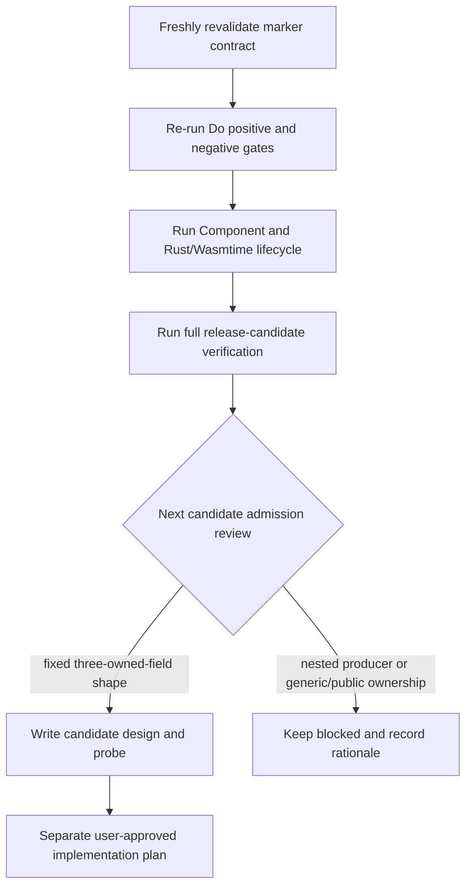

# G6.2 Parameterized Pair Closeout And Next Admission Review Plan

> **For agentic workers:** REQUIRED SUB-SKILL: Use
> `superpowers:executing-plans` (or `superpowers:subagent-driven-development`)
> to execute this plan task-by-task. Steps use checkbox syntax for tracking.

**Goal:** Close the in-flight parameterized two-owned-field producer route, then
run one evidence-gated review for the next bounded G6.2 producer/resource shape
without opening public ownership syntax, generic producer lowering, or full GC
cutover.

**Architecture:** The existing parameterized pair route remains isolated behind
its hash-pinned descriptor and keeps the static pair route byte-compatible. The
next stage begins only after its compiler, Component, and Rust/Wasmtime lifecycle
gates are green. Candidate selection is a separate fail-closed design gate; no
new descriptor or public syntax is implemented when the measured ABI or cleanup
contract is missing.

**Tech Stack:** Zig `0.16.0`, `wasm-tools 1.255.0`, Rust/Cargo `1.97.1`,
Wasmtime `47.0.2`, Bash gates, and the existing `do` regression harness.

**Spec:** `doc/superpowers/specs/2026-08-28-g6-2-parameterized-owned-record-pair-producer-design.md`

## Global Constraints

- Keep `do:g6-2-owned-record-pair-producer@0.1.0` and its WIT hash
  `89345a5213936735d7f065cd54ed42b83d159b80305a1a900ae00df2e811704d`
  independently runnable and unchanged.
- The parameterized descriptor is exactly
  `do:g6-2-owned-record-pair-parameterized-producer@0.1.0` with WIT hash
  `e7abd3cf7b7543325865a0b4be4b32ae50a2470ac5083169250719f89b7ce53a`.
- Preserve the pair layout `8/4`, field offsets `left=0` and `right=4`, stream
  capacity `1`, source ABI `(i32) -> (i32)`, and producer input order
  `(mode, left-seed, right-seed)`.
- Use independent presence bits for both owned handles; transfer both only after
  a complete record write, and release pre-transfer state in `right -> left`
  order. Handle value `0` is never an absence marker.
- Do not add public `own<T>`, `borrow<T>`, `ref<T>`, `Option`, or `Result`
  syntax; do not admit generic producers, arbitrary producer expressions,
  borrowed/list/variant payloads, or general async/resource lowering.
- Keep `complete_rows=15 pending_rows=15` with deliberate inventory exit `1`;
  these Component lifecycle proofs do not close an ARC/GC semantic-equivalence
  row.
- Use project-local caches when needed:
  `TMPDIR="$PWD/.tmp/do-tmp"`, `ZIG_LOCAL_CACHE_DIR="$PWD/.tmp/zig-cache"`,
  and `ZIG_GLOBAL_CACHE_DIR="$PWD/.tmp/zig-gcache"`.
- Stage only files belonging to the task being executed. Push only after a
  separate explicit delivery request.

## Current Evidence

- The seed-order assertion at `src/build/codegen_component_async.zig:2052`
  matches the canonical template; focused dispatch is `2/2`, the isolated
  emitter suite is `154/154`, and the affected modules pass `109/109`,
  `187/187`, and `568/568`.
- The parameterized Do positive/negative gates, canonical ABI gate,
  Rust/Wasmtime lifecycle gate, canonical/generated equivalence gate, and
  neighboring static-route gates pass. Full regression is
  `pass=1410 fail=0 skip=3`; `zig test main.zig` is `692/692`; ReleaseSmall
  and release smoke pass.
- Template and canonical WAT are byte-identical and parse with
  `wasm-tools 1.255.0`; the pinned WIT hash and `8/4` pair layout are fixed.
- The remaining closeout work is precise staging and a local commit. No push
  is authorized by this plan.
- A fresh read-only inventory check reports
  `summary complete_rows=15 pending_rows=15` and exits `1`; this is the
  intentional GC migration boundary, not a failed parameterized Component
  route.



### Task 1: Revalidate the parameterized codegen contract

**Files:**
- Modify only if the assertion is still stale:
  `src/build/codegen_component_async.zig:2031-2056`
- Test: `src/build/codegen_component_parameterized_owned_record_pair_stream_producer.zig`

**Interfaces:** The test consumes the existing canonical template and must
assert the exact markers emitted by that template. No WAT template or manifest
hash changes are allowed.

- [x] **Step 1: Verify the seed-order assertion and repair only if needed.**

  The assertion must contain these four exact checks:

  ```zig
  try std.testing.expect(std.mem.indexOf(u8, wat, "[producer-input-mode]") != null);
  try std.testing.expect(std.mem.indexOf(u8, wat, "[producer-left-ticket-seed-param]") != null);
  try std.testing.expect(std.mem.indexOf(u8, wat, "[producer-right-ticket-seed-param]") != null);
  try std.testing.expect(std.mem.indexOf(u8, wat, "[producer-seed-order] left then right") != null);
  ```

  Keep the existing `[producer-input-word-count] 3` and `__arc_` assertions.
  If the source already contains these checks, leave it unchanged and record
  the verification result.

- [x] **Step 2: Run the focused compiler tests.**

  ```bash
  (cd src && zig test build/codegen_component_async.zig \
    --test-filter 'parameterized owned-record pair')
  (cd src && zig test build/codegen_component_parameterized_owned_record_pair_stream_producer.zig)
  ```

  Expected: the focused dispatch tests pass `2/2`, the isolated emitter tests
  pass, and the canonical WAT remains byte-identical to its template.

- [x] **Step 3: Run all three affected Zig modules.**

  ```bash
  (cd src && zig test build/p3_async_manifest.zig)
  (cd src && zig test build/sema_imports.zig)
  (cd src && zig test build/codegen_component_async.zig)
  ```

  Expected: `109/109`, `187/187`, and the complete codegen suite pass with no
  change to the static pair dispatch.

### Task 2: Close the parameterized Do admission boundary

**Files:**
- Create: `examples/p3-runtime/g6-2-owned-record-pair-parameterized-producer.do`
- Create: `examples/p3-runtime/test_do_g6_2_owned_record_pair_parameterized_producer.sh`
- Create: `examples/p3-runtime/test_do_g6_2_owned_record_pair_parameterized_producer_negative.sh`
- Create: `src/build/test/compile_err/702_g6_2_parameterized_pair_wrong_arity.do`
- Create: `src/build/test/compile_err/702_g6_2_parameterized_pair_wrong_arity.expect`
- Create: `src/build/test/compile_err/703_g6_2_parameterized_pair_seed_order.do`
- Create: `src/build/test/compile_err/703_g6_2_parameterized_pair_seed_order.expect`
- Create: `src/build/test/compile_err/704_g6_2_parameterized_pair_non_u32_seed.do`
- Create: `src/build/test/compile_err/704_g6_2_parameterized_pair_non_u32_seed.expect`
- Create: `src/build/test/compile_err/705_g6_2_parameterized_pair_renamed_binding.do`
- Create: `src/build/test/compile_err/705_g6_2_parameterized_pair_renamed_binding.expect`
- Create: `src/build/test/compile_err/706_g6_2_parameterized_pair_borrowed_field.do`
- Create: `src/build/test/compile_err/706_g6_2_parameterized_pair_borrowed_field.expect`
- Create: `src/build/test/compile_err/707_g6_2_parameterized_pair_extra_field.do`
- Create: `src/build/test/compile_err/707_g6_2_parameterized_pair_extra_field.expect`
- Create: `src/build/test/compile_err/708_g6_2_parameterized_pair_wrong_binding.do`
- Create: `src/build/test/compile_err/708_g6_2_parameterized_pair_wrong_binding.expect`
- Create: `src/build/test/compile_err/709_g6_2_parameterized_pair_async_intrinsic.do`
- Create: `src/build/test/compile_err/709_g6_2_parameterized_pair_async_intrinsic.expect`
- Create: `src/build/test/compile_err/710_g6_2_parameterized_pair_old_descriptor.do`
- Create: `src/build/test/compile_err/710_g6_2_parameterized_pair_old_descriptor.expect`
- Create: `src/build/test/compile_err/711_g6_2_parameterized_pair_unregistered_descriptor.do`
- Create: `src/build/test/compile_err/711_g6_2_parameterized_pair_unregistered_descriptor.expect`

**Interfaces:** The positive fixture must match the exact source in the design
spec. Every negative fixture must fail before WAT: source-shape mutations use
`UnsupportedP3AsyncComponent`, the wrong import marker uses `InvalidImportDecl`,
and the unregistered locator uses `UnknownP3AsyncHostDescriptor`. No mutation
may fall through to the normal ARC route.

- [x] **Step 1: Add the exact positive source.**

  It contains only `make_ticket`, `consume`, `Ticket`, `ResourcePair`,
  `ProducerError`, the sentinel
  `produce(mode u32, left_seed u32, right_seed u32) -> Result<nil, ProducerError>`
  returning `Ok()`, and `start() {}`.

- [x] **Step 2: Add the ten boundary mutations.**

  Mutate exactly one contract fact per fixture: arity, seed order, seed type,
  binding name, owned-field qualifier, field count, marker kind, async token or
  intrinsic, and descriptor identity. Keep each `.expect` to the stable
  the diagnostic expected for that guard (`UnsupportedP3AsyncComponent` for
  source-shape mutations, `InvalidImportDecl` for the wrong marker, and
  `UnknownP3AsyncHostDescriptor` for the unregistered locator).

- [x] **Step 3: Run the positive and negative gates.**

  ```bash
  TMPDIR="$PWD/.tmp/do-tmp" \
  ZIG_LOCAL_CACHE_DIR="$PWD/.tmp/zig-cache" \
  ZIG_GLOBAL_CACHE_DIR="$PWD/.tmp/zig-gcache" \
  bash examples/p3-runtime/test_do_g6_2_owned_record_pair_parameterized_producer.sh
  bash examples/p3-runtime/test_do_g6_2_owned_record_pair_parameterized_producer_negative.sh
  ```

  Expected: generated WIT matches the pinned source and hash, generated WAT
  matches the canonical WAT, the three inputs and ownership markers are present,
  and all ten mutations fail before WAT emission.

### Task 3: Prove generated lifecycle and canonical equivalence

**Files:**
- Create: `examples/p3-runtime/test_rust_g6_2_owned_record_pair_parameterized_producer.sh`
- Create: `examples/p3-runtime/test_g6_2_owned_record_pair_parameterized_producer_equivalence.sh`
- Use: `examples/p3-runtime/rust-host-runner/src/bin/g6_2_owned_record_pair_parameterized_producer_abi.rs`
- Use: `examples/p3-runtime/rust-host-runner/src/bin/g6_2_owned_record_pair_parameterized_producer.rs`

**Interfaces:** The generated Component and canonical Component must use the
same ten-mode runner. The runner records seed order, callback/poll/cancel/future
counters, ticket creation/drop counts, and final `table-empty=true`.

- [x] **Step 1: Run the ten lifecycle modes.**

  Run `ready`, `pending`, `sink-error-before`, `sink-error-after`,
  `cancel-before-transfer`, `cancel-after-transfer`,
  `early-drop-before-transfer`, `early-drop-after-transfer`, `repeat`, and
  `invalid`. Require `[left_seed,right_seed]` only after transfer, `2/2`
  ticket cleanup per invocation, `4/4` in `repeat`, one stream/future cleanup,
  zero resource creation for `invalid`, and an empty `ResourceTable`.

- [x] **Step 2: Compare canonical and generated outputs.**

  Assemble each Component with `cm-async,cm-more-async-builtins`, normalize only
  declared Component identity bytes, and `diff -u` every mode's stable
  `key=value` output. Do not add this result to the ARC/GC inventory.

- [x] **Step 3: Re-run the closed neighboring routes.**

  Run the static single-field and static two-field ABI/Do/Rust/equivalence gates.
  Their WIT hashes, payload order, cleanup counts, and empty tables must remain
  unchanged.

### Task 4: Release-candidate and status recheck

**Files:**
- Modify only after green gates: `examples/p3-runtime/README.md`,
  `doc/roadmap_status.md`, `doc/pending_blocked.md`, `doc/master_plan.md`,
  `doc/start_here.md`, `CHANGELOG.md`.

- [x] **Step 1: Run repository verification with project-local caches.**

  ```bash
  TMPDIR="$PWD/.tmp/do-tmp" \
  ZIG_LOCAL_CACHE_DIR="$PWD/.tmp/zig-cache" \
  ZIG_GLOBAL_CACHE_DIR="$PWD/.tmp/zig-gcache" \
  ./src/build/test/run_tests.sh
  (cd src && zig test main.zig)
  (cd src && zig build -Doptimize=ReleaseSmall)
  bash src/build/test/run_release_smoke.sh
  git diff --check
  ```

  Expected: no regression, current pinned tool versions are used, and the
  deliberate inventory check still reports `complete_rows=15 pending_rows=15`
  with exit `1`.

- [x] **Step 2: Synchronize only current-state documentation.**

  Record the parameterized descriptor/hash/layout and ten-mode cleanup evidence
  as a private bounded checkpoint. Keep generic producer, arbitrary expression,
  borrowed/list/variant resource payloads, general async/resource lowering,
  public ownership syntax, and full GC cutover explicitly pending.

- [x] **Step 3: Review the staged path list before committing.**

  ```bash
  git diff --check
  git status --short
  git diff --stat
  ```

  Commit only this route and its evidence with:

  ```bash
  git commit -m "feat: add parameterized owned-record pair producer gate"
  ```

### Task 5: Next single-candidate admission review

This task starts only after Tasks 1–4 are green. It is a design gate, not an
authorization to implement a new public language feature.

- [x] **Step 1: Compare the three candidate shapes.**

  | Candidate | Evidence needed | Decision |
  | --- | --- | --- |
  | Fixed `ResourceTriple { left, middle, right: own<ticket> }` producer | Independent WIT hash, measured 12-byte/4-byte layout, offsets `0/4/8`, four producer input words `(mode,left-seed,middle-seed,right-seed)`, presence-mask transfer, ten-mode cleanup | **Recommended**: extends the proven mask/layout contract with a small isolated ABI change and no public syntax |
  | Nested owned-resource record producer | Independent probe for nested field offsets, recursive cleanup and transfer ordering, plus new analyzer/layout facts | Not recommended now: more compiler branches before a direct triple-field invariant is measured |
  | Generic producer or public `own<T>`/`borrow<T>`/`ref<T>` | Generic IR, ownership/escape rules, async cancellation/lifetime contract, broad regression migration | Defer: architectural scope exceeds G6.2 bounded evidence and remains a documented blocker |

- [x] **Step 2: Apply the admission criteria.**

  Admit a candidate only when all of these are independently observable: a
  pinned WIT hash; canonical ABI without Wasm GC references; exact descriptor and
  source matcher; fail-closed drift negatives; canonical/generated Component
  assembly; ready/pending/error/cancel/early-drop/repeat/invalid runtime rows;
  exactly-once resource, stream, task, and future cleanup; no static-route drift;
  and no change to the migration inventory.

- [x] **Step 3: Stop or open a separate design.**

  The recommended triple probe measured the stated ABI and lifecycle. Its dated
  design is recorded in
  `doc/superpowers/specs/2026-08-28-g6-2-owned-record-triple-producer-design.md`,
  and the separately approved implementation plan is
  `doc/superpowers/plans/2026-08-28-g6-2-owned-record-triple-compiler-admission.md`.
  The compiler admission and release evidence are now complete. Any further
  producer/resource shape, including nested producer lowering, requires a new
  design and explicit approval rather than extending this plan implicitly.

## Stop Conditions And Rollback

- A marker mismatch, WIT hash drift, unsupported shape, failed Component
  validation, lifecycle counter mismatch, or non-empty resource table stops the
  parameterized route from being promoted.
- A shared-module change that alters the static descriptor or an existing WIT
  hash is rolled back only for the new-route files; unrelated worktree changes
  remain untouched.
- A default `/tmp` quota error may be rerun with the project-local cache paths;
  test expectations must not be weakened.
- If the next candidate fails its probe, remove only its uncommitted design/probe
  artifacts and retain the closed parameterized pair route.

## Acceptance

The current stage is complete only when Tasks 1–4 have fresh passing evidence,
the route is documented as private and bounded, and the inventory remains
`complete_rows=15 pending_rows=15` with exit `1`. The next stage is complete only
when Task 5 has either produced an approved triple-producer design spec or has
recorded a measured failure and preserved the existing pending boundary.
