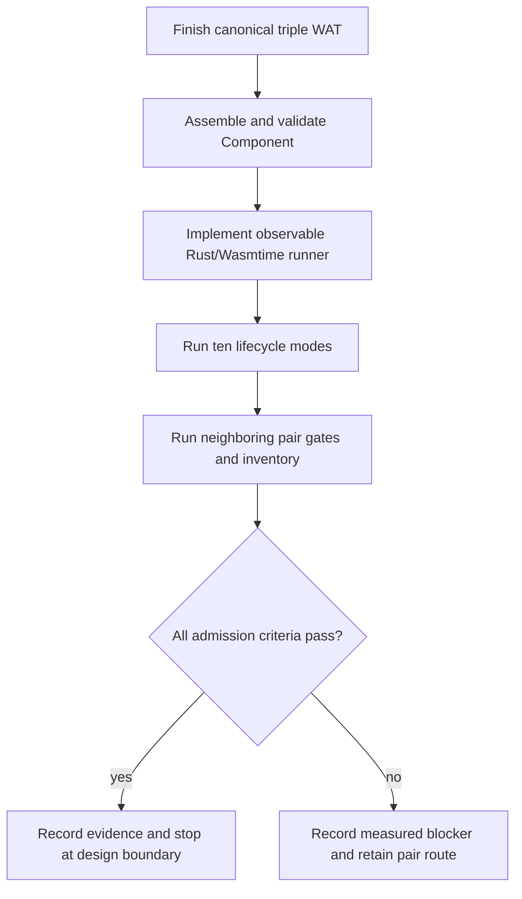

# G6.2 Fixed Three-Owned-Field Record Producer Probe Plan

> **For agentic workers:** REQUIRED SUB-SKILL: Use
> `superpowers:executing-plans` (or `superpowers:subagent-driven-development`)
> to execute this plan task-by-task. Steps use checkbox syntax for tracking.

**Goal:** Independently measure and gate a fixed three-owned-resource record
producer without admitting it to the `do` compiler or public ownership syntax.

**Architecture:** Extend the already-proven canonical pair probe only in a
standalone WIT/WAT/Rust fixture. The probe owns three top-level `ticket`
handles, records presence separately from handle values, transfers the complete
record atomically, and exercises cleanup before and after transfer. A passing
probe produces evidence for a later design/implementation decision; it does not
create a manifest row or generated compiler route.

**Tech Stack:** Zig `0.16.0`, `wasm-tools 1.255.0`, Rust/Cargo `1.97.1`,
Wasmtime `47.0.2`, Bash, and the existing `do` regression harness.

**Spec:** `doc/superpowers/specs/2026-08-28-g6-2-owned-record-triple-producer-design.md`

## Global Constraints

- Keep this probe private and canonical. Do not modify
  `src/build/p3_async_manifest.zig`, `p3_async_registry.json`, compiler
  dispatch, or any public `do` syntax.
- Pin the WIT source to
  `examples/p3-runtime/wit/g6-2-owned-record-triple-producer.wit` and SHA-256
  `73fd57dc8f34f13023b48f2b82e439b212eab52192886f0d07a37d86e63658b1`.
- Preserve package `do:g6-2-owned-record-triple-producer@0.1.0`, world
  `owned-record-triple-producer`, source member `make-ticket`, sink member
  `consume-via-stream`, and export member `produce` exactly.
- Measure a 12-byte, 4-byte-aligned record with `left=0`, `middle=4`, and
  `right=8`; use stream capacity `1` and four producer input words in the order
  `(mode, left-seed, middle-seed, right-seed)`.
- Use mask bits `left=1`, `middle=2`, `right=4`, `transferred=8`. Handle value
  `0` is valid and is never an absence marker.
- Transfer only after the complete record write. Before transfer release in
  `right -> middle -> left` order; after transfer the host owns and drops all
  three tickets exactly once.
- Keep the GC migration inventory at `complete_rows=15 pending_rows=15` with
  deliberate exit `1`; this probe is not ARC/GC semantic-equivalence evidence.
- Use project-local caches when a command writes build artifacts:
  `TMPDIR="$PWD/.tmp/do-tmp"`, `ZIG_LOCAL_CACHE_DIR="$PWD/.tmp/zig-cache"`,
  and `ZIG_GLOBAL_CACHE_DIR="$PWD/.tmp/zig-gcache"`.
- Stage only triple-probe files. Do not push from this plan; delivery requires a
  separate explicit request.

## File Map

- Modify: `examples/p3-runtime/g6-2-owned-record-triple-producer-canonical.wat`
  to finish the hand-written canonical implementation.
- Use: `examples/p3-runtime/wit/g6-2-owned-record-triple-producer.wit` as the
  immutable ABI contract.
- Modify: `examples/p3-runtime/rust-host-runner/Cargo.toml` to register the two
  triple runner binaries.
- Create: `examples/p3-runtime/rust-host-runner/src/bin/g6_2_owned_record_triple_producer_abi.rs`
  for the generated Component ABI runner.
- Create: `examples/p3-runtime/rust-host-runner/src/bin/g6_2_owned_record_triple_producer.rs`
  for canonical Component lifecycle execution.
- Create: `examples/p3-runtime/test_g6_2_owned_record_triple_producer_abi.sh`
  for WIT hash, WAT markers, Component assembly, and ABI assertions.
- Create: `examples/p3-runtime/test_rust_g6_2_owned_record_triple_producer.sh`
  for the ten-mode Rust/Wasmtime lifecycle matrix.
- Modify after all gates pass: `doc/roadmap_status.md`,
  `doc/pending_blocked.md`, `examples/p3-runtime/README.md`,
  `doc/start_here.md`, `doc/master_plan.md`, and `CHANGELOG.md` only as needed
  to record the bounded probe result and unchanged pending boundary.

## Execution Order



### Task 1: Complete and validate the canonical WAT

**Files:**
- Modify: `examples/p3-runtime/g6-2-owned-record-triple-producer-canonical.wat`
- Test: `examples/p3-runtime/wit/g6-2-owned-record-triple-producer.wit`

**Interfaces:** The module exports `[async-lift]produce` with four `i32`
parameters and imports the exact pinned WIT surface. It must expose the marker
comments consumed by the shell gate and must contain no Wasm GC reference at the
canonical boundary.

- [x] **Step 1: Extend `$make-record` to three seeds.**

  Change the parameters and locals to:

  ```wat
  (param $frame i32)
  (param $mode i32)
  (param $left_seed i32)
  (param $middle_seed i32)
  (param $right_seed i32)
  (result i32)
  (local $left i32)
  (local $middle i32)
  (local $right i32)
  ```

  Keep the mode `255` guard before any `make-ticket` call. Call
  `$make-ticket` in the exact order left, middle, right; store handles at frame
  offsets `64`, `68`, and `72`; set mask bits `1`, `2`, and `4` only after each
  store. Return `0` only after all three stores succeed.

- [x] **Step 2: Pass all four export inputs.**

  In the exported `[async-lift]produce`, load `$mode`, `$left_seed`,
  `$middle_seed`, and `$right_seed` into `$make-record` in that order. Keep the
  existing frame/task/stream setup and cancellation paths unchanged except for
  the triple record size and marker values.

- [x] **Step 3: Check the static contract before assembly.**

  Run:

  ```bash
  rg -n '\[producer-record-byte-size\] 12|\[producer-record-left-offset\] 0|\[producer-record-middle-offset\] 4|\[producer-record-right-offset\] 8|\[producer-input-word-count\] 4|left then middle then right' \
    examples/p3-runtime/g6-2-owned-record-triple-producer-canonical.wat
  if rg -n '__arc_|ref\.null|struct\.new|array\.new' \
    examples/p3-runtime/g6-2-owned-record-triple-producer-canonical.wat; then
    exit 1
  fi
  wasm-tools parse \
    examples/p3-runtime/g6-2-owned-record-triple-producer-canonical.wat \
    -o /tmp/g6-2-owned-record-triple-producer.core.wasm
  ```

  Expected: all five layout/input markers are present, no forbidden marker is
  found, and `wasm-tools parse` succeeds.

- [x] **Step 4: Commit the canonical WAT checkpoint.**

  ```bash
  git add examples/p3-runtime/g6-2-owned-record-triple-producer-canonical.wat
  git commit -m "test: complete canonical owned-record triple probe"
  ```

### Task 2: Add the observable Rust/Wasmtime runner

**Files:**
- Create: `examples/p3-runtime/rust-host-runner/src/bin/g6_2_owned_record_triple_producer_abi.rs`
- Create: `examples/p3-runtime/rust-host-runner/src/bin/g6_2_owned_record_triple_producer.rs`
- Test: `examples/p3-runtime/test_rust_g6_2_owned_record_triple_producer.sh`

**Interfaces:** The runner must model `ResourceTriple { left, middle, right }`,
implement the exact WIT world with Wasmtime component traits, and emit stable
`key=value` observations for seed order, resource drops, stream/future/task
cleanup, and `table-empty=true`.

- [x] **Step 1: Define the triple resource and counters.**

  Derive the same Wasmtime component traits used by the pair runner:

  ```rust
  #[derive(wasmtime::component::ComponentType,
           wasmtime::component::Lift,
           wasmtime::component::Lower)]
  #[component(record)]
  struct ResourceTriple {
      left: Resource<Ticket>,
      middle: Resource<Ticket>,
      right: Resource<Ticket>,
  }
  ```

  Track `created`, `resource_drops`, `received`, `host_calls`,
  `callback_calls`, `poll_calls`, `finish_calls`, `pending_polls`,
  `stream_drops`, `future_drops`, `future_polls`, `future_completions`,
  `pending_future_drops`, and `cancel_calls`. Keep all counter updates behind
  the existing mutex and fail if the `ResourceTable` is non-empty at teardown.

- [x] **Step 2: Implement the ten mode inputs and expectations.**

  Use these mode values and seed tuples:

  ```text
  ready=0 (111,222,333)
  pending=1 (0,4294967295,1)
  sink-error-before=2 (444,555,666)
  sink-error-after=3 (777,888,999)
  cancel-before-transfer=4 (1001,1002,1003)
  cancel-after-transfer=5 (2001,2002,2003)
  early-drop-before-transfer=6 (3001,3002,3003)
  early-drop-after-transfer=7 (4001,4002,4003)
  repeat=8 (111,222,333) then (444,555,666)
  invalid=255 (9,10,11)
  ```

  The sink must return `Err(io)` before reading for mode `2`, read then return
  `Err(pipe)` for mode `3`, remain pending for cancellation/drop modes, and
  accept the triple before holding the task for post-transfer cancellation/drop
  modes. Mode `255` must allocate nothing.

- [x] **Step 3: Assert the ownership and lifecycle matrix.**

  Require the following for every valid invocation: exactly three ticket
  creations and drops, one stream, one sink task/future, and an empty table.
  Require received seeds in `[left,middle,right]` order only after transfer.
  Require `repeat` to observe six ticket creations and six drops. Require all
  four pre/post cancellation or early-drop rows to record one cancellation and
  one pending-future drop, with zero future completions. Require `invalid` to
  record zero callbacks, polls, cancellations, drops, or completions.

- [x] **Step 4: Build the runner with the locked toolchain.**

  ```bash
  cargo build --quiet --locked \
    --manifest-path examples/p3-runtime/rust-host-runner/Cargo.toml \
    --bin do-p3-g6-2-owned-record-triple-producer-abi \
    --bin do-p3-g6-2-owned-record-triple-producer
  ```

  Expected: both binaries build without changing `Cargo.lock` or unrelated
  runner sources.

### Task 3: Add canonical ABI and lifecycle shell gates

**Files:**
- Create: `examples/p3-runtime/test_g6_2_owned_record_triple_producer_abi.sh`
- Create: `examples/p3-runtime/test_rust_g6_2_owned_record_triple_producer.sh`

**Interfaces:** The gates consume only the pinned WIT, canonical WAT, and the
two runner binaries. They must fail closed on tool version, hash, marker,
assembly, validation, counter, or table-cleanup drift.

- [x] **Step 1: Gate the WIT hash and canonical Component assembly.**

  The ABI gate must verify `wasm-tools --version` is `1.255.0`, hash the WIT,
  parse the canonical WAT, embed it with world
  `owned-record-triple-producer` and features `cm-async,cm-more-async-builtins`,
  run `component new --skip-validation`, and run `validate` with the same
  features. It must assert the 12-byte layout, `0/4/8` offsets, four input
  words, seed-order marker, transfer marker, and absence of `__arc_`.

- [x] **Step 2: Run all ten Rust/Wasmtime rows.**

  The lifecycle gate must build both triple binaries and invoke the ABI runner
  once per mode through the canonical gate, which verifies stable observations
  with `grep -Fq`, including `table-empty=true`. It must use a project-local
  temporary directory and remove it on exit.

- [x] **Step 3: Preserve the old routes.**

  Run the existing static and parameterized pair gates after the triple gate:

  ```bash
  bash examples/p3-runtime/test_g6_2_owned_record_pair_producer_abi.sh
  bash examples/p3-runtime/test_do_g6_2_owned_record_pair_producer.sh
  bash examples/p3-runtime/test_rust_g6_2_owned_record_pair_producer.sh
  bash examples/p3-runtime/test_g6_2_owned_record_pair_producer_equivalence.sh
  bash examples/p3-runtime/test_rust_g6_2_owned_record_pair_parameterized_producer.sh
  bash examples/p3-runtime/test_g6_2_owned_record_pair_parameterized_producer_equivalence.sh
  ```

  Expected: all existing pair hashes, payload orders, cleanup counts, and
  `table-empty=true` observations remain unchanged.

### Task 4: Run release verification and update evidence

**Files:**
- Modify after green gates: `doc/roadmap_status.md`,
  `doc/pending_blocked.md`, `examples/p3-runtime/README.md`,
  `doc/start_here.md`, `doc/master_plan.md`, `CHANGELOG.md`
- Test: full repository harness and GC inventory

**Interfaces:** Documentation records only measured triple-probe evidence and
keeps the generic/public ownership and GC migration boundaries explicit.

- [x] **Step 1: Run the required repository checks.**

  ```bash
  TMPDIR="$PWD/.tmp/do-tmp" \
  ZIG_LOCAL_CACHE_DIR="$PWD/.tmp/zig-cache" \
  ZIG_GLOBAL_CACHE_DIR="$PWD/.tmp/zig-gcache" \
  ./src/build/test/run_tests.sh
  (cd src && TMPDIR="$PWD/../.tmp/do-tmp" ZIG_LOCAL_CACHE_DIR="$PWD/../.tmp/zig-cache" ZIG_GLOBAL_CACHE_DIR="$PWD/../.tmp/zig-gcache" zig test main.zig)
  (cd src && TMPDIR="$PWD/../.tmp/do-tmp" ZIG_LOCAL_CACHE_DIR="$PWD/../.tmp/zig-cache" ZIG_GLOBAL_CACHE_DIR="$PWD/../.tmp/zig-gcache" zig build -Doptimize=ReleaseSmall)
  bash src/build/test/run_release_smoke.sh
  git diff --check
  ```

  Observed: full regression `pass=1410 fail=0 skip=3`, `zig test main.zig`
  `692/692`, ReleaseSmall, release smoke, and the triple/pair gates pass; no
  compiler registry or migration inventory row changes.

- [x] **Step 2: Run and record the intentional inventory result.**

  Run the repository's current GC inventory command and preserve the expected
  Observed: `summary complete_rows=15 pending_rows=15` with exit `1`. This is
  the intentional open-ledger result; no count or exit normalization was made.

- [x] **Step 3: Synchronize current-state documentation.**

  Record the pinned WIT hash, 12/4 layout, `0/4/8` offsets, input order, ten
  lifecycle rows, exactly-once cleanup, and empty-table result. State that the
  result is canonical probe evidence only. Keep generic producer expressions,
  nested ownership, borrowed/list/variant payloads, general async/resource
  lowering, public `own<T>`/`borrow<T>`/`ref<T>`, and full GC cutover pending.
  The triple probe is recorded as `design/probe passed`, with no manifest row,
  compiler dispatch, generated Do fixture, or public ownership admission.

- [x] **Step 4: Review the diff and commit the probe.**

  ```bash
  git diff --check
  git status --short
  git diff --stat
  git add doc/superpowers/plans/2026-08-28-g6-2-owned-record-triple-probe.md \
    doc/superpowers/specs/2026-08-28-g6-2-owned-record-triple-producer-design.md \
    CHANGELOG.md \
    doc/master_plan.md \
    doc/pending_blocked.md \
    doc/roadmap_status.md \
    doc/start_here.md \
    examples/p3-runtime/README.md \
    examples/p3-runtime/rust-host-runner/Cargo.toml \
    examples/p3-runtime/wit/g6-2-owned-record-triple-producer.wit \
    examples/p3-runtime/g6-2-owned-record-triple-producer-canonical.wat \
    examples/p3-runtime/rust-host-runner/src/bin/g6_2_owned_record_triple_producer.rs \
    examples/p3-runtime/rust-host-runner/src/bin/g6_2_owned_record_triple_producer_abi.rs \
    examples/p3-runtime/test_g6_2_owned_record_triple_producer_abi.sh \
    examples/p3-runtime/test_rust_g6_2_owned_record_triple_producer.sh
  git commit -m "test: add owned-record triple lifecycle probe"
  ```

  Observed: only triple-probe artifacts are staged and committed; unrelated
  worktree changes remain unstaged. Do not push in this plan.

### Task 5: Admission decision and handoff

**Files:**
- Modify only on a measured failure: `doc/pending_blocked.md`
- Create only on explicit approval after a green probe: a separate
  implementation plan under `doc/superpowers/plans/`

**Interfaces:** A green result is evidence for a future private compiler route;
it is not authorization to implement one. A failed result preserves the closed
pair routes and records the exact failed criterion.

- [x] **Step 1: Apply the admission checklist.**

  Admit the triple candidate only if the WIT hash, canonical assembly, layout,
  input order, all ten lifecycle rows, exact cleanup counters, empty resource
  table, neighboring pair gates, full regression, and unchanged inventory are
  all independently green.
  Observed: every criterion is green, so the candidate status is
  `design/probe passed`.

- [x] **Step 2: Handle a failed probe without widening scope.**

  Record the measured mismatch, command, and observed output in
  `doc/pending_blocked.md`. Do not add a manifest row, compiler matcher, Do
  fixture, or public ownership syntax. Keep the existing pair route untouched.
  No failed criterion occurred; the existing pair routes remain unchanged and
  no failure record was required.

- [x] **Step 3: Stop at the design boundary after success.**

  If all criteria pass, update the status docs to `design/probe passed` and
  wait for explicit approval before writing a compiler implementation plan.
  The next plan must separately address manifest admission, source matching,
  generated WAT parity, negative fixtures, and compiler regression coverage.
  The status docs now record this boundary; no compiler implementation is part
  of this plan.

## Stop Conditions And Rollback

- Any WIT hash drift, marker mismatch, unsupported Component feature, failed
  validation, seed-order mismatch, incorrect cleanup count, or non-empty table
  stops the triple candidate.
- If the canonical probe fails, retain its measured design/probe artifacts and
  record the blocker; do not alter the already-closed pair route.
- If a local implementation edit is found to affect an existing pair contract,
  revert only the uncommitted triple-probe edit after preserving the evidence;
  unrelated worktree changes remain untouched.
- A default temporary-directory quota failure may be rerun with the project
  local cache variables, but test expectations and counters must not be relaxed.

## Acceptance

This phase is complete only when the canonical WAT parses, the pinned WIT
assembles into a valid Component, all ten Rust/Wasmtime lifecycle rows pass,
neighboring pair routes remain green, the full harness and release checks pass,
and the inventory remains `complete_rows=15 pending_rows=15` with exit `1`.
After that point the triple shape is `design/probe passed`, not compiler-admitted
and not a public language feature.
