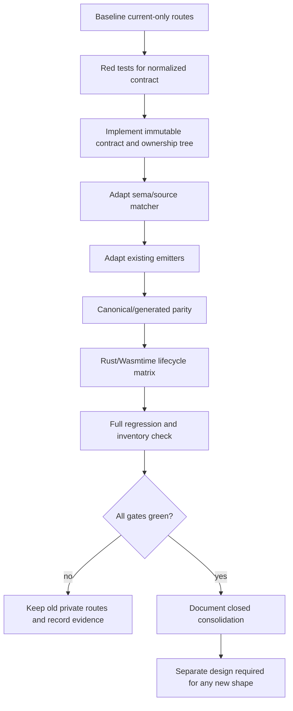

# G6.2 General Producer/Resource Contract Admission Implementation Plan

> **For agentic workers:** REQUIRED SUB-SKILL: Use
> `superpowers:executing-plans` (or `superpowers:subagent-driven-development`)
> to implement this plan task-by-task. Steps use checkbox (`- [ ]`) syntax for tracking.

**Goal:** Introduce a reusable internal producer/resource contract and prove it by replaying
the already admitted private routes, without widening Do syntax or admitting arbitrary WIT
producer shapes.

**Architecture:** Normalize manifest-measured source/sink, payload layout, ownership paths,
transfer commit, and terminal cleanup into immutable plan data. Existing descriptor-specific
emitters consume that plan through small adapters, so generated WAT/WIT remains byte-identical
for the current routes. New public ownership syntax, generic producer expressions, borrowed
async payloads, and unmeasured layouts remain rejected before WAT emission.

**Tech Stack:** Zig `0.16.0`, Do compiler, current-only `bin/do-toolchain` with
`wasm-tools 1.258.0` and Wasmtime `48.0.1`, Rust/Cargo `1.97.1`, existing WIT/Core-WAT
probes, Rust/Wasmtime host runners, and the Zig regression harness.

**Spec:** `doc/superpowers/specs/2026-09-03-g6-2-general-producer-resource-design.md`

## Global Constraints

- This plan is an internal-contract consolidation gate, not a public ownership-language change.
- Do not add or expose `own<T>`, `borrow<T>`, `borrow_mut<T>`, `ref<T>`, pointers, references,
  or lifetime syntax.
- Do not admit arbitrary producer expressions, generic producer lowering, borrowed values in
  async/Stream payloads, seventh-hop forwarding, seventh-level nested resources, or unmeasured
  list/variant/mixed-resource layouts.
- Keep every existing private descriptor, WIT hash, canonical template, output marker, and
  route-specific diagnostic unchanged.
- Keep `map<K,V>` separate; the exact synchronous `map<u32,u32>` route is not part of this plan.
- Component cancellation never rolls back an external effect already delivered to a host.
- Every resource, list allocation, stream endpoint, future, subtask, waitable membership, and
  frame has one finalization authority and at most one finalization.
- Preserve the GC-first target and the deliberate inventory result
  `complete_rows=15 pending_rows=15` with exit code `1`.
- Use project-local temporary/cache paths when a command creates artifacts:
  `TMPDIR="$PWD/.tmp/do-tmp"`, `ZIG_LOCAL_CACHE_DIR="$PWD/.tmp/zig-cache"`, and
  `ZIG_GLOBAL_CACHE_DIR="$PWD/.tmp/zig-gcache"`.
- Preserve unrelated dirty worktree changes. Stage only files belonging to this plan; do not
  run `reset`, `clean`, `checkout`, broad formatting, or `push` from this plan.

## File Map

| Path | Responsibility |
| --- | --- |
| `src/build/codegen_component_producer_contract.zig` | Immutable normalized producer, payload, ownership, and terminal plan types plus validation helpers. |
| `src/build/codegen_component_producer_contract_test.zig` | Unit tests for layout/path/bit/terminal invariants and fail-closed errors. |
| `src/build/p3_async_manifest.zig` | Expose only the measured facts needed to construct the normalized contract; keep descriptor-specific validators. |
| `src/build/codegen_component_async_plan.zig` | Convert already accepted source facts to a normalized contract; keep expression and hop limits explicit. |
| `src/build/sema_stream_lease.zig` | Enforce transfer/finalize/join rules when a producer contract is applied; no public type syntax. |
| `src/build/codegen_component_owned_record_stream_producer.zig` | Adapter for the existing single-owned-field record route. |
| `src/build/codegen_component_owned_record_pair_stream_producer.zig` | Adapter for the existing fixed pair route. |
| `src/build/codegen_component_owned_record_triple_stream_producer.zig` | Adapter for the existing fixed triple route. |
| `src/build/codegen_component_owned_record_nested_stream_producer.zig` | Adapter for the existing nested route. |
| `src/build/codegen_component_parameterized_owned_record_pair_stream_producer.zig` | Adapter for typed parameterized pair route. |
| `src/build/codegen_component_list_resource_producer.zig` | Adapter for the private list/resource route. |
| `src/build/codegen_component_dynamic_list_resource_producer.zig` | Adapter for bounded dynamic-count route. |
| `src/build/codegen_component_batched_list_resource_producer.zig` | Adapter for fixed two-batch route. |
| `src/build/codegen_component_scalar_list_stream_producer.zig` | Adapter for bounded scalar-list route. |
| `src/build/test/compile_err/748_g6_2_general_producer_*.do` | One-fact-at-a-time negative source mutations. |
| `examples/p3-runtime/test_g6_2_general_producer_contract.sh` | Consolidated current-only contract, parity, lifecycle, and regression gate. |
| `examples/p3-runtime/test_g6_2_general_producer_contract_negative.sh` | Consolidated fail-closed boundary gate. |
| `.superpowers/sdd/2026-09-03-g6-2-general-producer-resource/` | Command output and review evidence; never used as compiler input. |
| `doc/roadmap_status.md`, `doc/pending_blocked.md`, `doc/start_here.md`, `doc/master_plan.md`, `examples/p3-runtime/README.md`, `CHANGELOG.md` | Updated only after all gates are green. |

## Execution Order



### Task 1: Capture the baseline before touching shared code

**Files:**
- Create: `.superpowers/sdd/2026-09-03-g6-2-general-producer-resource/task-1-baseline.txt`
- Test: existing G6.2 route gates listed below

**Interfaces:**
- Consumes: current `toolchain/toolchain.lock.json`, private descriptor registry, and
  existing canonical/generated fixtures.
- Produces: a dated, machine-readable baseline that later parity checks compare against.

- [x] **Step 1: Verify toolchain identity.**

  Run:

  ```bash
  bin/do-toolchain probe
  ```

  Record the exact `wasm-tools 1.258.0` and Wasmtime `48.0.1` identity and capability lines.
  A version/hash mismatch stops this plan before shared source is modified.

- [x] **Step 2: Run the current unit and default harness baseline.**

  Run:

  ```bash
  (cd src && zig test main.zig)
  ./src/build/test/run_tests.sh
  ```

  Record the test counts, skip count, and the intentional GC inventory exit `1`.

- [x] **Step 3: Run representative existing producer gates.**

  Run:

  ```bash
  bash examples/p3-runtime/test_g6_2_owned_record_producer_abi.sh
  bash examples/p3-runtime/test_g6_2_owned_record_pair_producer_abi.sh
  bash examples/p3-runtime/test_g6_2_owned_record_pair_parameterized_producer_abi.sh
  bash examples/p3-runtime/test_g6_2_owned_record_triple_producer_abi.sh
  bash examples/p3-runtime/test_rust_g6_2_owned_record_nested_producer.sh
  bash examples/p3-runtime/test_rust_g6_2_batched_list_resource_producer.sh
  bash examples/p3-runtime/test_rust_g6_2_scalar_list_producer.sh
  ```

  Store stable `key=value` output and hashes in the baseline. Do not normalize away payload
  order, cleanup counts, or `table-empty=true`.

- [x] **Step 4: Review the baseline path list.**

  Run:

  ```bash
  git status --short
  git diff --check
  ```

  Confirm that the evidence file is the only new path and that unrelated dirty files remain
  untouched. If the baseline already fails, stop this plan and retain the failure evidence.

### Task 2: Define and test the immutable normalized contract

**Files:**
- Create: `src/build/codegen_component_producer_contract.zig`
- Create: `src/build/codegen_component_producer_contract_test.zig`
- Test: the new contract test module

**Interfaces:**
- Consumes: `p3_async_manifest.ProducerCanonical`, `RecordLayout`, `RecordNestedField`,
  `StreamCanonical`, and existing `AsyncFramePlan` facts.
- Produces: `ProducerContract`, `PayloadLayout`, `OwnershipTransferPlan`, `OwnershipLeaf`,
  `OwnershipParent`, `TerminalContract`, and `validate_contract()`; all are immutable plan data
  owned by the caller's allocator.

- [x] **Step 1: Write red tests for the exact contract shapes.**

  The tests must construct direct, pair, triple, nested, scalar-list, and batched-list facts
  and assert these invariants:

  ```text
  direct: leaf path ticket, handle offset 0, bit 0
  pair:   left/right offsets 0/4, bits 0/1, release order right then left
  triple: left/middle/right offsets 0/4/8, bits 0/1/2, release order right,middle,left
  nested: source path inner.ticket retained while canonical offset is 0
  list:   pointer/length/stride/capacity are measured facts, never inferred
  ```

  Add failures for duplicate bits, duplicate paths, a handle sentinel of `0`, missing drop
  import, transfer before complete write, and a child cleanup order after its parent.

- [x] **Step 2: Run the focused tests to establish RED.**

  Run:

  ```bash
  (cd src && zig test build/codegen_component_producer_contract_test.zig)
  ```

  Expected: failure because the contract types and validator do not yet exist.

- [x] **Step 3: Implement the pure contract model.**

  Add the following public shapes and exact validation behavior:

  ```zig
  pub const ProducerContract = struct {
      descriptor_id: []const u8,
      source: SourceContract,
      sink: SinkContract,
      payload: PayloadLayout,
      ownership: OwnershipTransferPlan,
      terminal: TerminalContract,
  };

  pub const SourceContract = struct {
      module: []const u8,
      import_name: []const u8,
      core_params: []const []const u8,
      core_results: []const []const u8,
  };

  pub const SinkContract = struct {
      module: []const u8,
      member: []const u8,
      capacity: u32,
      read_import: []const u8,
      write_import: []const u8,
      drop_import: []const u8,
  };

  pub const PayloadLayout = union(enum) {
      scalar: ScalarLayout,
      record: p3_async_manifest.RecordLayout,
      list: ListLayout,
  };

  pub const ScalarLayout = struct {
      core_type: []const u8,
      byte_size: u32,
      alignment: u32,
  };

  pub const ListLayout = struct {
      pointer_offset: u32,
      length_offset: u32,
      element_stride: u32,
      max_items: u32,
  };

  pub const OwnershipLeaf = struct {
      path: []const []const u8,
      resource: []const u8,
      handle_offset: u32,
      drop_import: []const u8,
      bit: u8,
  };

  pub const OwnershipParent = struct {
      path: []const []const u8,
      bit: u8,
  };

  pub const OwnershipTransferPlan = struct {
      leaves: []OwnershipLeaf,
      parents: []OwnershipParent,
      complete_write_required: bool,
      pre_transfer_reverse_order: bool,
  };

  pub const TerminalContract = struct {
      close_action: []const u8,
      abort_action: ?[]const u8,
      cancel_action: []const u8,
      cleanup_order: []const []const u8,
  };
  ```

  `validate_contract()` must reject duplicate bits/paths, missing measured offsets, any
  `handle == 0` absence convention, non-reverse cleanup order, and a terminal path without a
  finalization authority. It must not infer values from a neighboring descriptor.

- [x] **Step 4: Run the focused tests to establish GREEN.**

  Run the same command as Step 2. Expected: all direct/pair/triple/nested/list invariants and
  all rejection cases pass.

- [x] **Step 5: Run memory ownership tests.**

  Run:

  ```bash
  (cd src && zig test build/codegen_component_producer_contract.zig)
  ```

  The contract borrows immutable descriptor slices owned by the caller and has no `deinit`.
  Verify that conversion does not allocate, mutate, or release descriptor storage; the caller
  remains the sole owner of that storage and releases it through the manifest/registry lifetime.

### Task 3: Normalize manifest facts without widening admission

**Files:**
- Modify: `src/build/p3_async_manifest.zig`
- Modify: `src/build/codegen_component_producer_contract.zig`
- Test: `src/build/p3_async_manifest.zig`
- Test: `src/build/codegen_component_producer_contract_test.zig`

**Interfaces:**
- Consumes: existing descriptor-specific `LoweringShape` variants and their measured layout
  fields.
- Produces: `producer_contract_from_shape()` for only the already admitted private variants;
  unsupported or unmeasured shapes return `error.UnsupportedProducerContract`.

- [x] **Step 1: Add red conversion tests.**

  Cover the existing `owned_record_stream_producer`, pair, triple, nested,
  `record_resource_list_stream_producer`, dynamic, batched, scalar-list, and parameterized pair
  variants. Add negative cases for `variant_resource_stream_reader`, borrowed async payloads,
  malformed nested fields, a seventh nested level, and an unknown descriptor.

- [x] **Step 2: Run the conversion tests before implementation.**

  Run:

  ```bash
  (cd src && zig test build/p3_async_manifest.zig --test-filter 'producer contract')
  ```

  Expected: the new conversion entry point is absent or rejects all cases.

- [x] **Step 3: Implement exact conversion.**

  Build source/sink facts directly from each descriptor's measured values. Preserve source path,
  canonical offset, capacity, accepted lengths, resource drop import, terminal action, and
  descriptor hash. Do not add a union case for generic producer, arbitrary expression, borrowed
  async payload, or variant resource payload.

- [x] **Step 4: Run conversion and manifest regression tests.**

  Run:

  ```bash
  (cd src && zig test build/p3_async_manifest.zig --test-filter 'producer contract')
  (cd src && zig test build/p3_async_manifest.zig)
  ```

  Expected: existing manifest tests stay green and every unsupported case remains fail-closed.

  Evidence note: the ownership path arrays in `codegen_component_producer_contract.zig` are
  fixed schema labels for the already-private producer variants. They are not inferred from a
  neighboring descriptor: each conversion first validates the descriptor's measured
  `source_fields`, canonical offsets, resource identity, and drop import. A mismatch returns
  `UnsupportedProducerContract` before a contract is returned.

### Task 4: Make source and lease analysis consume the contract

**Files:**
- Modify: `src/build/codegen_component_async_plan.zig`
- Modify: `src/build/sema_stream_lease.zig`
- Test: `src/build/codegen_component_async_plan.zig`
- Test: `src/build/sema_stream_lease.zig`
- Create: `src/build/test/compile_err/748_g6_2_general_producer_shared_lease.do`
- Create: `src/build/test/compile_err/748_g6_2_general_producer_shared_lease.expect`
- Create: `src/build/test/compile_err/749_g6_2_general_producer_arbitrary_expression.do`
- Create: `src/build/test/compile_err/749_g6_2_general_producer_arbitrary_expression.expect`
- Create: `src/build/test/compile_err/750_g6_2_general_producer_borrowed_async.do`
- Create: `src/build/test/compile_err/750_g6_2_general_producer_borrowed_async.expect`
- Create: `src/build/test/compile_err/751_g6_2_general_producer_hop_overflow.do`
- Create: `src/build/test/compile_err/751_g6_2_general_producer_hop_overflow.expect`

**Interfaces:**
- Consumes: `ProducerContract` and existing token scanner facts.
- Produces: `analyze_producer_contract()` and lease transitions that reject invalid transfer,
  branch joins, defer transfer, shared writer use, and cross-poll borrowed values before WAT.

- [x] **Step 1: Write red analyzer tests.**

  Assert the accepted current forms use only typed bindings and registered descriptor metadata.
  Assert these diagnostics remain stable: `StreamWriterAlreadyFinalized` for a second transfer,
  `UnsupportedP3AsyncComponent` for arbitrary expressions and hop overflow, and the established
  signature/descriptor diagnostic for borrowed async payloads.

- [x] **Step 2: Run focused analyzer tests.**

  Run:

  ```bash
  (cd src && zig test build/codegen_component_async_plan.zig --test-filter 'producer contract')
  (cd src && zig test build/sema_stream_lease.zig --test-filter 'producer')
  ```

  Expected: the new contract path is not wired yet, so the new tests fail.

- [x] **Step 3: Implement the smallest adapter.**

  Keep `LeaseState` source-compatible for existing callers. Add only internal validation for
  `borrowed-use`, `in-flight`, and `cancelled` transitions where the normalized contract needs
  them; do not add source-level type tokens. A transfer changes state only after a complete write
  commit. Branch/loop joins that differ become `maybe` and cannot exit or transfer.

- [x] **Step 4: Run analyzer and black-box negatives.**

  Run:

  ```bash
  (cd src && zig test build/codegen_component_async_plan.zig --test-filter 'producer contract')
  (cd src && zig test build/sema_stream_lease.zig --test-filter 'producer')
  bash examples/p3-runtime/test_g6_2_general_producer_contract_negative.sh
  ```

  Expected: all four mutations fail before WAT and existing lease tests remain green.

### Task 5: Adapt existing emitters without changing their bytes

**Files:**
- Modify: the nine producer emitter modules listed in the file map
- Test: the corresponding emitter unit-test modules
- Do not modify: existing canonical WAT templates or descriptor hashes

**Interfaces:**
- Consumes: `ProducerContract` plus the route-specific payload/template adapter.
- Produces: byte-identical WAT/WIT for every currently admitted private descriptor.

- [x] **Step 1: Add byte/parity assertions before changing emitters.**

  For each emitter, assert that the current generated WAT contains its existing payload offsets,
  ownership markers, cleanup order, and descriptor import names. Store the current SHA-256 in
  the task evidence file.

- [x] **Step 2: Run the affected emitter suites.**

  Run:

  ```bash
  (cd src && zig test build/codegen_component_owned_record_stream_producer.zig)
  (cd src && zig test build/codegen_component_owned_record_pair_stream_producer.zig)
  (cd src && zig test build/codegen_component_owned_record_triple_stream_producer.zig)
  (cd src && zig test build/codegen_component_owned_record_nested_stream_producer.zig)
  (cd src && zig test build/codegen_component_list_resource_producer.zig)
  (cd src && zig test build/codegen_component_dynamic_list_resource_producer.zig)
  (cd src && zig test build/codegen_component_batched_list_resource_producer.zig)
  (cd src && zig test build/codegen_component_scalar_list_stream_producer.zig)
  ```

  Expected: baseline remains green before the adapter is enabled.

- [x] **Step 3: Add adapter calls at existing dispatch boundaries.**

  Each module must consume a validated `ProducerContract` and keep its current template and
  route-specific sentinel checks. Do not create a generic WAT template and do not add a fallback
  from failed contract validation to ARC or ordinary host lowering.

- [x] **Step 4: Re-run all affected unit suites and compare bytes.**

  Run the commands from Step 2 plus:

  ```bash
  git diff --check
  ```

  Expected: canonical/template hashes and stable markers are unchanged. Any byte drift is a
  stop condition until explained by an intentional, reviewed marker-only change.

### Task 6: Run consolidated Component and Rust/Wasmtime lifecycle gates

**Files:**
- Create: `examples/p3-runtime/test_g6_2_general_producer_contract.sh`
- Use: all existing canonical WIT/WAT, Do, and Rust producer fixtures
- Use: `examples/p3-runtime/rust-host-runner/zig-cc.sh` for Rust linking

**Interfaces:**
- Consumes: the normalized contract emitted by each existing route.
- Produces: one current-only summary covering canonical/generated parity and exactly-once
  lifecycle behavior; it must not create a new descriptor or a new public syntax.

- [x] **Step 1: Add the gate in red form.**

  The script must invoke `bin/do-toolchain parse-core`, `embed-component`, `new-component`, and
  `validate-component` through typed operations only. It must compare canonical/generated WIT/WAT
  and run the existing Rust runner modes `ready`, `pending`, `sink-error`, `cancel-before`,
  `cancel-after`, `early-drop`, `repeat`, and `invalid` for each route that already provides them.

- [x] **Step 2: Run the red consolidated gate.**

  Run:

  ```bash
  TMPDIR="$PWD/.tmp/do-tmp" \
  ZIG_LOCAL_CACHE_DIR="$PWD/.tmp/zig-cache" \
  ZIG_GLOBAL_CACHE_DIR="$PWD/.tmp/zig-gcache" \
  bash examples/p3-runtime/test_g6_2_general_producer_contract.sh
  ```

  Expected: it fails until every adapter and lifecycle assertion is wired.

- [x] **Step 3: Assert lifecycle invariants.**

  For every mode, require ordered payload values, exact resource/list release counts, one stream
  and future cleanup, one cancel only when the future is still pending, child-before-parent
  cleanup, and `table-empty=true`. A cancellation after transfer must not remove an already
  observed sink value.

- [x] **Step 4: Run the green consolidated gate and neighboring routes.**

  Run the command from Step 2, then re-run all existing G6.2 ABI/Do/Rust/equivalence scripts
  named in Task 1. Expected: no descriptor hash, marker, payload order, or cleanup drift.

### Task 7: Release-candidate verification and status handoff

**Files:**
- Modify only after all previous tasks are green: `doc/roadmap_status.md`,
  `doc/pending_blocked.md`, `doc/start_here.md`, `doc/master_plan.md`,
  `examples/p3-runtime/README.md`, `CHANGELOG.md`
- Test: repository standard gates

**Interfaces:**
- Consumes: Task 1 baseline, Task 6 lifecycle summary, and current-only toolchain probe.
- Produces: documentation that records internal consolidation only; generic producer,
  arbitrary expression, borrowed/list/variant async payloads, public ownership, and full GC
  cutover remain explicitly pending.

- [x] **Step 1: Run the complete verification set.**

  Run:

  ```bash
  TMPDIR="$PWD/.tmp/do-tmp" \
  ZIG_LOCAL_CACHE_DIR="$PWD/.tmp/zig-cache" \
  ZIG_GLOBAL_CACHE_DIR="$PWD/.tmp/zig-gcache" \
  ./src/build/test/run_tests.sh
  (cd src && zig test main.zig)
  (cd src && zig build -Doptimize=ReleaseSmall)
  bash src/build/test/run_release_smoke.sh
  git diff --check
  ```

  Expected: default and opt-in harnesses remain green, the existing skip count is unchanged,
  ReleaseSmall smoke passes, and the GC inventory still exits `1` with
  `complete_rows=15 pending_rows=15`.

- [x] **Step 2: Update current-state docs.**

  Record the normalized internal contract, the exact routes replayed, the lifecycle counters,
  the current-only toolchain identity, and the unchanged negative boundaries. Do not describe
  this as generic WIT producer support or as a GC inventory completion.

- [x] **Step 3: Audit staged paths.**

  Run:

  ```bash
  git status --short
  git diff --stat
  git diff --check
  ```

  Stage only the contract module, its tests, emitter adapters, consolidated gates, evidence,
  and synchronized status docs. Preserve all unrelated dirty modifications.

- [x] **Step 4: Commit locally after review.**

  Use:

  ```bash
  git commit -m "refactor: normalize g6.2 producer resource contracts"
  ```

  This plan does not authorize pushing. Delivery requires a separate explicit request.

## Stop Conditions

- Toolchain identity differs from the lock, or a required current-only command is unavailable.
- Any borrowed async shape is accepted, or any arbitrary producer expression reaches WAT.
- A transfer occurs before complete write, a branch `maybe` state exits, or cleanup order places a
  parent before a live child.
- Canonical/generated WIT/WAT bytes, descriptor hashes, payload order, marker counts, or
  `ResourceTable::is_empty()` behavior changes without a separately approved design.
- Any existing route regresses, or the GC inventory changes from its deliberate pending result.

When a stop condition occurs, retain the failing evidence, keep the previous private route, and
do not compensate by widening syntax or falling back to an unvalidated emitter.

## Acceptance

This plan is complete only when the normalized contract unit tests, source/lease negatives,
existing-route byte parity, Component validation, Rust/Wasmtime lifecycle matrix, full regression,
ReleaseSmall smoke, and documentation review all pass. Completion closes internal consolidation
only. A later new producer/resource shape must have its own WIT probe, manifest hash, source
matcher, negative fixtures, Component gate, Rust/Wasmtime lifecycle, and separate approved plan.
