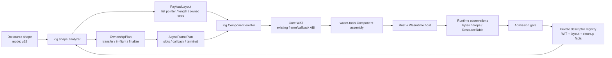
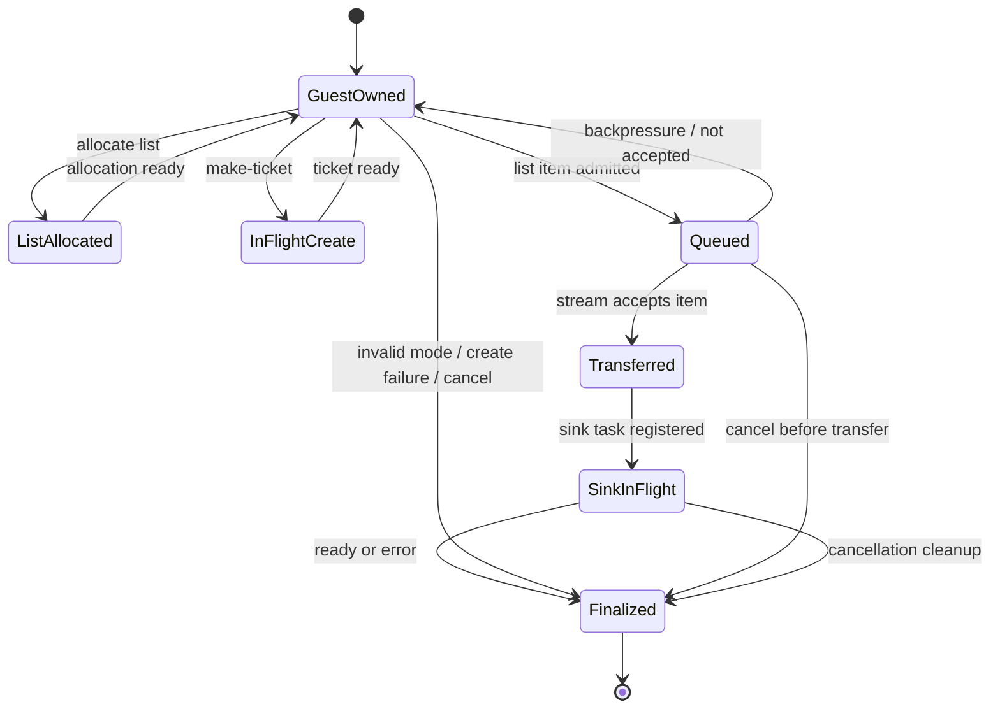

# G6.2 C-min List/Resource Producer Design

**Status:** Gates 1-4 complete for the private bounded C-min slice; generic producer/list lowering remains pending

**Date:** 2026-08-07

**Decision:** Keep `own<T>`, `borrow<T>`, `ref<T>`, pointer, reference, and
explicit lifetime syntax out of the Do language. Add one descriptor-bounded
producer slice that carries a fixed `list<resource-entry>` stream item. The
outer producer lease reuses the existing frame/callback ABI; list payload
ownership is added through a measured internal layout and cleanup plan.

All four gates are now complete for the one registered private descriptor. The
compiler promotion is deliberately exact-shape and consumes the measured
internal plans; it does not add public ownership syntax or generic list/producer
lowering.

## Goal

Prove one end-to-end producer shape with all of the following properties:

- a guest-owned `StreamWriter` lease;
- one stream item whose payload is a list of resource-bearing records;
- explicit transfer of `own<ticket>` handles from the guest payload to the
  Component stream;
- bounded list cardinalities `0`, `1`, and `3` in the probe/runtime matrix;
- exactly-once cleanup for list allocation, resource handles, stream endpoints,
  completion future, waitable membership, and the parent frame;
- pending, ready, sink error, cancellation, early-drop, and invalid-input
  behavior that is observable in Rust/Wasmtime.

The Do surface remains value-oriented. `Ticket` and `ResourceEntry` are named
resource/record types; WIT `own<ticket>` is an internal ABI fact, not a Do
source type.

## Evidence and Rationale

The repository already has a private consumer-side probe for
`stream<list<resource-entry>>`. It measured the following `cm32` facts:

- list pointer at frame `+64`;
- list length at frame `+68`;
- resource-entry stride `4` bytes;
- the owned ticket word at element offset `+0`;
- `cabi_realloc` allocation sizes for `0`, `1`, and `3` entries;
- raw-slot clearing before release;
- exactly-once ticket, stream, and future cleanup.

That evidence is consumer-side only. It does not prove a producer-side
`stream<list<resource-entry>>` input, queue ownership under backpressure, or
guest-side list construction. C-min therefore starts with a new producer
canonical probe instead of inferring an input ABI from the existing read
probe.

The pinned toolchain accepts owned resource fields in the relevant private
shapes. It still rejects nested borrowed stream/future shapes, so C-min uses no
borrowed payload.

## Canonical Shape

The probe uses a private WIT package with one resource-bearing list item:

```wit
package do:g6-2-c-min-producer@0.1.0;

interface types {
  enum error-code {
    io,
    pipe,
    invalid-mode,
  }

  resource ticket {}

  record resource-entry {
    ticket: own<ticket>,
  }
}

interface source {
  use types.{error-code, ticket};
  make-ticket: func(seed: u32) -> own<ticket>;
}

interface sink {
  use types.{error-code, resource-entry};
  consume-via-stream: async func(
    data: stream<list<resource-entry>>
  ) -> result<_, error-code>;
}

world c-min-producer {
  import source;
  import sink;
  export produce: async func(mode: u32) -> result<_, error-code>;
}
```

The exact WIT package name and member names are private implementation
identifiers. The registry must record the pinned package hash, world, operation
signatures, stream element layout, and all resource/drop operations before the
compiler can admit the shape.

`mode` is deliberately closed to three values:

| `mode` | list item | ticket seeds |
| ---: | --- | --- |
| `0` | empty list | none |
| `1` | one entry | `1` |
| `3` | three entries | `1`, `2`, `3` |

Other mode values return the private `invalid-mode` error before a ticket is
created. The implementation must not interpret `mode` as an arbitrary list
length. The compiler admission shape is one registered descriptor, one stream
item, one capacity-one writer, and one sink terminal.

## Architecture



The architecture has four compiler-side boundaries:

1. **Descriptor validation.** The registry is the only source of WIT names,
   canonical operations, list layout, resource paths, and drop operations.
2. **OwnershipPlan.** A pure plan records resource identities, transfer events,
   in-flight ownership, terminal actions, and path joins. It is not public
   syntax and does not expose raw handles to Do.
3. **PayloadLayout.** A pure layout records pointer/length words, element
   stride/alignment, owned slots, allocation/release operations, and invalid
   layout guards.
4. **AsyncFramePlan.** A pure frame plan records writer/readable endpoints,
   list storage, sink future, waitable membership, callback states, and the
   child-before-parent cleanup order. The existing outer frame/callback ABI is
   reused; C-min adds only the list payload slots and actions.

The implementation must not add a descriptor-specific ownership state machine
inside the WAT template. Descriptor-specific facts belong in the registry and
the validated plans.

## Producer Data Flow

The admitted sequence is fixed:

1. Validate `mode` against `0`, `1`, or `3`. Invalid mode returns before any
   resource allocation.
2. Allocate the list storage using the measured `cabi_realloc` shape. The
   empty list uses the canonical zero representation.
3. Create the required tickets through the registered `make-ticket` operation.
   A failure releases already-created tickets and list storage before the
   terminal error.
4. Write the owned ticket handles into the list slots. Each slot receives one
   semantic ownership identity; it is not a copyable scalar.
5. Start the registered sink operation and enqueue the one list item. If the
   writer is backpressured, the guest remains the list owner and must not
   allocate or enqueue a second item.
6. When the Component stream accepts the item, ownership of the list payload
   and its `own<ticket>` fields transfers to the stream/host side. The guest
   clears its ownership slots before releasing local storage.
7. Await the sink completion. The sink result is returned through the existing
   result/terminal path.
8. On normal completion, error, cancellation, or early drop, run the same
   child-before-parent cleanup plan exactly once.

## Ownership State Machine



The following invariants are mandatory:

- a ticket is dropped exactly once;
- a list allocation is released exactly once;
- a transferred ticket is never dropped again by the guest;
- a queued-but-not-transferred list remains guest-owned until cleanup;
- the sink child is dropped before its waitable membership and parent frame;
- a valid handle value of `0` is not treated as absence; presence is tracked
  explicitly where the ABI requires it;
- no owner, future, stream, or frame is silently dropped on an error path.

## Error and Cancellation Semantics

### Compile-time rejection

The compiler must reject before WAT emission:

- an unregistered locator or operation;
- a second stream item or second sink transfer;
- arbitrary list length expressions;
- nested lists, variant elements, borrowed fields, or unknown resource paths;
- a writer use after transfer/finalization;
- a branch/loop join that produces `maybe` ownership;
- a producer shape that falls through to synchronous code generation.

The primary unsupported-shape diagnostic remains stable and must not be
replaced by a generic parser error.

### Runtime terminal rules

- `invalid-mode` occurs before ticket creation and leaves no resource entry;
- a source/host error releases all guest-owned tickets before returning;
- a sink error after transfer is the host's ownership responsibility; the guest
  must not release transferred tickets;
- cancellation stops new writes, cancels live child operations, releases any
  not-yet-transferred list/tickets, then drops stream/future/waitable/frame in
  child-before-parent order;
- cancellation does not roll back external host effects already submitted to
  the sink.

## Language and Tool Responsibilities

| Layer | Implementation | Responsibility |
| --- | --- | --- |
| WIT | pinned WIT source | private type and operation contract |
| canonical ABI | hand-authored Core WAT | measure input stream/list layout and cleanup |
| compiler | Zig | sema admission, registry validation, plan construction, WAT emission |
| host runtime | Rust/Wasmtime | sink behavior, resource table, pending/ready/cancel observations |
| regression | Do + shell | positive/negative fixtures and full-suite integration |

Hand-authored WAT remains authoritative for the first ABI measurement. Zig may
generate the eventual compiler WAT, but generated output cannot be used as the
only evidence for its own layout assumptions. Rust remains the runtime gate
because the existing Wasmtime host runner already observes `ResourceTable` and
exactly-once drops.

## Implementation Gates

The work is split into independently stoppable gates.

### Gate 1: Producer canonical probe

Add a private WIT/WAT probe and Rust runner that covers:

- `0/1/3` list lengths;
- pending and immediate sink completion;
- sink `Err(pipe)`;
- invalid mode before allocation;
- cancellation before and after stream transfer;
- malformed pointer/length and duplicate-release Core-only mutations;
- exactly-once ticket/list/stream/future cleanup and empty `ResourceTable`.

No compiler registry entry is enabled until this gate passes with the pinned
`wasm-tools` and Wasmtime versions.

**Observed Gate 1 evidence (2026-08-07):**

- `wasm-tools component wit examples/p3-runtime/wit/g6-2-c-min-list-resource-producer.wit` passed with `wasm-tools 1.255.0 (76e20611d 2026-07-30)`.
- The WIT source hash is `8decd27aeca4a1f1863544860caec230a1fc50259336a893de79413c6f9ec3f7`.
- `bash examples/p3-runtime/test_g6_2_c_min_list_resource_producer_abi.sh` passed component parse/embed/new/validate and the complete ready/pending/error/early-drop/invalid-mode/cancel matrix.
- The measured producer facts are list pointer `64`, length `68`, element stride `4`, ticket offset `0`, and stream capacity `1`; malformed length and duplicate release variants trap as expected, and all admitted terminals end with an empty `ResourceTable`.
- Cancellation is intentionally split at the ownership boundary: guest-side subtask cancel covers pre-transfer cleanup, while host child-drop covers post-transfer cleanup. Dropping Wasmtime's root `call_concurrent` future is not treated as guest-task hard cancellation.

The probe closes only independent producer ABI evidence. Generic list/producer
lowering, borrowed payloads, public ownership syntax, and root hard-cancel remain
outside this design gate.

The Gate 2 layout and ownership slices are green: `ListLayoutMeasurement`/
`ListLayoutPlan` in `src/build/wit_abi_layout.zig` validates the measured
pointer/length words, fixed four-byte owned-resource records, capacity `3`, and
the admitted length set `0/1/3`; its owned-slot iterator yields offsets `0/4/8`.
`ListProducerOwnershipPlan` in `src/build/wit_abi_ownership.zig` validates
allocate/create/enqueue/transfer/clear/release/cancel/finalize transitions,
pre-/post-transfer cleanup, and `maybe` joins. Focused layout and ownership
tests each pass `6/6`; the complete layout/ownership suites pass `19/19` and
`17/17`, and the ABI type suite passes `5/5`. The registry/sema and emitter
promotion gates consume these plans without changing the public Do surface.

The bounded `ListProducerFramePlan` in `src/build/wit_abi_async.zig` is also
green. It models one writer/readable endpoint, one list slot, one sink future,
one queue slot, waitable membership, callback states, and terminal cleanup;
focused frame tests pass `4/4`, the full async suite passes `13/13`, and the
existing component async plan suite passes `156/156`. Queue overflow, await
before transfer, duplicate terminal paths, cancellation before/after transfer,
and early drop remain guarded without changing the public Do surface.

### Observed Gates 3-4 (2026-08-08)

- `zig test build/p3_async_manifest.zig` and `zig test build/sema_imports.zig` pass `79/79` and `122/122`; only the registered source/sink descriptor is admitted.
- `zig test build/codegen_component_list_resource_producer.zig` passes `139/139`; `zig test build/codegen_component_async.zig` passes `438/438` and routes the producer target through the unified dispatcher.
- `bash examples/p3-runtime/test_do_g6_2_c_min_list_resource_producer.sh` passes Do WAT/WIT generation and Component parsing.
- `bash examples/p3-runtime/test_rust_g6_2_c_min_list_resource_producer.sh` passes compiler-generated ready `0/1/3`, pending, sink error, early drop, invalid mode, and transfer-boundary cancellation with `table-empty=true`.
- `./src/build/test/run_tests.sh` reports `pass=1120 fail=0 skip=3`; `zig build -Doptimize=ReleaseSmall` and `git diff --check` pass. The existing repository-wide `cargo fmt --check` still reports unrelated pre-existing Rust formatting drift; the new C-min runner is individually rustfmt-clean.

### Gate 2: Internal plan unit tests

Add pure tests for:

- list layout and owned-slot enumeration;
- mode-to-cardinality mapping;
- guest-owned, queued, transferred, and finalized transitions;
- backpressure and cancellation joins;
- child-before-parent cleanup ordering;
- invalid mode and invalid layout guards.

This gate must not change existing compiler output.

### Gate 3: Compiler promotion

Add the private descriptor to the registry and admit only the exact C-min
source shape. The Zig emitter must consume `OwnershipPlan`, `PayloadLayout`, and
`AsyncFramePlan`; it must not add a second ad hoc list producer template.

The Do gate must verify WAT markers for list pointer/length, element stride,
owned ticket slots, queue state, callback states, and cleanup order. All
unregistered or broader forms remain rejected.

### Gate 4: Full regression and status

Run the focused Zig tests, the C-min Do gate, the Rust/Wasmtime matrix, default
regression, WASM regression, ReleaseSmall smoke, and `git diff --check`. Update
the current status docs only after fresh evidence; do not mark generic list,
generic producer, or public ownership syntax complete.

## Non-goals

C-min does not:

- add public `own<T>`, `borrow<T>`, `ref<T>`, pointers, references, or lifetime
  syntax;
- provide generic `list<T>` producer lowering;
- allow arbitrary list lengths, nested lists, variant elements, or borrowed
  elements;
- implement general async-call lowering or a scheduler;
- increase forwarding-hop or nested-resource limits;
- change cancellation into rollback or compensation;
- replace the Zig compiler or the Rust/Wasmtime runtime gate;
- claim complete WASI or WIT bindgen lowering.

## Deferred Alternatives

The alternatives remain valid but are not admitted by this spec:

- **A: one owned resource record.** Lower implementation risk, but it does not
  exercise list allocation, pointer/length ownership, or batch cleanup. It can
  be added later as another independently registered shape.
- **B: variant event with an owned ticket.** It adds tag/payload branch states
  and branch-specific cleanup on top of producer ownership. Existing variant
  evidence is private and consumer-oriented; it should not be combined with
  the first producer list gate.

Neither A nor B is rejected by the language design. They are deferred to keep
the first new producer shape focused and independently diagnosable.

## Completion Criteria

C-min is complete only when all four gates pass and the following are true:

1. the producer input ABI is measured independently from the consumer probe;
2. the registry contains only the measured private descriptor;
3. Do source admission is exact and fail-closed;
4. all normal/error/cancel/early-drop paths show exactly-once cleanup;
5. existing bounded producer, consumer, owned-future, and async-call gates have
   no behavioral drift;
6. documentation states that C-min is a private bounded slice, not generic
   ownership or list support.
