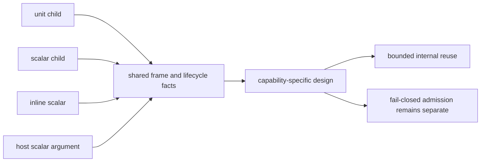

# M2 Bounded Async-Call Internal Consolidation Assessment

Date: 2026-08-09
Status: M2 Step 1 complete; no compiler changes in this assessment

## Scope

This report measures duplication across the four bounded async-call families
that are already admitted and green:

1. unit child call;
2. scalar helper child call;
3. inline helper followed by a child call, including the inline scalar form;
4. asynchronous host call with one scalar argument.

The report is an entry gate for M2 only. It does not authorize generic
`Future<T>` lowering, public `own<T>`/`borrow<T>`/`ref<T>` syntax, default
dispatch changes, or changes to `@async`, `@await`, or `@cancel`.

## Evidence Sources

| Family | Implementation | Measured source span | Distinguishing contract |
| --- | --- | ---: | --- |
| unit/scalar child | `src/build/codegen_component_async_call.zig:108-279` | 172 lines | one root-owned helper continuation; optional `u32` argument substitution |
| inline unit/scalar | `src/build/codegen_component_async_call.zig:280-583` | 304 lines | sequential inline and child phases; explicit root resume/cancel |
| host scalar argument | `src/build/async_host_scalar_argument_component_template.wat:1-253` | 253 lines | fixed `u32` argument at frame `+12`; host-specific cleanup and task return |
| host scalar emitter | `src/build/codegen_component_async_host_arg.zig:6-23` | 18 lines | template substitution only; admission is in the separate host plan |

The unit/scalar child emitter has one template with conditional substitutions;
the inline family has a second template. The host scalar template is a third
independent WAT artifact, rather than a variant of either Zig template.

## Measurements

The raw template spans measure `172/304/253` lines for unit/scalar child,
inline, and host respectively. The following signals were computed after
extracting the WAT text, normalizing placeholder names and local identifiers,
collapsing whitespace, and comparing sorted unique lines. This is a similarity
signal only; sorting removes control-flow order and cannot prove semantic
equivalence.

| Comparison | Normalized shared unique lines | Shared lifecycle markers |
| --- | ---: | ---: |
| unit vs inline | 63 | 6 |
| unit vs host | 59 | 4 |
| inline vs host | 56 | 4 |

The marker sets contain 6, 10, and 10 unique markers respectively. All three
families retain the terminal/cancellation boundary markers `[task-return]` and
`[task-cancel]`; the common guest lifecycle markers are fewer because each
family names its continuation and cleanup path differently.

The two source analyzers are also independently implemented:

- `codegen_component_async_call_plan.zig` is 358 lines;
- `codegen_component_async_host_arg_plan.zig` is 444 lines;
- they share 10 helper names: `analyze`, `count_token_pair`,
  `count_top_level_functions`, `find_function`, `find_host_binding`,
  `helper_body_is_exact`, `ident_eq`, `parse_u32_literal`,
  `root_body_is_exact`, and `signature_is_unit`.

The shared names do not imply drop-in equivalence. For example, the host plan
validates a pinned registry descriptor, a named `u32` helper parameter, and a
literal root value, while the async-call plan validates a zero-parameter host
descriptor and has separate inline-shape token lengths. The helper signatures
also differ at `helper_body_is_exact` and `root_body_is_exact`:
`codegen_component_async_call_plan.zig:283-318` versus
`codegen_component_async_host_arg_plan.zig:299-329`.

## Shared Structure

The measurements and source review confirm real duplication in these facts:

- root frame allocation/free and the `+0/+4/+8` lifecycle slots;
- waitable-set creation/drop and context get/set boundaries;
- encoded subtask drop and terminal task-return handling;
- callback dispatch into a root-owned continuation;
- token-level function lookup, unit-signature checks, literal parsing, and
  exact-body rejection helpers.

These are suitable candidates for a private structural description or pure
utility layer, provided the caller supplies all capability-specific facts.

## Non-Shared Semantics

The following differences must remain explicit and must not be hidden behind a
generic async lowering path:

1. The child template supports a single helper continuation and optional
   scalar substitution; its base path has no inline phase machine.
2. The inline template has sequential phase transitions, a root resume path,
   and an explicit root cancellation cleanup path.
3. The host template has a distinct asynchronous import signature, a fixed
   20-byte frame with argument slot `+12`, explicit argument store/load markers,
   and host-specific cleanup ordering.
4. Host admission is registry/hash/effect driven in
   `codegen_component_async_host_arg_plan.zig:138-223`; async-call admission is
   a separate topology/descriptor contract in
   `codegen_component_async_call_plan.zig:64-177`.
5. The generated WAT and WIT identity are promotion evidence. A refactor must
   not silently change marker order, import names, frame offsets, or pinned
   WIT hashes.

## Decision

**GO-limited for a design-only M2 Step 2.** The duplication is large enough to
justify investigating a private structural reuse layer, but the overlap is
not large enough to justify a generic `Future<T>` emitter. The next design
should consider only:

- immutable frame/lifecycle facts supplied by each admitted capability;
- pure token helpers whose contracts are proven identical;
- explicit mode-specific fragments for child, inline, and host cancellation;
- byte-for-byte or marker-order differential checks for every existing positive
  fixture.

The design must be allowed to conclude NO-GO if the required mode branches make
the shared layer less clear than the existing templates. A NO-GO is a valid M2
outcome and should hand off directly to M3 without changing behavior.

## M2 Step 2 Entry Contract

Before implementation, the follow-up design must specify:

1. the exact shared data structure and which fields are capability-owned;
2. the frame slot and alignment contract for each existing family;
3. normal completion and cancellation cleanup order for each family;
4. the admission boundary that remains outside the shared layer;
5. old/new WAT marker and WIT/hash differential tests;
6. the rollback path: keep the current templates if any focused or full gate
   changes output or rejection behavior.

Required verification remains the existing focused Zig tests, Component/WIT
validation, Rust/Wasmtime ready/pending/cancel gates, and the full regression
matrix. No new public syntax or default target is part of M2.
