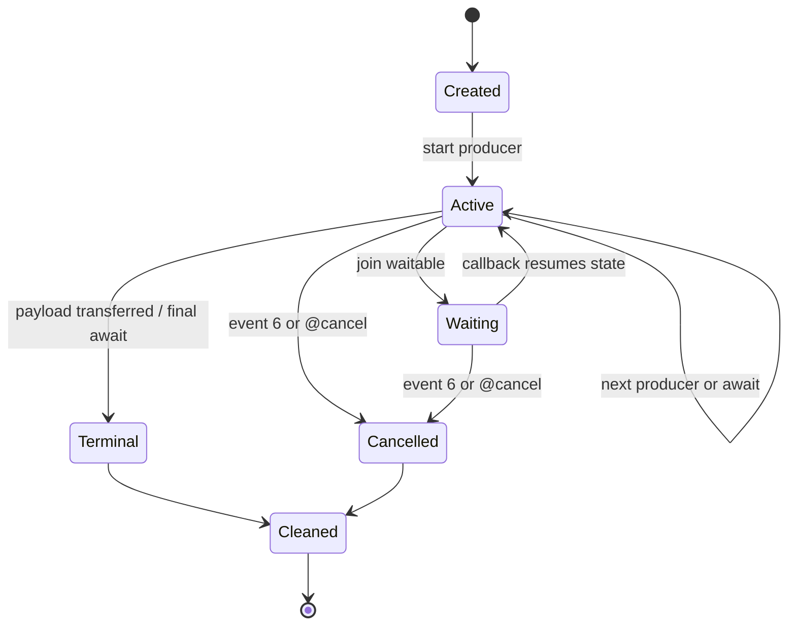

# General Async-Call Promotion Contract

Date: 2026-08-09  
Status: design-only; no compiler widening in this phase

## Decision

The bounded root-owned local-frame implementation is the evidence boundary for
future general async-call lowering. It proves a continuation owned by one
exported root task; it does not prove that arbitrary user calls, payloads, or
host signatures can be lowered automatically. Promotion is therefore
descriptor- and probe-driven. A shape is admitted only after its complete
Component ABI, frame layout, ownership matrix, and ready/pending/error/cancel
runtime gate are checked in.

The existing `@async(call)`, `@await(future)`, and `@cancel(future)` spelling
remains unchanged. Ordinary functions remain colorless: a normal call runs
inline, and only an explicit `@async(call)` creates a user-function future.
There is no `async` declaration modifier, async contagion, or public task
handle in this contract.

## Verified Bounded Facts

The facts below are measured facts of the current inline scalar probe, not a
layout formula for future shapes.

| Fact | Verified value | Evidence |
| --- | --- | --- |
| inline scalar frame size | 20 bytes | `src/build/codegen_component_async_call.zig` emitter template and inline scalar emitter test |
| waitable-set slot | frame `+0` | emitter frame comment and generated WAT |
| active host future/subtask slot | frame `+4` | emitter frame comment and cancellation path |
| phase slot | frame `+8` | inline/child transition stores phase `1`, `2`, `3` |
| `u32` argument slot | frame `+12` | `[guest-inline-arg-*]` and `[guest-async-arg-*]` markers |
| root cancellation event | callback event `6` | `[callback][async-lift]__ROOT__` dispatch |
| cancellation cleanup | active subtask, waitable set, context, and frame are released once | emitter test plus Rust/Wasmtime `cancel-inline` and `cancel-child` rows |

The private owned-future probe has a separate measured payload layout. Its
32-byte frame stores the canonical future payload at `+12`, the owned resource
representation at `+16`, and an independent presence bit at `+20`. The
presence bit is required because resource representation `0` is valid. These
offsets must not be reused as a generic payload convention; every promoted
payload shape gets its own canonical measurement.

The pinned evidence toolchain for the current bounded async-call slice is:

```text
Zig 0.16.0
wasm-tools 1.254.0 (bb58fdf91 2026-07-20)
Rust 1.97.1
Wasmtime 47.0.2
```

The current gates are:

```text
WASM_TOOLS=/home/_/.local/share/Trash/files/wasm-tools-1.254.0-x86_64-linux/wasm-tools \
  bash examples/p3-runtime/test_async_call_component_probe.sh
WASM_TOOLS=/home/_/.local/share/Trash/files/wasm-tools-1.254.0-x86_64-linux/wasm-tools \
  bash examples/p3-runtime/test_do_async_call_component.sh
WASM_TOOLS=/home/_/.local/share/Trash/files/wasm-tools-1.254.0-x86_64-linux/wasm-tools \
  bash examples/p3-runtime/test_do_async_call_inline_scalar_argument.sh \
  /tmp/async-call-inline-scalar-argument.component.wasm
bash examples/p3-runtime/test_rust_async_call_component.sh \
  /tmp/async-call-inline-scalar-argument.component.wasm
bash examples/p3-runtime/test_rust_async_call_scalar_argument.sh \
  /tmp/async-call-scalar-argument.component.wasm
```

The independent-child probe is intentionally rejected because the Component
ABI has no `[task-return]helper` endpoint for an ordinary internal helper. The
accepted probe keeps helper state in the root frame and resumes through the
root `[task-return]run` path. This remains the selected architecture.

## Promotion Inputs

A future promotion request describes all of the following explicitly:

1. An arbitrary producer expression that yields one declared `Future<T>`
   value. The expression may be a registered async host call, an explicit
   `@async(user_call)`, or a later admitted producer node; it is not recognized
   by token count or by copying one private descriptor.
2. Zero or more host arguments. Each argument has a source type, a canonical
   flat/core representation, a frame or temporary ownership rule, and a
   transfer point. Borrowed or resource arguments require their own pinned
   capability; they are not inferred from an ordinary value argument.
3. Zero or more `@await` and `@cancel` sites, with a statically known
   continuation state after each site. Multiple operations may exist over the
   lifetime of one root task, but the admitted overlap and waitable-set
   capacity must be measured by the shape's probe.
4. A declared payload shape `T`, including its result/error variants and any
   nested list, stream, or resource ownership. The payload is never treated as
   an untyped word; its canonical lowering and cleanup operations are part of
   the descriptor.

## State And Frame Contract

Each admitted shape has one root continuation and an explicit state record:



The frame must contain, at minimum, a root continuation state, an explicit
waitable set, the currently active operation, payload ownership state, and a
terminal flag. A descriptor may add slots, but it must record size, alignment,
offsets, and valid/present states in its canonical WAT and manifest. A frame
slot is not a Do pointer, reference, or exposed handle.

The ownership transition is ordered and idempotent:

| Order | State | Required action |
| ---: | --- | --- |
| 1 | active operation | finish or cancel the Component subtask; drop the subtask when the ABI reports it is still owned |
| 2 | payload | move a ready payload into its declared destination, or release an untransferred payload on cancellation/error |
| 3 | waitable set | drop it exactly once after no callback can use it |
| 4 | context | clear the root context slot |
| 5 | frame | release the root frame exactly once |
| 6 | terminal | call root `task.return` for success or root `task.cancel` for cancellation |

An already-issued host effect is never rolled back. Cancellation only
terminates live Component/guest state and releases values that remain owned by
the guest.

## Admission Contract

No generic lowering is admitted from a source signature alone. Before a shape
is promoted, the repository must contain:

- a pinned WIT package/world/member identity and hash;
- a hand-authored canonical Core WAT that records all frame offsets,
  continuation states, flat parameter/result words, and drop imports;
- a descriptor/manifest record that validates the exact signature, effect,
  import names, payload layout, and capacity limits;
- positive and negative Do fixtures, including drifted signature/layout,
  unsupported producer, overlap, and ownership cases;
- Component assembly and validation with the pinned `wasm-tools` route;
- Rust/Wasmtime ready, pending, error, terminal-cancel, early-cancel, and
  repeated-cleanup observations, including `ResourceTable` state;
- a full regression run with no new default-target acceptance.

The compiler target remains opt-in (`--p3-async-call-component`) and must fail
before WAT emission when any contract predicate is absent. The existing v1 and
Generic ABI v2 routes are not widened by this design.

## Shape-Specific Requirements

### Arbitrary producers

The planner must build an explicit producer graph. Every producer node declares
its result type, async import or local continuation, state transition, and
cleanup owner. A producer that is not registered or probed is rejected with a
stable target diagnostic. A generic `Future<T>` implementation cannot be
inferred from one `Future<nil>`, scalar, or private resource descriptor.

### Multiple awaits and overlap

Each await site receives a distinct continuation state. If operations overlap,
the descriptor records the maximum number of live operations and the waitable
set capacity; callbacks must identify the matching operation before resuming.
Sequential reuse of a slot is allowed only when the prior operation has
reached a terminal cleanup state. Dynamic fan-out, unbounded loops, and
unmeasured concurrency remain rejected.

### Payloads, resources, lists, and streams

Payload lowering is a separate capability class. Scalar, `Result`, owned
resource, list, and stream payloads each require a canonical ABI and an
ownership matrix. A nested `borrow<T>`, resource-bearing list/stream, or
future/stream payload cannot be accepted because another descriptor happens to
use the same core word. Presence bits are mandatory whenever zero is a valid
resource representation. List and stream buffers are released exactly once on
all terminal paths, and a transfer to the host records the transfer point.

### Host arguments

Arguments are copied, borrowed, or moved only according to the descriptor's
explicit ABI. The current `u32` slot at frame `+12` is a phase-local scalar
example, not a general argument area. A future multi-argument shape must
measure alignment, padding, ownership, and cancellation before admission.

## Explicit No-Go Decisions

This contract continues to reject:

- public `own<T>`, `borrow<T>`, `ref<T>`, pointer, reference, or lifetime
  syntax;
- implicit async contagion or an `async` function declaration modifier;
- an independent guest child task or synthetic `[task-return]helper` endpoint
  without a newly pinned Component ABI that defines its creation,
  continuation, cancellation, and cleanup semantics;
- generic lowering inferred from descriptor names, token shapes, or one
  private WIT/Component probe;
- unregistered filesystem methods, general HTTP, or arbitrary host I/O;
- `future<borrow<T>>` and borrowed stream records while the pinned toolchain
  rejects those rows during `component embed`.

These are deferred capabilities, not silent fallbacks. Each requires a new
design, canonical probe, and promotion gate before compiler implementation.

## Follow-Up Plan

The next implementation plan may promote one additional bounded shape at a
time. It must leave the current descriptors and probes unchanged, add the
shape-specific artifacts listed above, and update status documents only after
fresh verification. General filesystem async (D2), external HTTP, arbitrary
producer expressions, and public ownership syntax remain separate work items.
