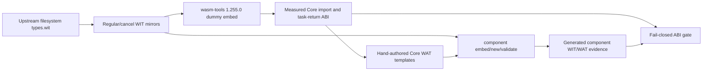

# D2 `descriptor.metadata-hash-at` Async Filesystem ABI Probe Design

Date: 2026-08-10
Status: ABI probe verified; compiler admission and runtime promotion remain blocked

## Goal

Measure the pinned WASI 0.3 filesystem method below as an independent,
method-specific capability:

```wit
descriptor.metadata-hash-at: async func(
    path-flags: path-flags,
    path: string,
) -> result<metadata-hash-value, error-code>
```

This slice records the current Component async/Core ABI and cleanup boundary.
It does not change Do syntax, semantic admission, code generation dispatch, or
the generic filesystem async decision.

## Scope and Non-Goals

In scope:

- an exact mirror of the pinned upstream `types.wit` subset;
- regular and test-only cancellation WIT worlds;
- hand-authored Core WAT templates that expose the measured import and task
  return contract;
- a fail-closed Bash probe pinned to the current `wasm-tools` binary and the
  upstream WIT hash;
- documentation of measured argument order, string lowering, result layout,
  resource drop, and cancellation markers.

Out of scope:

- compiler registry, sema, planner, or codegen admission;
- public Do `Result<T,E>`, `own<T>`, `borrow<T>`, `ref<T>`, pointer,
  reference, or lifetime syntax;
- a Rust/Wasmtime business-I/O runner;
- generic filesystem async lowering or inference from another method;
- host rollback on cancellation.

## Pinned Evidence

- Upstream source:
  `src/build/p3_wit/wasi-http-0.3.0-rc-2025-09-16/deps/filesystem/types.wit`
- Upstream source SHA-256:
  `8421d2ac1b15d121ccce9e3596ee342a641043a8b4558f7a4f2893a3eee6359f`
- WASI package/version: `wasi:filesystem@0.3.0-rc-2025-09-16`
- Method interface: `wasi:filesystem/types@0.3.0-rc-2025-09-16`
- Tool: `wasm-tools 1.255.0 (76e20611d 2026-07-30)`
- Tool SHA-256:
  `6e431ad26863c697cc30733aae69cbd9248f83811d9e63e4eb01061fc2ece013`
- Regular mirror SHA-256:
  `95e24b70eeed89407706c18a6e4cd13a8bc4dce72d1e56638436b03287d23412`
- Cancel mirror SHA-256:
  `aca9c5933786a00a2dd20b1ad1ddbb6d0a79ab5b3bdbd5bd61e14b100a3b6e0a`
- Component features: `cm-async,cm-more-async-builtins`

The mirror keeps the upstream `path-flags` flag order (`symlink-follow`), the
`metadata-hash-value` field order (`lower`, then `upper`), and the complete
`error-code` order. The probe parameter is named `path-flags`; `flags` is a WIT
reserved keyword and is intentionally not used.

## Architecture

The probe has four isolated artifacts. The WIT mirrors establish the source
shape, the dummy embed observes tool-produced Core types, the hand-authored
Core modules make the frame/cleanup assumptions explicit, and the Bash gate
repeats all checks against the pinned inputs.



The method import is measured as:

```text
[async-lower][method]descriptor.metadata-hash-at:
  (i32, i32, i32, i32, i32) -> i32
```

The arguments are, in order, `descriptor` handle, `path-flags` bits,
UTF-8 path pointer, UTF-8 path length, and the result-area pointer. The
`path-flags` WIT value is one `i32` bitset for this version. The generated
component lowering explicitly contains `string-encoding=utf8 async`.

The exported root task return remains:

```text
[task-return]run: (i32, i64, i64)
```

The first word is the result variant tag. For `Ok(metadata-hash-value)`, the
next two words are `lower:u64` and `upper:u64`; for `Err(error-code)`, the
error code occupies the first payload word and the second payload word is
cleared. The hand-authored frame keeps the result area aligned:

```text
frame+0   waitable:i32
frame+4   descriptor:i32
frame+8   path-flags:i32
frame+12  path-ptr:i32
frame+16  path-len:i32
frame+20  status:i32
frame+24  result-tag:u8
frame+32  lower:u64
frame+40  upper:u64
frame+48  callback-subtask:i32
```

The path pointer and length are retained in the frame until completion. This
is an ABI lifetime observation only; the probe does not claim that the current
Do runtime owns or copies arbitrary strings across an async boundary.

## Cancellation and Ownership

The cancel world adds only `cancel: async func()` and the corresponding
`[async-lower][subtask-cancel]` and `[task-return]cancel` markers. Completion
cleanup is ordered as:

1. drop the completed subtask when present;
2. drop the owned `descriptor` exactly once;
3. drop the frame waitable;
4. clear context and call `[task-return]run`.

The cancellation template calls the canonical subtask cancel operation and
drops the subtask when the returned status says it is terminal. This is
cleanup-only semantics. No host filesystem action is undone, and no rollback
is inferred from a cancellation marker.

## Alternatives and Decision

1. **Recommended: independent current-tool ABI probe.** Keep this method
   separate from `metadata-hash` because the mixed enum/string input changes
   the Core signature and introduces an input-lifetime question. It produces
   reproducible evidence with a small, reversible change set.
2. **Not recommended: infer the shape from `metadata-hash` or `stat-at`.**
   Both neighboring methods differ in argument/result layout. Inference could
   silently lose string pointer/length ordering or result-area alignment.
3. **Not recommended: admit the method in the compiler immediately.** The
   probe proves toolchain capability, not Do source ownership, path lifetime,
   error propagation, or runtime cleanup. Admission without those gates would
   widen the compiler based on an unverified contract.

## Acceptance and Failure Boundary

`bash examples/p3-runtime/test_d2_wasi_filesystem_metadata_hash_at_abi.sh`
must pass with the pinned tool and hashes. It must fail closed if any of these
change: WIT identity/order, method count, five-`i32` method type, task-return
shape, UTF-8 string lowering marker, result-area markers, descriptor-drop
import, cancellation markers, Core validation, or generated Component WIT.

If the pinned tool rejects the WIT shape, changes any measured order/width, or
cannot assemble either Core template, retain the exact failure as a blocker
and do not add compiler code. A later promotion task must separately provide
positive/negative compiler fixtures and a Rust/Wasmtime cleanup matrix.

## Verification Record

The current probe passes:

```text
bash examples/p3-runtime/test_d2_wasi_filesystem_metadata_hash_at_abi.sh
wasm-tools 1.255.0 (76e20611d 2026-07-30)
[async-lower][method]descriptor.metadata-hash-at
  (i32,i32,i32,i32,i32) -> i32
[task-return]run (i32,i64,i64)
string-lowering=ptr,len utf8
```

This record is limited to ABI/component construction. It is not evidence of
Do compiler support or real host filesystem behavior.
