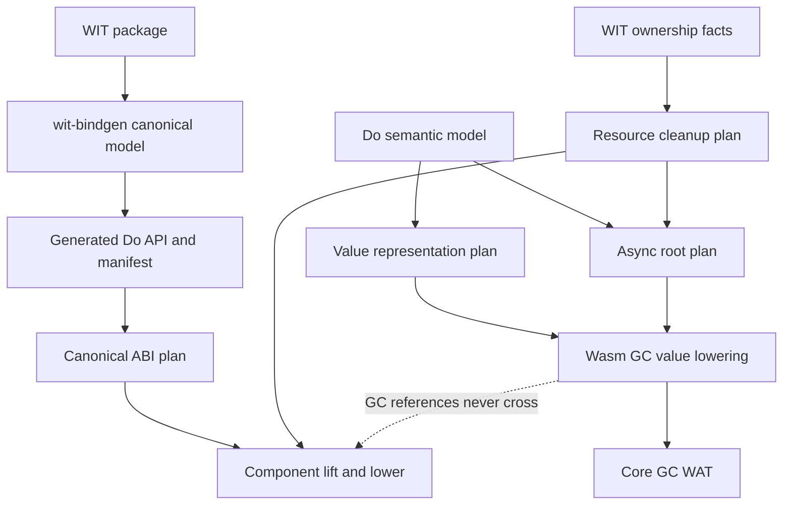

# GC Backend Architecture Design

**Status:** approved architecture baseline. This document authorizes planning
and does not itself change compiler behavior.

## Goal

Replace the current ARC transition implementation with one Wasm GC backend
while preserving Do source value semantics, colorless async, explicit
Component/WIT resource ownership, and the existing fail-closed capability
gates.

## Fixed Decisions

1. Wasm GC is the only managed-memory backend. The existing restricted
   `--gc-core` target is a temporary migration oracle, not a supported backend
   choice; G5 removes it when default output becomes GC. There is no long-lived
   ARC/GC compatibility mode.
2. Do source remains pointer-free and reference-free. `own<T>`, `borrow<T>`,
   `ref<T>`, `Result<T, E>`, and `Option<T>` do not become public general
   source types.
3. Read-only passing of managed values shares an internal reference. Updates
   preserve the old logical value through copy-on-write or rebuild.
4. GC traces Do allocations only. WIT resource ownership, borrow, drop, async
   terminal cleanup, and cancellation remain explicit ABI contracts.
5. WIT bindgen remains a separate boundary layer. It resolves WIT, generates
   ordinary Do declarations, and emits manifest facts; it does not choose GC
   layout, roots, scheduler behavior, or resource cleanup timing.
6. One emitted Core module uses exactly one managed-value representation. ARC
   handles and Wasm GC references must never appear in the same source-value
   path, local, aggregate, call, or return. Incremental migration therefore
   means complete-program capability slices verified beside the ARC oracle; it
   does not mean mixing the two representations in one program.

## Non-Goals

- No new public reference, ownership, lifetime, Result, or Option syntax.
- No general async, producer, filesystem, HTTP, or WIT shape admission during
  the backend migration.
- No claim that a Core GC probe proves Component ABI, async scheduler, or host
  resource behavior.
- No attempt to preserve ARC or `--gc-core` as a supported output backend after
  migration.

## Target Architecture



The arrows are one-way. WIT facts describe ABI boundaries; they never cause a
GC representation or a source-language type to be inferred. Resource cleanup
is not a GC finalizer operation.

Within a GC-capable module, a write may use `struct.set` or `array.set` only
for private storage whose old logical value cannot still be observed. If that
proof is unavailable, lowering first creates the minimum separated backing and
then updates it in place. This is a backend optimization: `@set` and `@put`
still return a new logical value, and a previous source value remains
unchanged.

## Compiler Boundaries

### 1. Value Representation Plan

Introduce an immutable compiler-owned representation classification:

```text
Inline
GcManaged
ResourceHandle
```

`Inline` covers scalar and eligible fixed aggregates. `GcManaged` covers text,
list, large struct, and struct with managed fields. `ResourceHandle` is an
opaque ABI value and is never a GC reference. The classification is a codegen
fact, not a source-visible type.

The replacement modules must be flat and pure where possible:

- `codegen_gc_representation.zig`: classification and representation
  invariants.
- `codegen_gc_layout.zig`: typed struct/array layout facts and field offsets.
- `codegen_gc_roots.zig`: immutable root/liveness plans for synchronous and
  suspendable paths.
- `codegen_gc_emit.zig`: small WAT fragments for allocation, field access,
  copy/rebuild, and nullability checks.

The existing restricted `codegen_gc_core.zig` supplies measured text/list/struct
fixtures and must be refactored into these plans and emit fragments. Its
profile-specific token matching and literal WAT templates do not survive the
target architecture. `runtime_arc_wat.zig`, `runtime_prelude_wat.zig`, and
`codegen_ownership.zig` remain migration evidence only. Their managed-value
retain/release responsibilities do not survive the target architecture.

### 2. Root Plan

Replace ARC scope-exit release plans with a root plan that identifies every
live `GcManaged` value at:

- local binding and overwrite;
- branch and loop joins;
- return and tail position;
- Future/Stream suspension, resume, cancellation, and terminal cleanup;
- Component call/result marshaling boundaries.

The compiler keeps references live by placing them in GC-traced locals, typed
objects, arrays, or frame fields. It does not emit source-value `inc`, `dec`,
or recursive release worklists. A root plan contains no WIT resource drop.

### 3. ABI and Resource Plans

`src/wit` remains responsible for an immutable canonical WIT model,
deterministic generated Do modules, `manifest.json`, and `wit.lock`.

The compiler converts a validated manifest entry into two separate plans:

- `AbiPlan`: canonical lift/lower, copied or marshaled values, result areas,
  and exact WIT identity.
- `ResourcePlan`: own/borrow transfer, drop authority, async liveness, and
  exactly-once terminal cleanup.

`option<T>` maps to `T | nil` and distinguishable `result<T, E>` maps to
`T | E` in generated public Do APIs. Nested option and same-arm Result remain
fail-closed until a dedicated generated nominal tagged-variant design exists.

### 4. Runtime Boundary

`runtime_gc_wat.zig` replaces ARC allocation and object metadata with typed
Wasm GC structs and arrays. `runtime_gc_prelude_wat.zig` emits the GC type and
runtime fragments required by the collected value representation plan.

Linear memory remains an implementation detail for canonical ABI buffers and
other byte-oriented host boundaries. It is not used as a public managed-value
heap or pointer surface.

## Migration Sequence

### Phase G0: Freeze And Baseline

Freeze public syntax and prohibit new ARC-specific lowering. Record the exact
default compiler regression, Core GC probes, Component validation, and existing
bounded async/WASI gates before changing output. Record every existing
`--gc-core` text/managed-struct/Tuple fixture as a migration oracle. The
fixed-index and parameterized `[u8] @set` fixtures use the separate non-CLI
parsed G5a test entry; do not admit another profile-specific GC shape.

### Phase G1: Pure Facts Before Emission

Add pure representation, layout, root, ABI, and resource plan tests without
changing default generated WAT. Refactor existing `codegen_gc_core.zig`
profile facts into the shared plans without admitting a new source shape. Every
plan rejects an impossible shape before output.

### Phase G2: GC Value Runtime

Implement typed GC storage and lower the smallest closed value set in order:

1. `text` read-only pass and identity;
2. `[u8]` read, set, and append with COW/rebuild behavior;
3. managed struct construction, field get/set, and nested managed fields;
4. Tuple storage with managed leaves.

Each slice proves old-value preservation, no payload copy on read-only pass,
and no ARC symbol in the new output.

### Phase G3: Synchronous Root Conversion

Convert local, overwrite, branch, loop, return, defer, and call boundaries to
the root plan. Delete ARC retain/release emission for every converted value
class only after the equivalent GC output and negative cases pass.

### Phase G4: Suspension And ABI Conversion

Convert Future/Stream frames and Component call paths to GC-traced frame
fields. Keep `AbiPlan` and `ResourcePlan` separate: values are marshaled at the
boundary; resource transfer and cancellation cleanup follow the pinned WIT
contract.

### Phase G5: Default Switch And ARC Removal

G5 is three dependent implementation stages. The current compiler still sends
ordinary builds through ARC, while the synchronous GC entry rejects imports,
async, generic functions, module graphs, resources, and many normal managed
value operations. It is therefore a P0 migration precondition failure to
switch the default backend or delete ARC now.

#### G5a: Complete-program GC lowering slices

Extend the shared GC representation, layout, root, and emitter modules through
closed whole-program synchronous slices. Each slice compiles the whole
admitted program with GC; it cannot delegate one managed value path to ARC.
The order is: scalar/text/list expressions and calls; managed structs and
nested managed fields; Tuple/storage and unions; generic calls and returns;
local overwrite, branch, loop, defer, and return roots; then import and
Component boundary marshalling. Profile-token matching in `codegen_gc_core.zig`
must be replaced by parsed declarations and codegen facts before a slice is
admitted.

The existing `--gc-core` selector and Core-GC scripts remain a migration oracle
during G5a. No new user-selectable backend or source syntax is introduced.

#### G5b: ARC/GC semantic equivalence gates

For every G5a-admitted complete-program slice, execute backend-neutral source
fixtures through the default ARC path and the GC test entry. Compare observable
Do behavior, including old-value preservation after `@set`/`@put`, local
overwrite, branch/loop/defer/return behavior, traps, host marshalling, and
resource terminal cleanup where the shape is already admitted. Validate the GC
WAT with the current `wasm-tools` and execute it with Wasmtime. ARC-only WAT
goldens remain migration evidence until their matching GC slice is proven.

#### G5c: One-backend cutover

Only after every ordinary default path is represented by a passing G5a slice
and has passed G5b can the compiler route default output to GC. In the same
cutover series, remove `--gc-core`, `codegen_gc_core.zig`, ARC runtime/prelude
exports, ARC ownership emission, and ARC-specific generated-WAT assertions.
Retain ARC only in dated historical evidence outside active compiler paths.

During G0-G4, ARC code and the existing restricted `--gc-core` target may exist
only as migration oracles inside the repository. Neither is a supported
user-selectable backend and no new feature may depend on either one.

## Required Gates

Every phase must pass its focused pure tests plus the previous phase's gates.
G5c additionally requires:

1. full compiler regression and release smoke;
2. Core GC compile-and-run probes;
3. Component assembly and canonical ABI validation on the current toolchain;
4. Rust/Wasmtime ready, pending, error, cancel, and early-drop evidence for
   each admitted async/resource shape;
5. a residual scan proving generated GC output contains no `__arc_` symbol;
6. a source scan proving no public ownership/reference/Result/Option syntax
   was added.

G5a and G5b failure is fail-closed for the affected slice only. It does not
authorize default GC routing, mixed ARC/GC lowering, broader WIT admission, or
a silent fallback in the GC test path.

A failed gate blocks only the dependent migration phase. It does not authorize
an ARC fallback, a broadened WIT registry predicate, or a silent downgrade.

## Work That May Continue

WIT bindgen resolution, lockfile/manifest determinism, diagnostics, and
generated-source differential tests may continue during G0-G4. New executable
WIT lowering, general async composition, arbitrary producer expressions,
general filesystem async, and D2 external host I/O remain frozen until G4
establishes the root and ABI/resource contracts.

## Resume Point After G5

Resume the current mainline in this order:

1. general async-call lowering;
2. arbitrary producer expression and generic resource/list shapes;
3. general filesystem async;
4. D2 true host I/O and external HTTP.

Each resumed capability still needs its own pinned WIT input, negative source
fixtures, canonical ABI measurement, Component validation, and Rust/Wasmtime
terminal-cleanup matrix. GC migration does not automatically admit any of
those shapes.

## Completion Criteria

The architecture migration is complete only when default `do build` emits the
GC backend for every admitted managed value path, no generated output depends
on `__arc_*`, source-level behavior and WIT resource cleanup contracts remain
unchanged, and all required gates are green.
