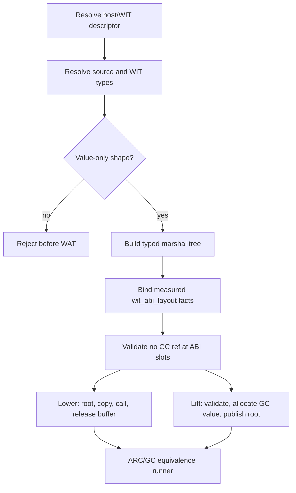

# GC Canonical Marshal Plan

## Status

Design gate for the pending `host_wit_marshalling` inventory row. This
document defines the boundary contract; it does not claim that the generic
host/WIT emitter is implemented.

## Scope

The first implementation slice is a typed boundary plan only, synchronous and
value-only:

- scalar values;
- `text` and `list<T>` values backed by Wasm GC objects;
- records whose fields are scalar/text or a list of scalar/text;
- list elements are intentionally limited to scalar/text until measured
  element stride and indirect layout facts are available;
- one canonical ABI argument or result slot at one declared host/WIT member,
  selected by `lower` or `lift` respectively.

`tuple`, `option<T>`, `result<T, E>`, and variants remain design targets, but
are pending separate shape and canonical-layout gates. This slice does not
claim their lowering or admission.

The slice does not admit async frames, `Future`/`Stream`, resource terminal
cleanup, arbitrary producer expressions, or external HTTP. Resource handles
remain owned by `ResourcePlan`; they are not traced as GC children.

## Boundary Invariants

1. A canonical import/export receives only canonical scalar words and linear
   memory addresses. A `(ref null $do_*)` value must never appear in its
   parameter or result list.
2. Every admitted source value has an explicit marshal node. The plan records
   source kind, direction (`lift` or `lower`), provisional size/alignment
   facts, and a canonical slot checked by `codegen_component_abi_plan`.
3. Lowering copies the source value into canonical memory before the host call
   when the source is a GC-managed value. The source GC object stays rooted
   until the copy and the host call have completed.
4. Lifting validates the canonical pointer/length or flattened fields before
   constructing a new GC value. Invalid ranges fail before allocation or
   publication of the result root.
5. Nested managed fields are represented by child marshal nodes and offsets;
   they are never encoded as raw GC references in canonical memory.
6. Resource handles use the explicit resource ownership/drop plan. GC
   collection cannot trigger a WIT resource drop.
7. Unsupported or unresolved source shapes fail before WAT emission with a
   named capability error; they do not fall back to an ARC emitter inside the
   same admitted host/WIT plan.

## Canonical Shapes

The broader design targets the following canonical representations. The first
implementation plan currently admits only the scalar/text/list/record rows;
the remaining rows stay pending shape gates:

| Source shape | Canonical representation | GC action |
| --- | --- | --- |
| scalar/bool | one or more scalar core words | no GC root |
| `text` | `(ptr: i32, len: i32)` bytes in linear memory | lower copy / lift new text |
| `list<T>` | `(ptr: i32, len: i32)` element sequence | recurse through `T` |
| record | field sequence with canonical offsets/alignment | recurse per field |
| tuple | field sequence with canonical offsets/alignment | pending |
| `option<T>` | tag word plus canonical `T` payload | recurse for present arm |
| `result<T,E>` | tag word plus canonical `T`/`E` payload | recurse for selected arm |
| bounded variant | tag word plus declared payload area | recurse for selected arm |
| resource | canonical handle word | `ResourcePlan`, never GC-traced |

The current builder's scalar and record offsets are provisional type-tree
facts used by unit tests. The exact offsets, alignment, strides, and
indirect-result convention must come from `wit_abi_layout` and a pinned
WIT/canonical ABI descriptor before any host/WIT member is admitted. A source
spelling alone is insufficient to admit a member.

### Measured-layout adapter status (2026-08-16)

`build_sync_value_plan_with_layout` now binds a bounded measured tree to the
typed marshal tree. The adapter consumes `wit_abi_layout.LayoutPlan` for scalar
and record nodes, `TextLayoutPlan` for text nodes, `ListLayoutPlan` for
`list<u32>`, and `ByteListLayoutPlan` for `list<u8>` nodes, preserving the
measured field offset, byte size, alignment, and list element stride in the
resulting plan. A scalar width mismatch, record field/name/count drift,
invalid text pointer/length facts, or invalid list facts fails before an
admitted plan is returned.

At this initial adapter checkpoint, text/byte-list and bounded `list<u32>`
allocation/copy execution, `list<text>`, arbitrary list element layouts,
runtime pointer/length range validation, linear-memory lift/lower, and
descriptor-to-registry hash matching remained pending. The fixed synchronous
`list<u32>` allocation/copy lower and result-area lift paths have since closed
their measured execution gates; `list<text>`, arbitrary list element layouts,
and parser-backed compiler wiring remain pending. The original builder remains
provisional and must not be used as a canonical emitter input without this
measured adapter.

### Synchronous operation-plan status (2026-08-17)

`src/build/codegen_component_marshal_ops.zig` now derives an execution-neutral
operation sequence for measured `text`, `list<u8>`, bounded `list<u32>`, and
scalar-record-lift plans. Lowering is ordered
as `read_gc_span -> validate_linear_range -> cabi_realloc_alloc -> copy_to_linear
-> canonical_call -> cabi_realloc_free`. Text/list lifting is ordered as
`canonical_call -> validate_linear_range -> copy_from_linear ->
construct_gc_value -> publish_gc_root -> cabi_realloc_free`; scalar-record
lifting uses the same prefix but ends at `publish_gc_root` because it has no
temporary allocation. The module also checks pointer/length bounds with
subtraction-before-addition and rejects `length * stride` overflow.

`src/build/codegen_component_marshal_wat.zig` now emits a bounded core-WAT
function fragment for those shapes. Lowering reads a GC text/byte-array or
`$do_u32`, checks the destination span with 64-bit page arithmetic, allocates
with `cabi_realloc`, copies bytes or aligned `i32` elements, calls the canonical
function, and frees the temporary linear allocation. Lifting passes a measured
result-area pointer to the canonical function, loads `(ptr, len)` from that
area, validates the returned byte span before constructing a GC byte or
`$do_u32` array (and `do_text` where applicable), publishes the result through
a typed local, and frees the linear allocation.

The scalar-record slice is intentionally narrower: it admits only a non-empty
measured record whose fields are `u32`, `u64`, or `i64` (currently emitted as
`i32`/`i64` core words). `lift` receives one measured result-area pointer; the
emitter checks the full record span, loads each field at its measured offset,
and constructs `$do_record`. `lower` has two bounded forms: flat scalar
records pass the measured scalar words directly, while the separate indirect
slice passes one measured linear-memory pointer. The indirect emitter allocates
the measured buffer, stores fields at their measured offsets, calls the
canonical import, and frees the buffer. Nested/text/list fields and indirect
records outside the pinned bounded shape remain unsupported.

The emitter remains a core-WAT fragment. The fixed `list<u32>` lower and lift
shapes have independent Core/WIT assembly and Rust/Wasmtime host gates in
`examples/gc-p3-runtime/test_gc_marshal_u32_host.sh` and
`test_gc_marshal_u32_lift_host.sh`, plus an ARC/GC equivalence gate in
`test_gc_marshal_u32_equivalence.sh`. The equivalence runner observes the same
`[10, 20, 30]` values on both paths and exactly one allocation/free per path.
The emitter still does not resolve a WIT registry descriptor, wire `do build`,
or prove arbitrary records/lists. The scalar-record result lift has an
independent host-driven Component gate in
`examples/gc-p3-runtime/test_gc_marshal_record_host.sh`; it observes the same
record fields through the pinned WIT adapter and sums them to `42`. The paired
`test_gc_marshal_record_equivalence.sh` runs a GC record path and a linear
memory result-area path under the same WIT world; both return `42`. These
probes are evidence for bounded copy/guard and equivalence units, not closure
of `host_wit_marshalling` or the G5c cutover.

### Descriptor and boundary admission (2026-08-16)

`validate_descriptor_binding` now requires both sides of a binding to carry a
`sha256:` value with exactly 64 hexadecimal digits and rejects any package,
world, member, revision, or hash drift. `build_sync_value_plan_with_registry`
performs that comparison before constructing a plan. The operation-plan entry
point also calls `validate_sync_value_plan`, which recursively rejects a GC
reference marker in any marshal node and re-runs the shared canonical-slot
validator. These checks close the format/drift and hidden-node negative units;
they do not resolve a registry file or prove that a supplied entry came from a
WIT parser.

### Private parser-backed route checkpoint (2026-08-18)

`src/build/codegen_component_marshal_route.zig` now provides the private
fail-closed route that resolves a WIT source member, binds the measured plan,
derives the canonical import from the plan descriptor, and invokes the bounded
Core module emitter. Callers cannot supply a second import identity to bypass
the descriptor check. The scalar-record `lift` probe, host Component gate, and
ARC/GC equivalence gate all consume this route.

The route is intentionally not the default `do build` host/WIT backend. It is
evidence for bounded generated shapes; broad aggregates, record `lower` outside
the pinned slices, async/resource shapes, and G5c cutover remain separate gates.
The migration inventory therefore marks only the bounded
`host_wit_marshalling` G5a/G5b cells complete; its G5c cell remains pending.

### Parser-backed scalar-record lower checkpoint (2026-08-18)

The measured scalar-record `lower` slice now uses the canonical ABI shape
observed from pinned `wasm-tools 1.255.0`: a two-field `u32` record is flattened
to `(i32, i32)` at the Core import while the Component/WIT host callback still
receives one record value. The parser-backed probe generates this route, and
the Core/WIT assembly, Rust/Wasmtime host, and GC/flat equivalence gates pass
with values `7,35`, result `42`, and exactly one host callback per path.

This is evidence for one flat scalar record only. It does not admit indirect
record layouts outside the pinned bounded slice, nested/text/list fields,
arbitrary aggregate shapes, default compiler-route wiring, async/resource
paths, or G5c cutover.

### Parser-backed mixed scalar-record lower checkpoint (2026-08-18)

The same private route now has an independent three-field lower probe with
`code: u32`, `count: u64`, and `status: s64`. The pinned
`wasm-tools 1.255.0` canonical import is flat `(i32, i64, i64)`; the record
layout is 24 bytes with the `u64`/`s64` fields aligned at offsets 8 and 16.
Component assembly, Rust/Wasmtime host execution, and GC/flat equivalence all
pass with values `7,35,-5`, guest result `42`, and one callback per path. The
canonical import remains free of GC references.

This only extends the measured flat scalar-record set. Indirect records outside
the pinned shape, nested/text/list fields, arbitrary aggregates, default
compiler-route wiring, async/resource paths, and G5c cutover remain pending.

### Parser-backed indirect scalar-record lower checkpoint (2026-08-18)

The private route now admits one measured indirect record lower shape: the WIT
`writing` record has 17 `u64` fields. Pinned `wasm-tools 1.255.0` measures a
136-byte record with 8-byte alignment and lowers the canonical Core import to
one `(i32)` pointer. The GC path allocates the buffer with `cabi_realloc`,
writes all fields at the measured offsets, invokes the host callback, and frees
the buffer. The canonical import contains no GC reference.

`examples/gc-p3-runtime/test_gc_marshal_record_indirect_lower_host.sh` passes
the pinned Core/WIT assembly and Rust/Wasmtime host gate with `result=42` and
one host write callback. The paired
`test_gc_marshal_record_indirect_lower_equivalence.sh` compares the GC buffer
path with the flat linear-memory reference and passes with `42/42` and one
callback per path. This is a bounded lower/equivalence checkpoint only;
nested/text/list fields, arbitrary indirect layouts, default compiler-route
wiring, async/resource paths, and G5c cutover remain pending.

## Plan Construction and Use

The plan is immutable after construction. Future emitters will consume it rather than
re-deriving offsets from source token profiles. The plan must carry the
descriptor identity (package, world, member, and pinned revision/hash) so a
canonical import cannot be spoofed by a same-shaped locator/member.

## Gate and Evidence

The `host_wit_marshalling` inventory row remains pending until all of the
following exist:

1. a parser/sema-to-plan adapter for one bounded synchronous value-only
   member;
2. RED tests for GC-reference leakage, invalid pointer/length, unsupported
   nested/resource shapes, and descriptor drift;
3. a WAT fixture with canonical imports and no GC reference parameters/results;
4. independent ARC and GC executions that compare observable values and
   ownership/cleanup outcomes;
5. pinned `wasm-tools` parsing and a host-driven Component/WIT runner.

The fixed `list<u32>` and pinned 17-field indirect scalar-record slices have
independent host and ARC/GC equivalence runners, but that evidence is
intentionally narrower than this inventory row: parser-backed default compiler
wiring, registry-wide admission, general aggregate shapes, and the remaining
host/WIT routes are still absent. Therefore `host_wit_marshalling` remains
pending even though those bounded slices are green.

Until this gate is green, the residual `wasi:filesystem/preopens` fixture is
expected to retain its `wasi-bind` manifest and canonical import on the ARC
transition path.
