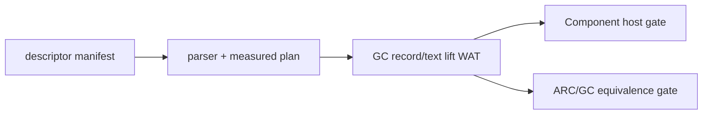

# G5c C15-A: private managed-field record lift

## Status

Implemented as a bounded private manifest-backed probe on 2026-08-20.
The default host/WIT route, text/list record lower, async/resource paths, and
G5c full cutover remain outside this design.

## Scope

The fixed WIT shape is:

```wit
record reading {
  code: u32,
  label: string,
}

read: func() -> reading;
```

The descriptor is pinned by `doc/wit/gc_descriptor_manifest.json`. The parser-
backed private route validates the package, world, interface, member,
signature, source hash, and measured layout before emitting Core WAT.

Measured result-area layout:

| field | offset | size | alignment |
| --- | ---: | ---: | ---: |
| `code` | 0 | 4 | 4 |
| `label.ptr` | 4 | 4 | 4 |
| `label.len` | 8 | 4 | 4 |
| `reading` | 0 | 12 | 4 |

The canonical import remains `(i32) ->` through a single result-area pointer.
The pointer/length payload is copied into a GC `do_bytes` array and then a
`do_text` struct. No GC reference crosses the canonical Component boundary.

## Implementation boundary

The marshal plan accepts a measured `text` child only on the lift record path.
The Core emitter:

1. loads the measured pointer and length;
2. validates the linear span against memory size;
3. allocates and fills a GC byte array;
4. frees the temporary canonical span through the configured `cabi_realloc`;
5. constructs `do_text`, then the enclosing `do_record`.

Record lower with managed fields, lists, variants, options/results, resources,
and arbitrary nested managed shapes continue to fail closed.



## Verification contract

- focused route positive and measured child-count negative tests;
- `wasm-tools 1.255.0` Core parse and Component embed/new/validate;
- source-hash drift rejection;
- Rust/Wasmtime host result `12` (`code 7 + label length 5`);
- ARC/GC equivalence result `12/12`;
- residual gate inclusion and complete compiler regression.

## Non-goals and promotion gate

This slice does not change ordinary `do build` host/WIT routing and does not
close the `host_wit_marshalling` G5c inventory cell. Promotion requires a
separate design for managed-field lower, multiple managed fields, list fields,
general aggregate recursion, and compiler default-route provenance.
