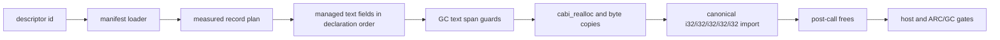

# G5c C15-D: bounded multi-managed-text record lower

## Status

Proposed after approval of the bounded C15-D design. This document defines a
private, manifest-backed probe and compiler opt-in slice. It does not authorize
default host/WIT routing, arbitrary aggregate lowering, or the G5c cutover.

## Goal

Extend the verified C15-B `{u32, string}` lower route to one fixed record with
two managed `string` fields. The GC record remains a GC value; each string is
copied to a temporary canonical linear-memory span, passed as a pointer/length
pair, and freed after the host call. The route must preserve declaration order,
reject unsupported shapes before WAT emission, and retain the existing C15-B
behavior for its descriptor.

## Selected WIT shape

The new descriptor is:

`demo:marshal-record-managed-lower-multi/api.write@1.0.0/lower`

Its source is:

```wit
package demo:marshal-record-managed-lower-multi@1.0.0;

interface api {
  record writing {
    code: u32,
    label: string,
    note: string,
  }

  write: func(value: writing);
}
```

The package-less world fragment imports `api` and exports
`run: func() -> u32`. The probe constructs `{ code: 7, label: "hello", note:
"world" }`. The host must observe those values and exactly one `write` call.

The probe's `run` export returns the existing cleanup counter convention
`allocation_count * 16 + free_count`; two allocations and two frees therefore
return `34`. Host runners must also report the decoded allocation and free
counters explicitly.

## ABI and measured layout

The pinned toolchain is `wasm-tools 1.255.0 (76e20611d 2026-07-30)`. A fresh
probe must establish the following target facts before implementation is
admitted:

```wat
(type $canonical_lower (func (param i32 i32 i32 i32 i32)))
```

The canonical parameters are, in order, `code`, `label.ptr`, `label.len`,
`note.ptr`, and `note.len`. The expected result-area measurement is:

| field | offset | size | alignment |
| --- | ---: | ---: | ---: |
| `code` | 0 | 4 | 4 |
| `label` | 4 | 8 | 4 |
| `note` | 12 | 8 | 4 |
| `writing` | 0 | 20 | 4 |

The implementation must compare the measured facts with these values and fail
closed on any mismatch. No GC reference may occur in the canonical import.

## Architecture and data flow

The existing manifest loader remains the sole source of package, world,
member, signature, canonical-import, and source-hash facts. The marshal planner
continues to use the measured `MarshalNode` children. The C15-D change removes
the emitter's assumption that the only managed field is `root.children[1]` and
derives the direct managed text fields in declaration order.



The admission predicate is intentionally bounded to a root record with exactly
three direct children: `u32`, `string`, and `string`. Nested records, lists,
variants, options/results, resources, async members, and arbitrary producer
expressions remain rejected. The emitter may be implemented by walking the
measured root children; it must not add a second descriptor-specific copy of
the C15-B emitter.

## Lowering algorithm

For a valid `{u32, string, string}` input:

1. Load `code`, `label`, and `note` from the GC record.
2. For each text field in source order, guard `length <= bytes-array.length`.
3. Allocate one temporary linear span with
   `cabi_realloc(0, 0, 1, length)` for that field. Zero-length fields retain
   the same one allocation/free accounting rule; no optimization is admitted.
4. Copy the field's bytes into its span.
5. Call the canonical import with the scalar followed by the two pointer/length
   pairs in source order.
6. Free each temporary span with
   `cabi_realloc(ptr, length, 1, 0)` after the host call. The order is fixed and
   documented by the emitter (reverse declaration order is the selected order).

The generated WAT uses distinct locals for each span and length. It must not
store a GC reference in linear memory or pass a GC reference across the import.
An invalid GC text length traps before the host call. Allocation traps remain
ordinary Wasm traps; this slice does not add rollback or exception handling.

## Admission and failure contract

The descriptor route accepts only the exact id above and the measured shape
above. It rejects, before returning WAT, all of the following:

- unknown or duplicate descriptor ids;
- source, package, world, interface, member, direction, signature, canonical
  import, or SHA-256 drift;
- missing, extra, reordered, or differently typed record children;
- a record-area size or alignment mismatch;
- an indirect record layout;
- nested records, list fields, variants, options/results, resources, async
  members, or arbitrary producer expressions;
- any canonical slot containing a GC reference.

No error path falls back to the default ARC-backed `@host` route, and no
partially generated WAT is returned after a failed admission check.

## Compiler boundary

The existing private `--gc-wit-marshal <descriptor-id>` option remains the only
compiler entry point. C15-D adds exactly one admitted descriptor to the
fail-closed adapter after its manifest, toolchain, host, and equivalence gates
are green. The default `do build` path and ordinary `@host` lowering remain
unchanged and ARC-backed. No `own<T>`, `borrow<T>`, `ref<T>`, Option/Result,
async, or resource syntax is added.

## Verification gates

The implementation plan must include all of these independently observable
gates:

1. A pinned WIT/Core probe establishes the five-`i32` canonical import and the
   20-byte record layout with `wasm-tools 1.255.0`.
2. Focused Zig tests cover multi-field planning, declaration-order arguments,
   allocation/free operation order, and a red negative shape test.
3. Manifest tests cover source-hash, signature, measured-layout, unknown-id,
   and unsupported-shape rejection before WAT emission.
4. Generated Core WAT passes parse, embed, component-new, validate, and WIT
   inspection. The canonical import contains no `(ref`.
5. The Rust/Wasmtime host gate observes `code=7`, `label=hello`,
   `note=world`, `write-calls=1`, `allocations=2`, and `frees=2`.
6. The ARC/GC equivalence gate observes identical values and
   `allocations=2/2`, `frees=2/2`, and `write-calls=1/1`.
7. The compiler opt-in host and equivalence gates start from real `do build`
   output. Existing C15-B gates and all default-path regression tests remain
   green.

## Non-goals and rollback

This slice does not implement arbitrary numbers of managed fields, nested
managed records, text/list records, list allocation policy, default host/WIT
routing, async/resource lowering, public ownership syntax, or full GC cutover.
If any measured ABI, Component, host, or equivalence gate fails, reject the
C15-D descriptor and leave C15-A through C15-C unchanged; do not weaken a gate
or add an ARC compatibility branch to make the probe pass.
