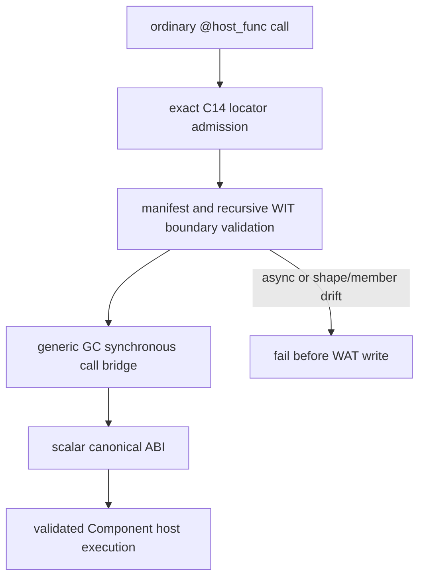

# G5c C14 Default Host/WIT Route Design

## Status

Implementation in progress. The RED gates in this document promote the two
already verified C14 four-level scalar-record descriptors from the explicit
`--gc-wit-marshal` route to the ordinary synchronous `@host_func` route. The
route remains bounded and manifest-backed.

## Goal

Make ordinary Do calls for the exact C14 nested scalar-record lift and lower
descriptors use the generic `GcSyncHostWitRoute` bridge. The implementation
must reuse the checked-in descriptor manifest, measured layout, recursive
boundary validator, and existing C14 WAT emitters where the generic route
cannot yet cover the shape.

Admitted descriptors:

```text
demo:marshal-record-nested-lift-deeper/api.read@1.0.0/lift
demo:marshal-record-nested-lower-deeper/api.write@1.0.0/lower
```

## Route Contract



The lift import is `(i32) -> nil`, using the measured result-area pointer. The
lower import is `(i32, i64, i64, i64, i64) -> nil`, using the measured scalar
sequence for the four-level record. No canonical import may carry a GC
reference. The ordinary route must execute a real `start` call; a private
probe-only `$run` wrapper is insufficient evidence.

The Do record tree is the C14 shape already validated by the private route:

```do
Leaf { code u32, count u64 }
Header { leaf Leaf, status i64 }
Detail { header Header, marker i64 }
Reading { detail Detail, tail i64 }
```

The lower fixture uses `Writing` as the root. Field order, scalar types, and
nested record references are checked recursively against the resolved WIT
member. Missing declarations, reordered fields, extra declarations, async
markers, locator/member drift, and unsupported nested shapes fail closed.

## Scope And Non-goals

- Reuse the existing manifest loader and `GcSyncHostWitRoute`; do not add a
  second descriptor table or a new syntax.
- Preserve the explicit C14 selector and all existing C15/C16 default routes.
- Admit only these two exact synchronous descriptors.
- Do not admit arbitrary aggregate depth, text/list/variant/resource values,
  async lowering, ownership syntax, or general WIT inference.
- Leave the 15-row migration inventory unchanged at
  `complete_rows=15 pending_rows=15`.

## Gates And Rollback

The host gate must build both ordinary fixtures without `--gc-wit-marshal`,
parse the Core module, assert the canonical imports and nested struct code,
assemble and validate the Component with `wasm-tools 1.255.0`, and observe the
existing Rust/Wasmtime C14 host results. The equivalence gate compares each
default GC Component with its checked-in ARC reference and requires the same
result and callback count. The negative gate retains async, member, and
recursive-shape rejection with no output artifact and proves that an
unadmitted descriptor still follows the existing ARC route.

If a default gate fails, remove only the two C14 rows from
`admitted_gc_host_descriptor`. The explicit route and the existing default
C15/C16 routes remain the rollback baseline.
