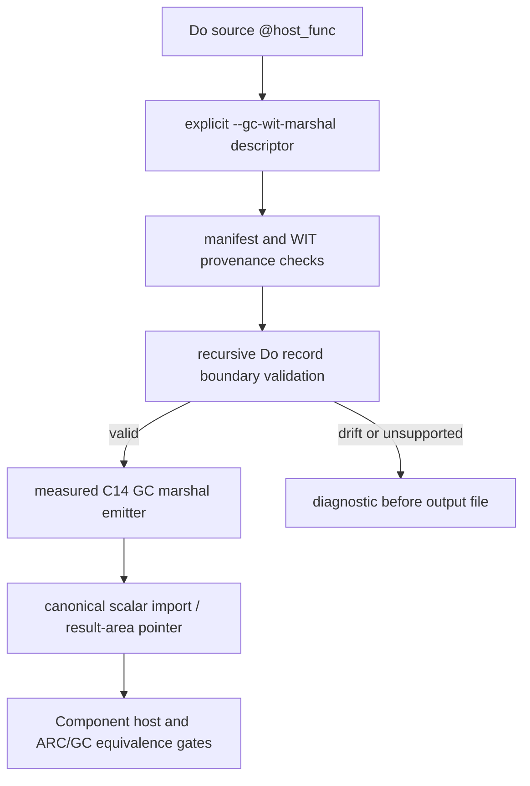

# G5c C14 Four-Level Scalar-Record Compiler Boundary

## Status

Private explicit compiler-boundary slice. This design follows the already
verified C14 manifest-backed four-level nested scalar-record Components and
does not promote the descriptor to the ordinary default host/WIT route.

## Goal

Allow a source-level `@host_func` declaration to select the exact C14 `lift` or
`lower` descriptor through `--gc-wit-marshal`, while validating the complete
four-level Do record tree against the resolved WIT shape before any WAT is
written.

The admitted descriptor ids are:

```text
demo:marshal-record-nested-lift-deeper/api.read@1.0.0/lift
demo:marshal-record-nested-lower-deeper/api.write@1.0.0/lower
```

## Source contract

Lift accepts exactly one synchronous host declaration with a zero-parameter
result rooted at `Reading`; lower accepts exactly one synchronous declaration
with one `Writing` parameter and a `nil` result. The root and every nested Do
record must preserve field order and map the WIT scalar types as follows:

```do
Leaf {
    code u32
    count u64
}

Header {
    leaf Leaf
    status i64
}

Detail {
    header Header
    marker i64
}

Reading {
    detail Detail
    tail i64
}
```

The lower fixture uses the same tree with `Writing` as the root. The validator
does not require Do type names to match WIT case, but it resolves each nested
Do type name and recursively checks its fields. A missing nested declaration,
field reorder, scalar type drift, async marker, locator/member drift, duplicate
declaration, extra host declaration, or unsupported child fails closed before
WAT emission.

## Route and ABI



The lower canonical import is the measured scalar sequence
`(i32, i64, i64, i64, i64) -> nil`; the lift import is `(i32) -> nil`, where
the parameter is the canonical result-area pointer. No GC reference crosses a
canonical import. The C14 `run` wrapper and Rust/Wasmtime adapters remain
probe-local.

`--gc-wit-marshal` remains the only compiler admission switch for C14. The
ordinary default route continues its existing behavior until a separate,
explicit default-route design is approved and gated. This task does not add
generic aggregate inference, arbitrary depth, text/list/variant/resource
support, async lowering, or ownership syntax. The migration inventory remains
the intentionally incomplete 15-row ledger.

## Verification and rollback

The compiler host gates must parse the generated Core module, reject canonical
GC-reference imports, assemble and validate the Component with pinned
`wasm-tools 1.255.0`, and observe `sum=42` for lift or `result=42` with one
write callback for lower. Equivalence gates compare the generated GC Component
with the checked-in ARC Component and require `42/42` and callback counts
`1/1`. Negative gates require async, locator/member, and recursive-shape drift
to fail before the output path exists.

Rollback is limited to removing the two explicit descriptor branches from the
GC WIT marshal adapter and the recursive boundary fixture/test entries. It
does not alter the existing C15/C16 default route or manifest evidence.
