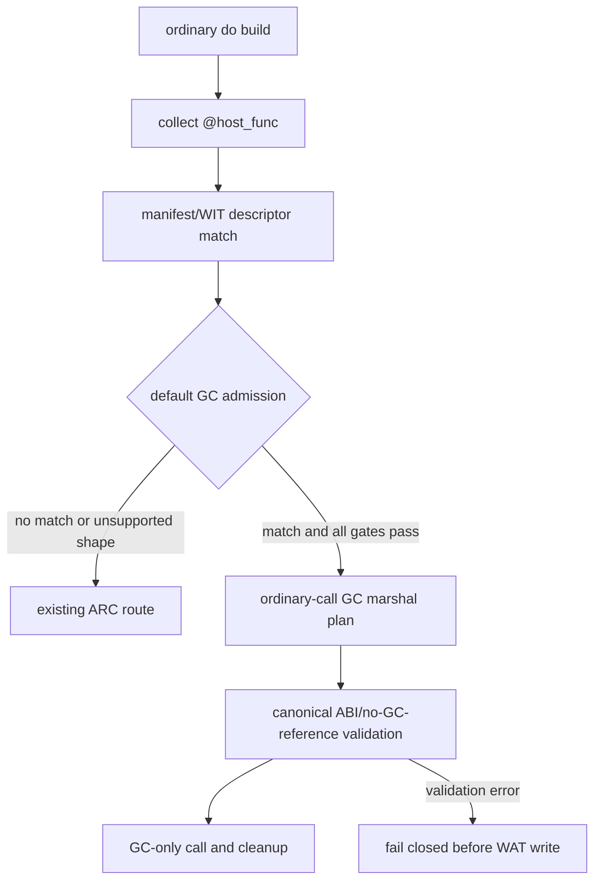

# G5c Default Host/WIT Route Design

## Status

Implemented bounded default route (2026-08-22). The ordinary `@host_func`
pipeline now admits only the manifest-verified C15-B lower and C16-C lift
descriptors. All other host/WIT shapes, including C15-D/C16-D multi-text
records, remain on the ARC transition path until their own default-route gates
close.

## Goal

Connect one manifest-backed GC marshal plan to the ordinary host-call codegen
pipeline, then admit only the proven synchronous C15-B and C16-C descriptors
to the default route. The first implementation must compile a normal Do call
through the same function/call path used by ordinary programs; a probe-only
`$run` wrapper is not sufficient evidence.

Initial descriptors:

```text
demo:marshal-record-managed-lower/api.write@1.0.0/lower
demo:marshal-record-managed-lift/api.read@1.0.0/lift
```

The C15-D and C16-D multi-text descriptors remain explicit opt-in until the
same ordinary-call bridge is separately verified. Nested records, lists,
variants, resources, futures, streams, async host declarations, and public
ownership syntax remain outside this slice.

## Current Evidence And Boundary

The checked-in descriptor manifest already validates source paths, concatenated
WIT source hash, package/version, world, interface, member, signature claims,
canonical import, and measured layout. The source boundary validator derives
the Do record shape from resolved WIT and rejects async, duplicate, unrelated,
locator-drift, member-drift, and shape-drift declarations.

The explicit `--gc-wit-marshal` route continues to call the manifest-backed
marshal emitter and append its private probe wrapper. The ordinary route now
loads the exact descriptor from the same manifest, validates the resolved WIT
member against the Do tokens, and passes the immutable route into
`codegen_pipeline.emit_wat_with_options`. C15-B lowers `Writing { code: u32,
label: text }` through the canonical `(i32, i32, i32)` import; C16-C lifts
`Reading { code: u32, label: text }` through the canonical result-area
`(i32)` import. Both ordinary outputs contain `;; gc-sync`, no `__arc_`
symbols, and no GC reference at the canonical boundary.

The default evidence is covered by
`examples/gc-p3-runtime/test_gc_default_host_route_c15b.sh` and the
C15-B/C16-C negative/default compiler gates. The historical `_red.sh`
entrypoint now delegates to the green C15-B gate and is retained only for
script compatibility.

## Route Contract



The bridge must satisfy these rules:

1. A default candidate is selected only by an exact manifest descriptor match:
   canonical module, member, direction, package/version, source hash, WIT
   member signature, and Do boundary must all agree.
2. The candidate must be synchronous and have exactly one target declaration.
   Async markers, duplicate declarations, unrelated host declarations, and
   any source or shape drift fail closed when the candidate is selected.
3. The candidate's measured layout is loaded from the manifest. No caller,
   descriptor-id switch, or probe-specific table may supply a replacement
   layout.
4. The ordinary call emitter consumes a plan with explicit lower/lift and
   cleanup operations. It must not call or depend on the private probe `$run`
   wrapper. Lower C15-B passes `(code, label.ptr, label.len)` to the canonical
   import and frees the copied text after the call. Lift C16-C passes the
   result-area pointer to the canonical import and constructs the GC record
   returned to the ordinary Do caller.
5. The canonical import may contain only Core scalar values and linear-memory
   pointer/length values. A GC reference crossing the import is an admission
   error.
6. A descriptor that has no ordinary-call bridge stays on the existing ARC
   path. There is no implicit retry, partial GC emission, or silent ARC fallback
   after the candidate has been selected and its GC validation has failed.
7. The output is written only after the selected route has completed all source,
   plan, ABI, and WAT validation. Rejection leaves no output artifact.

## Implementation Units

### Unit A: plan bridge

Expose a small immutable host-call marshal plan from the manifest loader. The
plan carries descriptor identity, direction, canonical import, measured root,
Do field mapping, and cleanup actions. `codegen_host_imports` or a dedicated
adapter may consume it, but the manifest loader remains the only owner of
provenance checks.

### Unit B: ordinary lower call

Add the C15-B lower path to the existing call emitter. It must accept the
ordinary call expression, materialize the record's scalar/text fields, invoke
the canonical import, and perform the measured cleanup exactly once. A real
`start` function calling the host declaration is the required fixture.

### Unit C: ordinary lift call

Add the C16-C lift path to the same call emitter. It must invoke the canonical
result-area import, lift the returned scalar/text fields into the ordinary Do
result, and preserve the existing local/control-flow conventions.

### Unit D: admission and rollback gate

Default admission is enabled only for C15-B and C16-C after their focused
host, equivalence, negative, and toolchain gates. Any selected mismatch is
fail-closed. Removing a descriptor's admission row is the rollback action; the
ordinary ARC route for unadmitted shapes and the explicit
`--gc-wit-marshal` route remain intact.

## Verification Gates

The implementation must retain these gates for every admitted descriptor and
for each future admission expansion:

- a normal-call C15-B fixture and a normal-call C16-C fixture;
- WAT assertions for canonical import, call/cleanup order, and absence of GC
  references at the ABI boundary;
- Component assembly and validation with pinned `wasm-tools 1.255.0`;
- Rust/Wasmtime host execution for both ordinary calls;
- ARC/GC equivalence for values and cleanup counts;
- negative fixtures for async, locator/member mismatch, duplicate/extra
  declaration, source-hash drift, missing measurement, and shape drift;
- a default-route negative proving an unadmitted descriptor still emits ARC;
- a no-artifact assertion for every fail-closed rejection.

The existing explicit manifest gates and `check_gc_g5c_residual_gate.sh
baseline` remain required. The migration inventory stays
`complete_rows=15 pending_rows=15` until a separate cutover decision closes
all remaining host/WIT residuals.

## Non-goals And Rollback

This slice does not delete `runtime_arc_wat.zig`, `runtime_prelude_wat.zig`, or
`codegen_ownership.zig`; they remain required by unadmitted ordinary programs.
It does not change async lowering, resource ownership, WIT syntax, public
`own<T>`/`borrow<T>`/`ref<T>`, `Option`, or `Result` syntax. It does not change
the default backend globally. If any real-call, ABI, cleanup, or equivalence
gate fails, keep the descriptor explicit-only and restore the previous route
admission table; do not add a compatibility fallback that hides the failure.
