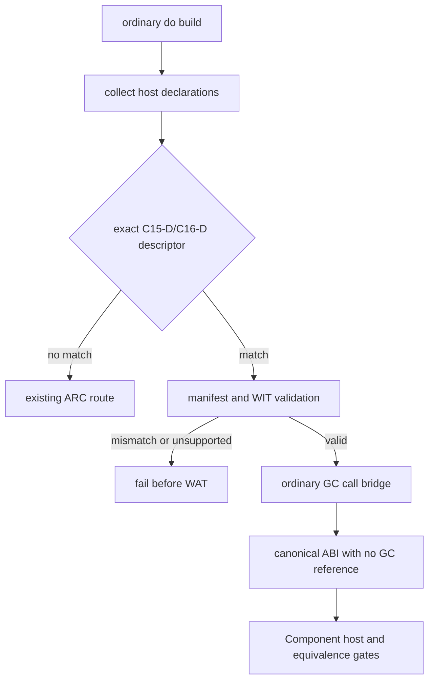

# G5c C15-D/C16-D Default Multi-Managed-Text Route Design

## Status

Follow-on design for the bounded 2026-08-22 default-route promotion. It admits
only the already verified C15-D lower and C16-D lift descriptors through the
ordinary synchronous `@host_func` call path. It does not widen the WIT/Do
inference surface.

## Goal

Promote these exact manifest descriptors from explicit opt-in to the ordinary
default host/WIT GC route:

```text
demo:marshal-record-managed-lower-multi/api.write@1.0.0/lower
demo:marshal-record-managed-lift-multi/api.read@1.0.0/lift
```

The existing manifest loader, WIT-derived boundary validator, measured marshal
plan, and ordinary call bridge remain the source of truth. No new ABI or source
syntax is introduced.

## Scope And Non-Goals

- C15-D admits exactly `Writing { code: u32, label: text, note: text }` lower.
- C16-D admits exactly `Reading { code: u32, label: text, note: text }` lift.
- Both declarations must be synchronous, unique, and match the manifest's
  locator, member, direction, WIT signature, source hash, and measured layout.
- The lower canonical import is `(i32, i32, i32, i32, i32)`; the lift import is
  one `(i32)` result-area pointer.
- No GC reference crosses either canonical import. Lower frees both temporary
  text spans after the call; lift validates and copies both result spans.
- Unknown, drifted, async, duplicate, extra, nested, list, variant, option,
  result, resource, producer, and arbitrary aggregate shapes remain outside the
  default route and retain their existing behavior.
- The 15-row migration inventory remains `complete_rows=15 pending_rows=15`.
- The ordinary compiler currently exports `_start`; the executable default
  gates add only a temporary probe-local wrapper that exports WIT's `run`
  entry. This adapter is outside compiler output and does not change the
  admission or ABI contract.

## Route And Failure Contract



Admission is selected by exact descriptor identity. A selected descriptor never
silently falls back to ARC after a GC validation failure; it fails before the
output file is written. A non-selected descriptor continues through the normal
ARC path, as before.

## ABI And Cleanup Invariants

C15-D lower uses the measured 20-byte root:

```text
code@0
label.ptr@4 label.len@8
note.ptr@12 note.len@16
```

The generated call order is `code, label.ptr, label.len, note.ptr, note.len`.
Each text value gets one allocation and one byte copy; both frees occur only
after the canonical call. C16-D uses the same 20-byte result area and returns a
GC `Reading` value after validating and copying both spans.

## Verification Gates

The promotion is accepted only when all of these pass with
`wasm-tools 1.255.0`:

1. A focused admission test accepts the two exact locators and rejects an
   unknown locator.
2. Default C15-D and C16-D host gates build without `--gc-wit-marshal`, parse
   and validate the Core/Component output, and run the existing Rust/Wasmtime
   host adapters.
3. Default equivalence gates compare those outputs with the checked-in
   linear-memory references and observe `2/2` cleanup counters for C15-D and
   `17/17` values for C16-D.
4. Negative gates reject async and locator mismatch before WAT, leave no
   artifact, and retain the explicit opt-in route.
5. The focused Zig suite, full regression, ReleaseSmall build, release smoke,
   `git diff --check`, and residual baseline remain green. The inventory keeps
   its documented pending exit status.

## Rollback

The rollback switch is the two-entry admission table in `src/build/run.zig`.
Removing either entry restores that descriptor to the existing ARC default
route without changing the manifest, emitter, explicit `--gc-wit-marshal`
route, or other host descriptors. A failed ABI, Component, host, equivalence,
or negative gate blocks promotion and requires this table-only rollback; gates
must not be weakened to preserve green output.
