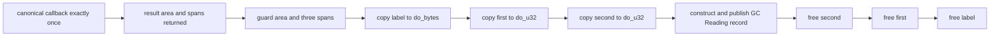

# G5c Bounded Mixed `text` + Two `list<u32>` Lift Design

## Status

Approved bounded continuation of the synchronous G5c host/WIT route. This
document admits one exact manifest-backed descriptor only; it does not
generalize record/list inference, close a migration row, or claim full G5c
cutover.

## Goal and exact boundary

Promote this synchronous result-area lift boundary through the ordinary GC/WIT
route:

```wit
package demo:marshal-record-mixed-text-two-u32-lists-lift@1.0.0;

interface api {
  record reading {
    code: u32,
    label: string,
    first: list<u32>,
    second: list<u32>,
  }

  read: func() -> reading;
}
```

The Do declaration is:

```do
Reading {
    code u32
    label text
    first [u32]
    second [u32]
}

read = @host_func(
    "demo:marshal-record-mixed-text-two-u32-lists-lift/api@1.0.0",
    "read",
    () -> Reading,
)
```

The descriptor id is:

```text
demo:marshal-record-mixed-text-two-u32-lists-lift/api.read@1.0.0/lift
```

The exact manifest source is
`examples/gc-p3-runtime/marshal-record-mixed-text-two-u32-lists-lift-manifest-source.wit`.
The world source is
`doc/wit/gc_marshal_record_mixed_text_two_u32_lists_lift_imports.wit`.
The source hash is computed from source bytes, one newline, world bytes, and
one trailing newline:

```text
sha256:518edd667347a947c1bb3b912b4cf3579be0288567086b7e4b45dc6345964e75
```

## Fixed result-area layout and canonical ABI

The measured result area is 28 bytes with 4-byte alignment:

| Field | Offset | Size | Alignment |
| --- | ---: | ---: | ---: |
| `code` | 0 | 4 | 4 |
| `label.ptr` / `label.len` | 4 / 8 | 8 | 4 |
| `first.ptr` / `first.len` | 12 / 16 | 8 | 4 |
| `second.ptr` / `second.len` | 20 / 24 | 8 | 4 |
| record total | 0 | 28 | 4 |

The `label` child is a text span with byte size `1`, alignment `1`, and
`cabi_realloc` allocation/free. Both list children are `list<u32>` spans with
element byte size/alignment/stride `4/4/4` and `cabi_realloc` allocation/free.
The fixed capacities and accepted lengths are:

| Field | Capacity | Accepted lengths |
| --- | ---: | --- |
| `first` | 3 | `0, 1, 2, 3` |
| `second` | 2 | `0, 1, 2` |

The canonical Core import receives one result-area pointer and returns no Core
value:

```wat
(func (param i32))
```

No Wasm GC reference, array reference, or ownership token crosses this
canonical boundary.

## Lift, cleanup, and observable oracle

The host writes one result area and three temporary linear spans. The GC lift
must:

1. invoke the canonical host callback exactly once with the result-area pointer;
2. validate the 28-byte result-area span before its first load after the
   callback returns;
3. load `code`, both text/list pointer-length pairs, and validate each span;
4. validate both `length * 4` calculations before copying either list;
5. allocate and copy `label` into `$do_bytes`;
6. allocate and copy `first` into `$do_u32`;
7. allocate and copy `second` into `$do_u32`;
8. construct and publish one `$do_record` containing all four fields;
9. free `second`, then `first`, then `label`, exactly once.

The empty label and empty lists are valid. Overflow, malformed lengths, and
out-of-bounds spans trap before copying. If a later allocation or copy fails,
the cleanup mask frees every span already acquired, exactly once, in reverse
acquisition order.

The positive host oracle returns:

```text
code=7
label=hello
first=[10,20,5]
second=[3,4]
read-calls=1
allocations=3
frees=3
```

The generated `run` export returns `54` (`7 + 5 + 10 + 20 + 5 + 3 + 4`).
The `stats` export returns `51` (`3 * 16 + 3`), preserving the existing
allocation/free counter contract. ARC/GC equivalence must observe `54/54`,
`51/51`, and `1/1` callback counts.



## Admission and fail-closed boundary

Admission requires all of these facts to match the manifest:

1. Exactly one synchronous `@host_func` declaration has no parameters and
   returns `Reading`.
2. Locator, member, package, world, interface, revision, descriptor id, and
   source hash match exactly.
3. The Do record is named `Reading` and has exactly the ordered fields
   `code u32`, `label text`, `first [u32]`, `second [u32]`.
4. The measured result-area and child layouts, capacities, and accepted
   lengths match this document.
5. Every pointer, length, multiplication, and allocation is guarded before its
   first load or copy. A runtime guard failure occurs after the one canonical
   callback and must not copy or retry the callback; an invalid declaration or
   descriptor is rejected before WAT and therefore produces no host call or WAT
   artifact.

The route rejects before WAT for an async declaration, locator or member drift,
field reorder, `[u8]` substitution, text payload substitution, extra or
missing fields, record-name drift, dynamic capacity, unknown descriptor, or a
GC-reference canonical import. Unrelated host declarations retain the ARC
fallback.

## Non-goals, rollback, and inventory boundary

- No public syntax change.
- No `own<T>`, `borrow<T>`, `ref<T>`, `Option`, `Result`, variant, async,
  resource, cancellation, or generic ownership behavior.
- No arbitrary aggregate/list inference, dynamic producer, or nested aggregate.
- No manifest schema change, canonical ABI change, ARC fallback removal, or
  migration-row closure.
- Keep `complete_rows=15 pending_rows=15` with deliberate inventory exit `1`.

If any focused or full gate fails, remove only this descriptor's manifest/WIT
inputs, source fixtures, fixed emitter branch, runner, and dedicated scripts.
Existing descriptors and unrelated dirty-worktree changes remain untouched.

## Required evidence gates

The descriptor is complete only after all of these pass with the pinned
toolchain:

1. Host-boundary, measured-plan, and WAT unit tests prove the exact four-field
   shape, 28-byte result area, one scalar result-area parameter, three copies,
   and reverse cleanup order.
2. Positive and negative compiler fixtures pass or reject before WAT as
   specified above.
3. Manifest-backed Component host execution observes the exact oracle and
   `3/3` allocation/free counts.
4. The fixed ARC oracle and generated GC Component use the same WIT and
   canonical import; equivalence observes `54/54`, `51/51`, and `1/1`.
5. Default and explicit routes emit no ARC marker for this descriptor and no
   canonical import contains `(ref`.
6. Full regression, ReleaseSmall, release smoke, residual,
   semantic-equivalence, inventory, and formatting gates pass. Inventory keeps
   its deliberate `complete_rows=15 pending_rows=15` exit `1`.
