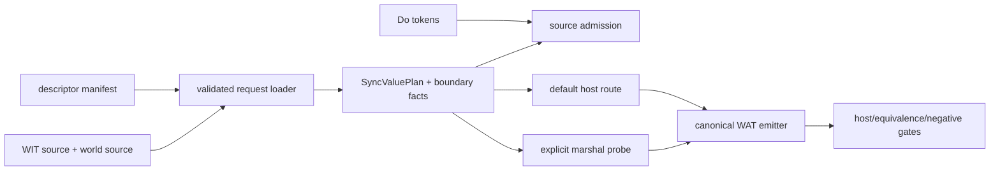

# G5c Route Consolidation Design

Status: proposed for the next implementation phase.

## Goal

Consolidate the already admitted C14–C20 synchronous GC/WIT routes around one
validated, manifest-backed request plan. The consolidation must remove duplicate
descriptor admission and provenance checks without widening the admitted shape
set or closing the global GC migration ledger.

## Evidence and current problem

The current implementation already has a typed `SyncValuePlan` and an owning
`LoadedRequest`, but the same boundary facts are reconstructed in multiple
places:

- `src/build/codegen_gc_wit_host_boundary.zig:65-124` keeps separate field
  arrays for each fixed descriptor.
- `src/build/codegen_gc_wit_host_boundary.zig:232-245` maps descriptor IDs to
  fixed `HostBoundarySpec` values.
- `src/build/codegen_component_descriptor_manifest.zig:84-134` independently
  reads the manifest, source, world source, verifies the hash, resolves WIT,
  and builds host fields for source-level admission.
- `src/build/codegen_component_descriptor_manifest.zig:175-249` repeats the
  manifest/source/hash/WIT sequence to build `LoadedRequest.plan`.
- `src/build/run.zig:162-210` maps ordinary host locators to descriptor IDs,
  while `src/build/codegen_gc_wit_marshal.zig:32-51` maintains another boolean
  dispatch set for explicit marshal probes.

The existing `SyncValuePlan` already rejects GC references at the canonical
boundary (`src/build/codegen_component_marshal_plan.zig:75-81` and
`validate_sync_value_plan`). The design reuses that invariant instead of
creating a second ABI model.

## Selected approach

Use the existing manifest loader and `LoadedRequest` as the single ownership
boundary. Extend that request with the source-level host-boundary facts derived
while the resolved WIT binding is alive. All consumers then use the same loaded
request:



The descriptor ID remains a lookup key only. Shape, field order, measured
layout, source hash, canonical import and direction come from the loaded
manifest/WIT request and its typed plan.

## Request ownership and interfaces

`src/build/codegen_component_descriptor_manifest.zig` remains the only module
that performs the manifest-backed provenance sequence. `LoadedRequest` will own:

1. the parsed manifest and manifest bytes;
2. the concatenated source bytes whose hash was checked;
3. the converted measured layout;
4. the existing `marshal.SyncValuePlan`;
5. an owned recursive `HostBoundarySpec` field tree used by the Do-token
   validator.

The field tree must deep-copy names and scalar type spellings that would
otherwise point into a temporary WIT binding. Its deinitializer must release
nested field arrays and copied strings before the manifest and source buffers.
No consumer may resolve the same descriptor a second time during one route.

The loader exposes two paths:

- `load_request_from_manifest(...)` returns the complete owned request for
  compiler and explicit-route callers.
- `validate_host_boundary_from_manifest(...)` remains a compatibility wrapper
  for isolated tests; it loads one request, validates tokens against the owned
  boundary facts, then deinitializes it.

The ordinary compiler path changes to call a request-based validator after the
request has been loaded. It must not call the compatibility wrapper, because
that would parse and hash the same descriptor twice.

## Admission invariants

The loaded request is admitted only when every invariant below holds:

1. manifest path, descriptor ID and all source paths are validated relative
   paths;
2. manifest schema and pinned toolchain are accepted;
3. concatenated source and world source match `source_sha256` exactly;
4. package, world, interface, member, direction, parameter count and result
   match the resolved WIT binding;
5. the canonical import is derived from the resolved package/interface/member
   and equals the manifest claim;
6. the measured layout binds to the resolved value shape, including offsets,
   sizes, alignments, list stride, capacity and accepted lengths;
7. `SyncValuePlan` validates with no GC reference crossing the canonical ABI;
8. only the current bounded synchronous record/list shapes are admitted;
9. async markers, resources, `future`, `stream`, `own`, `borrow`, `option`,
   `result`, variants, arbitrary aggregates and unmeasured shapes remain
   fail-closed.

The host-token validator continues to enforce one target synchronous
`@host_func`, exact locator/member, exact Do record name and ordered fields.
`@host_async_func` remains rejected for this route family.

## Route and emitter behavior

`src/build/run.zig` will select a manifest descriptor through one registry
lookup, load the request, validate the Do declaration against that request, and
retain the request lease until code generation completes.

`src/build/codegen_gc_wit_marshal.zig` will use the same request loader and
request-based validator. Its descriptor-specific `$run` wrappers may remain for
probe result aggregation, but they are test/probe presentation only; they must
not carry an independent admission or layout table.

The canonical emitter continues to consume `SyncValuePlan`. Its operation order
is explicit:

```text
canonical_call
validate_linear_span
copy_linear_payload
construct_gc_value
publish_gc_root
cleanup_each_linear_allocation_once
```

Every pointer plus length pair is checked for overflow and measured bounds
before a load or copy. Cleanup is represented by the measured plan and emitted
in the existing reverse ownership order. The C20 route must continue to free
payload before label, exactly once each; other existing routes retain their
current measured order.

## Compatibility and non-goals

This phase does not:

- change Do syntax or introduce `own<T>`, `borrow<T>`, `ref<T>`, `Option` or
  `Result`;
- promote generic aggregate/list lowering or lifting;
- promote async, resource, cancellation or borrowed-payload routes;
- remove the ARC backend or its equivalence oracle;
- alter the `complete_rows=15 pending_rows=15` migration inventory;
- change the pinned toolchain (`wasm-tools 1.255.0`, Wasmtime 47.0.2,
  Zig 0.16.0).

Unknown descriptors and all shapes outside the existing allowlist must keep
failing before WAT emission. The change is therefore reversible by restoring
the previous request call sites without changing the manifest contract.

## Verification contract

The implementation is accepted only if all of the following remain true:

- focused unit tests cover the shared loader, owned boundary tree, descriptor
  drift, source-hash drift, measured-layout drift, canonical-import drift and
  GC-reference rejection;
- every current C14–C20 positive route passes host and ARC/GC equivalence gates;
- every existing async, locator/member, field-order/type, extra-field and
  unsupported-shape negative fixture still rejects before WAT;
- generated canonical imports contain no GC reference types;
- generated WAT has the expected span checks and exactly-once cleanup;
- default GC build/parse, ReleaseSmall smoke, `zig test main.zig`, the full
  `src/build/test/run_tests.sh` suite and `git diff --check` pass;
- the migration inventory still reports `complete_rows=15 pending_rows=15`
  with its deliberate non-zero exit.

## Implementation boundary

The first implementation change is limited to:

- `src/build/codegen_component_descriptor_manifest.zig`
- `src/build/codegen_gc_wit_host_boundary.zig`
- `src/build/codegen_component_marshal_route.zig`
- `src/build/codegen_gc_wit_marshal.zig`
- `src/build/run.zig`
- their focused tests and the three stage-status documents.

`codegen_component_marshal_plan.zig` and lower-level WAT emitters are changed
only if a focused test proves that an invariant cannot be expressed through the
existing `SyncValuePlan`; no broad emitter rewrite is part of this phase.
