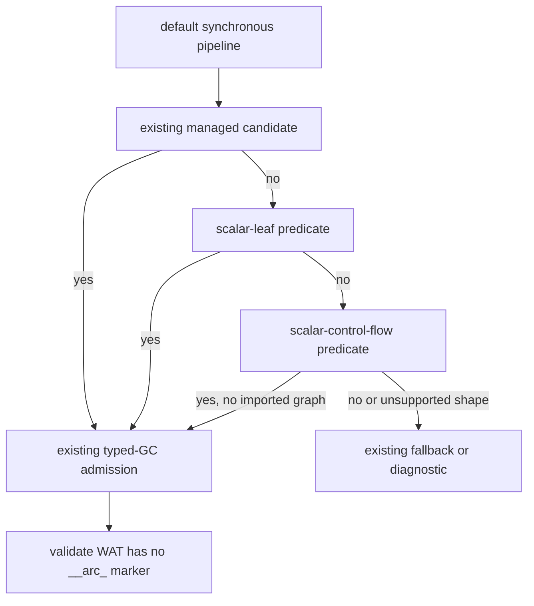

# G5c Restricted Synchronous Scalar Control-Flow Design

## Status

Design for the next bounded implementation slice. It is not implemented and
does not close a migration row.

## Goal

Extend the default typed-GC route from direct scalar returns to a deliberately
small synchronous control-flow subset:

```do
choose(value i32) -> i32 {
    if @eq(value, 0) {
        return 7
    } else {
        return value
    }
}

guard(value i32) -> i32 {
    if @eq(value, 0) return 7
    return value
}

start() {}
```

The generated functions must use Core Wasm scalar locals/results and the
existing `BodyEmitter` branch lowering. No public language syntax changes.

## Current evidence and chosen approach

The scalar-leaf admission already routes direct scalar returns through typed
GC. `src/build/codegen_gc_sync.zig` already contains `emit_if`,
`emit_guard_return`, `else-if` recursion, and branch/guard join markers. The
current gap is admission: `gc_sync_scalar_leaf_body` intentionally rejects an
`if` statement, so the existing emitter is not reached for this shape.

The selected approach is an independent scalar-control-flow admission
predicate in `src/build/codegen_pipeline.zig`. It is evaluated only after the
existing managed candidate and scalar-leaf candidate checks. The predicate
will reuse `gc_sync_scalar_leaf_header`, `find_stmt_end`,
`find_top_level_block_open`, and `find_matching_in_range`; it will not alter
the managed candidate predicate or rewrite the control-flow emitter.



## Admission contract

The new route is admitted only when every non-`start` top-level function meets
all of these conditions:

1. Parameters are named Core Wasm scalar values and the function has exactly
   one Core Wasm scalar result. `start()` remains the existing entry exception.
2. The body is one of the following forms:
   - one `if` with a scalar condition and two scalar-returning branches;
   - one `if`/`else-if` chain with scalar-returning branches and a final
     scalar `else` branch;
   - one guard `if <scalar-condition> return <scalar-expression>` followed by
     one unconditional scalar return.
3. Conditions and return expressions are limited to the exact pure scalar
   expression boundary used by this slice: a scalar identifier, a numeric
   literal, or `@eq(<scalar-atom>, <scalar-atom>)` for a condition. The
   admission scanner must reject managed values, host calls, user-function
   calls, arbitrary producer calls, and unsupported expressions before
   selecting this route.
4. The whole source has no async marker, `@await`, `@cancel`, resource, WIT or
   host binding, managed declaration, loop, `defer`, or recursive function.
5. A `ModuleGraph` with more than one module is rejected for this route. The
   scalar route has no module-qualified call environment and must not resolve a
   child helper against a root helper.

The existing `start()` handling remains unchanged. A non-empty `start` body is
accepted only if the existing GC emitter can prove it is scalar and supported;
otherwise the route fails closed.

## Rejection and fallback contract

The following remain outside this slice and must not produce the new GC marker:

- loops, collection loops, `defer`, recursion, and cross-module calls;
- managed parameters, locals, fields, lists, tuples, unions, resources, or
  producer expressions;
- `@host_func`, `@host_async_func`, WIT declarations, async functions,
  `Future`/`Stream`, and `@await`/`@cancel`;
- multiple results, `nil` result functions, and arbitrary scalar call graphs;
- any malformed or partially parsed branch shape.

For a scalar-control-flow candidate, an
`codegen_gc_sync.is_gc_sync_admission_rejection` result from the emitter may
return `null` from `try_emit_default_gc_sync`, preserving the current fallback
route. A managed candidate must retain its existing behavior: an admitted
managed shape that reaches a GC capability error must not silently fall back.

## Implementation boundary

Only these implementation points may change in this slice:

- `src/build/codegen_pipeline.zig`: add the predicate, route ordering, and
  focused unit tests.
- `examples/gc-p3-runtime/scalar-control-flow.do`: positive fixture.
- `examples/gc-p3-runtime/test_do_gc_scalar_control_flow.sh`: WAT/wasm-tools
  gate.
- `src/build/test/check_gc_default_build_gate.sh`: add the fixture and assert
  GC/no-ARC output.
- current-state docs after verification.

Do not change `doc/grammar.peg`, public intrinsics, ownership types, WIT
descriptors, `codegen_gc_sync.zig` control-flow emission, or the migration
ledger rows.

## Verification and rollback

The focused Zig suite must cover positive `if/else`, `else-if`, and
guard-return admission, plus rejection of loop, `defer`, recursion,
host/WIT, managed, async, and imported-module shapes. The positive fixture
must build through the default route, contain `;; gc-sync`,
`;; gc-root branch_join`, and `;; gc-root guard_join`, contain no `__arc_`,
and parse with `wasm-tools 1.255.0`.

The default fixture manifest rises from 77 to 78 only after the new fixture
and its gate are present. The full regression, release smoke, residual gate,
semantic-equivalence gate, and `git diff --check` must remain green. The
migration inventory is expected to keep its intentional non-zero result:
`complete_rows=15 pending_rows=15`.

If a focused or full gate fails, revert only the scalar-control-flow predicate,
fixture, gate, and documentation additions. Do not weaken an existing test,
remove an existing negative case, change the ARC fallback, or change the
inventory status.

## Non-goals

This slice does not close G5c, switch the whole compiler to GC, admit general
scalar calls or arbitrary expressions, add loop/async/resource lowering, or
introduce `own<T>`, `borrow<T>`, `ref<T>`, `Option`, or `Result` syntax.
