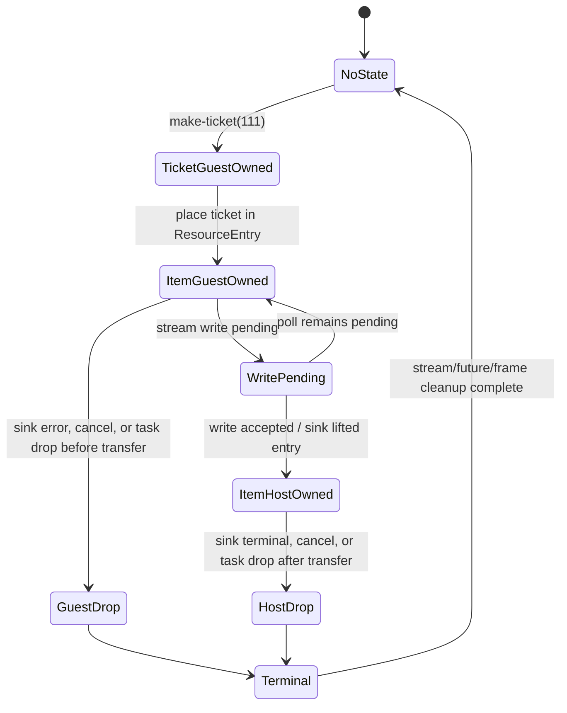

# G6.2 Direct Owned-Record Producer Design

**Status:** Design gate, candidate A selected; implementation is not admitted
until the probe and manifest gates below are green.

**Date:** 2026-08-26

## Decision

Add one private, descriptor-bounded producer shape that transfers exactly one
`resource-entry` containing one `own<ticket>` through a capacity-one stream.
The shape is a lifecycle and ownership probe for a direct record stream. It is
not a general `stream<T>` producer, a list producer, or a public ownership
feature.

The selected candidate is deliberately narrower than the existing batched
`stream<list<resource-entry>>` checkpoint:

| Candidate | Shape | Decision |
| --- | --- | --- |
| A | one fixed `resource-entry` per invocation, one stream write, one lease transfer | **Selected** |
| B | another list/batched producer | Rejected: duplicates the existing list checkpoints and does not isolate direct-record transfer |
| C | generic record/resource producer or arbitrary async lowering | Rejected: scope and proof surface are too large for one gate |

The compiler may recognize only the exact declaration topology and descriptor
defined here. It may emit only the hand-authored fixed template validated by
the probe. It must not infer or lower arbitrary producer expressions.

## Scope boundary

This gate permits:

- one private `do:` descriptor and one private world;
- one `resource-entry` record with exactly one owned `ticket` field;
- one source host function that creates a ticket;
- one asynchronous sink host function that consumes `stream<resource-entry>`;
- one capacity-one stream and one successful or failed write;
- finite test modes for ready, pending, error, cancellation, early drop, and
  sequential repeat;
- exactly-once cleanup assertions for the stream, future/task, frame/waitable
  state, and ticket resource.

This gate does **not** add public `own<T>`, `borrow<T>`, `ref<T>`, pointer, or
lifetime syntax. In the Do source, `own<ticket>` exists only in the WIT
contract; `Ticket` is represented by the existing private
`@wasi_resource(...)` declaration. It also does not admit lists, variants,
borrowed payloads, nested resources, arbitrary async calls, general producer
expressions, root hard-cancel, or D2 filesystem/HTTP methods.

## Pinned WIT contract

The source file for the probe is
`examples/p3-runtime/wit/g6-2-owned-record-producer.wit` and must contain
exactly this text (including the final newline):

```wit
package do:g6-2-owned-record-producer@0.1.0;

interface types {
  enum error-code { io, pipe, invalid-mode }
  resource ticket {}
  record resource-entry { ticket: own<ticket> }
}

interface source {
  use types.{ticket};
  make-ticket: func(seed: u32) -> own<ticket>;
}

interface sink {
  use types.{error-code, resource-entry};
  consume-via-stream: async func(
    data: stream<resource-entry>
  ) -> result<_, error-code>;
}

world owned-record-producer {
  use types.{error-code};
  import source;
  import sink;
  export produce: async func(mode: u32) -> result<_, error-code>;
}
```

The byte SHA-256 of this pinned source is
`6c1406962ee4c4e3eec5b3b4a866acfd1d8eb6ee159ce5b4077df113063d1ace`.
The manifest row must carry this value. A missing, stale, or mismatched hash
fails admission; no compatibility alias is permitted.

The package, interfaces, world, and member names are contract identifiers:

| Item | Exact value |
| --- | --- |
| package | `do:g6-2-owned-record-producer@0.1.0` |
| source interface instance | `do:g6-2-owned-record-producer/source@0.1.0` |
| sink interface instance | `do:g6-2-owned-record-producer/sink@0.1.0` |
| world | `owned-record-producer` |
| source member | `make-ticket` |
| sink member | `consume-via-stream` |
| exported member | `produce` |
| descriptor effect | `record-resource-stream-producer` |

## Exact Do admission

The only accepted Do source is:

```do
make_ticket = @host_func(
    "do:g6-2-owned-record-producer/source@0.1.0",
    "make-ticket",
    (u32) -> Ticket
)

consume = @host_async_func(
    "do:g6-2-owned-record-producer@0.1.0",
    "consume-via-stream",
    (StreamWriter<ResourceEntry>) -> Result<nil, ProducerError>
)

Ticket = @wasi_resource(
    "do:g6-2-owned-record-producer/source/ticket",
    { .id i64 }
)

ResourceEntry {
    .ticket Ticket
}

ProducerError error = Io | Pipe | InvalidMode

produce(mode u32) -> Result<nil, ProducerError> {
    return Ok()
}

start() {}
```

The apparent synchronous `produce` body is a private adapter sentinel. The
registered descriptor supplies the async Component export template; this gate
does not generalize that behavior to ordinary Do functions. The
`@host_async_func` declaration names the result payload, while a call to it
would produce the existing private future shape; the binding itself must not
be rewritten as `Future<Result<...>>`.

Admission is exact: two host bindings, the exact locators/members/signatures,
one resource declaration, one record declaration, one error declaration, one
sentinel `produce`, one `start`, and no `async` token or `@async`, `@await`, or
`@cancel` in the source. Any extra declaration or body statement is rejected
before WAT emission.

## Canonical ABI and layout

The probe must derive and pin the following values in the manifest. The
operation names and arities follow the current Preview-3 component lowering
used by the existing stream-writer checkpoints.

### Record and resource

| Property | Value |
| --- | --- |
| record | `resource-entry` |
| record alignment | 4 bytes |
| record byte size | 4 bytes |
| field | `ticket` |
| field core type | `i32` resource representation |
| field offset | 0 |
| field ownership | `own` |
| resource drop import | `[resource-drop]ticket` |

The source host operation lowers as `(i32) -> (i32)`: a `u32` seed and an owned
ticket handle. The sink operation has the stream handle and task/result state
in its canonical core signature:

| Operation | Core parameters | Core results |
| --- | --- | --- |
| `[stream-new-0]consume-via-stream` | `()` | `i64` handle pair |
| `[stream-write-0]consume-via-stream` | `i32, i32, i32` | `i32` status |
| `[stream-read-0]consume-via-stream` | `i32, i32, i32` | `i32` status |
| `[stream-cancel-read-0]consume-via-stream` | `i32` | `i32` status |
| `[stream-cancel-write-0]consume-via-stream` | `i32` | `i32` status |
| `[stream-drop-readable-0]consume-via-stream` | `i32` | `()` |
| `[stream-drop-writable-0]consume-via-stream` | `i32` | `()` |
| `[async-lower]consume-via-stream` | `i32, i32` | `i32` task status |
| completion | `i32, i32` | `()` |

The manifest records the sink canonical completion as `task-return`, with
`completion_params = ["i32", "i32"]`, and records the stream element as
`resource-entry`. The final probe output, including the generated Core-WAT
SHA-256, is retained as evidence; a different ABI or operation set stops the
gate rather than being silently adapted.

### Capacity and fixed producer sequence

- stream capacity is exactly `1`;
- each valid invocation creates exactly one ticket with seed `111`;
- each valid invocation attempts at most one stream write;
- no list allocation, dynamic count, second item, or batch field exists;
- `mode = 255` is invalid and creates neither ticket nor stream.

The `produce` export is async in the WIT world but remains a private template
route. The Do source does not gain general async lowering from this exception.

## Ownership state machine

Ownership changes only at the successful stream-write transfer boundary:



The guest clears its owned slot only after the write reports successful
transfer. A pending write does not transfer ownership. A sink that never lifts
the item cannot cause a host drop. Conversely, once the sink lifts the item,
the guest must never call the ticket drop import for that handle; the host
side owns and drops it exactly once. Stream and task/future leases are dropped
exactly once on every terminal path. Cancellation is cleanup-only and never
claims to roll back an external effect already observed by the sink.

## Mode and lifecycle matrix

The Rust/Wasmtime runner uses the following private mode values and asserts
both observations and cleanup counts:

| Mode | Sink behavior | Expected item observation | Ticket owner at terminal |
| --- | --- | --- | --- |
| `ready` (`0`) | consume and complete `Ok` immediately | `[111]` | host, then one host drop |
| `pending` (`1`) | return `Pending` once, then consume and complete `Ok` | `[111]` after one pending poll | host, then one host drop |
| `sink-error-before` (`2`) | complete `Err(io)` without reading | `[]` | guest, then one guest drop |
| `sink-error-after` (`3`) | read one item, then complete `Err(pipe)` | `[111]` | host, then one host drop |
| `cancel-before-transfer` (`4`) | remain pending; cancel before write acceptance | `[]` | guest, then one guest drop |
| `cancel-after-transfer` (`5`) | accept item, keep terminal pending; cancel after transfer | `[111]` | host, then one host drop |
| `early-drop-before-transfer` (`6`) | remain pending; drop the producer task/future before write | `[]` | guest, then one guest drop |
| `early-drop-after-transfer` (`7`) | accept item; drop task/future before completion | `[111]` | host, then one host drop |
| `repeat` (`8`) | run `ready` twice sequentially in one instance | `[111]`, `[111]` | each invocation independently drops once |
| invalid (`255`) | reject mode before producer setup | `[]` | no resource exists |

Every valid row must assert:

- one stream creation and one stream lease cleanup;
- one task/future creation and one task/future cleanup;
- one ticket creation and exactly one ticket drop (per invocation);
- no duplicate drop, leaked handle, or non-empty `ResourceTable`;
- no third write and no malformed record payload.

The `repeat` row additionally proves that private storage, waitables, and
resource tables are reusable after the first terminal. It must not rely on a
fresh `Store` to hide a leak.

## Negative boundary and fail-closed rules

The analyzer and WAT route must reject before emission when any of the
following changes:

- `StreamWriter<[ResourceEntry]>`, `StreamWriter<OtherEntry>`, a borrowed
  record, a variant, a list, or an option appears in the sink parameter;
- `ResourceEntry` has a missing, extra, reordered, nested, or non-owned field;
- `Ticket` uses a different resource path, field layout, or annotation;
- source/sink locator, package, world, member, version, or WIT hash drifts;
- `make-ticket` is async, has a different parameter/result, or is duplicated;
- `consume` is synchronous, has a different result, or is duplicated;
- `produce` contains any statement other than `return Ok()` or changes its
  parameter/result shape;
- a second top-level function, intrinsic, helper, dynamic count, arbitrary
  expression, or independent child task is introduced;
- the canonical stream/task/drop import names, arities, completion mode,
  record size, or stream capacity differ from the pinned manifest row.

These rejections preserve the boundary between this proof and the still
pending general producer, borrowed payload, and async/resource work.

## Probe and promotion gates

The execution order is fixed:

1. Add the WIT source and assemble a hand-authored Core-WAT/component using
   `wasm-tools 1.255.0`; validate the component and record the source and
   generated-artifact hashes.
2. Run the Rust/Wasmtime lifecycle runner with Rust/Cargo `1.97.1` and
   Wasmtime `47.0.2` for every matrix row. Preserve failures verbatim and stop
   on any ABI, validation, ownership, or cleanup mismatch.
3. Only after the probe is green, add one manifest descriptor row and the
   exact sema admission predicate. No default route is widened before this
   row is pinned.
4. Add the isolated emitter/template, positive and negative Do fixtures, and
   Component gate. The generated output must match the pinned descriptor and
   contain no ARC retain/release operations.
5. Run the ARC/GC semantic-equivalence row, the full regression, the default
   GC gate, ReleaseSmall build, release smoke, and `git diff --check`.
6. Promote the row only if the complete matrix remains green and the
   `ResourceTable` is empty for every terminal path. Otherwise leave the row
   private and fail closed.

The required toolchain for this gate is fixed to Zig `0.16.0`,
`wasm-tools 1.255.0`, Rust/Cargo `1.97.1`, and Wasmtime `47.0.2`. A toolchain
upgrade is a separate explicitly reviewed change; this design does not add a
compatibility path for older versions.

## Non-goals and follow-up boundary

Passing this gate proves only direct single-record owned transfer and its
lifecycle. It does not close the G6.2 migration inventory, enable general
`own<T>`/`borrow<T>`/`ref<T>`, or justify promotion of list, variant, borrowed,
nested, arbitrary-expression, or unrestricted async lowering. Those capabilities
require separate design gates with their own manifest, ABI, negative, and
exactly-once cleanup evidence.
