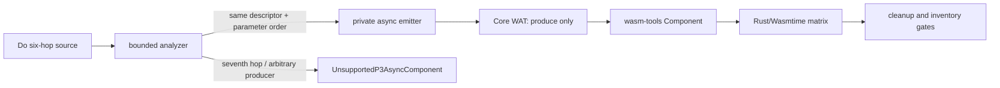

# G6.2 Parameterized Forwarding Six-Hop Design

> 状态：已获本阶段执行授权；实现仍须经过正负测试、Component、Rust/Wasmtime 与全量门禁。

## 目标

在现有私有 `StreamWriter<u8>` 参数化 producer 能力上增加**第六个
forwarding helper edge**。保持同一个 descriptor、同一个 WIT world、同一组
typed 参数和同一套 lease/cleanup 语义；这只是 bounded capability promotion，
不等价于通用 async-call lowering。

## 现状证据

- G5c residual matrix 的 15 个 row 仍为 `complete_rows=15 pending_rows=15`，
  当前没有第二个满足 admission contract 的同步 exact descriptor。
- G6.2 参数化 producer 已验证到五跳；第六跳 fixture 当前在 analyzer/WAT 前以
  `UnsupportedP3AsyncComponent` 拒绝。
- 当前工具链固定为 Zig `0.16.0`、`wasm-tools 1.255.0`、Wasmtime `47.0.2`。
- 当前 compiler 常量
  `src/build/codegen_component_async_plan.zig` 中的
  `max_parameterized_forwarding_hops` 为 `5`。

## 精确 source surface

正向 fixture 必须保留以下结构：

```text
produce(count u64, value u8)
  -> outer_stream
  -> extra_stream
  -> entry_stream
  -> forward_stream
  -> middle_stream
  -> inner_stream
  -> finish_stream
```

这里的六跳是 `outer_stream` 到 `finish_stream` 的六个 helper transfer；root
`produce` 到首个 helper 的绑定不计入 forwarding-hop 上限。每个 helper 只能把
`(writer, count, value)` 按原顺序传给下一个 helper，并 await 同一个
`Result<nil, ProbeError>`。`finish_stream` 负责 bounded countdown、`defer
close(writer)` 和一次 `sink_write(writer)`。

WIT surface 仍为现有：

```wit
package do:stream-probe@0.1.0;

interface sink {
  enum error-code { io, illegal-byte-sequence, pipe }
  write-via-stream: async func(data: stream<u8>) -> result<_, error-code>;
}

world stream-writer-probe {
  import sink;
  use sink.{error-code};
  export produce: async func(count: u64, value: u8) -> result<_, error-code>;
}
```

不得为第六跳新增 descriptor、WIT member 或新的 public syntax。

## Admission 与代码生成边界

1. `max_parameterized_forwarding_hops` 只从 `5` 增至 `6`。
2. analyzer 仍要求 writer/count/value 三种参数各出现一次，且 helper call 的
   参数顺序与声明的 `parameter_order` 完全一致。
3. 只允许静态、可枚举的 helper chain；第七跳、循环调用、任意 producer
   expression 和未注册 host call 继续 fail-closed。
4. helper 仍是内部 lowering 节点；Component 只导出 `[async-lift]produce`，不导出
   `outer_stream`、`extra_stream`、`entry_stream`、`forward_stream`、
   `middle_stream`、`inner_stream` 或 `finish_stream`。
5. canonical async core type、result area、source/WIT/manifest provenance 必须
   与五跳 descriptor 一致。现有 frame offset `52/60` 只能作为待复测的期望值，
   不能未经 probe 直接写入新契约。

## Lease、错误与取消语义

- `StreamWriter<u8>` 在 chain 中只发生一次逻辑 transfer；任何 helper 都不能在
  transfer 前写入、关闭或复制 lease。
- `finish_stream` 的每次 write、sink error、正常完成和 drop 都只允许一次终态
  cleanup；错误按现有 `Result<nil, ProbeError>` 传播。
- pending/ready/error/cancel/early-drop 的内部状态清理必须 exactly once；取消
  只清理 guest/host state，不回滚已经发生的外部写入。
- 运行时完成后 `ResourceTable` 必须为空，host callback 次数与 stream drop 次数
  必须保持一比一。

## 验收与回滚

验收包含：

1. analyzer 正向接受六跳，负向拒绝七跳；现有任意 producer、borrowed、variant
   和通用 list 负例不变。
2. WAT 只有 `produce` export、无 `(ref` crossing、保留 span guard 和 cleanup
   顺序。
3. pinned `wasm-tools` parse/embed/component-new/validate 通过。
4. Rust/Wasmtime 覆盖 `count=0/1/3`、`value=90`、pending/ready/error，以及
   cancellation/early-drop 的 lease 与资源计数不变量。
5. 全量回归、ReleaseSmall、release smoke 和 migration inventory 门禁通过；
   inventory 仍保持 deliberate exit `1`。

任一 focused、Component、Rust/Wasmtime 或 cleanup gate 失败，立即保留上限 `5`
和第六跳负例；不得通过放宽断言或扩大其它 capability 来绕过失败。

## 非目标

- 不做任意深度或通用 async-call lowering。
- 不开放通用 aggregate/list、borrowed/owned/variant producer。
- 不新增公开 `own<T>`、`borrow<T>`、`ref<T>`、`Option` 或 `Result` 语义。
- 不推进 D2 通用 filesystem/HTTP async。
- 不进行 full GC cutover，也不关闭任何 G5c migration row。

## 数据流


