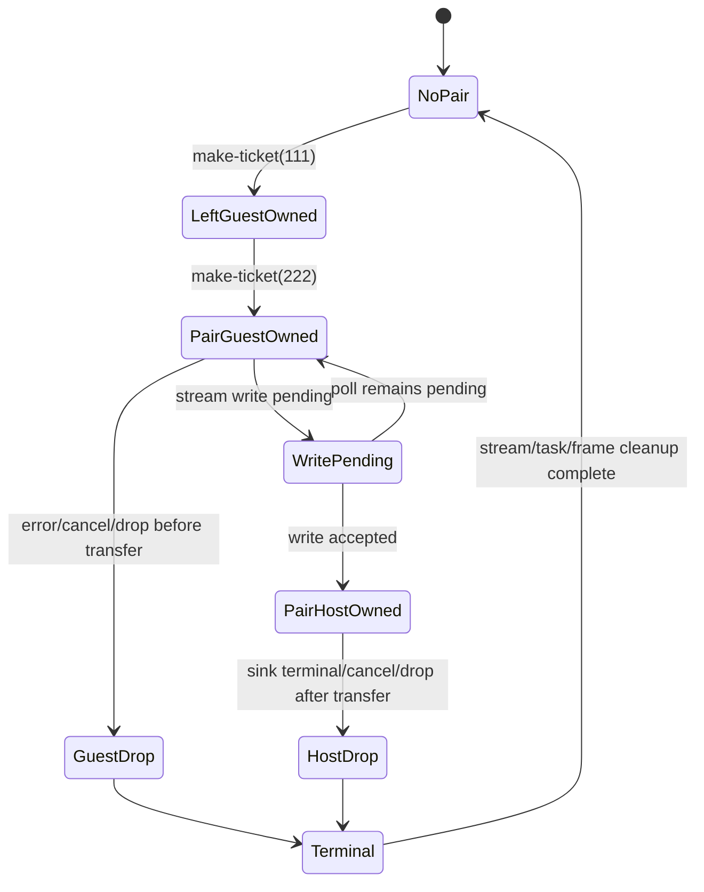

# G6.2 Two-Owned-Field Record Producer Design

> 状态：设计候选；实现前需要单独的 spec review 与执行计划批准。
> 本文只定义一个私有、固定形状的 Component gate，不开放通用 producer 或
> public ownership syntax。

## 目标与当前证据

当前已关闭的 `do:g6-2-owned-record-producer@0.1.0` 只证明了
`stream<record { ticket: own<ticket> }>` 的单资源 producer：一条记录、一次
写入、转移前后取消/早退和 exactly-once drop 均有 Component/Rust/Wasmtime
证据。已有 `do:record-resource-stream-multi@0.1.0` 和
`do:record-resource-stream-multiple-nested@0.1.0` 则证明了两个 `own<ticket>`
字段在 consumer 侧可被解析为两个 4-byte handle slot，但尚未证明 producer
侧的原子转移与双资源清理。

本 gate 的目标是补上这一个明确缺口：在全新的私有 descriptor 中，把两个
owned resource 放入同一个直接 stream record，并验证记录写入是原子的。它
不把现有单字段 emitter 改成任意 record emitter，也不改变默认 `do build`
路由。

## 方案选择

### A：固定两字段 producer（采用）

增加一个新的 private descriptor，记录固定为
`{ left: own<ticket>, right: own<ticket> }`，capacity 固定为 `1`，每次调用
最多写入一条记录。producer 通过同一个 `make-ticket(u32)` import 创建 seed
`111` 和 `222` 两个 ticket，然后一次性提交记录。正向 gate 覆盖 ready、一次
pending、sink error（转移前/后）、cancel（转移前/后）、task early-drop
（转移前/后）、repeat 和 invalid。

这是推荐方案，因为它复用已有的 multi-owned consumer layout 证据，只新增
producer 的原子 ownership boundary；影响面可以由一个新 descriptor、一个新
emitter 和一组独立 gates 封闭。

### B：继续增加 forwarding hop

仅将静态 helper forwarding 上限从六跳提高到七跳。该方案几乎没有 ABI 新证据，
只会扩大人为深度上限，不能验证资源记录的多字段转移，故不作为下一 gate。

### C：开放 generic producer/lease

直接允许任意 producer expression、通用 record/list 和可组合 lease。该方案需要
新的通用 IR、layout、ownership transfer、取消和跨任务契约；当前工具链与
inventory 仍明确把它列为 pending。它不属于一个可独立核验的 bounded gate，
本阶段拒绝。

## 精确 WIT surface

实现阶段必须创建
`examples/p3-runtime/wit/g6-2-owned-record-pair-producer.wit`，内容固定为
以下文本（含最后换行）：

```wit
package do:g6-2-owned-record-pair-producer@0.1.0;

interface types {
  enum error-code { io, pipe, invalid-mode }
  resource ticket {}
  record resource-pair {
    left: own<ticket>,
    right: own<ticket>,
  }
}

interface source {
  use types.{ticket};
  make-ticket: func(seed: u32) -> own<ticket>;
}

interface sink {
  use types.{error-code, resource-pair};
  consume-via-stream: async func(
    data: stream<resource-pair>
  ) -> result<_, error-code>;
}

world owned-record-pair-producer {
  use types.{error-code};
  import source;
  import sink;
  export produce: async func(mode: u32) -> result<_, error-code>;
}
```

The byte SHA-256 of this exact source (including its final newline) is
`89345a5213936735d7f065cd54ed42b83d159b80305a1a900ae00df2e811704d`. The
implementation gate must recompute this hash and store the same value in the new
manifest row. A missing or mismatched hash is an admission error, not a reason to
silently regenerate the descriptor.

The package, instances, world, and members are contract identifiers:

| Item | Exact value |
| --- | --- |
| package | `do:g6-2-owned-record-pair-producer@0.1.0` |
| source Component instance | `do:g6-2-owned-record-pair-producer/source@0.1.0` |
| sink Component instance | `do:g6-2-owned-record-pair-producer/sink@0.1.0` |
| source Do host locator | `do:g6-2-owned-record-pair-producer/source@0.1.0` |
| sink Do host locator | `do:g6-2-owned-record-pair-producer@0.1.0` |
| world | `owned-record-pair-producer` |
| source member | `make-ticket` |
| sink member | `consume-via-stream` |
| exported member | `produce` |
| descriptor effect | `record-resource-pair-stream-producer` |

## Exact Do admission

The positive source file is
`examples/p3-runtime/g6-2-owned-record-pair-producer.do` and has this exact
shape:

```do
make_ticket = @host_func("do:g6-2-owned-record-pair-producer/source@0.1.0", "make-ticket", (u32) -> Ticket)
consume = @host_async_func("do:g6-2-owned-record-pair-producer@0.1.0", "consume-via-stream", (StreamWriter<ResourcePair>) -> Result<nil, ProducerError>)
Ticket = @wasi_resource("do:g6-2-owned-record-pair-producer/source/ticket", { .id i64 })
ResourcePair {
    .left Ticket
    .right Ticket
}
ProducerError error = Io | Pipe | InvalidMode

produce(mode u32) -> Result<nil, ProducerError> {
    return Ok()
}

start() {}
```

The apparent synchronous `produce` body is a private adapter sentinel, exactly as
in the single-field producer. The registered descriptor supplies the async export
template; this exception must not make ordinary Do functions implicitly async.

Admission is fail-closed and exact:

- exactly two host bindings, one `@host_func` source and one `@host_async_func` sink;
- exactly one `@wasi_resource`, one `ResourcePair` record, one error declaration,
  one sentinel `produce`, and one `start`;
- exactly two record fields, in the order `.left Ticket` then `.right Ticket`;
- no `async` declaration token and no `@async`, `@await`, or `@cancel` intrinsic;
- no list, variant, nested record, borrowed field, extra host binding, or extra
  top-level declaration;
- source and sink Do host locator/member/signature must match the host-locator
  rows above byte-for-byte. The generated sink Component import uses the separate
  sink-instance row; this follows the existing manifest convention and is not an
  alias or compatibility route.

The compiler must use a separate lowering-shape variant and separate emitter module
for this descriptor. Reusing a generic “any record with owned fields” predicate is
out of scope.

## Canonical ABI and layout gate

The pinned manifest row must be derived from the actual WIT/Component probe, not from
these expected values. The following are the intended acceptance facts:

| Property | Required value |
| --- | --- |
| stream element | `resource-pair` |
| record alignment | 4 bytes |
| record byte size | 8 bytes |
| `left` core field | `i32` at offset 0 |
| `right` core field | `i32` at offset 4 |
| field ownership | `own` for both fields |
| resource | `ticket` for both fields |
| drop import | `[resource-drop]ticket` for both fields |
| stream capacity | 1 |
| source core signature | `(i32) -> (i32)` |

The sink stream operation set must remain the operation set measured for the existing
direct owned-record producer (`stream-new`, `stream-write`, `stream-read`, both
stream cancellation operations, both stream drop operations, async-lower and
task-return). If the current `wasm-tools` or Wasmtime produces another signature,
the gate stops and records the observed ABI; it must not adapt silently.

The canonical import must contain no Wasm GC reference type. The record crosses the
Component boundary as canonical resource handles in linear memory; Do source still
has no public `own<T>`, `borrow<T>`, `ref<T>`, pointer, or lifetime syntax.

The producer template must keep an ownership-presence bitmask separate from the two
handle words. A resource-table representation of `0` is valid, so `left == 0` or
`right == 0` must never be used as an absence test. Bit `0` means the left handle is
guest-owned, bit `1` means the right handle is guest-owned, and bit `2` means the
complete pair has transferred to the stream/host. The mask is cleared only after the
corresponding drop or successful pair transfer.

## Producer sequence and ownership state machine

For every valid non-repeat invocation, the fixed template performs this sequence:

1. reject mode `255` before allocating a stream or ticket;
2. create `left` with `make-ticket(111)`;
3. create `right` with `make-ticket(222)`;
4. place both handles in the 8-byte record slot and set ownership bits `0|1`;
5. create a capacity-one stream and start the sink task;
6. perform at most one stream write of the complete record;
7. clear both guest-owned slots and set the transferred bit only after the write
   reports successful transfer;
8. finalize the sink task, stream ends, waitable and frame exactly once.

The write is atomic from the ownership contract's perspective: there is no valid
state in which `left` is host-owned while `right` remains guest-owned. A pending or
failed write transfers neither field. A successful write transfers both fields.



If the second `make-ticket` fails, the first ticket is released before any stream
creation. If stream creation or sink start fails, the ownership mask drops every set
guest bit in reverse field order (`right`, then `left`), including a valid zero
handle representation. A successful transfer forbids guest-side ticket drops; the
host lifts and drops both handles exactly once.
Cancellation cleans up guest/host state and never claims rollback of an external
effect already observed by the sink.

## Runtime lifecycle matrix

The Rust/Wasmtime runner must use one Store per matrix invocation except for the
`repeat` row, which intentionally reuses one Store and ResourceTable. The sink
records the seeds in receive order and counts callbacks, stream drops, task/future
drops, ticket drops, pending polls, cancellation calls, and table emptiness.

| Mode | Sink behavior | Expected received seeds | Ticket owner at terminal |
| --- | --- | --- | --- |
| `ready` (`0`) | consume and complete `Ok` | `[111, 222]` | host, then two host drops |
| `pending` (`1`) | pending once, then consume/`Ok` | `[111, 222]` | host, then two host drops |
| `sink-error-before` (`2`) | `Err(io)` without reading | `[]` | guest, two guest drops |
| `sink-error-after` (`3`) | read pair, then `Err(pipe)` | `[111, 222]` | host, two host drops |
| `cancel-before-transfer` (`4`) | stay pending; cancel before write | `[]` | guest, two guest drops |
| `cancel-after-transfer` (`5`) | accept pair; remain pending; cancel | `[111, 222]` | host, two host drops |
| `early-drop-before-transfer` (`6`) | stay pending; drop task/future | `[]` | guest, two guest drops |
| `early-drop-after-transfer` (`7`) | accept pair; drop task/future | `[111, 222]` | host, two host drops |
| `repeat` (`8`) | run `ready` twice in one Store | `[111,222,111,222]` | each pair drops two handles |
| `invalid` (`255`) | reject before setup | `[]` | no tickets or stream |

Every valid invocation must assert one stream creation/cleanup, one sink task/future
creation/cleanup, two ticket creations and exactly two ticket drops, no duplicate
drop, no leaked handle, no third write, and an empty `ResourceTable`. `repeat` must
observe four creations and four drops without relying on Store disposal to hide a
leak. The `invalid` row must observe zero resource creation, zero sink callback and
zero drop.

## Negative boundary

The Do negative suite must reject before WAT and preserve the diagnostic
`UnsupportedP3AsyncComponent` for:

- the old single-field descriptor or locator with the new two-field record;
- reversed field order, a third field, a scalar field, nested record or list field;
- `borrow<ticket>` in either field or any borrowed stream/future payload;
- wrong source seed signature, wrong sink result, wrong host binding kind, or a
  second source/sink binding;
- mode/body changes, an `async` token, `@async`, `@await`, or `@cancel` in the
  sentinel source;
- seventh forwarding hop, arbitrary producer expression, generic list/variant,
  and unregistered descriptors.

No negative test may be weakened merely to accommodate a different template.

## Required gates and evidence

The implementation plan must create separate commands for:

1. WIT source hash, `wasm-tools parse/embed/component new/validate`, and canonical
   Core-WAT ABI assertions;
2. Do positive admission/WAT and all negative boundary fixtures;
3. Rust/Wasmtime lifecycle rows above, including exactly-once cleanup and empty
   `ResourceTable`;
4. a canonical-vs-generated Component lifecycle equivalence run, kept separate from
   the ARC/GC semantic-equivalence row count;
5. compiler unit tests, full `run_tests.sh`, ReleaseSmall, release smoke, and the
   migration inventory's deliberate `complete_rows=15 pending_rows=15` exit `1`.

The pinned toolchain for this gate is Zig `0.16.0`, `wasm-tools 1.255.0`, Rust/Cargo
`1.97.1`, and Wasmtime `47.0.2`. Use project-local temporary/cache paths when the
default `/tmp` quota fails; record the environment rather than changing the gate's
default behavior.

## Rollback and non-goals

If any ABI, Component, runtime, or cleanup gate fails, retain the new descriptor as
unadmitted (or remove only the new candidate files in the same change) and keep the
single-field producer route unchanged. Do not widen the existing effect predicate,
raise forwarding depth, or add compatibility aliases.

This design does not:

- open generic producer/lease inference or arbitrary producer expressions;
- add public `own<T>`, `borrow<T>`, `ref<T>`, `Option`, or `Result` syntax;
- admit borrowed, list, variant, nested, or mixed scalar/resource producer records;
- implement independent guest child tasks, general filesystem/HTTP async, or root
  hard-cancel;
- close any G5c migration row or claim full GC cutover.
