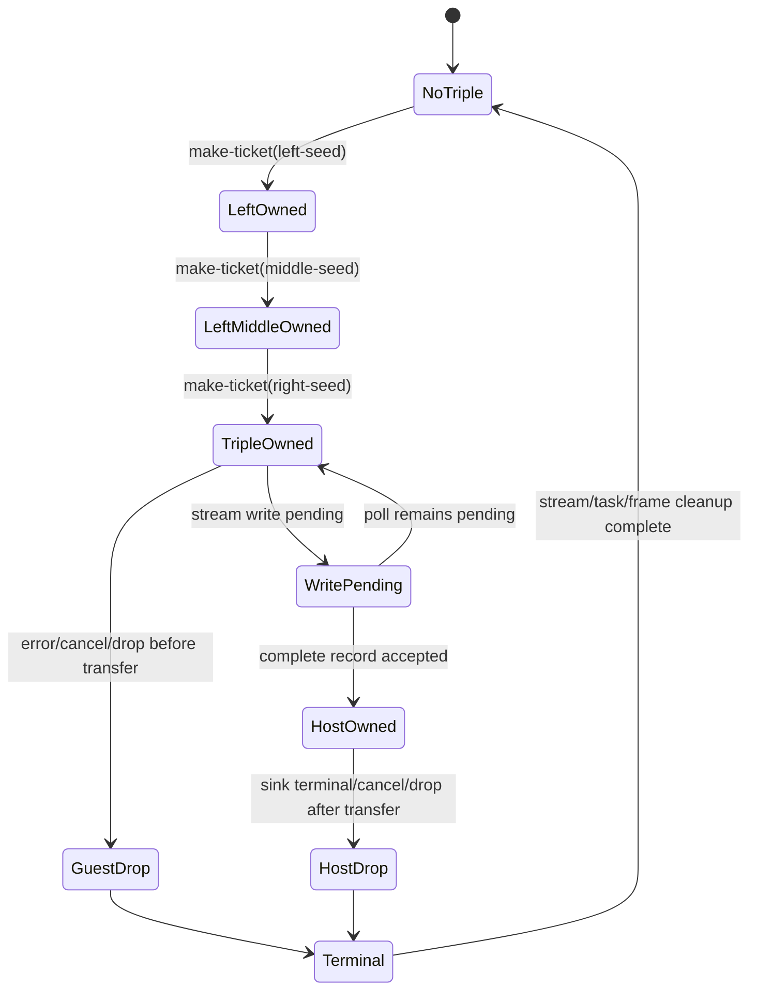

# G6.2 Fixed Three-Owned-Field Record Producer Probe

> 状态：design/probe only。本文不授权修改 `do` 语法、manifest registry 或
> compiler lowering；只有本文的 canonical ABI 与生命周期 probe 全部通过后，
> 才能另立实现计划并请求明确批准。

## 目标与非目标

本阶段验证一个比已关闭 pair route 多一个顶层 owned resource field 的固定
Component shape：

```text
ResourceTriple {
    left: own<ticket>,
    middle: own<ticket>,
    right: own<ticket>,
}
```

producer 接收四个 `u32` words：`mode`、`left-seed`、`middle-seed` 和
`right-seed`，依次调用 source `make-ticket`，向 capacity-one
`stream<resource-triple>` 写入一个完整 record，再等待 sink terminal。

本 probe 不做以下任何事情：

- 不新增或修改 `src/build/p3_async_manifest.zig`、`p3_async_registry.json`；
- 不新增 `do` fixture、`@host` admission 或 compiler-generated Component route；
- 不开放 generic producer、arbitrary producer expression、nested producer、
  borrowed/list/variant payload 或 public `own<T>`/`borrow<T>`/`ref<T>` syntax；
- 不改变 `complete_rows=15 pending_rows=15`，也不宣称 ARC/GC migration 完成。

## 方案裁定

| 方案 | 处理方式 | 结论 |
| --- | --- | --- |
| A | 固定三字段 `ResourceTriple`，四个独立 `u32` 输入，单独 WIT/WAT/Rust probe | **采用**；只扩展已测量的顶层 mask/layout 不变量，影响面可隔离 |
| B | 固定 nested owned record，例如 `Outer { inner: ResourcePair }` | 暂缓；会同时引入递归 offset、递归 cleanup 和嵌套 transfer 顺序，不能把失败归因到字段计数 |
| C | 通用 `record<own<T>>` producer 或 generic seed 列表 | 拒绝本阶段；需要通用 IR、类型实例化、escape/ownership 和 async cancellation 契约 |

## 精确 WIT surface

文件：`examples/p3-runtime/wit/g6-2-owned-record-triple-producer.wit`。

```wit
package do:g6-2-owned-record-triple-producer@0.1.0;

interface types {
  enum error-code { io, pipe, invalid-mode }
  resource ticket {}
  record resource-triple {
    left: own<ticket>,
    middle: own<ticket>,
    right: own<ticket>,
  }
}

interface source {
  use types.{ticket};
  make-ticket: func(seed: u32) -> own<ticket>;
}

interface sink {
  use types.{error-code, resource-triple};
  consume-via-stream: async func(
    data: stream<resource-triple>
  ) -> result<_, error-code>;
}

world owned-record-triple-producer {
  use types.{error-code};
  import source;
  import sink;
  export produce: async func(
    mode: u32,
    left-seed: u32,
    middle-seed: u32,
    right-seed: u32
  ) -> result<_, error-code>;
}
```

The WIT source is byte-pinned by the probe script. Its SHA-256 is
`73fd57dc8f34f13023b48f2b82e439b212eab52192886f0d07a37d86e63658b1`; a missing
or changed hash stops the probe. Contract identifiers are fixed:

| Item | Exact value |
| --- | --- |
| package | `do:g6-2-owned-record-triple-producer@0.1.0` |
| source instance | `do:g6-2-owned-record-triple-producer/source@0.1.0` |
| sink instance | `do:g6-2-owned-record-triple-producer/sink@0.1.0` |
| world | `owned-record-triple-producer` |
| source member | `make-ticket` |
| sink member | `consume-via-stream` |
| export member | `produce` |

## Canonical ABI hypothesis to measure

The hand-written canonical WAT must prove or falsify each item; the probe must not
silently adapt to a different result.

| Property | Required value |
| --- | --- |
| stream element | `resource-triple` |
| record alignment | 4 bytes |
| record byte size | 12 bytes |
| `left` core field | `i32` at offset 0 |
| `middle` core field | `i32` at offset 4 |
| `right` core field | `i32` at offset 8 |
| field ownership | `own` for all three fields |
| resource | `ticket` for all three fields |
| stream capacity | 1 |
| source core signature | `(i32) -> (i32)` |
| producer input words | `(i32 mode, i32 left-seed, i32 middle-seed, i32 right-seed)` |
| canonical boundary | no Wasm GC reference type |

The record slot begins at linear-memory offset `64`; frame layout and async imports
may reuse the proven pair probe. The three handle words are independent from the
mask and must not use handle value `0` as absence.

## Ownership state machine

Mask bits are `left=1`, `middle=2`, `right=4`, and `transferred=8`.



Required invariants:

1. Mode `255` is rejected before stream, task, or ticket allocation.
2. Seeds are passed to `make-ticket` in exact order left, middle, right.
3. The guest sets bits `1|2|4` only after each corresponding handle is stored.
4. A successful complete-record write clears bits `1|2|4` and sets bit `8` as one
   ownership transition; a pending or failed write transfers none.
5. Before transfer, cleanup drops `right`, then `middle`, then `left`.
6. After transfer, guest cleanup drops no ticket; the host drops all three exactly
   once.
7. If a source call fails, only handles whose bits are set are dropped in reverse
   field order. A zero handle remains a valid owned handle when its bit is set.

## Runtime lifecycle matrix

The Rust/Wasmtime runner uses one Store per row except `repeat`, which invokes the
export twice on one Store and `ResourceTable`.

| Mode | Inputs `(left,middle,right)` | Sink behavior | Expected received seeds |
| --- | --- | --- | --- |
| `ready` (`0`) | `(111, 222, 333)` | consume and complete `Ok` | `[111, 222, 333]` |
| `pending` (`1`) | `(0, 4294967295, 1)` | pending once, then consume/`Ok` | `[0, 4294967295, 1]` |
| `sink-error-before` (`2`) | `(444, 555, 666)` | `Err(io)` without reading | `[]` |
| `sink-error-after` (`3`) | `(777, 888, 999)` | read triple, then `Err(pipe)` | `[777, 888, 999]` |
| `cancel-before-transfer` (`4`) | `(1001, 1002, 1003)` | stay pending; cancel before write | `[]` |
| `cancel-after-transfer` (`5`) | `(2001, 2002, 2003)` | accept triple; remain pending; cancel | `[2001, 2002, 2003]` |
| `early-drop-before-transfer` (`6`) | `(3001, 3002, 3003)` | stay pending; drop task/future | `[]` |
| `early-drop-after-transfer` (`7`) | `(4001, 4002, 4003)` | accept triple; drop task/future | `[4001, 4002, 4003]` |
| `repeat` (`8`) | `(111,222,333)` then `(444,555,666)` | run `ready` twice in one Store | `[111,222,333,444,555,666]` |
| `invalid` (`255`) | `(9, 10, 11)` | reject before setup | `[]` |

Every valid invocation must create and drop exactly three tickets, one stream,
one sink task/future, and leave `table-empty=true`; `repeat` must observe `6/6`
ticket creation/drop. `invalid` must observe zero creation, callback, poll,
cancel, drop, and completion events. The four cancel/early-drop modes must each
record one host-task cancel and one pending-future drop with zero future completion.

## Admission gate and stop conditions

This probe is admitted only if all of the following are independently observable:

- the WIT hash and all package/world/member identifiers match exactly;
- `wasm-tools 1.255.0` parses, embeds, assembles, and validates the Component;
- the canonical WAT exposes 12-byte layout markers, offsets `0/4/8`, four input
  words, and no `__arc_` or Wasm GC reference at the canonical boundary;
- all ten lifecycle rows match received seed order, ownership cleanup counters,
  future/stream/task counters, and an empty `ResourceTable`;
- any mismatch stops the candidate and records the measured result in
  `doc/pending_blocked.md` without changing the existing pair route.

If every check passes, this file becomes evidence for a separate implementation
plan. It does not authorize a manifest row, compiler dispatch, generated Do
fixture, or public ownership syntax. Those require explicit design approval first.
