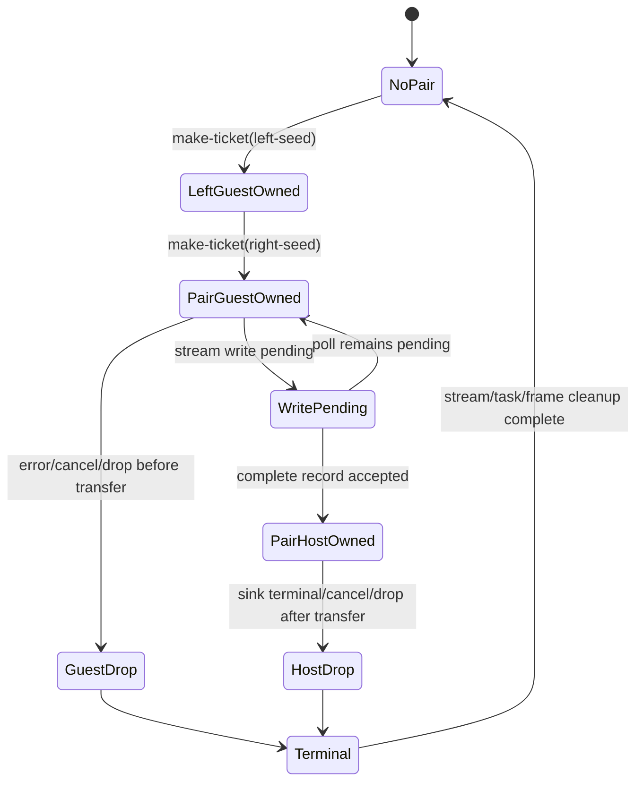

# G6.2 Parameterized Two-Owned-Field Record Producer Design

> 状态：下一阶段设计。本文只定义一个新的、私有且固定形状的 Component
> gate；它不会修改已经关闭的静态双字段 producer descriptor。

## 目标与边界

现有 `do:g6-2-owned-record-pair-producer@0.1.0` 已证明固定 seed
`111/222` 的 `stream<record { left: own<ticket>, right: own<ticket> }>` producer
生命周期。下一阶段只增加一个独立 descriptor，让两个 ticket seed 成为显式
`u32` 输入，验证参数值经过 source host import、record 写入和 sink 接收的完整
数据流，同时保持现有双资源 ownership contract 不变。

新 descriptor 为
`do:g6-2-owned-record-pair-parameterized-producer@0.1.0`。它仍是 private
bounded route，不开放通用 producer、generic inference、任意 producer
expression、公共 `own<T>`/`borrow<T>`/`ref<T>`、`Option`/`Result` 语法或全局 GC
切换。旧 descriptor 的 WIT hash、manifest row、Do fixture、emitter 和 gate
必须保持可独立运行。

本设计采用当前工具链边界：Zig `0.16.0`、`wasm-tools 1.255.0`、Rust/Cargo
`1.97.1`、Wasmtime `47.0.2`。如果 probe 产生不同的 canonical signature、
stream operation set 或 ownership 行为，必须记录实际结果并停止本 gate；不得
静默修改设计以适配未测量的 ABI。

## 方案选择

| 方案 | 做法 | 结论 |
| --- | --- | --- |
| A | 新建独立 descriptor，`produce(mode, left-seed, right-seed)` 接收两个独立 seed，复用已测量的 8-byte pair layout | **采用**；能证明真实参数数据流，旧 hash 不变，影响面可隔离 |
| B | 只接收 `seed-base`，由 producer 派生第二个 seed | 不采用；ABI 较小，但不能证明两个独立输入，也掩盖参数顺序/传递错误 |
| C | 直接开放任意 `record<own<T>>` producer 或 generic seed 列表 | 不采用；需要通用 IR、layout、ownership transfer 和取消契约，不是 bounded slice |

## 精确 WIT surface

实现必须创建以下文件内容（含最后换行）：
`examples/p3-runtime/wit/g6-2-owned-record-pair-parameterized-producer.wit`。

```wit
package do:g6-2-owned-record-pair-parameterized-producer@0.1.0;

interface types {
  enum error-code { io, pipe, invalid-mode }
  resource ticket {}
  record resource-pair {
    left: own<ticket>,
    right: own<ticket>,
  }
}

interface source {
  use types.{ticket};
  make-ticket: func(seed: u32) -> own<ticket>;
}

interface sink {
  use types.{error-code, resource-pair};
  consume-via-stream: async func(
    data: stream<resource-pair>
  ) -> result<_, error-code>;
}

world owned-record-pair-parameterized-producer {
  use types.{error-code};
  import source;
  import sink;
  export produce: async func(
    mode: u32,
    left-seed: u32,
    right-seed: u32
  ) -> result<_, error-code>;
}
```

The source hash for this exact byte sequence is
`e7abd3cf7b7543325865a0b4be4b32ae50a2470ac5083169250719f89b7ce53a`.
The manifest must store this hash and the ABI script must recompute it. A missing
or mismatched hash is an admission error.

Contract identifiers are fixed:

| Item | Exact value |
| --- | --- |
| package | `do:g6-2-owned-record-pair-parameterized-producer@0.1.0` |
| source Component instance | `do:g6-2-owned-record-pair-parameterized-producer/source@0.1.0` |
| sink Component instance | `do:g6-2-owned-record-pair-parameterized-producer/sink@0.1.0` |
| source Do locator | `do:g6-2-owned-record-pair-parameterized-producer/source@0.1.0` |
| sink Do locator | `do:g6-2-owned-record-pair-parameterized-producer@0.1.0` |
| world | `owned-record-pair-parameterized-producer` |
| source member | `make-ticket` |
| sink member | `consume-via-stream` |
| export member | `produce` |
| descriptor effect | `record-resource-pair-parameterized-stream-producer` |

The exact Do adapter source is:

```do
make_ticket = @host_func("do:g6-2-owned-record-pair-parameterized-producer/source@0.1.0", "make-ticket", (u32) -> Ticket)
consume = @host_async_func("do:g6-2-owned-record-pair-parameterized-producer@0.1.0", "consume-via-stream", (StreamWriter<ResourcePair>) -> Result<nil, ProducerError>)
Ticket = @wasi_resource("do:g6-2-owned-record-pair-parameterized-producer/source/ticket", { .id i64 })
ResourcePair {
    .left Ticket
    .right Ticket
}
ProducerError error = Io | Pipe | InvalidMode

produce(mode u32, left_seed u32, right_seed u32) -> Result<nil, ProducerError> {
    return Ok()
}

start() {}
```

The apparent synchronous body is a descriptor sentinel. The registered descriptor
supplies the async export template; ordinary Do functions do not become implicitly
async. The source contains no `async` declaration token and no `@async`, `@await`,
or `@cancel` intrinsic.

## Canonical ABI and layout gate

The probe must measure and pin the following facts:

| Property | Required value |
| --- | --- |
| stream element | `resource-pair` |
| record alignment | 4 bytes |
| record byte size | 8 bytes |
| `left` core field | `i32` at offset 0 |
| `right` core field | `i32` at offset 4 |
| field ownership | `own` for both fields |
| resource | `ticket` for both fields |
| drop import | `[resource-drop]ticket` for both fields |
| stream capacity | 1 |
| source core signature | `(i32) -> (i32)` |
| producer input words | `(i32 mode, i32 left-seed, i32 right-seed)` |

The sink stream operation set is exactly the set measured for the closed static pair
producer: `stream-new`, `stream-write`, `stream-read`, both stream cancellation
operations, both stream drop operations, async-lower, and task-return. The generated
canonical imports contain no Wasm GC reference type. The record crosses the
Component boundary as canonical resource handles in linear memory.

The emitter loads the two input seed words once, passes them to the two
`make-ticket` calls in left/right order, and writes the returned handles to the
8-byte record slot. It must not derive one seed from the other, reorder them, or use
the handle value as an absence marker.

## Ownership state machine

The pair keeps two handle words and an independent presence mask. Bit `0` means the
left handle is guest-owned, bit `1` means the right handle is guest-owned, and bit
`2` means the complete pair has transferred to the stream/host. A valid resource
table handle of `0` does not clear a bit.



The required sequence for every valid non-repeat invocation is:

1. Reject mode `255` before allocating a stream, task, or ticket.
2. Call `make-ticket(left_seed)`, then `make-ticket(right_seed)`.
3. Place both handles in the record slot and set guest ownership bits `0|1`.
4. Create a capacity-one stream and start the sink task.
5. Attempt at most one complete-record write.
6. Clear both guest bits and set the transferred bit only after the write reports a successful transfer.
7. End the stream and finalize task, waitable, and frame exactly once.

If the second source call fails, drop the first handle. If stream creation or task
start fails, drop set guest bits in reverse field order (`right`, then `left`). A
pending or failed write transfers neither field. A successful write transfers both
fields atomically from the ownership contract's perspective. Cancellation only
cleans up runtime state; it never rolls back an external effect already observed by
the sink.

## Runtime lifecycle matrix

The Rust/Wasmtime runner uses one Store per row except `repeat`, which invokes the
producer twice on one Store and ResourceTable. Seed values are checked in receive
order, not only through cleanup counters.

| Mode | Seed inputs | Sink behavior | Expected received seeds |
| --- | --- | --- | --- |
| `ready` (`0`) | `(111, 222)` | consume and complete `Ok` | `[111, 222]` |
| `pending` (`1`) | `(0, 4294967295)` | pending once, then consume/`Ok` | `[0, 4294967295]` |
| `sink-error-before` (`2`) | `(333, 444)` | `Err(io)` without reading | `[]` |
| `sink-error-after` (`3`) | `(555, 666)` | read pair, then `Err(pipe)` | `[555, 666]` |
| `cancel-before-transfer` (`4`) | `(777, 888)` | stay pending; cancel before write | `[]` |
| `cancel-after-transfer` (`5`) | `(999, 1000)` | accept pair; remain pending; cancel | `[999, 1000]` |
| `early-drop-before-transfer` (`6`) | `(1234, 5678)` | stay pending; drop task/future | `[]` |
| `early-drop-after-transfer` (`7`) | `(42, 43)` | accept pair; drop task/future | `[42, 43]` |
| `repeat` (`8`) | `(111, 222)` then `(333, 444)` | run `ready` twice in one Store | `[111,222,333,444]` |
| `invalid` (`255`) | `(9, 10)` | reject before setup | `[]` |

Every valid invocation creates two tickets and drops exactly two tickets, one stream,
one sink task/future, and leaves `table-empty=true`. `repeat` observes four ticket
creations and four drops before Store disposal. Invalid observes zero ticket, stream,
task, callback, and drop events. The four cancel/early-drop rows record one host-task
cancel and one pending-future drop with zero future completions. `pending` records two
stream-consumer polls; before-transfer cancel/early-drop records zero, and
after-transfer cancel/early-drop records one. Wasmtime 47.0.2's `finish-calls=0`
behavior is asserted rather than inferred.

## Exact admission and negative boundary

The new route is admitted only when all of these facts match byte-for-byte:

- the new package, locators, world, effect, WIT hash, and member names;
- exactly one `@host_func` source binding named `make_ticket`;
- exactly one `@host_async_func` sink binding named `consume`;
- exactly one `@wasi_resource`, one `ResourcePair` with exactly `.left Ticket` then `.right Ticket`, one error declaration, one three-argument sentinel `produce`, and one `start`;
- source signature `(u32) -> Ticket` and sink signature `(StreamWriter<ResourcePair>) -> Result<nil, ProducerError>`;
- no extra declaration, async token, async intrinsic, borrowed field, list, variant, nested record, or generic type.

The negative suite must reject before WAT with `UnsupportedP3AsyncComponent` for:

- the static descriptor or old locator paired with the three-argument source;
- the new descriptor paired with one or two producer arguments, reordered arguments, a non-`u32` seed, or a renamed local binding;
- reversed/extra/scalar/nested/list/borrowed fields;
- wrong source/sink binding kind, result type, resource type, WIT hash, world, member, or a second binding;
- changed sentinel mode/body, an `async` token, `@async`, `@await`, or `@cancel`;
- seventh forwarding hop, arbitrary producer expression, generic list/variant, or an unregistered descriptor.

No negative fixture may be weakened to accommodate a different template.

## Required artifacts and gates

The implementation must add a separate WIT source, canonical Core-WAT, manifest and
registry row, pair-parameterized emitter/template, Do fixture, negative fixtures,
Rust/Wasmtime ABI and lifecycle binaries, and shell gates. The old static pair files
remain separate.

Run gates in this order:

1. Recompute the WIT hash; run `wasm-tools parse`, `component embed`, `component new`, and `validate` with `cm-async,cm-more-async-builtins`; assert the measured canonical ABI and no GC references.
2. Run the Do positive admission/WAT gate and all negative fixtures; assert the exact generated WIT/hash, three input words, seed order, mask markers, and no ARC marker.
3. Run all Rust/Wasmtime rows and assert seed payloads, callback/poll/cancel/drop counters, exactly-once cleanup, and empty `ResourceTable`.
4. Assemble canonical and generated Components separately and compare normalized lifecycle output for every mode. This is a Component equivalence gate, not an ARC/GC semantic-equivalence row.
5. Re-run the closed static pair gates and the full compiler suite. Keep the migration inventory at `complete_rows=15 pending_rows=15` with its deliberate exit `1`.

Use project-local temporary paths when the default `/tmp` quota is insufficient:

```text
TMPDIR=$PWD/.tmp/do-tmp
ZIG_LOCAL_CACHE_DIR=$PWD/.tmp/zig-cache
ZIG_GLOBAL_CACHE_DIR=$PWD/.tmp/zig-gcache
```

The final verification includes `./src/build/test/run_tests.sh`, `zig test main.zig`,
`cd src && zig build -Doptimize=ReleaseSmall`, release smoke, the GC default gate,
semantic-equivalence, all new and old G6.2 gates, `git diff --check`, and a clean
review of the staged file list.

## Rollback and non-goals

If any hash, ABI, admission, Component, lifecycle, or equivalence gate fails, keep
the new descriptor unadmitted and leave the static pair route unchanged. Removing
only the new descriptor files is the rollback. Do not change the existing pair hash,
raise forwarding depth, widen an existing generic predicate, add aliases, or make a
default-route promotion in this slice.

This design does not implement generic producer leases, arbitrary producer
expressions, borrowed/list/variant/mixed resource payloads, public ownership syntax,
general filesystem/HTTP async, root hard-cancel, or full GC cutover.
