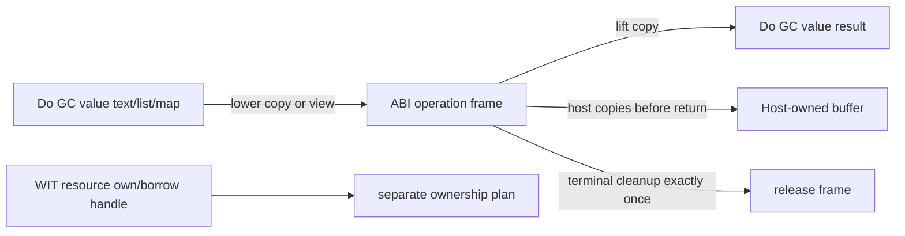

# Canonical ABI Operation Lifetime Design

状态: 已批准架构，待实施
日期: 2026-08-30

## 目标

为 `text`、`[T]`、WIT `string/list/map` 以及 Future/Stream 的 canonical ABI
边界定义统一、可验证的生命周期规则，同时保持 Do 源码无指针、无引用、无
公开 `own<T>`/`borrow<T>`/`ref<T>`。

## 核心裁定

canonical ABI 本身不规定一个名为 arena 的实现对象。本文使用
“operation frame”表示一次 ABI operation 的临时 linear-memory 区域、result
area 和相关清理状态。

对于非 resource 的 `string`、`list<T>`、`map<K,V>` 和其他 canonical payload：

> `ptr,len` 只构成当前 ABI operation 内的借用视图。该视图不得逃逸到下一次
> ABI operation、GC 对象、Future frame、Stream buffer、ResourceTable 或宿主
> 异步任务。需要保留时，必须复制到 GC-managed Do value 或 host-owned buffer。

这是编译器的安全契约，不要求每次 Do 函数调用都发生物理复制。编译器可以在
同一 Do 执行中直接传递 GC-managed 值，只在进入或离开 canonical ABI 边界时
建立临时视图或执行必要复制。

## 生命周期域

### 1. Do GC value

- `text`、`[T]` 和结构化值是 Do 的逻辑值，由 GC 保活。
- Do 函数之间传参、返回或绑定，不因为值较大就强制做 ABI 级 memcpy。
- `@set`、`@put` 的逻辑值语义继续由 GC/backend contract 定义；本设计不引入
  公开可变引用。

### 2. Canonical operation frame

- 输入 `string/list` 的 `ptr,len` 是当前 operation 的临时借用视图。
- `map<K,V>` 的 canonical pair-list 指针、长度以及每个 key/value payload
  也只是当前 operation 的临时借用视图；pair-list 是 ABI 表示，不改变 Do
  `HashMap<K,V>` 的逻辑语义。
- 同步 operation 返回后，输入临时 span 可立即清理；不得再读取其地址。
- result-area 中的 payload 只在 lift 完成前有效；lift 完成后复制为 Do GC
  value，再按 allocator contract 清理临时区域。
- 任何临时 span 都必须有明确的单一释放点；错误、取消和异常路径不得泄漏或
  重复释放。

### 3. WIT resource handle

- resource handle 不是 GC reference，也不是 string/list 的线性内存 span。
- `own`、`borrow`、transfer 和 drop 继续由 Component/WIT ownership plan
  管理。
- 本设计不把资源句柄的跨调用规则简化为“复制字节”；资源必须按对应的
  ownership contract 转移或借用。

## 按 operation 类型的规则

| operation | 允许的 payload 生命周期 | 保留/跨 operation 行为 |
| --- | --- | --- |
| 同步 host/WIT call | 当前调用期间 | 返回后不得保留 `ptr,len`；需保留则 copy |
| 同步 map host/WIT call | 当前调用期间 | pair-list 和 nested payload 在返回后失效；需保留则 lift/copy 到 `HashMap<K,V>` |
| 同步 result lift | lift 完成前 | 复制到 Do 值后释放临时 result-area |
| `@host_async_func` 启动 | 从参数 lower 到 host 确认已复制/消费 | string/list/map 及 nested payload 默认在 Future 返回前复制到 host/task-owned buffer；不得把调用方临时 span 直接交给异步任务 |
| Future completion | terminal lift 期间 | payload lift 到 Do 值；complete/error/cancel/drop 后 operation frame exactly once cleanup |
| Stream poll/read/write | 当前单次 poll/write operation | map pair-list 或 nested payload 若需排队、背压或跨 poll 保存，先复制到 Stream-owned buffer |
| resource own/borrow | 由 resource contract 决定 | 不适用 string/list 的 byte-copy 规则；按 transfer/borrow/drop 处理 |

### 异步参数的默认实现

`@host_async_func` 的调用方临时 span 不得在 Future 创建后继续作为裸地址使用。
默认实现是：

1. 在启动 operation 时把 string/list/map 及 nested payload 复制到 host/task-owned storage；
2. 释放调用方 operation frame 的临时 span；
3. Future 只持有 host/task-owned storage 的逻辑句柄；
4. Future 在 complete/error/cancel/drop 任一终态释放该 storage exactly once。

如果未来实现 pinned frame 来减少复制，只能作为内部优化；必须证明 frame 在
所有终态、Store disposal 和取消竞态下均保持可达并 exactly-once 清理，不能改变
源码可观察语义。

## 失败、取消与异常

- lift/lower 失败必须沿现有错误契约传播，不能把失效 span 当作空值或成功值。
- Future 取消只清理 guest/Component/operation-frame 状态，不回滚已经发出的
  host side effect。
- 重复终态、重复 cancel 和 Store disposal 必须汇聚到同一个幂等清理点。
- 如果 host 在 operation 返回前未确认已复制或消费输入，则 operation frame
  必须继续存活，直到确认或终态清理；禁止提前释放。

## 不变量

1. canonical `ptr,len` 不进入 Do 可观察值。
2. canonical `ptr,len` 不跨 ABI operation、Future suspension 或 Stream poll
   边界逃逸。
3. GC reference 不跨 Component/WIT boundary。
4. 每个 operation frame 和 host/task-owned copy 都只有一个释放权威。
5. 同一 GC 值在多个 Do 函数之间传递，不等于重复 canonical serialization。
6. 对同一输入执行相同 operation，是否采用内部 zero-copy 优化不得改变结果、
   错误、取消或资源释放行为。

## 非目标

- 不增加公开 pointer/reference/lifetime 语法。
- 不把 `own<T>`、`borrow<T>` 或 resource drop 交给 GC finalizer。
- 不承诺所有 WIT nested list/record/borrow shape 自动可用；每个 shape 仍需
  pinned ABI、Component validation 和 Rust/Wasmtime lifecycle gate。
- 不承诺跨异步边界零拷贝。

## 验收标准

落地实施时至少应有以下证据：

1. 同步 string/list/map host call 返回后，临时 span 已清理且不能被后续 operation
   读取。
2. async string/list/map 参数在 Future 返回后仍可被 host 正确消费，且 complete、
   error、cancel、drop 均只清理一次。
3. Stream payload 在跨 poll 排队时使用独立 owned buffer，不依赖上一次 poll
   的 `ptr,len`。
4. result-area payload lift 后得到独立 Do GC value，原始 linear span 清理
   不影响该值。
5. current-only `wasm-tools`、Wasmtime、Rust/Cargo 和 Zig 锁定版本下，Component
   assembly、ABI validation、Rust/Wasmtime lifecycle 和标准回归均通过。
