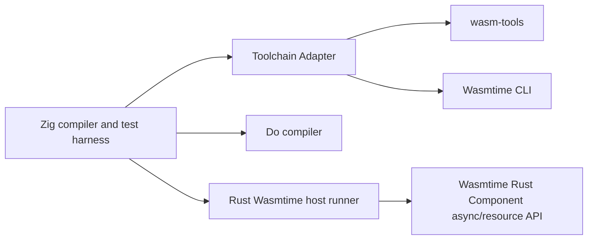

# Map、工具链适配与 Zig 测试编排设计

状态: 已批准架构，待实施
日期: 2026-08-30

## 目标

同时收敛三个长期耦合问题：

1. WIT `map<K,V>` 与 `list<tuple<K,V>>` 的语义、Do 映射和 canonical ABI 生命周期；
2. `wasm-tools`、Wasmtime CLI、Rust Wasmtime crate 和 Cargo 的升级边界；
3. 仓库自有 Shell 测试编排迁移到 Zig，同时保留 Rust Wasmtime host runner 作为 P3 runtime oracle。

## 已批准的总体架构

Zig 负责编译器、测试发现、子进程、临时目录、超时、断言和工具链调用。Rust
继续负责当前 P3 async、Future、Stream、resource、cancellation 的 Wasmtime
运行时验证。Shell 不再承载测试逻辑，只允许在迁移期间保留极薄的启动入口。

“C 方案”指集中式 Toolchain Adapter，不指 C 语言实现；“B 方案”指 Zig
测试编排加 Rust host runner 保留。

## 1. WIT map

### 1.1 语义

- WIT `map<K,V>` 是独立的一等 WIT 类型；不得自动把所有
  `list<tuple<K,V>>` 重写为 map。
- `list<tuple<K,V>>` 仍保持原有有序、可重复键的列表语义。
- map 在绑定层映射为 Do `HashMap<K,V>`；已有 `lib/hash_map.do` 是初始实现，
  不新增第二套集合类型。
- map 的 key 只允许 WIT 标量键：整数、`bool`、`char` 和 `string`。资源、
  record、variant、list、tuple、future、stream、`own<T>`、`borrow<T>` 不得作为 key。
- value 遵循现有 WIT 类型准入和 resource ownership 规则；本设计不借机开放
  通用 `own<T>`、`borrow<T>` 或新的 Do 引用语法。
- 重复 key 的 lift 行为固定为后出现的值覆盖前值；绑定层得到一个逻辑 map。

### 1.2 canonical ABI 与生命周期

- canonical ABI 可以使用 pair-list 表示 map，但该表示是 ABI 细节，不改变 Do
  map 语义。
- 输入 map 的 `ptr,len` 只在当前 operation frame 内有效，不能进入下一次
  operation、GC 可观察值、Future frame、Stream buffer 或 host 异步任务。
- 同步返回的 map 在 lift 时复制到 GC-managed `HashMap<K,V>`，完成后清理临时
  result area。
- 异步调用启动时，map 及其 string/list payload 必须复制到 host/task-owned
  storage，除非实现能证明 pinned frame 在 complete、error、cancel、drop 和
  Store disposal 全部路径上 exactly-once 清理。
- Stream 跨 poll 排队时必须使用独立 owned buffer，不能保存上一次 poll 的裸
  `ptr,len`。
- map 内的 resource value 仍由 Component/WIT transfer、borrow、drop 规则管理，
  不由 GC finalizer 替代。

### 1.3 编译器边界

WIT parser/model、Do emitter、signature renderer、manifest/registry validator
都认识 `.map`。Do 核心只接收生成后的 `HashMap<K,V>`；不会因为 WIT map 而
改变 `@get/@set`、GC 或普通函数的值语义。

## 2. current-only Toolchain Adapter

- `validate-core` 固定执行 Core wasm 验证，使用 `gc,cm-async,cm-more-async-builtins`
  feature 集合；与 `parse-core`、Component 验证一样，调用方不得追加任意 flags。

- 根目录单一 lock 记录 wasm-tools、Wasmtime CLI、Rust Wasmtime crate、Cargo、
  Zig 版本、revision 和 artifact SHA-256。
- 当前候选 CLI 基线为本机实测的 `wasm-tools 1.258.0` 和 `wasmtime 48.0.1`；
  Rust crate 必须通过编译和运行门禁后才能同步到 48.0.1。
- adapter 只暴露命名操作：`parse-core`、`strip-core`、`embed-component`、`new-component`、
  `validate-core`、`validate-component`、`component-wit`、`print-component`、`run-wasmtime` 和
  `probe`。`print-component` 仅用于读取已验证 Component 的确定性文本证据，
  不接受任意 wasm-tools flags。
- 适配层集中检查 current-only 版本和 hash；缺失、版本不符、hash 不符或能力
  不足时 fail-closed。
- capability probe 判断实际能力，不在 compiler semantic code 中写版本分支。
- manifest 可以记录工具链版本/hash 作为证据，但不得参与 Do 类型语义或 lowering
  决策。
- 历史文档保留历史版本；active route 不再调用旧版工具。

## 3. Zig 测试编排与 Rust 边界

- Zig `zig test` 用于 compiler、WIT parser/model、adapter 和确定性 fixture 测试。
- `zig build test` 作为全量集成入口，统一执行外部 `do`、wasm-tools、Wasmtime、
  Cargo 和 Rust runner，并统一收集 stdout/stderr、退出码、超时和清理结果。
- Rust host runner 不立即翻译成 Zig。它继续验证 Wasmtime Component async/resource
  API，必要时只做 Wasmtime 48.0.1 的最小 API 适配。
- 后续可以把多个 Rust `[[bin]]` 合并为一个参数化 runner，减少 Cargo 编译和
  磁盘占用；这不是本阶段的前置条件。
- `.deps/wit-bindgen`、生成目录、worktree 和历史脚本不属于迁移范围。

## 非目标

- 不维护旧版 wasm-tools 或 Wasmtime 兼容矩阵。
- 不把所有 `list<tuple<K,V>>` 自动转换成 map。
- 不重写 Do 的 GC、值语义、`own<T>`/`borrow<T>`/`ref<T>` 或资源所有权语义。
- 不在本阶段把 P3 Rust host runtime 改写成 Zig/C API runtime。

## 总体验收

1. WIT map 正负例、Do 绑定、canonical pair-list、同步 lift、异步复制和 Stream
   排队生命周期均有独立测试。
2. 修改工具链版本只需修改 lock、adapter 能力记录和必要的证据，不触碰 compiler
   semantic code。
3. active 测试不再直接散落调用 wasm-tools/Wasmtime；所有调用经过 adapter。
4. `zig build test` 能运行现有编译器回归、Component assembly、Rust host runner
   和失败诊断，并保持错误、取消、超时和清理语义。
5. `./src/build/test/run_tests.sh` 的逻辑迁移完成后，Shell 只剩启动兼容入口或
   被删除；`.deps/wit-bindgen` 不被改写。
