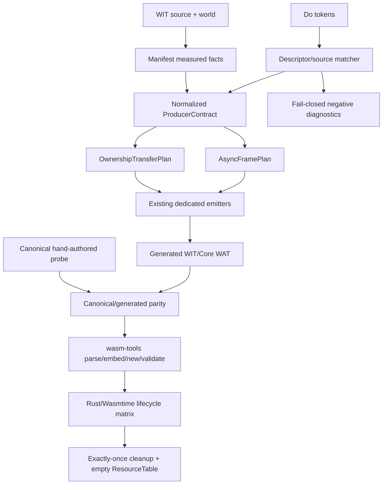

# G6.2 通用 Producer/Resource 内部契约设计

日期: 2026-09-03
状态: 设计与准入门; 未授权扩大编译器 admission

## 1. 目标

为 G6.2 建立一个可复用的内部 producer/resource 契约，使 direct owned-record、
nested owned-record、list producer 和参数化 producer 使用同一套可验证的 ownership、
async frame 与 terminal cleanup 规则。这个阶段只收敛内部模型和证据门，不新增公开
`own<T>`、`borrow<T>`、`ref<T>`、指针、引用或生命周期语法，也不把任意 producer
expression 变成可接受输入。

完成本设计门后，下一条实现任务仍必须选择一个明确的、hash-pinned、manifest-backed
形状；“通用”只表示内部计划可以描述多个已测量形状，不表示 Do 源码自动获得任意
WIT producer/resource 能力。

## 2. 当前证据与边界

当前 active toolchain 是 `wasm-tools 1.258.0`、Wasmtime `48.0.1`、Zig `0.16.0`、
Rust/Cargo `1.97.1`，由 `toolchain/toolchain.lock.json` 锁定。历史
`wasm-tools 1.255.0` 只作为 dated probe 证据，不能作为当前 adapter 版本。

已验证的私有形状包括：

| 能力 | 当前状态 | 证据结论 |
| --- | --- | --- |
| direct/pair/triple owned record producer | verified | 固定 record layout、presence mask、转移前后 exactly-once drop 已闭环 |
| nested owned-record producer | verified | `outer.inner.ticket` 的递归路径、转移和清理已闭环；最大当前证据深度仍为六层 consumer |
| scalar/list、dynamic、batched list producer | verified | 只接受注册 descriptor 和固定容量/长度，任意 list producer 仍拒绝 |
| 参数化 producer 与 helper forwarding | verified | typed 参数、受限重排和六跳边界已锁定；第七跳仍拒绝 |
| variant resource stream | probe-only | canonical ABI 可测，但没有 compiler admission |
| `stream<record { ticket: borrow<ticket> }>` / `future<borrow<ticket>>` | rejected | pinned Component toolchain 在 embed 阶段拒绝，不能由 Do 包装绕过 |
| 任意 producer expression | rejected | 当前源码 matcher 只接受已登记 topology；表达式、别名和逃逸规则未收敛 |
| map | exact sync route only | `map<u32,u32>` lower/lift 已闭环，async copy 和 Stream buffer 仍阻断，不并入本设计 |

当前 GC inventory 仍为 `complete_rows=15 pending_rows=15`、预期退出码 `1`。G6.2
Component 生命周期证据不自动关闭 GC/ARC semantic-equivalence row；`runtime_arc_wat.zig`
与 `codegen_ownership.zig` 仍是迁移债务，不是本设计的目标 runtime。

## 3. 方案比较

### A. 继续 descriptor-specific template

每增加一个形状就复制一份 manifest validator、source matcher、WAT template 和
cleanup emitter。

- 收益: 变更最小，当前路线风险最低。
- 代价: ownership 状态机和 cleanup 顺序会继续分散；重复逻辑容易出现一处修复、
  另一处遗漏。
- 结论: 作为紧急回归修复可用，但不能作为 G6.2 后续架构。

### B. 内部归一化 `ProducerContract` (推荐)

在 manifest/WIT 测量结果和现有 emitter 之间增加一个纯数据计划层，统一描述 source
operation、sink endpoint、payload layout、ownership paths、transfer transaction、
terminal actions 和 frame cleanup。source matcher 仍然逐 descriptor fail-closed，
只把通过完整契约校验的结果交给 emitter。

- 收益: 把重复的状态/布局/清理事实集中到一处；可以先重放现有已验证路线，随后
  逐个增加新形状；不需要公共 ownership 语法。
- 代价: 需要新增 plan 类型、生命周期校验和各专用 emitter 的适配；必须防止抽象
  层变成未经测量的“万能 lowering”。
- 结论: 选用。第一阶段只做归一化与现有路线回放，不扩大 descriptor admission。

### C. 公共 ownership 类型 + 通用 producer lowering

直接把 WIT 的 `own`/`borrow`/`resource` 语义暴露给 Do，并为任意 producer expression
建立 escape、alias、async lifetime、cancel 和跨 poll buffer 规则。

- 收益: 源码表达力最大，WIT 映射直观。
- 代价: 需要完整 ownership/borrow IR；当前 pinned toolchain 还拒绝 borrowed
  stream/future；取消后的 live child、外部副作用和 alias 语义尚未定义。
- 结论: 本阶段不选，列为 v1 后置架构项目。

## 4. 选定架构

### 4.1 分层



依赖方向固定为 `WIT/manifest -> matcher -> normalized plans -> emitter -> runtime gate`。
emitter 不读取版本号、不猜 layout；probe 是 layout 和 toolchain 能力的证据来源，
不是 source admission 的替代品。

### 4.2 内部契约

下面是实现时必须保持的纯数据边界。名称是设计 API，不代表当前源码已经存在；
实现计划会在单独任务中落地并先写单元测试。

```text
ProducerContract {
  descriptor_id
  source: SourceContract { module, import_name, core_params, core_results }
  sink: SinkContract { module, member, capacity, read/write/drop operations }
  payload: PayloadLayout
  ownership: OwnershipTransferPlan
  terminal: TerminalContract
}

OwnershipTransferPlan {
  leaves: [OwnershipLeaf { path, resource, handle_offset, drop_import, bit }]
  parents: [OwnershipParent { path, bit }]
  transfer_commit: CompleteWriteOnly
  pre_transfer_release_order: reverse_acquisition_order
}

AsyncFramePlan {
  frame_slots
  child_endpoints
  waitable_membership
  terminal_states
  cleanup_order: child -> endpoint -> waitable -> frame
}
```

这些结构必须是 immutable plan data。构造后 emitter 只消费已校验的 plan；不得在
WAT 输出阶段重新推断字段 offset、ownership qualifier 或 source expression。

### 4.3 Payload 与 ownership 树

- scalar、record、list、variant 是不同的 payload kind，不能通过字符串别名互换。
- `RecordNestedField` 的 source path 与 canonical flattened offset 同时保留；路径
  不能由 handle 值推断。
- 每个 owned leaf 有独立 presence bit；handle `0` 永远不是缺失标记。
- list backing allocation、stream endpoint、future、subtask、waitable 和 frame
  具有独立 owner bit/state；一个资源转移成功不等于其他 slot 自动转移。
- borrowed leaf 只能作为当前 probe/operation 的临时观察；在 pinned toolchain
  拒绝 borrowed stream/future 的情况下，不生成跨 poll 的 borrowed plan。

### 4.4 Producer expression admission

归一层不自动放宽 source matcher。当前及本阶段允许的输入仍是：

1. manifest 中存在且 hash 匹配的 source/sink descriptor；
2. source 参数只来自已声明、类型已知的 Do binding；
3. helper forwarding 只在 descriptor 明确给出 hop 上限和参数位置时接受；
4. producer payload 必须在一次完整 write 成功后才 commit transfer。

以下输入继续在 WAT 之前拒绝，并各自保留稳定诊断：任意函数调用结果、条件表达式、
别名链、未登记 helper、超过 descriptor hop 上限、并发共享 writer lease、borrowed
payload、未测量的 list/variant/mixed resource payload。

这使“通用”成为内部表示能力，而不是隐式的公共语言语义变化。

## 5. Ownership 与取消契约

### 5.1 状态

设计层统一使用以下状态；现有 `sema_stream_lease.zig` 的状态是其中已实现的子集：

```text
owned -> borrowed-use -> owned
owned -> transferred -> in-flight
owned -> finalized
in-flight -> completed -> finalized
in-flight -> cancelled -> finalized
branch/loop mismatch -> maybe
```

`borrowed-use` 只存在于一个 host call 或当前表达式观察期间；不跨 await、Stream poll、
helper 返回或 Future 保存。`maybe` 不能被当成 `owned` 使用，必须在所有路径完成相同
transfer/finalize 或在语义分析阶段拒绝。

### 5.2 Transfer transaction

1. 先验证 record/list payload 完整、长度和每个 owned leaf 都在有效 frame slot。
2. 执行一次完整 stream write；失败时不清除 guest ownership。
3. 只有 write 成功并收到可继续的 terminal 状态时，原子清除 guest presence bits，
   标记 transferred，并交给 sink/host owner。
4. 转移前失败、cancel 或 early drop 按反向获取顺序释放 guest-owned leaves、buffer、
   endpoint、future 和 frame。
5. 转移后发生 cancel 不回滚已提交的外部效果；只清理尚存的 async state。

### 5.3 Exactly-once cleanup

每个 terminal path 必须满足：

- 每个 resource handle 至多一次 drop；
- 每个 list allocation 至多一次 release；
- 每个 stream readable/writable、future、subtask 和 waitable membership 至多一次
  drop；
- child endpoint 先于 parent waitable set，parent frame 最后清理；
- 正常、pending、sink error、completion error、cancel-before-transfer、
  cancel-after-transfer、early-drop 和 repeat 都留下可观测计数；
- Component host 的 `ResourceTable` 最终为空。

## 6. Capability gate

设计门必须先重跑现有独立 evidence，不把已存在的 green route 直接合并成“通用支持”：

| Gate | 方法 | 退出条件 |
| --- | --- | --- |
| toolchain identity | `bin/do-toolchain probe` | 版本、hash、capability 与 lock 完全一致 |
| canonical capability | 现有 direct/pair/triple/nested/list/variant/borrow probes | 每个 shape 的接受或拒绝结果与记录一致 |
| contract unit tests | 新增 normalized plan tests | layout、path、bit、terminal order 全部确定，无隐式默认 |
| source boundary | 每类一个正例和一个单事实负例 | 负例在 WAT 前返回既定诊断，不降级到 ARC route |
| generated parity | canonical WIT/WAT 与 generated WIT/WAT | 仅允许声明的 Component identity 差异 |
| lifecycle | Rust/Wasmtime ten-mode matrix | cleanup counters、ordered payload、`table-empty=true` 全部一致 |
| regression | `./src/build/test/run_tests.sh`、`zig test main.zig`、ReleaseSmall | 既有 route、GC inventory 和 skip 数不漂移 |

任何 probe 在 `wasm-tools` 阶段失败，或任何 borrowed async shape 被接受，都是阻断，
不能通过增加 Do 侧包装、扩大深度常量或重用邻近 descriptor 绕过。

## 7. 明确非目标

- 不新增公共 `own<T>`、`borrow<T>`、`ref<T>`、`borrow_mut<T>` 或生命周期语法。
- 不把 WIT `own`/`borrow` 直接映射成 Do 源码类型；它们仍是 Component ABI/manifest
  内部事实。
- 不实现任意 producer expression、通用 async-call composition、Stream 跨 poll owned
  buffer 或 borrowed future/stream。
- 不修改 `map<K,V>` 的通用 lowering；已闭环的同步 `map<u32,u32>` 只作为独立 route。
- 不改变取消语义；取消不回滚已经提交给外部系统的副作用。
- 不把本阶段 Component lifecycle 证据记入 GC inventory 或宣称 full GC cutover。

## 8. 进入实现的门槛

只有在本 spec 通过 review，且以下事实都被机器 gate 锁定后，才可创建具体的 positive
compiler admission plan：

1. `ProducerContract`、`OwnershipTransferPlan`、`AsyncFramePlan` 的字段和所有权边界
   无歧义；
2. 至少一个现有 direct/pair/nested 路线能由归一计划重放，canonical/generated 输出
   与 cleanup 计数不变；
3. borrowed async、arbitrary expression、shared lease、hop/depth overflow 的负例
   在 WAT 前拒绝；
4. 所有 terminal path 都能观察 exactly-once cleanup，且 Component `ResourceTable`
   为空；
5. 默认 route、GC inventory、工具链锁和现有 descriptor hash 无漂移。

若第 2 或第 3 项失败，保留现有 descriptor-specific 路线，记录失败证据，不扩大
admission，也不把失败伪装成 generic support。
