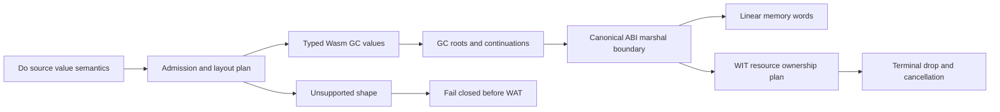

# GC-First Runtime Cutover Design

**Status:** Proposed; design review required before implementation

**Date:** 2026-09-05

## Goal

Move every currently admitted Do compiler route to the selected Wasm GC
backend, remove ARC as a normal-route fallback, and preserve the existing
source and Component contracts. This phase closes implementation migration
debt; it does not broaden async, WIT map, G6.2 producer, or D2 method
admission.

## Evidence and Baseline

The selected v1 memory contract is GC-first. The source language remains
pointer-free and reference-free, uses value semantics, and does not expose
`ref<T>`, `own<T>`, `borrow<T>`, or lifetime syntax. `text`, lists, large
structs, and managed structs may use private GC references; those references
must not cross a Component/WIT boundary.

The current implementation has typed GC routes and bounded GC frame evidence,
but still contains ARC runtime and ownership code. The G5c inventory remains
`complete_rows=15 pending_rows=15`; the pending rows are capability gaps, not
cutover failures. The exact async `map<u32,u32>` probe proves runtime
capability only and remains outside compiler admission.

The cutover baseline is pinned to the current-only toolchain:

- `wasm-tools 1.258.0`
- Wasmtime `48.0.1`
- Zig `0.16.0`
- Rust/Cargo `1.97.1`

The existing dirty async-map probe files are not part of this design change.

## Decisions

### 1. Backend selection

GC is the only normal managed-memory backend. The compiler must not silently
route an admitted shape through ARC. An unsupported shape fails closed with
its existing diagnostic instead of receiving an implicit compatibility route.

During migration, a legacy linear/ARC oracle may be invoked only by explicit
equivalence tests. It is never reachable from the default compiler route. After
the final equivalence snapshot, the production ARC path is deleted; a clearly
named test-only oracle may remain temporarily only if it is required to replay
that snapshot.

### 2. Source semantics

The cutover does not change source semantics:

1. Assignment, argument passing, return, field access, and collection access
   remain value-semantic operations.
2. `@set` and `@put` produce a new logical value. Unique, non-escaping storage
   may be reused only when the observable old value remains unchanged.
3. Read-only passing of a managed value does not copy its payload.
4. GC reachability, not deterministic source scope exit, determines the
   lifetime of Do-managed objects.
5. WIT resources retain explicit transfer, borrow, close, and drop contracts.
   GC finalization never replaces resource cleanup.

### 3. Layer boundaries

The migration has four ownership domains:

- **Do values:** typed GC structs/arrays and GC references; no source-level
  retain/release operations.
- **Compiler roots:** locals, storage slots, branch joins, loops,
  continuations, and bounded async frames keep GC values reachable.
- **Linear ABI temporaries:** text/list/record values are copied into and out
  of canonical linear memory at the Component boundary. A GC reference never
  crosses that boundary.
- **WIT resources:** integer handles and explicit `OwnershipPlan` state. The
  resource table and host side effects are cleaned up exactly once at the
  terminal state.

`codegen_ownership` may remain as an internal transition module only while it
narrowly emits the WIT resource plan. Do-value ARC release plans are removed
from the normal path.

### 4. Async boundary

This phase migrates existing admitted bounded GC frame/table routes and keeps
their root liveness and terminal cleanup behavior. It does not implement
generic async-call lowering, arbitrary producer expressions, async map
lowering, Stream map buffers, or host-future cancellation.

For the existing async routes, a frame owns its GC roots and explicit WIT
state. Cancellation clears remaining guest/Component state and does not roll
back a host side effect that has already occurred. `ready`, `pending`,
`cancel`, and Store-disposal paths must retain exactly-once cleanup.

## Architecture

The normal route is a single backend selection followed by typed emission. A
route is admitted only if its value layout, root set, and Component marshaling
plan are measured or already covered by an existing gate.



The transition must not add a second implicit path between admission and
emission. The existing manifest-backed descriptor and measured layout
contracts remain the single source of truth for host/WIT routes.

## Cutover Units and Gates

### GC-C0: Contract and inventory gate

Create a complete inventory of normal-route ARC references and classify every
site as one of:

- Do managed-value code to replace with typed GC emission;
- WIT resource transfer/drop code to retain as explicit ABI logic;
- test-only linear/ARC oracle to isolate and later delete.

The gate is green only when the classification is exhaustive, no public
ownership or reference syntax is introduced, and each currently admitted route
has a named GC owner for values, roots, and boundary temporaries.

### GC-C1: Runtime and ownership gate

Replace the default use of `runtime_arc_wat.zig` and
`runtime_prelude_wat.zig` with the typed GC runtime fragments. Remove
Do-value `inc/dec`, retain, release, and ARC scope-exit emission from the
normal codegen path. Preserve resource-handle drop/transfer and explicit
Component terminal cleanup.

Negative gates must prove that a normal GC build cannot emit `__arc_` symbols,
ARC runtime imports, or a silent ARC fallback marker.

### GC-C2: Value, storage, and root gate

Migrate storage, alias, overwrite, return, branch join, loop, and bounded
Future/Stream root handling. The gate must prove:

1. passing a large managed value for reading does not copy its payload;
2. updating a shared logical value preserves the old value;
3. unique non-escaping storage may be reused without observable mutation;
4. roots survive branch joins, loops, and bounded suspension/resumption;
5. managed child reachability is supplied by GC tracing rather than compiler
   retain/release code.

The existing source value rules and `@set`/`@put` behavior are unchanged.

### GC-C3: Route and boundary gate

Switch all currently admitted synchronous and bounded async routes to GC by
default. Keep unsupported generic async, map, Stream, producer, borrow, and
unmeasured WIT shapes fail-closed with their existing diagnostics.

Run the existing Component/WIT routes with the current toolchain and verify:

- no GC reference crosses canonical lift/lower;
- all temporary linear allocations are released exactly once;
- resource tables are empty after applicable terminal states;
- cancellation removes only remaining state and never undoes an emitted host
  side effect;
- the async-map capability probe remains unchanged evidence, not compiler
  admission.

### GC-C4: Removal, verification, and documentation gate

After the equivalence snapshot and full regression pass, delete the ARC
transition path from the normal compiler/runtime route. If a replayable
equivalence test still requires it, isolate it as a clearly named test-only
oracle with an explicit invocation; it must not be linked by the default build.
Update the authoritative memory, roadmap, pending, and changelog documents so
they distinguish:

- admitted routes now using GC;
- capability probes that are not compiler admission;
- pending capability rows that remain blocked.

The G5c inventory count must not be changed merely because the backend was
switched.

## Verification Matrix

Every unit ends with a focused gate and the following final commands:

```bash
cd src && zig test main.zig
./src/build/test/run_tests.sh
RUN_WASM=1 RUN_GC_CORE=1 ./src/build/test/run_tests.sh
./src/build/test/run_release_smoke.sh
./src/build/test/check_toolchain_adapter.sh
./examples/p3-runtime/test_async_map_capability.sh
```

The final acceptance criteria are:

- all currently admitted routes pass with GC markers and no normal-route ARC
  markers;
- unsupported shapes fail before WAT and retain their diagnostics;
- existing ARC/GC equivalence observations remain identical for the snapshot
  rows;
- bounded Future/Stream and resource terminal rows preserve exactly-once
  cleanup;
- Component validation and Rust/Wasmtime execution pass on the pinned
  toolchain;
- no public `own<T>`, `borrow<T>`, `ref<T>`, pointer, or lifetime syntax is
  added.

## Dependencies and Follow-on Work

GC-C0 through GC-C4 are the critical path. Generic async lowering must wait
until the frame/root and cleanup contracts are stable. After this phase, the
next design is the general async frame contract, followed by promotion of the
measured `map<u32,u32>` route. G6.2 general producer/resource and D2 general
filesystem/HTTP work depend on the same async terminal contract and remain
separate projects.

The following are explicitly outside this phase:

- public ownership, borrowing, reference, or lifetime syntax;
- arbitrary `map<K,V>` combinations and Stream map buffers;
- generic producer expressions or general resource payload lowering;
- general filesystem async or external HTTP;
- a parser/sema/codegen rewrite unrelated to the backend cutover;
- direct Wasm binary emission.

## Rollback

Each gate is a separate, revertible change. If a focused gate fails, keep the
last green GC route as the active baseline, restore the prior route selection,
and leave unsupported shapes fail-closed. Rollback must not alter the pinned
toolchain, the async-map capability probe, or WIT hashes. No public compatibility
surface is added for rollback.

## Review Checklist

- [ ] Does the implementation classify every ARC call site before changing it?
- [ ] Does the default route have one explicit GC backend selection?
- [ ] Are Do values and WIT resources kept in separate lifecycle domains?
- [ ] Are root liveness and terminal cleanup tested independently?
- [ ] Are unsupported shapes rejected before WAT instead of routed to ARC?
- [ ] Are all claims in the roadmap and pending list synchronized with gates?
