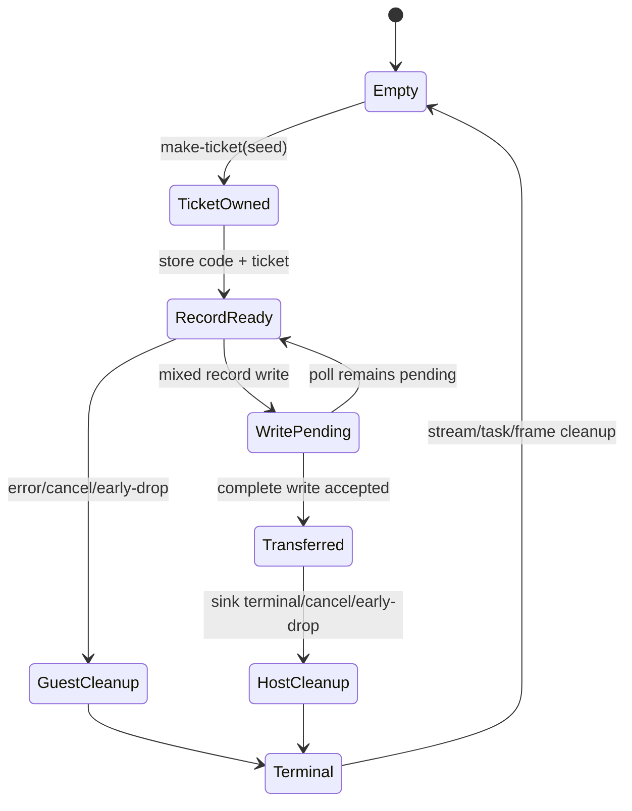

# G6.2 Private Mixed-Owned-Record Producer Design

> Status: approved bounded design (2026-09-09). This document authorizes one
> private, fixed-shape producer route after the canonical probe succeeds. It
> does not open public ownership syntax or general producer lowering.

## Decision

The next G6.2 shape is a mixed record with one ordinary scalar field and one
owned resource field:

```text
MixedEntry {
    code: u32,
    ticket: own<ticket>,
}
```

The route is intentionally narrower than generic records. It reuses the
existing immutable `ProducerContract`, exercises a non-resource payload field
alongside an owned leaf, and keeps the ownership problem to one top-level
resource path. The record is not nested, repeated, a list, or a variant.

This is an architectural bounded slice, not a promise that every WIT record or
producer expression will lower.

## Rationale and rejected alternatives

| Option | Decision | Reason |
| --- | --- | --- |
| A. Mixed record producer | **Selected** | Adds measurable layout/ownership coverage while reusing the existing source, sink, transfer, and terminal model. No new public language semantics are needed. |
| B. Variant-owned producer | Deferred | Requires a new variant payload plan, tag-dependent write logic, and conditional ownership cleanup. A failure would mix variant ABI and producer lifecycle causes. |
| C. Arbitrary producer expression | Deferred | Requires expression IR, alias/lease analysis, helper escape rules, and async cancellation semantics. It is a separate general-lowering project. |

The private async `map<u32,u32>` route and generic map/list work remain separate
from this producer/resource slice. They must not be folded into this route.

## Goals

The implementation must establish all of the following for one pinned
descriptor:

- canonical layout for `u32` followed by `own<ticket>`;
- source creation of one ticket and one complete mixed record write;
- transfer commit only after the complete record write succeeds;
- exactly-once cleanup before transfer and after transfer;
- scalar payload preservation independently of the resource handle;
- generated WIT/Core WAT parity with the hand-authored canonical probe;
- current-toolchain Component validation and Rust/Wasmtime lifecycle evidence.

## Scope and non-goals

The route includes only:

- one new private `do:` descriptor and one pinned WIT world;
- one `ticket` resource and one `MixedEntry` record;
- one scalar `code: u32` field and one owned `ticket` field;
- one synchronous source `make-ticket(seed: u32) -> own<ticket>` import;
- one asynchronous sink consuming `stream<mixed-entry>`;
- one capacity-one stream and at most one mixed record per invocation;
- finite ready, pending, sink-error, cancellation, early-drop, repeat, and
  invalid lifecycle modes;
- compiler admission only through the existing opt-in P3 Component route.

This route does not:

- add public `own<T>`, `borrow<T>`, `ref<T>`, `borrow_mut<T>`, pointer, or
  lifetime syntax;
- change the Do value model, GC contract, or cancellation rollback semantics;
- add generic producer IR or arbitrary producer expressions;
- add helper forwarding, branch-selected producers, multiple records, lists,
  variants, nested records, borrowed payloads, or mixed resource collections;
- change existing direct, pair, parameterized-pair, triple, nested, list, or
  scalar-list routes;
- change the default compiler route or GC inventory;
- claim full WASI, full P3 host binding, or ARC/GC equivalence completion.

## Pinned WIT surface

The canonical probe and generated output must use this exact WIT text,
including the final newline. The implementation gate must calculate its
SHA-256 and store the resulting value in the new manifest row. A missing or
changed hash rejects admission.

```wit
package do:g6-2-owned-record-mixed-producer@0.1.0;

interface types {
  enum error-code { io, pipe, invalid-mode }
  resource ticket {}
  record mixed-entry {
    code: u32,
    ticket: own<ticket>,
  }
}

interface source {
  use types.{ticket};
  make-ticket: func(seed: u32) -> own<ticket>;
}

interface sink {
  use types.{error-code, mixed-entry};
  consume-via-stream: async func(
    data: stream<mixed-entry>
  ) -> result<_, error-code>;
}

world owned-record-mixed-producer {
  use types.{error-code};
  import source;
  import sink;
  export produce: async func(mode: u32) -> result<_, error-code>;
}
```

The contract identifiers are fixed:

| Item | Exact value |
| --- | --- |
| package | `do:g6-2-owned-record-mixed-producer@0.1.0` |
| source instance | `do:g6-2-owned-record-mixed-producer/source@0.1.0` |
| sink instance | `do:g6-2-owned-record-mixed-producer/sink@0.1.0` |
| world | `owned-record-mixed-producer` |
| source member | `make-ticket` |
| sink member | `consume-via-stream` |
| export member | `produce` |
| descriptor effect | `record-resource-mixed-stream-producer` |

## Exact Do adapter shape

The accepted Do source remains an adapter sentinel. It registers the measured
source and sink, declares the ordinary Do resource shell, and contains no
producer expression for the private template to interpret:

```do
make_ticket = @host_func("do:g6-2-owned-record-mixed-producer/source@0.1.0", "make-ticket", (u32) -> Ticket)
consume = @host_async_func("do:g6-2-owned-record-mixed-producer@0.1.0", "consume-via-stream", (StreamWriter<MixedEntry>) -> Result<nil, ProducerError>)
Ticket = @wasi_resource("do:g6-2-owned-record-mixed-producer/source/ticket", { .id i64 })
MixedEntry {
    .code u32
    .ticket Ticket
}
ProducerError error = Io | Pipe | InvalidMode
produce(mode u32) -> Result<nil, ProducerError> { return Ok() }
start() {}
```

The matcher must require exactly two host bindings, one resource declaration,
one record declaration, one error declaration, one `produce`, one `start`, and
no `async` token or `@async`, `@await`, or `@cancel` intrinsic. The private
template supplies the Component async export; the sentinel body is not general
Do async lowering and must remain rejected when changed.

## Canonical ABI hypothesis

The hand-authored canonical WAT/WIT probe must measure and assert every value
below. The generated route may proceed only if all values match exactly.

| Property | Required measured value |
| --- | --- |
| stream element | `mixed-entry` |
| record alignment | 4 bytes |
| record byte size | 8 bytes |
| `code` core field | `i32` at offset 0 |
| `ticket` core field | `i32` at offset 4 |
| source ownership path | `ticket` |
| source field ownership | `own` only for `ticket`; `code` is unowned |
| resource | `ticket` |
| resource drop import | `[resource-drop]ticket` |
| stream capacity | 1 |
| source core signature | `(i32) -> (i32)` |
| producer input words | `(i32 mode)` |
| canonical boundary | no Wasm GC reference type |

The canonical record slot is linear memory. The implementation must retain both
the semantic field names and their measured offsets; it must not infer the
ownership path from a handle value or assume that the scalar field is part of
the resource mask.

## Internal normalized contract

The manifest matcher adds one private shape, for example
`record_resource_mixed_stream_producer`, and passes it through the existing
immutable `ProducerContract` boundary.

The normalized values are:

```text
payload = record MixedEntry { code:i32@0, ticket:i32@4 }
ownership.leaves = [
  { path:[ticket], resource:ticket, handle_offset:4,
    drop_import:[resource-drop]ticket, bit:0 }
]
ownership.parents = []
source = (i32) -> (i32)
sink.capacity = 1
terminal = task-return
```

The scalar field must be represented in the measured `RecordLayout` but must
not receive an ownership leaf, presence bit, or resource drop. The existing
transfer invariant remains: the complete record write is the only commit point.
No emitter may re-infer offsets, ownership qualifiers, or source expression from
the Do tokens after contract construction.

## Ownership and transfer contract

The frame uses one guest-owned leaf bit. The stream/task/future/waitable state
continues to use its existing independent lifecycle facts.



Required invariants:

1. `mode = 255` is rejected before stream, task, or ticket allocation.
2. Every valid invocation calls `make-ticket` exactly once and stores the
   returned handle at the measured offset 4.
3. The `code` value is stored at offset 0 and remains observable after the
   resource transfer; it never changes the ticket presence bit.
4. Handle value `0` is valid when the ticket presence bit is set and is never an
   absence sentinel.
5. A pending or failed complete-record write transfers no ownership.
6. A successful complete-record write atomically clears the ticket presence bit
   and marks the record transferred.
7. Before transfer, guest cleanup drops `ticket` exactly once.
8. After transfer, guest cleanup performs no ticket drop and the host drops the
   lifted ticket exactly once.
9. Stream, sink task/future, waitable membership, and frame cleanup remain
   exactly once on every terminal path.

The `code` field is a value payload. It must not acquire a synthetic resource
owner or be released through `[resource-drop]ticket`.

## Lifecycle matrix

The Rust/Wasmtime runner uses one `Store` per mode except `repeat`, which runs
two invocations in one store and resource table. The runner records both the
received scalar code and the resource seed so field order cannot be hidden by
checking the resource alone.

| Mode | Inputs | Sink behavior | Expected received `(code, seed)` |
| --- | --- | --- | --- |
| `ready` (`0`) | code `7`, seed `111` | read record and complete `Ok` | `[(7,111)]` |
| `pending` (`1`) | code `9`, seed `222` | remain pending once, then read and complete | `[(9,222)]` |
| `sink-error-before` (`2`) | code `11`, seed `333` | return `Err(io)` without reading | `[]` |
| `sink-error-after` (`3`) | code `13`, seed `444` | read record, then return `Err(pipe)` | `[(13,444)]` |
| `cancel-before-transfer` (`4`) | code `15`, seed `555` | remain pending; cancel before acceptance | `[]` |
| `cancel-after-transfer` (`5`) | code `17`, seed `666` | accept record; remain pending; cancel | `[(17,666)]` |
| `early-drop-before-transfer` (`6`) | code `19`, seed `777` | drop task/future before acceptance | `[]` |
| `early-drop-after-transfer` (`7`) | code `21`, seed `888` | accept record; drop task/future | `[(21,888)]` |
| `repeat` (`8`) | ready twice | two ready invocations in one store | `[(7,111),(7,111)]` |
| `invalid` (`255`) | code `23`, seed `999` | reject before setup | `[]` |

Every valid invocation must observe one ticket creation and exactly one ticket
drop, one stream cleanup, one sink task/future cleanup, and
`table-empty=true`. The four cancel/early-drop modes must record one pending
future drop and one host-task cancel with zero completion calls. `repeat` must
observe two ticket creations and two drops without leaking the mixed record.
The invalid row must observe zero source calls, resource creation, stream/task
allocation, cancellation, and completion.

## Negative boundary

Each focused negative fixture changes one contract fact and must be rejected
before WAT emission, with no fallback to an existing producer route:

- `MixedEntry` without `code`, without `ticket`, or with an extra field;
- reordered fields or a changed scalar type/offset;
- `ticket` marked `borrow` or replaced with a non-resource type;
- direct `Outer.ticket`, nested, list, variant, or multiple-owned payloads;
- wrong stream element, host marker, descriptor effect, result, or capacity;
- changed package, world, source module, member, WIT hash, or drop import;
- wrong source arity/result, asynchronous source binding, or changed seed mode;
- a non-sentinel producer body, helper call, branch, `@await`, `@cancel`, or
  `@async` intrinsic;
- a second sink/source binding or any ownership qualifier in the Do host
  signatures.

The negative gate must assert that no `.wat` file is emitted and that existing
direct/pair/triple/nested/list routes remain selectable only by their own exact
descriptors.

## Capability and admission gate

The implementation may be admitted only after all independent gates pass:

1. `bin/do-toolchain probe` reports the versions, hashes, and capabilities in
   `toolchain/toolchain.lock.json` (current-only policy).
2. The canonical WIT source hash and canonical WAT layout markers match the
   measured record, offsets, source signature, and no-GC-reference boundary.
3. The manifest parser and matcher accept only the exact new descriptor and
   reject every listed drift before WAT.
4. `ProducerContract` unit tests prove the scalar field has no ownership bit and
   the ticket leaf has offset 4, bit 0, and the required drop import.
5. Generated WIT/Core WAT match the canonical probe, allowing only declared
   Component identity differences.
6. Component parse/embed/new/validate succeeds with the pinned current
   `wasm-tools` adapter.
7. The Rust/Wasmtime lifecycle matrix observes ordered `(code, seed)` payloads,
   exactly-once cleanup, and `table-empty=true` for every row.
8. Existing G6.2 routes, GC-only normal compilation, default regression, and
   ReleaseSmall smoke remain green; the migration inventory stays
   `complete_rows=15 pending_rows=15` with its expected exit status.

Any canonical layout mismatch, borrowed async acceptance, duplicate cleanup,
non-empty resource table, GC reference at the Component boundary, or emitted
WAT for a negative fixture is a stop condition. The route remains pending and
only its uncommitted artifacts may be removed; existing routes and their
diagnostics must remain unchanged.

## Implementation handoff

After this document is reviewed, the implementation plan must be a separate
dated file. It must first add failing contract/matcher tests, then add the
manifest and canonical probe, then implement the minimal emitter/adapter, and
finally run the full regression and Rust/Wasmtime gates. The plan must not add
generic producer expression support or public ownership syntax as incidental
work.
