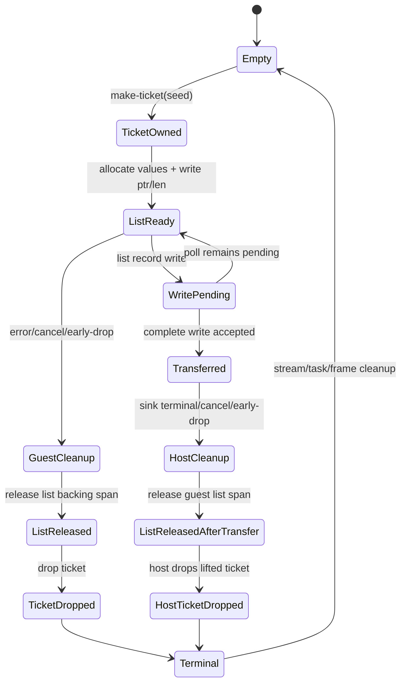

# G6.2 Private List-Owned-Record Producer Design

> Status: approved bounded design (2026-09-10). This document authorizes one
> private, fixed-shape producer route after the canonical probe succeeds. It
> does not open public ownership syntax or general producer lowering.

## Decision

The next G6.2 shape is a record with one bounded scalar list and one owned
resource field:

```text
ListEntry {
    values: list<u32>,
    ticket: own<ticket>,
}
```

The list is deliberately before the owned handle. This exercises an indirect
canonical field (`ptr`/`len`) together with a resource handle, while keeping
ownership to one top-level leaf. It extends the existing immutable
`ProducerContract`; it does not create a generic list/resource lowering path.

This is a private, measured, fixed-shape slice. It is not a promise that every
record containing a list or resource can be lowered.

## Rationale and rejected alternatives

| Option | Decision | Reason |
| --- | --- | --- |
| A. Fixed `list<u32>` plus `own<ticket>` record | **Selected** | Combines an already measured scalar-list payload with one owned leaf and tests that list storage cleanup is independent from resource transfer. |
| B. Reverse the fields (`own<ticket>` then `list<u32>`) | Deferred | It is a small layout permutation with little new semantic coverage; it can be admitted only as a separately measured shape later. |
| C. Variant, nested record, or arbitrary producer expression | Deferred | These require tag-dependent cleanup, recursive ownership plans, or expression/alias/async escape analysis and would combine separate blockers. |

The existing direct, pair, triple, nested, scalar-list, batched-list, and mixed
scalar/owned routes remain unchanged. The private synchronous and asynchronous
`map<u32,u32>` routes remain separate.

## Goals

The implementation must establish all of the following for one pinned
descriptor:

- canonical layout for `list<u32>` followed by `own<ticket>`;
- bounded list lengths `0..3`, with pointer, length, stride, and capacity all
  measured rather than inferred;
- source creation of one ticket and one complete list-record write;
- a transfer commit only after the complete record write is accepted;
- exactly-once release of the list backing allocation and exactly-once cleanup
  of the ticket on every terminal path;
- generated WIT/Core WAT parity with a hand-authored canonical probe;
- current-toolchain Component validation and Rust/Wasmtime lifecycle evidence.

## Scope and non-goals

The route includes only:

- one new private `do:` descriptor and one pinned WIT world;
- one `ticket` resource and one `ListEntry` record;
- one `values: list<u32>` field and one `ticket: own<ticket>` field, in that
  order;
- one synchronous source `make-ticket(seed: u32) -> own<ticket>` import;
- one asynchronous sink consuming `stream<list-entry>`;
- one capacity-one stream and at most one list record per invocation;
- fixed list values with lengths `0`, `1`, `2`, or `3` selected by the private
  mode table;
- finite ready, pending, sink-error, cancellation, early-drop, repeat, and
  invalid lifecycle modes;
- compiler admission only through the existing opt-in P3 Component route.

This route does not:

- add public `own<T>`, `borrow<T>`, `ref<T>`, `borrow_mut<T>`, pointer, or
  lifetime syntax;
- change the Do value model, GC contract, or cancellation rollback semantics;
- add generic producer IR or arbitrary producer expressions;
- add multiple list fields, list-of-resource elements, variants, nested
  records, borrowed payloads, or multiple owned leaves;
- change existing G6.2 routes, the default compiler route, or the GC inventory;
- claim full WASI, full P3 host binding, or ARC/GC equivalence completion.

## Pinned WIT surface

The canonical probe and generated output must use this exact WIT text,
including the final newline. The implementation gate calculates its SHA-256
and stores the resulting value in the new manifest row. A missing or changed
hash rejects admission.

```wit
package do:g6-2-owned-record-list-producer@0.1.0;

interface types {
  enum error-code { io, pipe, invalid-mode }
  resource ticket {}
  record list-entry {
    values: list<u32>,
    ticket: own<ticket>,
  }
}

interface source {
  use types.{ticket};
  make-ticket: func(seed: u32) -> own<ticket>;
}

interface sink {
  use types.{error-code, list-entry};
  consume-via-stream: async func(
    data: stream<list-entry>
  ) -> result<_, error-code>;
}

world owned-record-list-producer {
  use types.{error-code};
  import source;
  import sink;
  export produce: async func(mode: u32) -> result<_, error-code>;
}
```

The contract identifiers are fixed:

| Item | Exact value |
| --- | --- |
| package | `do:g6-2-owned-record-list-producer@0.1.0` |
| source instance | `do:g6-2-owned-record-list-producer/source@0.1.0` |
| sink instance | `do:g6-2-owned-record-list-producer/sink@0.1.0` |
| world | `owned-record-list-producer` |
| source member | `make-ticket` |
| sink member | `consume-via-stream` |
| export member | `produce` |
| descriptor effect | `record-resource-list-owned-record-stream-producer` |

## Exact Do adapter shape

The accepted Do source is an adapter sentinel. It registers the measured source
and sink, declares the ordinary Do resource shell, and contains no producer
expression for the private template to interpret:

```do
make_ticket = @host_func("do:g6-2-owned-record-list-producer/source@0.1.0", "make-ticket", (u32) -> Ticket)
consume = @host_async_func("do:g6-2-owned-record-list-producer@0.1.0", "consume-via-stream", (StreamWriter<ListEntry>) -> Result<nil, ProducerError>)
Ticket = @wasi_resource("do:g6-2-owned-record-list-producer/source/ticket", { .id i64 })
ListEntry {
    .values [u32]
    .ticket Ticket
}
ProducerError error = Io | Pipe | InvalidMode
produce(mode u32) -> Result<nil, ProducerError> { return Ok() }
start() {}
```

The matcher requires exactly two host bindings, one resource declaration, one
record declaration, one error declaration, one `produce`, one `start`, and no
`async` token or `@async`, `@await`, or `@cancel` intrinsic. The private
template supplies the Component async export; the sentinel body is not general
Do async lowering and must remain rejected when changed.

## Canonical ABI hypothesis

The hand-authored canonical WAT/WIT probe must measure and assert every value
below. These values are the required target; if the pinned toolchain measures a
different value, promotion stops and the design is revised rather than
silently adapting the emitter.

| Property | Required measured value |
| --- | --- |
| stream element | `list-entry` |
| record alignment | 4 bytes |
| record byte size | 12 bytes |
| `values.ptr` core field | `i32` at offset 0 |
| `values.len` core field | `i32` at offset 4 |
| `ticket` core field | `i32` at offset 8 |
| list element type | `u32` |
| list element stride | 4 bytes |
| list capacity | 3 |
| source ownership path | `ticket` |
| source field ownership | `own` only for `ticket`; `values` is unowned |
| resource | `ticket` |
| resource drop import | `[resource-drop]ticket` |
| stream capacity | 1 |
| source core signature | `(i32) -> (i32)` |
| producer input words | `(i32 mode)` |
| canonical boundary | no Wasm GC reference type |

The record slot is linear memory. The list backing allocation is a separate
linear span whose pointer and length are written into the record slot. The
implementation retains both semantic field names and measured offsets; it does
not infer ownership from a handle value or use a null pointer as a resource
sentinel.

## Private mode table and lifecycle observations

The mode table is part of the private template and is not a general list
constructor. It covers all admitted lengths and terminal paths:

| Mode | Values | Ticket seed | Terminal behavior | Sink observation |
| ---: | --- | ---: | --- | --- |
| `0` | `[]` | `111` | ready | `([], 111)` |
| `1` | `[11, 22]` | `222` | pending then ready | `([11,22], 222)` |
| `2` | `[12]` | `333` | sink returns `Err(pipe)` after read | `([12], 333)` |
| `3` | `[13, 14, 15]` | `444` | cancel before transfer | `[]` |
| `4` | `[16]` | `555` | transfer then remain pending and cancel | `([16], 555)` |
| `5` | `[17, 18]` | `666` | early drop before transfer | `[]` |
| `6` | `[19, 20, 21]` | `777` | transfer then early drop | `([19,20,21], 777)` |
| `7` | `[22, 23]` | `888` | ready twice | `([22,23],888)` twice |
| `255` | none | none | reject before setup | `[]` |

Every valid invocation creates one ticket, allocates one list backing span,
releases that span exactly once, and performs one ticket cleanup exactly once.
The repeat mode performs the same sequence twice. The invalid row performs no
source call, list allocation, stream/task allocation, cancellation, or
completion. A returned handle value of `0` remains valid whenever the ticket
presence bit is set.

## Internal normalized contract

The manifest matcher adds one private shape,
`record_resource_list_owned_record_stream_producer`, and passes it through the
existing immutable `ProducerContract` boundary. This name is intentionally
distinct from the existing `record_resource_list_stream_producer` shape,
which means `stream<list<resource-entry>>`.

The normalized values are:

```text
payload = record ListEntry {
  values: list<u32> { ptr:i32@0, len:i32@4, stride:4, capacity:3 },
  ticket: i32@8,
}
ownership.leaves = [
  { path:[ticket], resource:ticket, handle_offset:8,
    drop_import:[resource-drop]ticket, bit:0 }
]
list_allocations = [
  { path:[values], element:u32, stride:4, capacity:3,
    pointer_offset:0, length_offset:4, release:cabi_realloc }
]
ownership.parents = []
source = (i32) -> (i32)
sink.capacity = 1
terminal = task-return
```

The list allocation is a cleanup fact, not an ownership leaf and not a
presence bit. The complete record write is the sole resource transfer commit
point. No emitter may re-infer offsets, list capacity, ownership qualifiers,
or source expression from Do tokens after contract construction.

## Ownership, list release, and cancellation contract

The source creates the ticket first and the list backing span second. Therefore
pre-transfer cleanup releases the list span before dropping the ticket. The
list span remains live while a write is pending and is released once on either
successful acceptance or terminal cleanup.



Required invariants:

1. `mode = 255` is rejected before stream, task, ticket, or list allocation.
2. Every valid invocation calls `make-ticket` exactly once and writes the
   returned handle at measured offset 8.
3. The list pointer, length, and each `u32` element are written within the
   measured capacity; a fourth element is never admitted.
4. A pending or failed complete-record write transfers no resource ownership.
5. A successful complete-record write atomically clears the ticket presence bit
   and marks the record transferred.
6. Before transfer, list release and ticket drop each occur exactly once.
7. After transfer, the guest releases its list span exactly once and performs
   no ticket drop; the host drops the lifted ticket exactly once.
8. Stream, sink task/future, waitable membership, and frame cleanup remain
   exactly once on every terminal path.
9. Cancellation does not roll back a list write or any external effect already
   accepted by the sink.

## Negative boundary

Each focused negative fixture changes one contract fact and must be rejected
before WAT emission, with no fallback to an existing producer route:

- `ListEntry` without `values`, without `ticket`, with an extra field, or with
  reordered fields;
- `values` changed from `[u32]`, a list length over `3`, a list element stride
  change, or a changed record offset/size;
- `ticket` marked `borrow` or replaced with a non-resource type;
- direct resource-only, nested, variant, list-of-resource, or multiple-owned
  payloads;
- wrong stream element, host marker, descriptor effect, result, capacity,
  package, world, source module, member, WIT hash, or drop import;
- wrong source arity/result, asynchronous source binding, or changed mode
  topology;
- a non-sentinel producer body, helper call, branch, `@await`, `@cancel`, or
  `@async` intrinsic;
- a second sink/source binding or an ownership qualifier in the Do host
  signatures.

The negative gate asserts that no `.wat` file is emitted and that existing
direct, pair, triple, nested, list, and mixed routes remain selectable only by
their own exact descriptors.

## Capability and admission gate

Promotion is allowed only after all independent gates pass:

1. `bin/do-toolchain probe` matches the current versions, hashes, and
   capabilities in `toolchain/toolchain.lock.json`.
2. The canonical WIT hash and canonical WAT layout markers match the measured
   record, list, source signature, and no-GC-reference boundary.
3. The manifest parser and matcher accept only this exact descriptor and reject
   every listed drift before WAT.
4. `ProducerContract` tests prove the list fields have no ownership bit and the
   ticket leaf has offset 8, bit 0, and the required drop import.
5. Generated WIT/Core WAT match the canonical probe, allowing only declared
   Component identity differences.
6. Current-only Component parse/embed/new/validate succeeds.
7. Rust/Wasmtime lifecycle tests observe ordered `(values, seed)` payloads,
   exactly-once list release, exactly-once resource cleanup, and
   `table-empty=true` for every row.
8. Existing G6.2 routes, GC-only normal compilation, default regression, and
   ReleaseSmall smoke remain green; the migration inventory stays
   `complete_rows=15 pending_rows=15` with its expected exit status.

Any canonical layout mismatch, list release duplication, borrowed async
acceptance, duplicate resource cleanup, non-empty resource table, GC reference
at the Component boundary, or emitted WAT for a negative fixture is a stop
condition. The route remains pending and existing routes are left untouched.

## Implementation handoff

After this spec passes review, the implementation plan must be a separate dated
file. It first adds failing contract and matcher tests, then the manifest and
canonical probe, then the minimal emitter/adapter, and finally the full
Component and Rust/Wasmtime gates. The plan must not add generic producer
expression support or public ownership syntax as incidental work.
