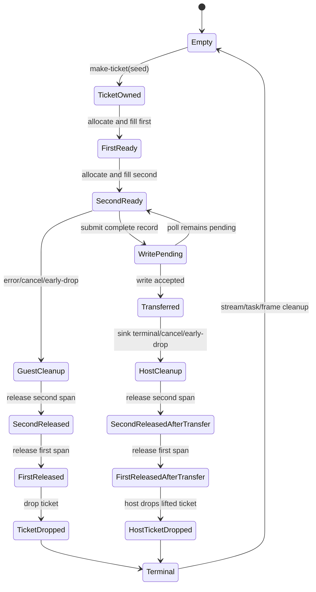

# G6.2 Private Two-List Owned-Record Producer Design

> Status: approved bounded design (2026-09-11). This document authorizes one
> private, fixed-shape producer route after the canonical probe succeeds. It
> does not open public ownership syntax or general producer lowering.

## Decision

Add one independent G6.2 route for a record containing two independently
allocated scalar lists and one owned resource:

```text
TwoListEntry {
    first: list<u32>,
    second: list<u32>,
    ticket: own<ticket>,
}
```

The route is intentionally separate from the existing
`record-resource-list-owned-record-stream-producer` route. It extends the
existing immutable `ProducerContract` with two `ListAllocation` facts; it does
not generalize list lowering, ownership syntax, or producer expressions.

## Alternatives

| Option | Decision | Reason |
| --- | --- | --- |
| A. Two `list<u32>` fields plus one `own<ticket>` | **Selected** | Exercises independent list backing allocations and their cleanup while reusing the measured scalar-list and single-owned-resource contracts. |
| B. One list plus two owned tickets | Deferred | Multiple owned leaves are already covered by pair/triple routes; it adds less new evidence than a second list allocation. |
| C. Nested record containing two lists | Deferred | Combines nested paths with multiple allocations and would expand two separate boundaries in one route. |

## Goals

The gate must establish all of the following for one pinned descriptor:

- canonical layout for two indirect `list<u32>` fields followed by one
  `own<ticket>` field;
- two separately measured list backing spans, each with bounded length `0..3`;
- complete record construction before transfer commit;
- exactly-once release of both list spans and exactly-once ticket cleanup on
  every terminal path;
- generated WIT/Core WAT parity with a hand-authored canonical probe;
- current-toolchain Component validation and Rust/Wasmtime lifecycle evidence.

## Scope and non-goals

The route includes only:

- one new private `do:` descriptor and one pinned WIT world;
- one `ticket` resource and one `TwoListEntry` record;
- `first: list<u32>`, `second: list<u32>`, and `ticket: own<ticket>` in that
  exact order;
- one synchronous source `make-ticket(seed: u32) -> own<ticket>` import;
- one asynchronous sink consuming `stream<two-list-entry>`;
- a capacity-one stream and at most one record per invocation;
- fixed list lengths and values selected by a private mode table;
- ready, pending, sink-error, cancellation, early-drop, repeat, and invalid
  lifecycle modes.

This route does not:

- add public `own<T>`, `borrow<T>`, `ref<T>`, `borrow_mut<T>`, pointer, or
  lifetime syntax;
- change the Do value model, GC contract, or cancellation rollback semantics;
- add generic producer IR or arbitrary producer expressions;
- add list-of-resource elements, variants, nested records, borrowed payloads,
  or additional owned leaves;
- change an existing G6.2 route, the default compiler route, or the GC
  inventory;
- claim full WASI, full P3 host binding, or general async/resource lowering.

## Pinned WIT surface

The canonical probe and generated output must use this exact WIT text,
including the final newline:

```wit
package do:g6-2-owned-record-two-list-producer@0.1.0;

interface types {
  enum error-code { io, pipe, invalid-mode }
  resource ticket {}
  record two-list-entry {
    first: list<u32>,
    second: list<u32>,
    ticket: own<ticket>,
  }
}

interface source {
  use types.{ticket};
  make-ticket: func(seed: u32) -> own<ticket>;
}

interface sink {
  use types.{error-code, two-list-entry};
  consume-via-stream: async func(
    data: stream<two-list-entry>
  ) -> result<_, error-code>;
}

world owned-record-two-list-producer {
  use types.{error-code};
  import source;
  import sink;
  export produce: async func(mode: u32) -> result<_, error-code>;
}
```

The implementation must calculate the SHA-256 of this exact text and store it
in the new registry row. A changed text or hash must reject admission.

The proposed descriptor identifiers are:

| Item | Exact value |
| --- | --- |
| package | `do:g6-2-owned-record-two-list-producer@0.1.0` |
| source instance | `do:g6-2-owned-record-two-list-producer/source@0.1.0` |
| sink instance | `do:g6-2-owned-record-two-list-producer/sink@0.1.0` |
| world | `owned-record-two-list-producer` |
| source member | `make-ticket` |
| sink member | `consume-via-stream` |
| export member | `produce` |
| descriptor effect | a new distinct private two-list producer effect |

## Exact Do adapter shape

The accepted Do source is an adapter sentinel. Its body is not interpreted as
general producer code:

```do
make_ticket = @host_func("do:g6-2-owned-record-two-list-producer/source@0.1.0", "make-ticket", (u32) -> Ticket)
consume = @host_async_func("do:g6-2-owned-record-two-list-producer@0.1.0", "consume-via-stream", (StreamWriter<TwoListEntry>) -> Result<nil, ProducerError>)
Ticket = @wasi_resource("do:g6-2-owned-record-two-list-producer/source/ticket", { .id i64 })
TwoListEntry {
    .first [u32]
    .second [u32]
    .ticket Ticket
}
ProducerError error = Io | Pipe | InvalidMode
produce(mode u32) -> Result<nil, ProducerError> { return Ok() }
start() {}
```

Admission requires exactly two host bindings, one resource declaration, one
record declaration, one error declaration, one `produce`, one `start`, and no
`async` token or `@async`, `@await`, or `@cancel` intrinsic. The private
template supplies the Component async export.

## Canonical ABI target

The values below are required targets and must be measured by the independent
canonical probe with the current pinned toolchain. If any value differs, the
promotion stops and this design is revised; the emitter must not silently
adapt to the drift.

| Property | Required measured value |
| --- | --- |
| stream element | `two-list-entry` |
| record alignment | 4 bytes |
| record byte size | 20 bytes |
| `first.ptr` / `first.len` | `i32` at offsets 0 / 4 |
| `second.ptr` / `second.len` | `i32` at offsets 8 / 12 |
| `ticket` | `i32` at offset 16 |
| list element type | `u32` for both lists |
| list element stride | 4 bytes for both lists |
| list capacity | 3 items for each list |
| stream capacity | 1 |
| source core signature | `(i32) -> (i32)` |
| producer input words | `(i32 mode)` |
| canonical boundary | no Wasm GC reference type |

The record slot and both list backing spans are in linear memory. The two list
allocations are distinct cleanup facts, not one combined allocation and not
ownership leaves. The ticket is the only ownership leaf. All offsets, sizes,
capacities, and ownership paths are retained in the normalized contract and
must not be inferred again from Do tokens by the emitter.

## Normalized contract

The new registry effect maps to the existing immutable `ProducerContract`:

```text
payload = record TwoListEntry {
  first: list<u32>  { ptr:i32@0,  len:i32@4,  stride:4, capacity:3 },
  second: list<u32> { ptr:i32@8,  len:i32@12, stride:4, capacity:3 },
  ticket: i32@16,
}
ownership.leaves = [
  { path:[ticket], resource:ticket, handle_offset:16,
    drop_import:[resource-drop]ticket, bit:0 }
]
ownership.parents = []
list_allocations = [
  { path:[first],  pointer_offset:0, length_offset:4,
    element:u32, stride:4, capacity:3, release:cabi_realloc },
  { path:[second], pointer_offset:8, length_offset:12,
    element:u32, stride:4, capacity:3, release:cabi_realloc }
]
source = (i32) -> (i32)
sink.capacity = 1
terminal = task-return
```

Each list allocation path must be unique and must not overlap the ownership
path. The existing contract validation remains authoritative for complete
record writes, ownership masks, transfer timing, and terminal-stage ordering.

## Ownership, cleanup, and cancellation

The source creates the ticket, then allocates and fills `first`, then allocates
and fills `second`. Before transfer, backing spans are released in reverse
allocation order (`second`, then `first`), followed by the ticket drop. After a
successful transfer, the guest releases both backing spans exactly once and
does not drop the ticket; the host drops the lifted ticket exactly once.



Required invariants:

1. `mode = 255` is rejected before stream, task, ticket, or either list
   allocation is created.
2. Every valid invocation calls `make-ticket` exactly once and writes the
   handle at measured offset 16.
3. Both list pointer/length pairs and every `u32` element stay within their
   measured capacity; a fourth element is never admitted.
4. A pending or failed complete-record write transfers no ownership.
5. A successful complete-record write atomically clears the ticket presence bit
   and marks the record transferred.
6. Before transfer, both list releases and the ticket drop occur exactly once.
7. After transfer, both guest list releases and the host ticket drop occur
   exactly once, with no guest ticket drop.
8. Stream, sink task/future, waitable membership, and frame cleanup remain
   exactly once on every terminal path.
9. Cancellation does not roll back a list write or any external effect already
   accepted by the sink.

## Mode and evidence matrix

The private template must cover empty, non-empty, pending, sink-error,
cancel-before-transfer, cancel-after-transfer, early-drop-before-transfer,
early-drop-after-transfer, repeat, and invalid modes. Each valid mode creates
one ticket and two list allocations. The repeat mode runs the sequence twice;
the invalid mode creates none. Rust/Wasmtime assertions must include list
values for both fields, ticket observations, exactly-once release/drop counts,
pending-future cancellation, and `table-empty=true`.

The implementation gate must include:

- canonical ABI WAT/WIT probe and generated/canonical byte parity;
- positive Do and Component gates;
- one-fact-per-fixture negative admission tests with no WAT emission;
- generated Rust/Wasmtime lifecycle tests for all mode rows;
- full project regression and standalone Zig tests;
- an inventory/documentation update that keeps this route private and does not
  change the public capability count.

## Negative boundary

The analyzer must reject before WAT emission, without falling through to an
existing route, when any of these facts changes:

- one or more than two list fields, field rename, field reorder, or an extra
  record field;
- either list changed from `list<u32>`, length above `3`, stride changed, or
  pointer/length offset changed;
- record size/alignment, stream element, stream capacity, or producer input
  changed;
- `ticket` changed to `borrow`, a non-resource, or a second owned leaf;
- nested, variant, list-of-resource, borrowed, or other payload shapes;
- descriptor/package/world/member/effect/hash/drop-import drift;
- asynchronous source, changed source arity/result, extra binding, or changed
  resource declaration;
- producer helper, branch, arbitrary expression, `@async`, `@await`, or
  `@cancel` in the sentinel body;
- any attempt to use public ownership/reference syntax or the default compiler
  route.

The negative gate must assert that no `.wat` or `.wit` output is emitted and
that no old producer route accepts the changed fixture.

