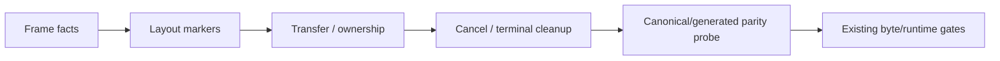

# G6.2 Canonical-to-Frame Probe 设计

日期: 2026-09-12
状态: D1 已批准；只读 probe，不迁移 producer route

## 1. 背景与目标

G6.2 的 12 个 producer route 目前仍以完整的 checked-in WAT template 为产物来源。
上一阶段已经验证了 runtime layout、ownership state、canonical binding 边界和 cleanup
文本，但这些事实仍分散在 template 注释、route-private 检查和 contract 中。下一步需要
先把事实收敛成机器可读表，再验证 template 可以被分解为稳定的 payload/lifecycle 片段。

本阶段目标是建立一个 **只读 canonical-to-frame probe**：

1. 为 12 个 template 保存经过源码/模板交叉核对的 frame、ownership、binding 和
   lifecycle facts；
2. 从现有模板文本中提取片段位置和 marker 值，验证事实表没有漂移；
3. 对 canonical WAT 与 generated WAT 做 byte-preserving segment 检查；
4. 用失败测试覆盖越界、overlap、缺失 state、batch alias 和 cleanup order 错误；
5. 不改变任何现有 WAT/WIT、route matcher、diagnostic、counter 或公开能力。

## 2. 方案裁定

### 2.1 采用：外部 facts + 只读文本 probe

事实表位于独立的 test-only Zig 模块，模板仍是唯一产物来源。probe 只读取 template
bytes，提取已有 `[producer-*]` marker 和 lifecycle anchor 的位置；它不解析或重写
WAT，也不把注释当作新的运行时 ABI。这样既能对 12 个 route 做统一门禁，又不会改变
byte-level golden contract。

### 2.2 不采用：在模板内加入新的 machine markers

给模板增加 marker 会直接改变 embedded WAT bytes，触碰当前 parity contract；已有注释
和 route constants 足以作为当前阶段的输入，因此不引入新模板文本。

### 2.3 不采用：现在创建 shared emitter/state IR

事实表和分解 probe 通过前，无法证明 nested/batched/list 的 state transition 可以用
同一 IR 表达。shared emitter、state IR 和 route migration 继续留在 deferred gate，不能
由本阶段通过事实表间接宣布完成。

## 3. 数据模型

`codegen_component_producer_mapping_probe.zig` 提供以下只读模型：

```text
FrameFact       { name, offset, width, alignment, role }
OwnershipFact   { encoding, guest_value, transferred_value, released_value, state_offset }
BindingFact     { name, canonical_offset, payload_size, frame_offset, width }
LifecycleFact   { name, required_text, ordered_anchors }
TemplateFact    { route_id, template_name, frame_size, frames, ownership, bindings, lifecycle }
```

`OwnershipFact.encoding` 区分 scalar state、mask state 和 batched scalar state；这避免
把 pair/triple 的 bit mask 错误地当成单值 state。`0` 仍是合法 offset/handle；不存在的
事实必须由缺失表项表达，不能用零哨兵代替。

probe 输出只包含借用输入的 `TemplateObservation`：marker 数、片段起止位置、插入区间
长度和 route id，不拥有或修改输入 bytes。

## 4. 分解与 parity 契约

每个 template 至少划分为以下逻辑片段：



- `Frame facts` 由事实表验证 frame size、field range、alignment 和 overlap；
- `Layout markers` 验证现有 numeric marker 与 facts 一致；
- `Transfer / ownership` 验证 transfer、state 和 exactly-once marker 的存在及顺序；
- `Cancel / terminal cleanup` 验证 post-transfer cancel anchor 和 child-before-parent
  cleanup 顺序；
- parity probe 要求 generated output 保留 canonical template 的前缀与后缀字节，允许
  仅在既有 metadata insertion point 增加 route metadata；若 prefix/suffix 任一字节
  漂移则失败。

probe 不宣称 WAT 语义等价，也不替代 Wasmtime execution gate。

## 5. 覆盖范围

事实表覆盖当前 12 个 checked-in template：

- owned-record: direct、list、two-list、pair、triple、nested、mixed、parameterized pair；
- C-min list: fixed、dynamic；
- scalar list；
- batched list。

每条 entry 都必须指定其真实 marker 集合；不得把 record-only marker 套到 C-min 或
scalar route。所有 route 的 `frame_size` 当前由 template 的 `$frame-alloc` 事实核对为
128，但仍逐 entry 保存，不通过全局默认推断。

## 6. 失败关闭规则

以下情况必须返回 probe error 且不得生成新产物：

- route/template 身份为空或 facts 数组为空；
- frame field 越界、未对齐、overlap；
- ownership state 缺失、编码不匹配或 batch 两组 alias 同一 frame 区间；
- canonical binding 越界或 frame binding 与另一个 binding overlap；
- required marker 缺失、numeric marker 与事实不一致、lifecycle anchor 顺序漂移；
- generated output 缺少 canonical prefix/suffix，或 canonical segment 出现多次；
- cleanup anchor 先于 child transfer/close anchor。

## 7. 非目标与 deferred gate

- 不公开 `own<T>`、`borrow<T>`、`ref<T>`，不改变 async/cancel 语义；
- 不生成 shared emitter、不删除 template、不迁移任何 route；
- 不开放 generic/arbitrary producer、filesystem/HTTP async 或 borrowed payload；
- 不把 probe 结果解释为完整 P3/WASI runtime completion。

只有以下证据全部通过，才可以另立 shared emitter/state IR 设计：

1. 12 条事实表均能由当前源码和 template marker 复核；
2. decomposition probe 在 canonical/generated 输出上通过且 byte parity 未变；
3. nested、pair/triple、two-list、batched 的 ownership/cleanup 负例全部锁定；
4. 新计划明确 route-by-route gate、失败回滚和无 silent fallback。

## 8. 验收

```text
zig test main.zig --test-filter "producer canonical frame probe"
zig test main.zig
zig build -Doptimize=ReleaseSmall
./src/build/test/run_tests.sh
git diff --check
```

本阶段实际证据：

- focused canonical-frame probe: `17/17` tests passed；
- `cd src && zig test main.zig`: `1612/1612` tests passed；
- `cd src && zig build -Doptimize=ReleaseSmall`: exit `0`；
- `./src/build/test/run_tests.sh`: `14/14 steps; 53/53 tests passed`；
- `git diff --check`: passed；未修改任何 WAT template 或生产 route。

因此 D1 的 facts/decomposition/parity gate 已关闭，但 shared emitter、state IR 和 route
migration 仍是 deferred，不能从 probe 结果推断为已实现。验证必须从 `src` 目录执行；若
从仓库根目录直接运行 `zig test src/main.zig`，现有相对 fixture 测试会产生
`FileNotFound`，该结果不作为源码回归证据。
