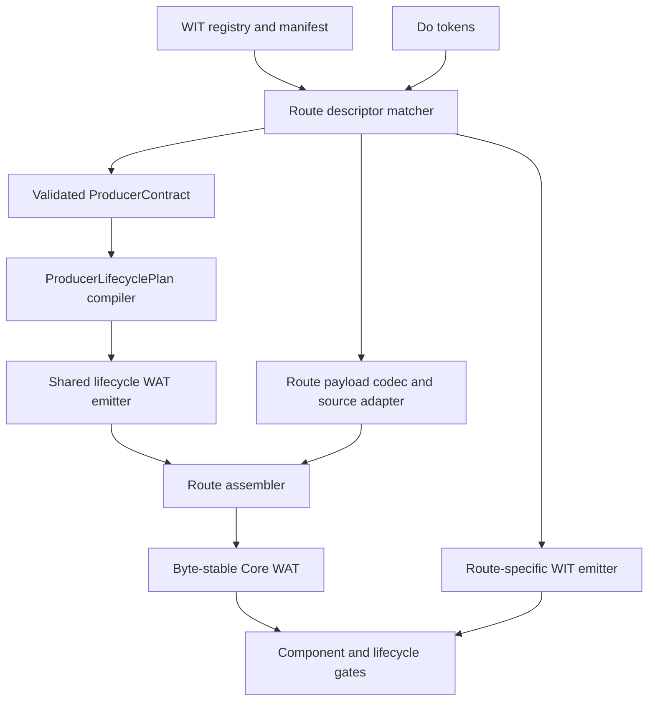

# G6.2 Producer Emitter 收敛设计

日期: 2026-09-12
状态: 方向已批准; 待书面 spec review; 未授权实现或扩大 compiler admission

## 1. 目标

让所有已接入 `ProducerContract` 的 private G6.2 producer route 共用一套确定性的
WAT lifecycle、ownership transfer 和 cleanup emitter。route 继续单独负责 descriptor
source matcher、payload 编解码和 WIT 文本，不新增公开类型、语法或受支持的 descriptor
shape。

当前有 12 个 `codegen_component_*producer.zig` 模块持有 `ProducerContract`，合计约
7130 行。归一契约已经集中描述 source/sink、payload、owned leaf、list allocation、
terminal action 和 cleanup order，但各 route 仍嵌入完整 WAT template，重复表达 transfer、
cancel、drop 和 frame cleanup 状态机。本阶段只消除这部分重复，不把内部归一化误称为
generic producer lowering。

## 2. 非目标

- 不开放 public `own<T>`、`borrow<T>` 或 `ref<T>`。
- 不支持 arbitrary producer expression、generic producer admission、borrowed async
  payload、variant payload、通用 filesystem async 或 HTTP async。
- 不改变 `@async`、`@await`、`@cancel` 和外部副作用的取消语义。
- 不迁移 `codegen_component_wasi_http.zig` 的 HTTP body producer，也不重构
  `codegen_component_stream_writer.zig` 的通用 stream writer lowering。
- 不改变 descriptor、manifest、WIT hash、Core ABI、diagnostic 或 GC inventory row。
- 不保留新旧 emitter 的运行时 fallback 或兼容开关。

## 3. 方案裁决

### A. Contract-driven lifecycle emitter (采用)

由共享模块把已验证的 `ProducerContract` 编译为不可变 lifecycle plan，再确定性生成
transfer、post-transfer cancel、terminal 和 cleanup WAT fragments。route assembler 注入
payload 专属 fragments，并保持最终 WAT/WIT byte parity。

收益是 ownership 状态机和 cleanup 顺序只有一个实现，同时保留逐 descriptor 的
fail-closed admission。代价是迁移期必须同时维护旧 snapshot 与新 fragment 组合，并逐
route 证明字节、诊断和 lifecycle 计数均不变。

### B. 继续复制完整 fixed-shape template (不采用)

单次改动最小，但每个新 shape 都复制 transfer/cancel/cleanup 状态机。一处修复无法自动
覆盖其他 route，长期增加 exactly-once cleanup 漂移风险。

### C. 直接建立 generic producer emitter 和 admission (不采用)

表达力最大，但会同时改变 matcher、payload lowering、ownership 和公开能力边界。
arbitrary expression 与 borrowed future/stream 尚未闭环，当前工具链证据也不能支持该
扩张。它必须是后续独立设计，不能借内部重构进入默认 route。

## 4. 架构



依赖方向固定为 `registry/tokens -> matcher -> validated contract -> lifecycle plan ->
shared emitter -> route assembler`。共享 emitter 不读取 lexer token、不查 registry、不猜
descriptor 或 layout；route assembler 不重新推断 ownership 和 cleanup order。

## 5. 组件边界

### 5.1 `ProducerLifecyclePlan`

新增内部 immutable plan，字段只来自通过 `validate_contract` 的 `ProducerContract`：

```text
ProducerLifecyclePlan {
  descriptor_id
  owned_slots: [OwnedSlot { bit, handle_offset, drop_import, path }]
  list_slots: [ListSlot { path, ptr_offset, len_offset, free_import }]
  transfer_commit: CompleteWriteOnly
  terminal: { close, abort?, cancel }
  cleanup_order
}
```

plan compiler 必须拒绝重复 bit/path、缺失 drop/free import、handle `0` absence sentinel、
transfer-before-complete-write、parent-before-child cleanup，以及契约未测量的 payload kind。
它不接受 lexer token 或 route-specific plan，因此不能扩大 source admission。

### 5.2 共享 lifecycle WAT emitter

新增扁平模块 `src/build/codegen_component_producer_emitter.zig`；plan 类型、
`from_contract` compiler 和 emitter 均放在该模块，不再增加中间模块。它只生成以下
确定性 fragments：

- ownership/list slot 初始化与 presence state；
- complete-write 后的 transfer commit；
- pre-transfer failure 的 reverse-acquisition cleanup；
- post-transfer cancel，不回滚已经提交的 host side effect；
- child、endpoint、waitable、frame 的 terminal cleanup；
- contract-derived audit markers。

共享 emitter 不生成 payload bytes、source call 参数、record/list 编码循环、WIT 或
Component metadata。所有 fragment 使用现有 `codegen_text.zig` 的稳定文本 API，禁止
route 自行拼出第二套 lifecycle 状态机。

### 5.3 Route adapter 和 assembler

每个现有 producer module 保留：

- 精确 descriptor lookup、hash 和 source-token matcher；
- route-specific error 到 `UnsupportedP3...` 的转换；
- payload layout 的额外精确约束；
- payload encode/decode 与 source parameter binding；
- WIT emitter 和 Component metadata。

assembler 只组合共享 lifecycle fragments 与 route payload fragments。不得在共享 emitter
失败时回退到旧完整 template；迁移失败时保持该 route 未迁移，并通过版本控制回滚本次
改动。

## 6. 数据流与状态不变量

1. matcher 先完成 descriptor、manifest hash、token topology 和 payload shape 校验。
2. `validate_contract` 成功后，plan compiler 才能生成 `ProducerLifecyclePlan`。
3. payload 完整写入 sink 后才能提交 owned resource 和 list backing transfer。
4. transfer 前失败按 reverse acquisition order 清理；owned child 必须先于 parent。
5. transfer 后 guest 清除对应 owner bit，不得再次 drop 已转交的 resource/list。
6. cancel 只终止尚未完成的 operation，不回滚已经提交给 host 或外部系统的副作用。
7. 每个 terminal path 按 contract 的 `resource`、`list`、`stream`、`future`、
   `subtask`、`waitable`、`frame` cleanup order 释放仍由 guest 持有的 stage，且
   ResourceTable 为空。
8. handle 值 `0` 是合法 resource handle，不得表示 absent。

## 7. 错误处理

- contract 或 plan 无效时必须在生成 WAT 前失败，并由 route 边界转换为现有精确
  `UnsupportedP3...` error；不得静默降级。
- route payload fragment 与 lifecycle plan 不匹配时视为 compiler contract error，测试
  必须锁定失败，不生成部分 artifact。
- 生成或 Component validation 失败时保留命令输出和该 route 的旧实现；不迁移依赖它的
  后续 route，但不阻断无依赖的文档或单元测试工作。
- 不改变用户可见 diagnostic 文本，除非后续另立诊断变更任务。

## 8. 迁移顺序

1. 冻结所有当前 contract-backed route 的 WAT/WIT bytes、hash、markers 和 lifecycle
   counter 基线。
2. 先为 plan compiler 与 shared emitter 写失败测试，再实现未接入生产 route 的纯模块。
3. 迁移 resource-only direct owned-record route，验证最小 owned leaf 状态机。
4. 迁移 two-list-owned-record route，验证多个 list allocation 与 resource 的 cleanup 顺序。
5. 分组迁移 pair/triple/nested、mixed/list、dynamic/batched/scalar route；每组通过后才删除
   对应重复 fragment。
6. 所有 contract-backed route 完成后，扫描并拒绝共享边界外残留的 lifecycle emitter。

迁移以 route 为原子单位。任一路线 byte parity 或 lifecycle gate 失败时，该路线保持旧
实现；不得通过放宽 snapshot、删除负例或改变计数完成迁移。

## 9. 验证与验收

每个迁移单元必须验证：

- plan/emitter Zig 单元测试，包含 invalid contract 和顺序错误负例；
- 迁移前后 WAT/WIT byte parity、descriptor hash 与 marker parity；
- 现有 compile-ok 和 compile-error fixtures，diagnostic 不变；
- 对应 Component parse/embed/new/validate gate；
- Rust/Wasmtime ready、pending、cancel、early-drop、repeat、invalid lifecycle matrix；
- resource/list exactly-once cleanup 和 `table-empty=true`；
- `cd src && zig test main.zig`；
- `./src/build/test/run_tests.sh`；
- `cd src && zig build -Doptimize=ReleaseSmall`。

最终验收条件：

1. 当前所有持有 `ProducerContract` 的 private producer route 均消费共享 lifecycle
   emitter；
2. route-specific 模块不再直接定义 transfer/cancel/terminal cleanup 状态机；
3. 所有既有 bytes、hash、diagnostic 和 runtime counters 保持不变；
4. 默认 route、公开语法、GC inventory 与 capability matrix 没有新增能力；
5. 文档明确区分“内部 emitter 收敛”与“generic producer admission”。

## 10. 后续边界

本设计闭环后，才单独评估 manifest-driven generic producer admission。后续设计必须重新
处理 arbitrary producer expression、payload kind 扩展、async buffer lifetime、borrowed
resource 工具链能力和公开语言映射；本设计的 shared emitter 不能作为这些能力已成立的
证据。
