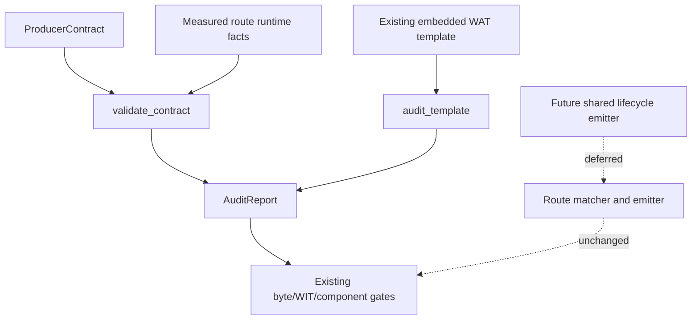

# G6.2 Producer Runtime Audit 设计

日期: 2026-09-12
状态: 方案 1 已裁定；本阶段 audit-only 已验证；共享 lifecycle emitter 迁移 deferred

## 0. 裁定与依据

现有 12 个 G6.2 producer route 仍主要通过完整的 `@embedFile` WAT template 产出。
模板中的 frame offset、ownership state、transfer loop、scheduler control flow 和
cleanup 顺序是 route-private facts；`ProducerContract` 中的 offset 则描述 canonical
payload。两者目前没有可证明的通用组合边界。

多个现有 equivalence gate 对 generated/canonical WAT 做字节级 `cmp`。在没有先完成
template decomposition 和 canonical-to-frame mapping 的情况下接入共享 emitter，会改变
golden bytes 或产生第二套 lifecycle 状态机。

因此本阶段采用 **方案 1：保持 WAT byte parity**：

- 只增加对既有 contract、measured runtime layout、canonical binding 和模板 lifecycle
  文本的只读审计；
- 不迁移 producer route，不删除或重写模板，不改变 WAT/WIT、diagnostic、runtime counter
  或公开能力；
- 共享 lifecycle emitter、模板拆解、state IR 另立设计和 gate，不能由本阶段的 audit
  结果推断为已经实现。

## 1. 当前目标与边界

### 1.1 目标

在不改变既有产物的前提下，建立一个可独立验证的审计边界，检查：

1. measured frame fields 的大小、对齐、边界和 overlap；
2. guest/transferred/released ownership states 的完整性和唯一性；
3. post-transfer cancel states 是否被 control-state 集合覆盖；
4. canonical payload offset 到 measured frame offset 的边界映射；
5. cleanup stage、symbol、offset 和 contract 顺序；
6. 12 个 checked-in template 的必要 lifecycle 片段、顺序、markers，以及 `__arc_`
   禁止残留。

### 1.2 非目标

- 不公开 `own<T>`、`borrow<T>`、`ref<T>`、`borrow_mut<T>` 或 lifetime syntax；
- 不开放 arbitrary producer expression、generic producer admission、borrowed async
  payload、variant payload、通用 filesystem async 或 HTTP async；
- 不改变 `@async`、`@await`、`@cancel` 或外部副作用取消语义；
- 不改变 descriptor、manifest、WIT hash、Core ABI、diagnostic、runtime counter 或 GC
  capability inventory 语义；新增 test-only ARC 词面时，仅补 `isolate_test_only` 分类行；
- 不引入 emitter fallback、兼容开关或第二套 template family。

## 2. 已落地的 audit API

实现文件为 `src/build/codegen_component_producer_runtime_audit.zig`，测试文件为
`src/build/codegen_component_producer_runtime_audit_test.zig`。`src/main.zig` 仅加入测试
root import，不改变 installed compiler dispatch。

### 2.1 事实模型

```text
RuntimeField {
  name, offset, width, alignment, role
}

OwnershipState {
  name, value, kind = guest_owned | transferred | released
}

ControlState { name, value }

CanonicalBinding {
  name, canonical_offset, payload_size, frame_offset, width
}

CleanupStep { stage, symbol, offsets }

RuntimeAudit {
  route_id, frame_size, fields, ownership_states, control_states,
  post_transfer_cancel_states, bindings, cleanup_steps
}
```

`0` 是合法 offset 或 handle；缺失不能用 `0` 表示。`frame_size` 必须非零，所有 field
和 binding 都必须落在 frame 内并满足对齐要求。field 区间不得 overlap。

### 2.2 验证入口

```zig
pub fn validate(runtime: RuntimeAudit) AuditError!AuditReport
pub fn validate_contract(
    contract: producer_contract.ProducerContract,
    runtime: RuntimeAudit,
) AuditError!AuditReport
pub fn audit_template(template: []const u8, spec: TemplateAuditSpec) AuditError!void
```

`validate_contract` 先调用既有 `producer_contract.validate_contract`，再验证 measured
runtime，并要求 contract terminal cleanup stages 与 measured `CleanupStep` 完全同序。
`audit_template` 只检查已经嵌入的不可变文本，不解析或重写 WAT。

### 2.3 失败关闭规则

以下情况必须失败且不产生任何新 artifact：空 route id、零 frame size、越界或未对齐
offset、field overlap、重复或缺失 ownership state、重复 control state、未覆盖的
post-transfer cancel state、空 cleanup symbol、未知 cleanup offset、canonical/frame
binding 越界、cleanup 顺序不一致、缺失/禁止模板片段或 lifecycle 顺序漂移。

## 3. 模板覆盖清单

审计覆盖当前 checked-in 的 12 个 producer template，按事实形状分组：

- owned-record：
  `owned_record_stream_producer_template.wat`、`list_owned_record_stream_producer_template.wat`、
  `two_list_owned_record_stream_producer_template.wat`、
  `owned_record_pair_stream_producer_template.wat`、
  `owned_record_triple_stream_producer_template.wat`、
  `owned_record_nested_stream_producer_template.wat`、
  `mixed_owned_record_stream_producer_template.wat`、
  `parameterized_owned_record_pair_stream_producer_template.wat`；
- C-min list：`cmin_list_resource_producer_template.wat`、
  `cmin_dynamic_list_resource_producer_template.wat`；
- scalar list：`cmin_scalar_list_stream_producer_template.wat`；
- batched list：`cmin_batched_list_resource_producer_template.wat`。

各组只声明该模板真实存在的 marker：C-min list 不强行声明 record child marker；scalar
list 使用 `[producer-stream-item-slot]`。这避免了用错误 fixture 放宽或错误判定模板。

## 4. 架构与数据流



本阶段的审计模块不读取 lexer token、不查 registry、不选择 route、不生成 WAT，也不接受
任意 WAT 字符串。既有 route emitter 和 template 继续是唯一产物来源。

## 5. 验收

### 5.1 本阶段

- runtime audit focused suite 覆盖零 offset、边界、overlap、state、binding、cleanup
  顺序和模板文本审计；
- `zig fmt` 后 `cd src && zig test main.zig` 全量通过；
- `cd src && zig build -Doptimize=ReleaseSmall` 通过；
- `./src/build/test/run_tests.sh` 通过；
- `git diff --check` 无输出；
- 不出现 producer route、WAT/WIT、diagnostic、counter 或 capability matrix 的变化。

本轮实际验证结果：`zig test main.zig` 为 `1596/1596`，ReleaseSmall build 退出 `0`，
`run_tests.sh` 为 `14/14 steps; 53/53 tests passed`；ARC inventory 为
`rows=53 matches=490 unclassified=0 normal_route_matches=0`，生产依赖闭包为
`modules=158 forbidden=0`。

### 5.2 工具链残余风险

direct Rust ABI/equivalence gate 需要系统 Zig runtime archive（例如 `Scrt1.o`、
`libcompiler_rt.a`、`libunwind.a`）。若全局 cache 缺失，应使用仓库本地 cache 运行可用
验证，并把工具链 cache 阻断单独记录；不得把它误报为源码回归。

审计边界的残余风险：模板覆盖目前是显式列出的 12 个 `@embedFile`，未来新增模板不会
自动进入审计；`audit_template` 是 substring/order 检查，不能替代 WAT 解析或 runtime
semantic gate；binding 目前验证数值边界，不证明 frame offset 对应完整 field 区间。

## 6. Deferred：共享 emitter 设计和 gate

只有以下证据齐备后，才可另立实现计划：

1. 每个 route 的 canonical-to-frame mapping 已有可机器验证的事实表；
2. template decomposition 能在不改变 golden bytes 的情况下暴露 payload/lifecycle
   fragments；
3. transfer、post-transfer cancel、terminal cleanup 的 state IR 能表达批量 list 和
   nested ownership，并有 reverse-acquisition 与 exactly-once 证明；
4. 明确 byte parity 是否继续保留；若改为 semantic parity，必须重新批准完整的
   Component/runtime/diagnostic/counter 验收矩阵；
5. 新计划包含独立 route gate、失败回滚和无 fallback 规则。

在该 gate 关闭前，不得创建生产 `codegen_component_producer_emitter.zig`，不得删除
现有 template lifecycle，也不得声称“所有 route 已消费共享 emitter”。

## 7. 决策记录

方案 1 被选中是因为它可验证、可回滚且保持现有 byte-level contract。方案 2（允许
semantic parity 后重写生命周期）不是当前阶段的替代实现；它需要新的授权和完整的
state/mapping 证据。方案 3（直接 generic admission）会扩大公开能力，违反本阶段范围。
