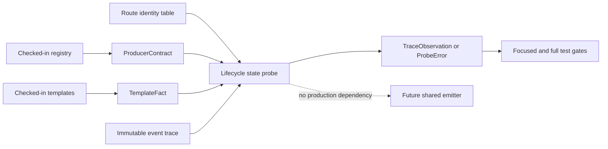
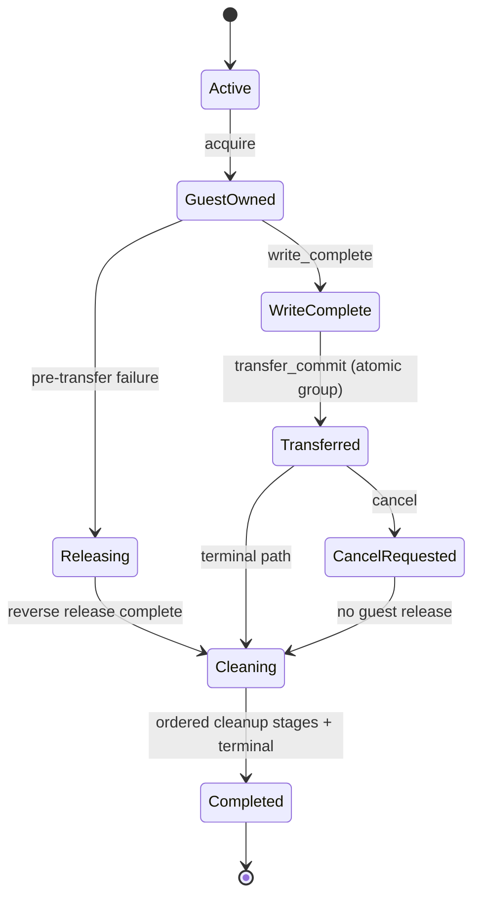

# G6.2 Producer Lifecycle State-IR Probe 设计

日期: 2026-09-13
状态: 方案 A 已批准; 书面设计待复核

## 1. 背景与目标

当前 12 条 G6.2 producer route 已有两层只读证据:

- `codegen_component_producer_contract.zig` 保存 source、sink、payload、ownership path、
  list allocation 和 terminal cleanup contract;
- `codegen_component_producer_mapping_probe.zig` 保存 template 的 frame、ownership state、
  canonical binding、marker 和 lifecycle anchor facts。

这两层能够检查静态布局和模板文本，但尚不能回答一个独立问题: 某条生命周期事件序列
是否会在 transfer 前泄漏 guest-owned 资产、transfer 后重复释放资产，或以错误顺序清理
nested/batched child 和 runtime parent。

本阶段新增一个 **test-only、只读、可执行的 lifecycle state IR probe**，目标是:

1. 从既有 `ProducerContract` 派生资源、list allocation、parent dependency 和 cleanup stage;
2. 从既有 `TemplateFact` 派生 ownership group 数量及其 scalar/mask/batched 编码;
3. 对 acquire、write-complete、atomic transfer、cancel、release、cleanup 和 terminal 事件执行
   失败关闭的状态转换;
4. 覆盖 12 条现有 route 的正常、transfer 前失败、transfer 后取消、repeat，以及
   nested/batched 特有路径;
5. 不改变模板、route、WAT/WIT、descriptor、diagnostic、counter 或公开语言能力。

该 IR 是共享 emitter 的前置证据，不是 production codegen IR，也不生成 WAT。

## 2. 方案裁定

### 2.1 采用: 独立的纯状态机 probe

新增扁平模块 `codegen_component_producer_lifecycle_state_probe.zig`。它接受调用方提供的
`ProducerContract`、`TemplateFact` 和不可变 event slice，先交给既有 validator 校验，
再执行纯状态转换。模块不读取 lexer、registry、文件或模板，不分配内存，不安装 codegen
hook，也不选择 producer route。

测试模块负责从 checked-in registry 取得当前 12 条 descriptor contract，并通过一张最小
身份表与 12 条 `TemplateFact.route_id` 连接。身份表只允许保存 `route_id`、descriptor
locator 和 member; WIT hash、offset、ownership bit、cleanup order 等事实不得复制进去。

收益是先建立可失败的生命周期契约，同时保持当前 byte parity 和 route 行为完全不变。

### 2.2 不采用: 直接迁移一条 production shared emitter route

直接迁移会同时改变状态机实现、模板字节和 route 输出，必须重新验证 Component、
diagnostic、counter 和 Wasmtime cleanup matrix。当前只有 mapping/decomposition 证据，尚无
可执行的状态转换门禁，因此回归面和回滚成本过高。

### 2.3 不采用: 每条 route 新增 lifecycle adapter

route-private adapter 改动较小，但会继续复制 12 套 transfer/cancel/cleanup 逻辑，无法证明
共同状态语义。后续创建 shared emitter 时仍需重做本阶段工作，因此不采用。

## 3. 事实所有权与模块边界



边界规则:

- `ProducerContract` 是资产拓扑和 terminal cleanup order 的唯一来源;
- `TemplateFact` 是 frame ownership group、encoding 和 state offset/value 的唯一来源;
- route identity table 只连接两个既有身份，必须 1:1 覆盖 12 条 route;
- event trace 是测试输入，只描述动作，不保存预期最终计数;
- probe 返回实际 observation，测试独立断言最终状态和计数;
- production producer module 不得 import lifecycle probe。

## 4. State IR

### 4.1 派生资产

probe 把 contract 转换为有界的逻辑资产集合:

- 每个 `OwnershipLeaf` 派生一个 `resource` asset，其成功写入 disposition 是
  `transfer_to_host`;
- 每个 `ListAllocation` 派生一个 `list_backing` asset，其成功写入 disposition 是
  `release_after_copy`;
- 当 `PayloadLayout` 是顶层 list 时，派生一个不与 `ListAllocation` 重复的 payload-list
  backing asset，disposition 同样是 `release_after_copy`;
- `OwnershipParent` 只形成 path dependency，不伪造 runtime drop 调用;
- stream、future、subtask、waitable 和 frame 由 `TerminalContract.cleanup_order` 表示。

当前 route 的 ownership group 数由 `TemplateFact.ownership.len` 给出。非 batched route 必须
恰好一组; batched route 的 group 数必须与 contract `batch_count` 相同。每个 group 都实例化
同一个 contract asset schema，但状态互不别名。

每个 group 的 asset index 是确定的：先按 `ProducerContract.ownership.leaves` 顺序放置
resource assets，再按 `list_allocations` 顺序放置 list-backing assets，最后在
`PayloadLayout.list` 且没有同一 allocation 已覆盖该 backing 时放置一个 payload-list
backing asset。重复的 pointer/length allocation 只产生一个 asset；asset schema 不从
`TemplateFact` 的 frame 数量推断。

资产数量和 group 数使用 `u64` bitset 表达，超过 64 时返回 `UnsupportedProbeBound`。这是
当前 12 条私有 route 的 test-only 上限，不是公开 producer 能力限制。

### 4.2 状态与事件

计划公开的最小模型为:

```text
AssetKind       = resource | list_backing
Disposition     = transfer_to_host | release_after_copy
AssetState      = absent | guest_owned | transferred | released
TerminalState   = active | cancel_requested | completed
AssetId         = { group_index, asset_index }

LifecycleEvent =
    acquire(AssetId)
  | write_complete(group_index)
  | transfer_commit(group_index)
  | cancel
  | release(AssetId)
  | cleanup_stage(CleanupStage)
  | terminal

LifecycleProgram = { route_id, contract, mapping, events }
TraceObservation = {
    acquired_count,
    transferred_count,
    released_count,
    cleanup_stage_count,
    terminal_state,
}
```

`LifecycleProgram` 及其 slice 全部借用调用方存储。probe 内部只维护固定大小 bitset、cleanup
cursor 和计数，不返回拥有型数据。

### 4.3 状态转换



转换规则:

1. `acquire` 只允许从 `absent` 进入 `guest_owned`; 同一资产重复 acquire 失败。
2. `write_complete` 要求该 group 的所有资产均为 `guest_owned`; 当前 12 条 route 不允许空
   资产 group，pure-scalar list 仍有 guest-owned payload-list backing。
3. `transfer_commit` 要求 write 已完整，并对 group 做一个不可中断的原子转换:
   `resource` 进入 `transferred`，`list_backing` 在清除 source slot 后进入 `released`。
   不提供单资产 transfer 事件，因而 IR 本身不能表达 half-transfer。
4. transfer 前失败只能以 event trace 记录的严格反向 acquisition 顺序 release
   guest-owned asset; contract path dependency 额外要求 child ownership 在后续 parent
   runtime cleanup 前消失。
5. transfer 后的 resource 归 host 所有，guest `release` 必须失败; 已释放的 list backing
   也不得再次 release。`cancel` 只改变控制状态，不回滚已发出的 host 操作，也不把
   transferred resource 改回 guest-owned。
6. `cancel` 在 active lifecycle 中最多出现一次。transfer 前 cancel 后必须先反向释放
   guest asset，transfer 后 cancel 不释放 host-owned resource; cancel 后禁止新的 acquire、
   write 或 transfer。
7. `cleanup_stage` 必须严格重放 `TerminalContract.cleanup_order` 这个**逻辑 contract 顺序**，
   每个 stage 恰好一次。它不是模板函数体的文本调用顺序；后者仍由现有 runtime audit 和
   Component/Rust/Wasmtime gate 证明。资产 release 和 runtime stage cleanup 分开计数，避免
   把条件式 resource/list cleanup 与 stage 顺序混为一件事。
8. `terminal` 只允许在没有 guest-owned asset、所有 group 已 transfer 或 release、cleanup
   stage 已完整执行时发生; duplicate terminal 失败。
9. repeat 通过两个全新的 state instance 验证，不允许复用 completed state 冒充第二次调用。
10. handle 值 `0` 继续是合法资源句柄; IR 只跟踪显式状态，不使用 handle 值作为 absent
   sentinel。

## 5. Route 与场景覆盖

12 条 checked-in route 必须全部通过 identity、contract、mapping 和 trace coverage。该 coverage
  验证 contract/mapping 能构造唯一资产图和合法 trace，不宣称模板逐指令已被 probe 解析:

- direct、mixed、nested、pair、parameterized pair、triple owned-record;
- list-owned-record、two-list-owned-record;
- fixed C-min list、dynamic C-min list、scalar list;
- two-batch C-min list。

每条 route 至少执行:

- 成功 acquire -> complete write -> atomic resource transfer/list-backing release -> ordered
  cleanup -> terminal;
- 在最后一个 acquire 后、transfer 前失败，并严格反向 release;
- transfer 后 cancel，证明 transferred asset 不发生 guest release;
- 两个全新 state instance 的 repeat，计数精确翻倍。

额外场景:

- pair/triple 验证 atomic group transfer，任何 partial acquisition 都不能 complete write;
- nested 验证 resource child ownership 在 parent runtime cleanup 前关闭;
- list-owned/two-list-owned 验证 resource 与一个或两个 list allocation 的反向释放;
- batched 验证第一组已 transfer、第二组 transfer 前失败时，两组状态隔离且第二组反向释放;
- scalar list 验证没有 resource leaf 时仍有 payload-list ownership 和完整 terminal cleanup。

## 6. 失败关闭与错误边界

probe 必须区分以下错误，且任何错误都不得继续 terminal 主路径:

- identity 缺失、重复或 12 条 coverage 不完整;
- contract 或 mapping validator 失败;
- group 数与 batched contract 不一致，或 group/asset index 越界;
- 重复 acquire、write incomplete、transfer before write、duplicate transfer;
- release order 错误、parent before child、guest release after transfer、duplicate release;
- cancel after terminal、duplicate cancel、cleanup stage 缺失/重复/乱序;
- terminal 过早或重复;
- probe 的 asset/group bitset 超出 64 位有界能力。

既有 validator 的具体错误在 probe 边界转换为 `InvalidContract` 或 `InvalidMapping`，但状态
转换错误保持细分，便于测试锁定故障原因。probe 不 catch 后继续，也不生成 fallback trace。

## 7. 证明边界

route scenario 是面向未来 shared emitter 的可执行契约。它证明 state model 可以无歧义地
表达当前 12 条 route 的 assets、group 和 terminal obligations，并能拒绝非法 trace。

它 **不解析现有 WAT 函数体，也不证明现有模板逐指令等于该 trace**。现有模板行为继续由
checked-in byte parity、Component validation 及 Rust/Wasmtime lifecycle gate 证明。若后续
shared emitter 消费本 IR，必须另外把 emitter output 与 IR event 对应关系纳入 route-by-route
runtime gate，不能仅凭本 probe 宣称迁移完成。

## 8. 测试与验收

实施必须遵循 TDD，先增加失败测试，再实现最小状态机。验收范围:

1. focused positive/negative state transition tests;
2. 12 条 route 的 identity 与 scenario matrix;
3. mapping probe、runtime audit 和 producer contract 既有测试无回归;
4. `zig test main.zig`、ReleaseSmall build、完整 integration harness 和 `git diff --check`。

标准命令:

```bash
cd src
TMPDIR="$PWD/../.tmp/do-tmp" \
ZIG_LOCAL_CACHE_DIR="$PWD/../.tmp/zig-cache" \
ZIG_GLOBAL_CACHE_DIR="$PWD/../.tmp/zig-gcache" \
zig test main.zig --test-filter "producer lifecycle state probe"

TMPDIR="$PWD/../.tmp/do-tmp" \
ZIG_LOCAL_CACHE_DIR="$PWD/../.tmp/zig-cache" \
ZIG_GLOBAL_CACHE_DIR="$PWD/../.tmp/zig-gcache" \
zig test main.zig

TMPDIR="$PWD/../.tmp/do-tmp" \
ZIG_LOCAL_CACHE_DIR="$PWD/../.tmp/zig-cache" \
ZIG_GLOBAL_CACHE_DIR="$PWD/../.tmp/zig-gcache" \
zig build -Doptimize=ReleaseSmall

cd ..
./src/build/test/run_tests.sh
git diff --check
```

## 9. 非目标与后续门禁

本阶段不做:

- production shared lifecycle emitter 或 route migration;
- template/WAT/WIT 重写，或从 byte parity 切换为 semantic parity;
- generic/arbitrary producer admission;
- public `own<T>`、`borrow<T>`、`ref<T>` 或其他语言语法;
- borrowed async payload、filesystem async 或 HTTP 扩展;
- 用 state probe 替代 Component/Rust/Wasmtime runtime cleanup gate。

只有本 probe 的 12-route matrix 和负例全部通过后，才可另立 shared emitter 设计。该设计仍
必须选择 byte parity 或经批准的 semantic parity，逐 route 迁移，并为每条 route 保留独立
Component/runtime/diagnostic/counter gate 和可回滚旧实现; 不允许 silent fallback。
