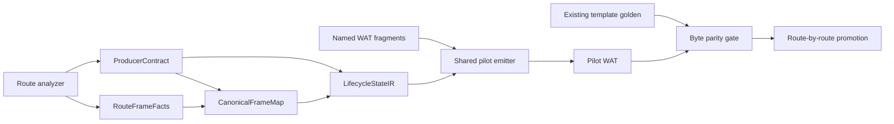

# G6.2 Shared Emitter and Lifecycle State-IR Pilot Design

日期: 2026-09-13
状态: 方案 A 已批准；本 spec 只定义 pilot，implementation plan 另立

## 1. 背景

G6.2 当前已有三类独立事实：

- `codegen_component_producer_contract.zig` 保存 source、sink、payload、ownership
  path、list allocation 和 terminal cleanup contract；
- `codegen_component_producer_mapping_probe.zig` 保存每条 route 的 frame、ownership
  encoding、canonical binding、marker 和 lifecycle anchor facts；
- `codegen_component_producer_lifecycle_state_probe.zig` 在固定 64-asset 上限内验证
  acquire、complete-write、atomic transfer、cancel、reverse release、cleanup 和
  terminal 的逻辑状态转换。

这些事实已经对 12 条 checked-in route 形成可执行的静态和生命周期证据，但生产 emitter
仍以 route-private 的完整 `@embedFile` WAT template 为主要产物来源。当前不能把 probe
误认为 production codegen，也不能直接把 12 条模板重写成一套未验证的通用状态机。

本阶段目标是建立一个**单 route、私有、可回滚的 production pilot**：以已有事实为输入，
让共享 fragment assembly 和 lifecycle state-IR 生成一份与现有产物字节完全一致的 WAT，
并以旧 route 作为 golden 对照。pilot 不改变默认 route，不开放新的语言能力。

## 2. 方案裁定

### 2.1 采用：byte-parity staged production pilot

pilot 只选择一个已经闭环的 direct owned-record producer route：
`do:g6-2-owned-record-producer@0.1.0 / consume-via-stream`，其 payload 是
`ResourceEntry { ticket: own<ticket> }`，stream capacity 为 `1`。它将：

1. 从 immutable route facts 构造 bounded `CanonicalFrameMap`；
2. 从 contract 和 mapping 构造静态 `LifecycleStateIR`；
3. 把现有 WAT 拆成有名字、有边界、可覆盖检查的 fragments；
4. 由共享 emitter 按 IR 和 fragment order 组装 pilot WAT；
5. 对旧 template 做 byte parity、WIT/hash、Component validation、diagnostic 和
   Rust/Wasmtime lifecycle 对照。

pilot 通过前，普通 `--p3-async-component` route 继续使用当前 emitter。pilot 通过后也
不自动推广到其他 route；每一条后续 route 都必须有自己的 facts、negative fixtures 和
parity/lifecycle gate。

### 2.2 不采用：semantic-parity rewrite

直接重写生命周期会允许更自由的 WAT，但会改变既有 bytes、marker、诊断和运行时观察面。
这需要重新批准完整 Component/runtime/diagnostic/counter 矩阵，当前没有足够收益抵消回滚
成本。

### 2.3 不采用：generic-first admission

先开放 arbitrary producer expression、generic producer、borrowed/variant payload 或
public ownership syntax 会越过当前 measured facts 边界。它们仍需各自的 design、WIT/ABI
probe、negative fixtures 和 runtime cleanup gate，不属于本 pilot。

## 3. 目标与非目标

### 3.1 目标

- 建立 production 可消费的、无堆分配的 bounded `CanonicalFrameMap`；
- 建立描述 transfer barrier、post-transfer cancel、reverse cleanup、nested/batched
  dependency 和 exactly-once obligations 的静态 `LifecycleStateIR`；
- 将一条 route 的 payload、lifecycle、metadata 组装为现有 golden WAT；
- 让 fragment coverage、mapping、state invariants 和 parity 都有失败测试；
- 保留显式 private pilot 入口、失败关闭和可回滚边界。

### 3.2 非目标

- 不改变默认 `--p3-async-component` dispatch、WAT/WIT bytes、descriptor/hash、diagnostic
  或 capability inventory；
- 不新增或公开 `own<T>`、`borrow<T>`、`ref<T>`、`borrow_mut<T>` 或 lifetime syntax；
- 不实现 generic producer、arbitrary producer expression、borrowed/variant payload、
  通用 list/resource lowering、通用 filesystem async 或 HTTP async；
- 不把 lifecycle state-IR probe 当作 runtime codegen parity 证据；
- 不删除、覆盖或静默替换现有 route template；
- 不引入 fallback：pilot 入口失败时返回明确的 admission/parity error，默认 route 的
  旧实现只作为尚未推广的独立路径存在。

## 4. 架构边界

生产共享层只依赖 immutable facts 和纯输入，不读取 lexer、registry 或文件系统，也不导入
`codegen_pipeline`。route analyzer 负责把已验证的 descriptor/source 形状转换为 facts；
shared emitter 只负责验证 facts、构造 IR、拼接 fragments 和返回 WAT。



### 4.1 Facts ownership

- `ProducerContract` 是 payload/ownership/list/terminal 事实的唯一来源；
- `RouteFrameFacts` 是 route measured frame、canonical binding、marker 和 lifecycle
  anchor 的唯一来源；
- `CanonicalFrameMap` 是一次性验证后的 route-local view，不复制 registry 或 lexer
  storage；
- `LifecycleStateIR` 只保存静态 transition/cleanup obligations，不拥有输入 slices；
- fragment table 只保存每个 fragment 的名称、来源区间、类别和 order；不保存第二份
  ownership 或 offset 事实。

当前 mapping probe 中的纯 fact 类型需要提取到 production leaf module；checked-in
12-route table、template parser 和 probe tests 继续留在 test-only 层。生产 route adapter
提供 direct pilot 所需的一组静态 `RouteFrameFacts`，不允许 emitter 自行扫描任意 WAT。

### 4.2 建议模块职责

实现 plan 必须保持以下单向依赖：

- `codegen_component_producer_facts.zig`: shared fact records 和 borrowed slice 类型；不
  读取 lexer/registry，不生成 WAT；
- `codegen_component_producer_state_ir.zig`: `CanonicalFrameMap`、`LifecycleStateIR`、
  invariant validator；只依赖 facts 和 `codegen_component_producer_contract.zig`；
- `codegen_component_producer_fragments.zig`: fragment descriptors、coverage/order
  validator 和 bounded assembly primitives；不依赖 route analyzer；
- `codegen_component_producer_emitter.zig`: pilot API，消费 contract/map/IR/fragments，
  生成 WAT；不导入 `codegen_pipeline`、lexer 或 registry；
- 现有 direct owned-record route adapter: 负责严格 source/descriptor admission 和
  事实提供，pilot 入口保持私有；
- test root: 提供 RED/GREEN、golden parity、negative、Component/Rust/Wasmtime 和
  full regression wiring。

如果实现中发现 shared fact extraction 不需要独立文件，必须在 implementation plan 中
说明理由并保持同样的依赖方向；不得把 test-only probe 直接作为 production dependency。

## 5. `CanonicalFrameMap`

`CanonicalFrameMap` 是 bounded、borrowed、immutable 的中间事实，至少包含：

```text
CanonicalFrameMap {
  route_id,
  frame_size,
  fields: []FrameField,
  bindings: []CanonicalBinding,
  ownership: []OwnershipEncoding,
  markers: []MarkerBinding,
  lifecycle: []LifecycleAnchor,
}
```

pilot 的输入边界定义为：

```text
PilotFacts {
  route_id,
  descriptor_id,
  contract: ProducerContract,
  frame_facts: []FrameFact,
  binding_facts: []CanonicalBinding,
  marker_facts: []MarkerBinding,
  lifecycle_facts: []LifecycleAnchor,
  fragments: []Fragment,
  golden_wat,
}

PilotInput {
  facts: PilotFacts,
  canonical_wit_hash,
}
```

`PilotFacts` 的所有 slice 都借用 route adapter 或静态常量的存储；`golden_wat` 只用于
parity comparator，不能作为 emitter 的单一完整输出 fragment。`FrameFact`、
`CanonicalBinding`、`MarkerBinding` 和 `LifecycleAnchor` 的字段来源于现有 mapping probe
事实提取，不允许在 emitter 内部重新扫描 lexer、registry 或任意 WAT。

验证规则：

1. 所有 field/binding 必须在 frame 或 canonical payload 的边界内，并满足 alignment；
2. field、binding 和 fragment 区间不得 overlap；
3. ownership state/bit 必须唯一且覆盖 transfer、released、post-transfer cancel 所需状态；
4. canonical offset `0` 和 resource handle `0` 都是合法值，缺失必须用显式空 entry 表示；
5. marker numeric value 必须与 measured fact 相等，marker 名称必须 route-specific；
6. route、descriptor、WIT identity 不匹配时 fail closed；
7. pilot 仅接受现有 direct owned-record route 的固定 `frame_size` 和 bounded asset/group
   上限，超过上限返回专用错误，不推断通用能力。

## 6. `LifecycleStateIR`

这是 production emitter 消费的**静态计划**，不是 test probe 的运行时状态存储。它至少
表达：

```text
LifecycleStateIR {
  groups: []LifecycleGroup,
  acquire_order: []AssetId,
  complete_write_barrier: []GroupId,
  transfer_commit: []AtomicGroupTransfer,
  post_transfer_cancel: CancelPlan,
  reverse_release: []AssetId,
  cleanup_order: []CleanupStage,
  terminal: TerminalPlan,
}
```

不变量必须在构造时失败关闭：

- 每个 group 的所有 asset 在 transfer 前必须完成写入；不得表达 half-transfer；
- resource asset 只能进入 `transferred`，list backing 只能进入 `released`；
- transfer 前释放严格按 acquisition reverse order；child ownership 在 parent cleanup 前
  完成；
- transfer 后 cancel 只能改变 control state，不回滚已发出的 host operation；
- cleanup stage 恰好一次且严格匹配 `TerminalContract.cleanup_order`；
- terminal 只能在 guest-owned asset 已清空、group 已 finalized、cleanup 已完成时发生；
- 重复 asset、重复 stage、重复 transfer、未知 marker、超过 64 asset/group 和 zero-as-
  absence sentinel 均拒绝。

`LifecycleStateIR` 的静态 event/state 语义必须与已完成的 probe 保持一致；probe 继续是
独立的 logical oracle，emitter gate 另验证 IR 到 WAT fragment 的对应关系。

## 7. Fragment assembly 与 pilot emitter

### 7.1 Fragment contract

每个 fragment 必须有：

```text
Fragment {
  name,
  kind = prefix | payload | lifecycle | metadata | suffix,
  source_span,
  required_markers,
  order,
}
```

pilot 的 fragment table 可以引用 immutable template source span 来完成第一阶段
decomposition，但必须满足：

- fragment 名称、类别和 order 是显式 facts，不在运行时扫描任意 WAT；
- 所有输出字节由 fragment assembly 产生，不能把完整 template 作为单个 fragment；
- prefix/suffix 与 golden template 完全相同；
- fragment spans 无 gap、无 overlap，且 coverage 恰好一次；
- marker/lifecycle order 由 `CanonicalFrameMap`/`LifecycleStateIR` 校验；
- 不把 metadata insertion 或 generated output 当作 canonical lifecycle fragment。

### 7.2 Pilot API

实现 plan 应提供等价于以下边界的私有 API（名称可按既有命名微调，但职责不得扩大）：

```zig
pub fn build_frame_map(input: PilotFacts) PilotError!CanonicalFrameMap
pub fn build_lifecycle_ir(
    contract: producer_contract.ProducerContract,
    frame_map: CanonicalFrameMap,
) PilotError!LifecycleStateIR
pub fn emit_pilot_wat(
    allocator: std.mem.Allocator,
    input: PilotInput,
) PilotError![]u8
```

IR/map 构造不分配；只有最终 WAT 输出允许使用调用方 allocator。所有输入 slices 在
调用期间保持有效，输出为调用方拥有的 buffer。

### 7.3 Dispatch and rollback

- pilot 由显式 private test/compiler entry 选择，并只接受一个 direct owned-record
  descriptor、一个 source shape 和一个 sink shape；
- 默认 route 不改 dispatch，不读取 pilot emitter；
- pilot 的 admission、mapping、fragment coverage、IR invariant 或 parity 任一失败都
  返回明确错误并且不产生 WAT/WIT artifact；
- 不允许把 pilot 失败静默降级到旧 emitter；
- 只有完整 pilot gate 通过并另行批准 route promotion 后，才可把该 route 接入默认 dispatch；
- rollback 是删除 private pilot dispatch 并恢复旧 route，旧 template 和旧 gate 必须仍然
  可用。

## 8. 验收门禁

### 8.1 Unit/structural gates

- facts extraction 与旧 mapping probe 的输出一致；
- valid map/IR 通过；空 identity、overlap、wrong binding、duplicate state、cleanup drift、
  invalid marker、batch alias、>64 bound 和 zero sentinel 负例均拒绝；
- fragment table 覆盖、order、marker ownership 和单完整 template fragment 负例均拒绝；
- lifecycle IR 对 transfer-before-write、partial group、post-transfer cancel、reverse
  cleanup 和 terminal guards 有直接失败测试。

### 8.2 Pilot artifact gates

- pilot WAT 与现有 direct route golden WAT 字节完全一致；
- WIT、descriptor/WIT hash、diagnostic 和 runtime counter 与现有 route 一致；
- current `wasm-tools` parse/Component embed/new/validate 通过；
- Rust/Wasmtime ready、pending、sink error、transfer-before/after cancel、early-drop、
  repeat 和 invalid cleanup matrix 通过，资源/list/frame exactly-once 且 `table-empty=true`；
- 生成结果不含 `__arc_`，且没有 Wasm GC reference 穿过 canonical boundary；
- default route、12 条既有 route 和 capability inventory 无变化。

### 8.3 Repository gates

```bash
cd src && zig test main.zig
cd src && zig build -Doptimize=ReleaseSmall
./src/build/test/run_tests.sh
./src/build/test/run_release_smoke.sh
git diff --check
```

所有命令使用仓库本地 Zig cache；Rust/Wasmtime gate 的系统 linker/cache 前提必须单独
记录，不能把环境缺失伪装成源码通过。

## 9. 阶段边界与后续入口

pilot 只证明一条 route 可以由共享 fragment/state-IR assembly 在不改变现有 bytes 的情况
下产出。它不证明：

- 12 条 route 已全部消费 shared emitter；
- arbitrary producer expression、generic producer 或 borrowed/variant payload 可 lower；
- 通用 async/resource、filesystem 或 HTTP 语义已经实现；
- public ownership syntax 或 lifetime system 已设计完成；
- semantic parity 可以替代 byte parity。

pilot gate 全部通过后，下一份独立 plan 才能处理第二条 route，并重新审查是否继续
byte parity。任何 semantic-parity、generic admission、public ownership 或 D2 general
async 扩展都必须另立 design 和 gate。

## 10. 决策记录

方案 A 被选中，因为它复用已经验证的 measured facts，保留现有 WAT byte contract，允许
route-by-route 回滚，且不会把 test-only probe 直接变成 production dependency。代价是第一
个 pilot 仍需要维护 fragment coverage 和 golden parity；这是为降低 production migration
风险接受的明确成本。

## 11. Task 6 Gate Evidence (2026-09-13)

当前工具版本：Zig `0.16.0`，`wasm-tools 1.258.0 (5c6d31c78 2026-08-24)`，
Wasmtime `48.0.1 (7bac2c277 2026-08-24)`。

- Zig unit gate：`(cd src && ... zig test main.zig)`，`1717/1717` passed，exit 0。
- Release build：`(cd src && ... zig build -Doptimize=ReleaseSmall)`，exit 0。
- Release smoke：`./src/build/test/run_release_smoke.sh`，exit 0。
- Formatting gate：`git diff --check`，exit 0。
- Full regression：`./src/build/test/run_tests.sh` 的 harness 子测试为
  `53/53` passed，但总 exit 1。唯一失败是 `check_gc_arc_inventory.sh` exit 2，
  因为新 pilot ARC-rejection guard 和 negative fixture 的 `__arc_` 文本未在
  `doc/gc_arc_inventory.tsv` 分类（源码证据：
  `src/build/codegen_component_producer_emitter.zig:57-58`、
  `src/build/codegen_component_producer_emitter_test.zig:163`）。这是
  source/inventory gate mismatch；本 Task 不扩大到 inventory 或 production
  emitter 改动。
- Artifact gate：临时 helper 直接调用 private
  `producer.emit_component_wat_pilot`，输出路径为
  `.tmp/task-6-evidence/private-pilot/pilot.wat`；该文件通过当前
  `wasm-tools parse`、`component embed`、`component new` 和
  `validate --features cm-async,cm-more-async-builtins`，均 exit 0。命令为
  `(cd src && ... zig run build/task_6_private_pilot_artifact_helper.zig --
  "$PWD/../.tmp/task-6-evidence/private-pilot/pilot.wat")`。descriptor
  identity 为 package `do:g6-2-owned-record-producer@0.1.0` / world
  `owned-record-producer`；WIT hash 为
  `6c1406962ee4c4e3eec5b3b4a866acfd1d8eb6ee159ce5b4077df113063d1ace`，pilot
  WAT hash 为 `095da7cd4c131a7318fc4bf5fd87b2d99e2672bff568edc577a553e228f856c5`。
  产物无 `__arc_`，canonical boundary 未发现 Wasm GC reference。helper 已
  在验证后删除。
- Rust/Wasmtime：既有 direct route gate 和 canonical/generated equivalence
  gate 在 repository-local Zig cache 下通过 10 个 lifecycle rows，均为
  `table-empty=true`，资源、stream、future cleanup exactly-once（repeat 为
  2 次）。首次运行因默认 `/home/_/.cache/zig` 缺少 `Scrt1.o`、libc/runtime
  archives 在 linker 阶段失败，已作为 environment evidence 保留，不作为运行时
  通过依据。
- Rollback/default：普通 `--p3-async-component` 输出与 checked-in WAT/WIT
  byte-for-byte 一致；pilot focused `13/13`、旧 producer focused `15/15`、
  旧 route Component gate 均通过，capability inventory 无 diff。实际 rollback
  在 `git archive HEAD` 临时 checkout 中把 `emit_component_wat_pilot` 替换为
  立即 `InvalidAdmission`，重建临时 compiler 后旧 route Component gate exit 0；
  这证明删除 private dispatch 后旧 route 仍可用，而非仅证明默认未使用。

因此本 spec 只关闭“单 route private pilot 的 artifact、focused runtime 和 rollback
证据”范围；完整 repository regression 仍有上述 ARC inventory mismatch，不能宣称
所有 Task 6 gates 全绿，也不能由 state-IR probe 单独宣称 runtime equivalence。
12-route migration、generic/arbitrary producers、public ownership syntax、
semantic-parity rewrite 和 D2 general async 保持 deferred。
