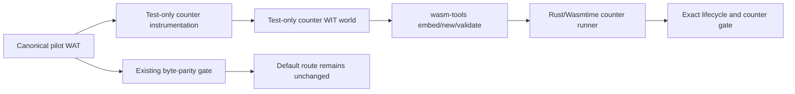

# G6.2 Pilot Runtime Counter Gate 设计

日期: 2026-09-14
状态: 已完成

## 1. 目标与边界

G6.2 shared emitter/state-IR single-route private pilot 的静态 map/IR、WAT/WIT
byte parity、Component 验证、Rust/Wasmtime resource/stream/future 生命周期和
rollback 已通过。当前唯一残留是 host runner 不能直接观察 pilot frame 的分配/释放，
也不能对 list backing 的计数给出运行时证据。

本 gate 只补齐 direct route 的 test-only runtime observation。它不改变:

- canonical WAT、canonical WIT、WIT hash 或默认 dispatch;
- `emit_component_wat` 的行为和公开 CLI;
- GC/ARC 路由、能力矩阵、`ProducerContract` 或公开 ownership 语法;
- generic/arbitrary producer、通用 async/resource lowering。

生产 artifact 仍必须保持现有 byte parity。计数器只注入到由 canonical pilot output
派生的、明确标记为 test-only 的 instrumented artifact，不能把 instrumented bytes
冒充 canonical bytes。

## 2. 证据契约

instrumented artifact 必须提供一个 test-only Component export:

```wit
runtime-counters: func() -> tuple<u32, u32, u32, u32>
```

返回值顺序固定为:

1. `frame_allocations`;
2. `frame_releases`;
3. `list_allocations`;
4. `list_releases`。

`runtime-counters` 是 Core-global async 边界的诊断接口，不作为 runtime gate 的
证据来源。Wasmtime Component async lift 后无法从该 export 稳定读取
producer-attributable 增量；runner 只能记录其原始值，不能据此关闭或否决 gate。

权威 runtime 证据是 counter world 新增的 test-only `runtime` import:

```wit
runtime-counter-event: func(kind: u32);
```

`$frame-alloc` 调用 `kind=1`，`$frame-free` 调用 `kind=2`。host runner 在
producer 调用前后隔离 callback 计数；direct route 的每次有效调用期望为:

```text
frame_allocations = invocation_count
frame_releases   = invocation_count
list_allocations = 0
list_releases    = 0
```

`invalid` 不创建 frame，四项均为 `0`。`repeat` 运行两个全新的 invocation，计数应
精确翻倍。Rust/Wasmtime runner 仍必须同时检查已有的 resource/stream/future counters
和 `ResourceTable` 为空；counter export 不能替代既有 lifecycle assertions。

如果 Component assembly 或 Wasmtime 当前 API 无法安装或观察该 callback，gate 必须
fail closed，保留失败证据；不得改用静态 WAT marker、tuple 值、推导 cardinality 或
其他 host 调用次数冒充 frame runtime observation。

## 3. 组件与数据流



### 3.1 Instrumentation

新增纯 helper `codegen_component_producer_runtime_counters.zig`，只接受已经通过
`emit_pilot_wat` 的 direct canonical WAT。它必须:

- 在唯一的 `$frame-alloc` / `$frame-free` 函数中发送 `runtime-counter-event`，并保留
  frame counter increment 供 tuple 诊断;
- 增加 list counter globals，但 direct route 不得产生 list allocation/release;
- 增加明确的 `runtime-counters` Core export;
- 对缺失、重复或漂移的 insertion anchors fail closed;
- 不修改输入 slice，不改变 canonical output;
- 给 instrumented output 加 test-only marker，便于脚本拒绝误用 canonical artifact。

instrumentation 不能从任意 WAT 文本猜测结构。入口必须先验证 direct route identity、
canonical hash 和既有 marker，再执行固定 anchor replacement。

### 3.2 Test-only WIT world

在 `examples/p3-runtime/wit/` 增加独立的 counter world。它复用原 world 的 source、
sink、types 和 `produce`，额外 import `runtime` 并保留 `runtime-counters` 诊断 export。
该 WIT 有独立 SHA-256，不能覆盖或修改 canonical WIT。

### 3.3 Runner

新增或扩展 Rust/Wasmtime test-only runner，安装 callback import，并在每个 mode 对
exact alloc/free callback delta 做断言。`runtime-counters` export 可读取为诊断，但不得
参与 pass/fail。runner 的 output 必须打印 `counter-source=component-callback` 和原始
callback 值，避免把静态期望误读为运行时观察。

## 4. Gate 矩阵

至少覆盖现有 direct route 的十个 mode:

| mode | invocation | frame alloc/free | list alloc/free | 终态要求 |
| --- | ---: | ---: | ---: | --- |
| ready | 1 | 1/1 | 0/0 | result + table empty |
| pending | 1 | 1/1 | 0/0 | result + table empty |
| sink-error-before | 1 | 1/1 | 0/0 | error + table empty |
| sink-error-after | 1 | 1/1 | 0/0 | error + table empty |
| cancel-before-transfer | 1 | 1/1 | 0/0 | cancel + table empty |
| cancel-after-transfer | 1 | 1/1 | 0/0 | cancel + table empty |
| early-drop-before-transfer | 1 | 1/1 | 0/0 | drop + table empty |
| early-drop-after-transfer | 1 | 1/1 | 0/0 | drop + table empty |
| repeat | 2 | 2/2 | 0/0 | two terminal paths + table empty |
| invalid | 0 | 0/0 | 0/0 | rejected before resource/frame creation |

## 5. 失败与回滚

- canonical output 与 instrumented output 混用时，脚本立即失败;
- callback import 缺失、签名漂移、重复或无法安装时，gate 失败并保留 stderr;
- 任一 mode 的 observed callback delta 与 exact expectation 不一致时，gate 失败;
- counter gate 失败不改变默认 route，也不触发 silent fallback;
- rollback 只删除 test-only instrumentation/world/runner 接线，旧 direct lifecycle
  gate 必须仍能独立通过。

已解决的 tuple 诊断与 A 裁定（2026-09-15）:

- Wasmtime 1.258.0 的 `ready` tuple 读取前后均为 `12/0/0/0`，临时在
  `[async-lift]produce` 入口增加 `+100` 也不改变 after 值。因此 tuple 明确降级为
  async Component 边界诊断，不能代表 producer invocation。
- test-only Core callback 在八个单调用 mode 稳定观察 `1/1`，`repeat` 稳定观察
  `2/2`。用户选择 A：`mode=255` 在 `$frame-alloc` 前由 `[async-lift]produce`
  直接返回 `invalid-mode`；因此 `invalid` callback 为 `0/0`，并保持不创建
  frame/stream/resource 的原始契约。
- callback matrix 连同既有 lifecycle、ResourceTable empty 与 cancellation checks
  通过。它是 test-only private evidence，不改变 production ABI、canonical WAT/WIT、
  default dispatch 或公开语言能力。

## 6. 验收

实现完成必须提供:

1. instrumentation unit positive/negative tests;
2. test-only WIT Component parse/embed/new/validate;
3. Rust/Wasmtime 十模式 runtime callback matrix，明确标注 component callback source;
4. canonical WAT/WIT byte parity、默认 route 和旧 rollback gate 无变化;
5. `zig test main.zig`、ReleaseSmall、完整 `run_tests.sh`、release smoke 和
   `git diff --check` 通过;
6. 更新 G6.2 plan、Task 6 report、`start_here.md`、`master_plan.md`、
   `pending_blocked.md` 和 `CHANGELOG.md`，只有 runtime callback matrix 与全套 gates
   全绿才将残留标为关闭。

## 7. 非目标

本 gate 不做 shared emitter 第二条 route 迁移，不做 semantic parity 替换，不开放
`own<T>`/`borrow<T>`/`ref<T>`，不做 generic producer、通用 list、通用 async/resource
或 D2 filesystem/HTTP 扩展。
