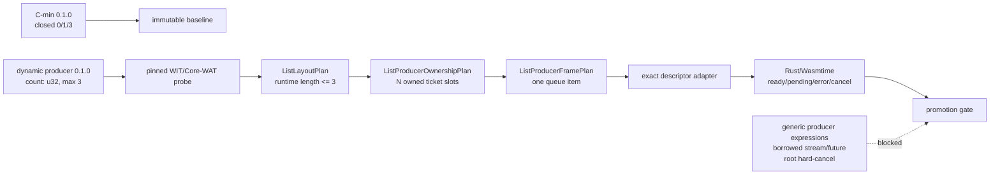

# G6.2 Bounded Dynamic List Producer Implementation Plan

> **For agentic workers:** REQUIRED SUB-SKILL: Use superpowers:subagent-driven-development (recommended) or superpowers:executing-plans to implement this plan task-by-task. Steps use checkbox (`- [ ]`) syntax for tracking.

**Goal:** Promote one new private producer descriptor that accepts a runtime `count` for one `stream<list<resource-entry>>` item, admits only `0..3`, and preserves the existing value-oriented Do surface and exactly-once resource cleanup.

**Architecture:** Keep the existing `do:g6-2-c-min-producer@0.1.0` descriptor immutable. Measure a new producer WIT/Core-WAT shape independently under `do:g6-2-c-min-dynamic-producer@0.1.0`, then generalize the pure list layout, ownership, and frame plans to validate a runtime length bounded by `3`. Add a separate exact-shape adapter and registry entry behind the existing opt-in `--p3-async-component` target; do not turn this into generic producer-expression lowering.

**Tech Stack:** Zig compiler (`src/build`), pinned WIT/Core-WAT canonical ABI probes, `wasm-tools 1.255.0`, Wasmtime `47.0.2`, Rust host runner, Do fixtures, shell gates, and the standard regression harness.

## Global Constraints

- The already-published C-min descriptor and its `0/1/3` closed-cardinality behavior remain unchanged.
- The new package locator is exactly `do:g6-2-c-min-dynamic-producer@0.1.0`; its WIT hash is measured and stored, never guessed.
- The new world exports `produce(count: u32)` and admits only runtime counts `0`, `1`, `2`, and `3`; `count > 3` returns `invalid-mode` before list allocation or ticket creation.
- The producer sends exactly one `stream<list<resource-entry>>` item through a capacity-one writer; a second item and a second transfer remain rejected.
- `own<ticket>` exists only inside the pinned WIT ABI. Do source still has no public `own<T>`, `borrow<T>`, `ref<T>`, pointer, reference, or lifetime syntax.
- Nested lists, borrowed fields, variants, arbitrary producer expressions, unbounded list lengths, helper composition, and root hard-cancel are outside this plan.
- Cancellation follows WIT/Wasmtime terminal semantics and never rolls back an external host effect already submitted to the sink.
- Hand-authored Core WAT and the Rust/Wasmtime runner are authoritative evidence for the new producer input ABI; compiler-generated output cannot be its only measurement source.
- Any probe, manifest, or runtime cleanup failure stops promotion at that gate; the existing C-min and full regression gates must remain green.

## Scope Boundary



This phase deliberately stops after one bounded dynamic descriptor. A later
phase may propose generic producer expressions only after this matrix is green.
The pinned `wasm-tools 1.255.0` matrix still rejects
`stream<record { ticket: borrow<ticket> }>` and `future<borrow<ticket>>` during
Component embedding, so borrowed async payloads are not a dependency of this
plan.

---

### Task 0: Freeze the post-C-min baseline

**Files:**
- Read: `doc/roadmap_status.md`
- Read: `doc/pending_blocked.md`
- Read: `doc/start_here.md`
- Read: `docs/superpowers/specs/2026-08-07-g6-2-c-min-list-resource-producer-design.md`

**Interfaces:**
- Baseline input: merged C-min PR and pinned toolchain versions.
- Baseline output: a clean, reproducible C-min gate before any new descriptor is added.

- [x] **Step 1: Confirm the C-min PR is merged or explicitly available as the execution base.**

Run `git fetch origin main`.
Run `git status --short --branch`.
Run `git log --oneline -5 origin/main`.

Do not start compiler changes from a stale base or from an unreviewed dirty
worktree. The local `re.md` resume note is not part of this phase.

- [x] **Step 2: Re-run the existing C-min gate and full baseline.**

Run `bash examples/p3-runtime/test_rust_g6_2_c_min_list_resource_producer.sh`.
Run `./src/build/test/run_tests.sh`.
Run `cd src && zig test main.zig`.

Expected: the C-min matrix passes; the standard regression reports
`pass=1120 fail=0 skip=3`; `zig test main.zig` passes all current tests. Any
failure is a prerequisite blocker, not a reason to broaden the new shape.

The pinned versions and probe hash belong to Task 1's new design document; do
not copy them from the old C-min package.

---

### Task 1: Measure the dynamic producer canonical ABI

**Files:**
- Create: `docs/superpowers/specs/2026-08-08-g6-2-c-min-dynamic-list-producer-design.md`
- Create: `examples/p3-runtime/wit/g6-2-c-min-dynamic-list-producer.wit`
- Create: `examples/p3-runtime/g6-2-c-min-dynamic-list-producer-canonical.wat`
- Create: `examples/p3-runtime/rust-host-runner/src/bin/g6_2_c_min_dynamic_list_producer_abi.rs`
- Create: `examples/p3-runtime/test_g6_2_c_min_dynamic_list_producer_abi.sh`
- Inspect: `examples/p3-runtime/test_g6_2_c_min_list_resource_producer_abi.sh`

**Interfaces:**
- Package: `do:g6-2-c-min-dynamic-producer@0.1.0`.
- World: `dynamic-list-producer`.
- Producer export: `produce: async func(count: u32) -> result<_, error-code>`.
- Sink member: `consume-via-stream: async func(stream<list<resource-entry>>) -> result<_, error-code>`.
- Source member: `make-ticket(seed: u32) -> own<ticket>`.

The WIT source must contain this exact shape:

```wit
package do:g6-2-c-min-dynamic-producer@0.1.0;

interface types {
  enum error-code { io, pipe, invalid-mode }
  resource ticket {}
  record resource-entry { ticket: own<ticket> }
}

interface source {
  use types.{ticket};
  make-ticket: func(seed: u32) -> own<ticket>;
}

interface sink {
  use types.{error-code, resource-entry};
  consume-via-stream: async func(data: stream<list<resource-entry>>) -> result<_, error-code>;
}

world dynamic-list-producer {
  use types.{error-code};
  import source;
  import sink;
  export produce: async func(count: u32) -> result<_, error-code>;
}
```

- [x] **Step 1: Write the design, WIT, and failing shell gate before the WAT and runner exist.**

The design must state the expected matrix, ownership transitions, and stop
conditions. The shell gate must fail on missing probe artifacts rather than
silently skip.

- [x] **Step 2: Run the red probe gate.**

Run `bash examples/p3-runtime/test_g6_2_c_min_dynamic_list_producer_abi.sh`.

Expected: failure naming the absent canonical WAT or Rust runner.

- [x] **Step 3: Implement the hand-authored producer Core WAT and host runner.**

The runner must print machine-checkable rows for:

| Mode | Expected list | Required result |
| ---: | --- | --- |
| `0` | `[]` | `Ok(())` |
| `1` | `[1]` | `Ok(())` |
| `2` | `[1, 2]` | `Ok(())` |
| `3` | `[1, 2, 3]` | `Ok(())` |
| `4` | `[]` | `Err(InvalidMode)`, zero tickets |

It must additionally cover pending sink completion, sink error, early drop,
source failure after partial ticket creation, cancellation before transfer,
and cancellation after transfer. Each admitted terminal path must end with an
empty `ResourceTable`, and the runner must distinguish transferred resources
from guest-owned resources.

- [x] **Step 4: Validate the independent producer ABI.**

Run `wasm-tools component wit examples/p3-runtime/wit/g6-2-c-min-dynamic-list-producer.wit`.
Run `sha256sum examples/p3-runtime/wit/g6-2-c-min-dynamic-list-producer.wit`.
Run `bash examples/p3-runtime/test_g6_2_c_min_dynamic_list_producer_abi.sh`.

Expected: the probe prints producer-specific pointer/length/stride/ticket
facts, validates the Component, and passes all dynamic count and cleanup rows.
If the producer layout differs from the old `64/68/4/0` facts, record the new
values and use them in every later task; never infer them from C-min 0.1.0.

- [x] **Step 5: Commit the independent evidence.**

Run `git add docs/superpowers/specs/2026-08-08-g6-2-c-min-dynamic-list-producer-design.md examples/p3-runtime/wit/g6-2-c-min-dynamic-list-producer.wit examples/p3-runtime/g6-2-c-min-dynamic-list-producer-canonical.wat examples/p3-runtime/rust-host-runner/src/bin/g6_2_c_min_dynamic_list_producer_abi.rs examples/p3-runtime/test_g6_2_c_min_dynamic_list_producer_abi.sh`.
Run `git commit -m "Probe bounded dynamic list producer ABI"`.

---

### Task 2: Generalize the pure bounded list plans

**Files:**
- Modify: `src/build/wit_abi_layout.zig`
- Test: `src/build/wit_abi_layout.zig`
- Modify: `src/build/wit_abi_ownership.zig`
- Test: `src/build/wit_abi_ownership.zig`
- Modify: `src/build/wit_abi_async.zig`
- Test: `src/build/wit_abi_async.zig`

**Interfaces:**
- Preserve `ListLayoutPlan.init(...)` and all C-min accepted-length behavior.
- Add `ListLayoutPlan.validate_runtime_length(length: u32)`, returning
  `LayoutError.InvalidListLength` when `length > capacity`.
- Keep `ListLayoutPlan.owned_slot_iterator(length)` as the only owned-slot
  enumerator; it must accept every `0 <= length <= capacity` after validation.
- Preserve `ListProducerOwnershipPlan.init(allocator, length, capacity, admitted_lengths)`
  and make `admitted_lengths` support either the old closed set or the dynamic
  range without weakening transfer/release guards.
- Preserve `ListProducerFramePlan` one-item queue transitions; add no second
  queue slot and no scheduler state.

- [x] **Step 1: Add failing layout tests for runtime lengths.**

Cover `0/1/2/3` as valid for capacity `3`, `4` as invalid, zero stride,
misaligned offsets, nested/borrowed elements, and the unchanged C-min closed
set `0/1/3`.

Run `cd src && zig test build/wit_abi_layout.zig --test-filter 'dynamic list producer'`.
Expected: only the new dynamic-length tests fail.

- [x] **Step 2: Add failing ownership and frame tests.**

Cover four live ticket states for lengths `0/1/2/3`, partial creation failure,
pre-transfer cancellation releasing exactly the created tickets, post-transfer
cancellation clearing source slots without guest drops, one queue item, and
child-before-parent cleanup.

Run `cd src && zig test build/wit_abi_ownership.zig --test-filter 'dynamic list producer'`.
Run `cd src && zig test build/wit_abi_async.zig --test-filter 'dynamic list producer frame'`.
Expected: the new tests fail while all existing C-min tests remain green.

- [x] **Step 3: Implement only the bounded pure-plan changes.**

Use early guards for `length > capacity`, invalid storage actions, missing owned
slots, duplicate release, and `maybe` joins. Do not import codegen modules or
add public ownership syntax to these leaves.

- [x] **Step 4: Run focused and complete pure-plan suites.**

Run `cd src && zig test build/wit_abi_layout.zig`.
Run `cd src && zig test build/wit_abi_ownership.zig`.
Run `cd src && zig test build/wit_abi_async.zig`.
Run `cd src && zig test build/codegen_component_async_plan.zig`.

Expected: old C-min suites and new dynamic suites pass together.

- [x] **Step 5: Commit the pure-plan generalization.**

Run `git add src/build/wit_abi_layout.zig src/build/wit_abi_ownership.zig src/build/wit_abi_async.zig`.
Run `git commit -m "Generalize bounded list producer plans"`.

---

### Task 3: Register the new descriptor and exact sema admission

**Files:**
- Modify: `src/build/p3_async_registry.json`
- Modify: `src/build/p3_async_manifest.zig`
- Modify: `src/build/sema_imports.zig`
- Test: `src/build/p3_async_manifest.zig`
- Test: `src/build/sema_imports.zig`

**Interfaces:**
- New locator: `do:g6-2-c-min-dynamic-producer@0.1.0`.
- New member: `consume-via-stream`.
- New lowering shape: `record_resource_list_stream_dynamic_producer`.
- Registry metadata must include the measured WIT hash, world name,
  `source.make-ticket`, sink canonical imports, resource drop path, list layout,
  capacity `3`, runtime count parameter `u32`, and invalid-count terminal.

- [x] **Step 1: Add failing manifest tests.**

Test valid metadata plus wrong WIT hash, wrong world, wrong list offsets,
wrong capacity, borrowed element, missing resource drop, unknown locator, and
an unbounded-count descriptor.

Run `cd src && zig test build/p3_async_manifest.zig --test-filter 'dynamic list producer'`.
Expected: the valid descriptor is not admitted yet; tampered cases remain
rejected.

- [x] **Step 2: Add the descriptor using only the fresh probe facts.**

Keep `do:g6-2-c-min-producer@0.1.0` unchanged. The new descriptor must be a
separate JSON entry with a separate package hash and exact world/signature
identity.

- [x] **Step 3: Add exact sema shape matching.**

Admit only two host bindings, one `Ticket` resource path, one `ResourceEntry`
record, one `ProducerError` union, and `produce(count u32)` with no `async`,
`@async`, `@await`, or `@cancel` in the source. Reject extra parameters,
different count types, arbitrary list expressions, and all unregistered
locators with the established unsupported descriptor diagnostics.

- [x] **Step 4: Run manifest and sema suites.**

Run `cd src && zig test build/p3_async_manifest.zig`.
Run `cd src && zig test build/sema_imports.zig`.

Expected: existing manifest/sema counts do not regress; the new valid row is
admitted and all drift rows fail closed.

- [x] **Step 5: Commit registry/sema admission.**

Run `git add src/build/p3_async_registry.json src/build/p3_async_manifest.zig src/build/sema_imports.zig`.
Run `git commit -m "Admit bounded dynamic list producer descriptor"`.

---

### Task 4: Add the isolated compiler adapter

**Files:**
- Create: `src/build/cmin_dynamic_list_resource_producer_template.wat`
- Create: `src/build/codegen_component_dynamic_list_resource_producer.zig`
- Modify: `src/build/codegen_component_async.zig`
- Modify: `src/build/codegen_component_async_plan.zig` only if dispatcher data is required
- Create: `examples/p3-runtime/g6-2-c-min-dynamic-list-resource-producer.do`
- Create: `examples/p3-runtime/test_do_g6_2_c_min_dynamic_list_resource_producer.sh`
- Test: `src/build/codegen_component_dynamic_list_resource_producer.zig`

**Interfaces:**
- Adapter entry: `DynamicListResourceProducerPlan.analyze(tokens, registry)`.
- Emitter entries: `emit_component_wat(...)` and `emit_component_wit(...)`.
- Dispatcher input: the new exact registry shape only.
- CLI target: reuse opt-in `--p3-async-component`; default ordinary `do build`
  continues to reject unsupported async lowering.

- [x] **Step 1: Add positive and negative adapter tests before wiring emission.**

Positive source must be exactly:

```do
make_ticket = @host("do:g6-2-c-min-dynamic-producer/source@0.1.0", "make-ticket", (u32) -> Ticket)
consume = @host_func("do:g6-2-c-min-dynamic-producer@0.1.0", "consume-via-stream", (StreamWriter<[ResourceEntry]>) -> Result<nil, ProducerError>)
Ticket = @wasi_resource("do:g6-2-c-min-dynamic-producer/source/ticket", { .id i64 })
ResourceEntry {
    .ticket Ticket
}
ProducerError error = Io | Pipe | InvalidMode

produce(count u32) -> Result<nil, ProducerError> {
    return Ok()
}

start() {}
```

Negative cases must cover unknown package version, `StreamWriter<u8>`, borrowed
entry, an extra host binding, `count i64`, a second producer parameter, and a
source `async`/`@await` token.

- [ ] **Step 2: Run the adapter tests red.**

Sequencing note: the adapter tests and implementation were recovered together
from the interrupted Inline Execution work. A separate pre-implementation red
run was not recorded, so this checkbox remains open rather than claiming a
red-green cycle that cannot be evidenced.

Run `cd src && zig test build/codegen_component_dynamic_list_resource_producer.zig`.

Expected: exact-shape positive tests fail before the adapter is implemented;
existing `codegen_component_async.zig` tests remain green.

- [x] **Step 3: Implement the adapter with early guards.**

The adapter must load only the new descriptor, construct the bounded layout,
ownership, and frame plans, and substitute the runtime `count` into the
hand-authored template. It must reject `count > 3` through the private
`invalid-mode` terminal before calling `make-ticket`; it must not generate a
general loop over an unbounded list.

- [x] **Step 4: Wire one dispatcher branch and inspect generated markers.**

Run `bash examples/p3-runtime/test_do_g6_2_c_min_dynamic_list_resource_producer.sh`.

Expected: WAT and WIT markers show the measured dynamic layout, one queue item,
runtime maximum `3`, and child-before-parent cleanup. The old C-min fixture and
consumer boundary fixture must remain unchanged.

- [ ] **Step 5: Commit the isolated compiler adapter.**

Run `git add src/build/cmin_dynamic_list_resource_producer_template.wat src/build/codegen_component_dynamic_list_resource_producer.zig src/build/codegen_component_async.zig examples/p3-runtime/g6-2-c-min-dynamic-list-resource-producer.do examples/p3-runtime/test_do_g6_2_c_min_dynamic_list_resource_producer.sh`.
Run `git commit -m "Lower bounded dynamic list producer"`.

---

### Task 5: Add the compiler-generated Component/Rust/Wasmtime gate

**Files:**
- Create: `examples/p3-runtime/rust-host-runner/src/bin/g6_2_c_min_dynamic_list_producer.rs`
- Create: `examples/p3-runtime/test_rust_g6_2_c_min_dynamic_list_producer.sh`
- Modify: `examples/p3-runtime/rust-host-runner/Cargo.toml` only for the binary target

**Interfaces:**
- Runner input: `<component.wasm> <count> <mode>` where mode selects ready,
  pending, sink-error, early-drop, source-failure, cancel-before-transfer, or
  cancel-after-transfer.
- Runner output: `count`, entries, host-calls, pending-polls, stream-drops,
  resource-created, resource-drops, cancel-calls, and `table-empty`.

- [x] **Step 1: Add shell assertions before the compiler-generated component exists.**

The gate must assert:

| Case | Entries | Resource rule |
| --- | --- | --- |
| ready `0/1/2/3` | exact `[1..count]` | all transferred entries end with an empty table |
| invalid `4` | empty | zero ticket creation |
| pending | exact entries | one pending poll and one terminal cleanup |
| sink error | exact entries | no guest double-drop after transfer |
| early drop | exact entries | one stream drop and empty table |
| source failure | prefix only | every created guest ticket released once |
| cancel before transfer | empty or partial prefix | guest-owned tickets released once |
| cancel after transfer | exact entries | transferred tickets not guest-dropped |

- [x] **Step 2: Run the runtime gate red.**

Run `bash examples/p3-runtime/test_rust_g6_2_c_min_dynamic_list_producer.sh`.

Expected: it stops because the compiler-generated Component or runner binary
does not yet exist, not because the test silently skips.

- [x] **Step 3: Implement the runner using the existing `ResourceTable` conventions.**

The host must count every create/drop, preserve the source/stream ownership
boundary, and treat a non-empty table or duplicate drop as failure. It must not
claim that dropping the root `call_concurrent` future hard-cancels the guest
task; only measured guest/child cancellation paths are admitted.

- [x] **Step 4: Run the complete dynamic runtime matrix.**

Run `bash examples/p3-runtime/test_do_g6_2_c_min_dynamic_list_resource_producer.sh`.
Run `bash examples/p3-runtime/test_rust_g6_2_c_min_dynamic_list_producer.sh`.
Run `rustfmt --edition 2021 --check examples/p3-runtime/rust-host-runner/src/bin/g6_2_c_min_dynamic_list_producer.rs`.

Expected: every admitted terminal path reports `table-empty=true`, counts
`0/1/2/3` preserve order, and count `4` creates no ticket.

- [ ] **Step 5: Commit the runtime gate.**

Run `git add examples/p3-runtime/rust-host-runner/src/bin/g6_2_c_min_dynamic_list_producer.rs examples/p3-runtime/test_rust_g6_2_c_min_dynamic_list_producer.sh examples/p3-runtime/rust-host-runner/Cargo.toml`.
Run `git commit -m "Test dynamic list producer runtime cleanup"`.

---

### Task 6: Add fail-closed Do fixtures and documentation

**Files:**
- Create: `src/build/test/check/450_g6_2_c_min_dynamic_list_resource_producer.do`
- Create: `src/build/test/compile_err/450_g6_2_c_min_dynamic_list_producer_unregistered.do`
- Create: `src/build/test/compile_err/450_g6_2_c_min_dynamic_list_producer_unregistered.expect`
- Create: `src/build/test/compile_err/451_g6_2_c_min_dynamic_list_producer_count_type.do`
- Create: `src/build/test/compile_err/451_g6_2_c_min_dynamic_list_producer_count_type.expect`
- Create: `src/build/test/compile_err/452_g6_2_c_min_dynamic_list_producer_second_item.do`
- Create: `src/build/test/compile_err/452_g6_2_c_min_dynamic_list_producer_second_item.expect`
- Create: `src/build/test/compile_err/453_g6_2_c_min_dynamic_list_producer_borrowed.do`
- Create: `src/build/test/compile_err/453_g6_2_c_min_dynamic_list_producer_borrowed.expect`
- Modify after green gates: `doc/roadmap_status.md`, `doc/pending_blocked.md`, `doc/start_here.md`, `CHANGELOG.md`

**Interfaces:**
- Positive fixture uses only the exact new locator and `produce(count u32)`.
- Negative fixtures must report the established unsupported descriptor diagnostic
  before WAT emission; they must not degrade into generic parser errors.

- [ ] **Step 1: Add positive and negative fixtures before final promotion.**

The positive fixture checks the new descriptor under `--p3-async-component`.
Negative fixtures cover unregistered package version, non-`u32` count, a second
stream item, and a borrowed stream entry.

- [ ] **Step 2: Run each negative fixture directly.**

Run `./bin/do build src/build/test/compile_err/450_g6_2_c_min_dynamic_list_producer_unregistered.do --p3-async-component -o /tmp/450.wat`.
Run `./bin/do build src/build/test/compile_err/451_g6_2_c_min_dynamic_list_producer_count_type.do --p3-async-component -o /tmp/451.wat`.
Run `./bin/do build src/build/test/compile_err/452_g6_2_c_min_dynamic_list_producer_second_item.do --p3-async-component -o /tmp/452.wat`.
Run `./bin/do build src/build/test/compile_err/453_g6_2_c_min_dynamic_list_producer_borrowed.do --p3-async-component -o /tmp/453.wat`.

Expected: all four fail with their `.expect` substrings and produce no WAT.

- [ ] **Step 3: Run the positive Do/component boundary gate.**

Run `bash examples/p3-runtime/test_do_g6_2_c_min_dynamic_list_resource_producer.sh`.
Run `bash examples/p3-runtime/test_do_g6_2_c_min_list_resource_producer.sh`.
Run `bash examples/p3-runtime/test_do_record_resource_list_stream_boundary.sh`.

Expected: the new dynamic descriptor passes and old consumer/C-min boundaries
remain unchanged.

- [ ] **Step 4: Update status only from fresh output.**

Record the new package hash, measured layout, accepted count range, runtime
matrix, and exact negative diagnostics. Keep generic producer expressions,
borrowed async payloads, public ownership syntax, and root hard-cancel in the
pending table.

- [ ] **Step 5: Commit fixtures and status documentation.**

Run `git add src/build/test/check/450_g6_2_c_min_dynamic_list_resource_producer.do src/build/test/compile_err/45*_g6_2_c_min_dynamic_list_producer* doc/roadmap_status.md doc/pending_blocked.md doc/start_here.md CHANGELOG.md`.
Run `git commit -m "Document bounded dynamic list producer gate"`.

---

### Task 7: Full verification and handoff

**Files:**
- Read: all plan/spec files above
- Verify: compiler, runtime, and documentation gates

- [ ] **Step 1: Run focused Zig tests.**

Run `cd src && zig test build/wit_abi_layout.zig`.
Run `cd src && zig test build/wit_abi_ownership.zig`.
Run `cd src && zig test build/wit_abi_async.zig`.
Run `cd src && zig test build/p3_async_manifest.zig`.
Run `cd src && zig test build/sema_imports.zig`.
Run `cd src && zig test build/codegen_component_async.zig`.
Run `cd src && zig test build/codegen_component_dynamic_list_resource_producer.zig`.

- [ ] **Step 2: Run canonical, Do, and Rust/Wasmtime gates.**

Run `bash examples/p3-runtime/test_g6_2_c_min_dynamic_list_producer_abi.sh`.
Run `bash examples/p3-runtime/test_do_g6_2_c_min_dynamic_list_resource_producer.sh`.
Run `bash examples/p3-runtime/test_rust_g6_2_c_min_dynamic_list_producer.sh`.
Run `bash examples/p3-runtime/test_rust_g6_2_c_min_list_resource_producer.sh`.

- [ ] **Step 3: Run the repository regression and build checks.**

Run `./src/build/test/run_tests.sh`.
Run `cd src && zig test main.zig`.
Run `cd src && zig build -Doptimize=ReleaseSmall`.
Run `cd src && zig build -Doptimize=Debug`.
Run `git diff --check`.

Expected: no regression from the C-min baseline; `skip=3` remains intentional.

- [ ] **Step 4: Review the scope checklist before declaring closure.**

The phase is complete only if all of these are evidenced:

- dynamic counts `0/1/2/3` preserve ordered tickets;
- count `4` allocates no list and creates no ticket;
- partial creation, pending, sink error, early drop, and both cancellation
  boundaries release exactly once;
- transferred tickets are never released by the guest;
- old C-min behavior is unchanged;
- no public ownership syntax or generic producer-expression lowering was added;
- borrowed stream/future and root hard-cancel remain explicitly blocked.

- [ ] **Step 5: Commit only after fresh verification and open/update the PR.**

Run `git status --short --branch`.
Run `git diff --check`.
Run `git push`.

The handoff must report verified, pending, blocked, and deferred items
separately. A green bounded matrix must not be described as generic WIT async
completion.

## Follow-up Gates (Not Part of This Plan)

1. **Generic producer expressions:** a separate design must define expression
   ownership, helper composition, arbitrary list construction, and a scheduler
   boundary before any sixth forwarding hop or unbounded producer is admitted.
2. **Borrowed async payloads:** rerun the capability matrix only after a pinned
   toolchain changes the rejected stream/future borrow rows; direct synchronous
   `list<borrow<T>>` evidence is insufficient.
3. **Root hard-cancel:** require a pinned Component ABI probe proving guest task
   cancellation and child-before-parent cleanup; dropping the root host future
   alone is not evidence.
4. **D2 general filesystem async and external HTTP:** create a separate target
   and plan; do not couple it to this list/resource producer promotion.
