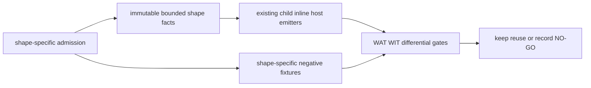

# Bounded Async-Call Internal Consolidation Design

Date: 2026-08-09
Status: M2 Step 2 design-only; no compiler changes are authorized by this document

## Decision

Use a private, descriptor-only reuse layer for the already admitted bounded
async-call shapes. The layer owns immutable frame facts and validates lifecycle
invariants; it does not own source admission, phase dispatch, cancellation
branching, or a generic WAT emitter.

The first implementation must preserve the current generated WAT byte for byte
for every positive fixture. If byte output cannot remain identical, the gate
falls back to marker-order and WIT/hash differential checks and records the
reason. A changed marker order, import, frame offset, WIT hash, or rejection
boundary is a NO-GO for M2 and leaves the current templates in place.

This is private compiler structure only. It does not add `Future<T>` lowering,
public `own<T>`/`borrow<T>`/`ref<T>`, pointer or reference syntax, or changes to
`@async`, `@await`, `@cancel`, default dispatch, or the existing Component
targets.

## Evidence And Scope

M2 Step 1 measured three independent template families:

| Family | Source span | Current frame shapes |
| --- | ---: | --- |
| unit/scalar child | 172 lines | 16-byte unit; 20-byte scalar |
| inline unit/scalar | 304 lines | 16-byte unit; 20-byte scalar |
| host scalar argument | 253 lines | fixed 20-byte scalar |

The detailed measurements and overlap limits are recorded in
[`2026-08-09-async-call-internal-consolidation-assessment.md`](2026-08-09-async-call-internal-consolidation-assessment.md).

The accepted shapes remain:

1. one root-owned child continuation with an optional literal `u32` argument;
2. one inline host phase followed by one child phase, with an optional literal
   `u32` argument;
3. one registered asynchronous host call with one `u32` argument.

No shape admits payloads, resources, lists, streams, borrowed values, dynamic
expressions, multiple live children, loops, recursion, or arbitrary producers.

## Architecture



The data flow is one way. A planner creates a shape-specific fact record after
its own registry, topology, signature, and red-boundary checks pass. The
existing emitter receives that record only for layout validation and pure
fragment substitution. Each emitter still selects its own template and emits
its own control flow.

The proposed private module is
`src/build/codegen_component_async_shape.zig`. It must not import
`codegen_pipeline`, and the plan modules must remain responsible for their own
descriptor and token-shape checks.

## Shared Data Structure

The structure is intentionally small and immutable after construction. The
following is the contract, expressed in Zig-like notation; names are fixed for
the implementation plan:

```zig
pub const BoundedAsyncMode = enum {
    child,
    inline,
    host_scalar,
};

pub const BoundedFrameLayout = struct {
    size: u32,
    alignment: u32,
    waitable_set_offset: u32,
    active_subtask_offset: u32,
    phase_offset: u32,
    u32_argument_offset: ?u32,
};

pub const BoundedCleanupAction = enum {
    cancel_active_subtask,
    drop_active_subtask_if_owned,
    drop_waitable_set,
    clear_root_context,
    free_root_frame,
    create_next_waitable_set,
    start_next_child,
    root_task_return,
    root_task_cancel,
};

pub const BoundedCleanupContract = struct {
    normal: []const BoundedCleanupAction,
    cancelled: []const BoundedCleanupAction,
};

pub const BoundedAsyncShape = struct {
    mode: BoundedAsyncMode,
    frame: BoundedFrameLayout,
    cleanup: BoundedCleanupContract,
};
```

Shared invariants validated by the module:

- the common slots are `waitable_set_offset = 0`,
  `active_subtask_offset = 4`, and `phase_offset = 8`;
- all offsets are 4-byte aligned and each optional slot lies within `size`;
- a scalar shape uses `u32_argument_offset = 12` and `size = 20`;
- a unit shape uses `u32_argument_offset = null` and `size = 16`;
- the active encoded subtask is released before its waitable set;
- context is cleared before the frame is freed;
- a terminal action occurs after resource cleanup and exactly once in each
  sequence;
- `create_next_waitable_set` and `start_next_child` are legal only in the
  inline normal-resume sequence, never in a cancellation sequence.

The shape record contains no mutable runtime state, allocator, source token
slice, descriptor registry handle, or payload ownership object. It is a layout
and lifecycle contract, not a runtime frame and not a public language value.

## Capability-Owned Fields

The shared module validates facts but does not invent them.

| Field or behavior | Shared rule | Capability-owned value |
| --- | --- | --- |
| common slot offsets | `0/4/8`, aligned | none |
| frame size | contains all declared slots | `16` or `20` for current shapes |
| scalar slot | optional, at `+12` | child/inline/host scalar admission |
| mode | selects a known bounded family | child, inline, or host scalar |
| phase values | state is explicit and finite | child `1`; inline `1/2/3`; host `1` |
| async import | not inferred | descriptor module, name, params, results |
| callback event | not inferred | current Component event values, including cancel event `6` where used |
| cancellation status | not generalized | pinned `subtask.cancel` terminal status for that shape |
| terminal endpoint | not inferred | root `[task-return]` and `[task-cancel]` names |
| cleanup order | must satisfy shared invariants | exact normal/cancel sequence per template |
| admission | outside the layer | registry/hash/topology/negative fixture contract |

The module must reject an unknown mode or a layout with an unowned slot. It
must never add an offset merely because another shape uses one.

## Frame And Lifecycle Matrix

All current shapes use a root-owned frame with the following common prefix:

| Shape | Size/alignment | `+0` | `+4` | `+8` | `+12` |
| --- | --- | --- | --- | --- | --- |
| child unit | 16 / 4 | waitable set | encoded subtask | helper state | unused |
| child scalar | 20 / 4 | waitable set | encoded subtask | helper state | `u32` argument |
| inline unit | 16 / 4 | waitable set | current subtask | phase | unused |
| inline scalar | 20 / 4 | waitable set | current subtask | phase | `u32` argument |
| host scalar | 20 / 4 | waitable set | encoded subtask | helper state | `u32` argument |

`frame-next` advances by the exact shape size. No shape uses a separate
terminal slot. The terminal condition is represented by the callback/endpoint
protocol and cleanup order. In particular, `+12` cannot be borrowed from the
existing `GenericAsyncFrame`, whose `terminal_offset` occupies that slot.

Normal and cancellation sequences are deliberately explicit:

| Shape | Normal completion | Cancellation |
| --- | --- | --- |
| child | drop owned subtask; drop waitable set; clear context; free frame; root return | not admitted by this template; keep its existing rejection boundary |
| inline | drop current subtask; drop waitable set; create next waitable set; start child; final child completion then drop waitable/context/frame; root return | cancel active subtask; drop it on pinned terminal status; drop waitable set; clear context; free frame; root cancel |
| host scalar | `cleanup(0)`: drop subtask if owned; drop waitable set; clear context; free frame; root return | `cleanup(1)`: cancel subtask first; drop it; then waitable/context/frame; root cancel |

The shared validator checks ordering only. It does not emit any of these
actions, because inline phase transitions and host cancellation status are not
semantically interchangeable.

## Layer Boundaries

### Shared structural layer

The layer may provide:

- layout construction and offset/size/alignment validation;
- cleanup-sequence validation;
- pure marker-list and slot metadata helpers used by differential tests;
- token helpers only after their input ranges, token-count rules, and failure
  behavior are proven identical by unit tests.

It may not parse a WIT file, look up a registry descriptor, inspect arbitrary
producer expressions, or choose an emitter template.

### Admission layer

`codegen_component_async_call_plan.zig` and
`codegen_component_async_host_arg_plan.zig` retain independent admission. They
continue to own locator/member/hash checks, parameter and result checks,
topology counts, exact-body checks, and stable rejection reasons. Similar
helper names are not sufficient evidence for extraction: host admission has a
pinned registry descriptor and scalar argument, while async-call admission has
different topology and inline-shape boundaries.

### Emitter layer

`codegen_component_async_call.zig` and
`codegen_component_async_host_arg.zig` retain the current templates and
mode-specific fragments. The first adapter may assert a `BoundedAsyncShape`
before substitution, but it must not introduce new WAT comments or reorder
existing text. A later extraction of repeated WAT fragments is allowed only if
the differential gate proves identical output.

## Testing And Promotion Gates

Implementation is split into independently verifiable steps:

1. Add the pure shape module and unit-test all five current layouts, invalid
   offsets, invalid alignment, duplicate terminal actions, and illegal inline
   cancellation transitions. No emitter imports the module yet.
2. Add plan-to-shape adapters that expose only immutable facts. Existing
   positive and negative planner tests must remain unchanged and continue to
   report the same errors.
3. Add differential tests for every positive child, inline, and host fixture:
   compare old/new WAT byte-for-byte; compare marker order, import names,
   frame offsets, and WIT bytes/hash; compare generated rejection behavior for
   every negative fixture.
4. Run the focused Zig tests, Component/WIT validation, Rust/Wasmtime
   ready/pending/cancel gates, and `./src/build/test/run_tests.sh`.

The promotion gate is green only if byte-for-byte comparison passes, or a
documented fallback proves that the only delta is reviewed non-ABI text while
marker order, imports, frame offsets, WIT bytes/hash, runtime terminal results,
and rejection boundaries remain unchanged. A failed focused gate, a changed
WIT hash, a different `ResourceTable` terminal result, or an ambiguous cleanup
owner is a recorded NO-GO. In that case, remove only the new private adapter
and retain the existing templates; do not broaden the task to generic async
lowering.

## Alternatives

### A. Descriptor-only structural reuse (selected)

This is the selected approach. It captures real duplication in frame facts and
cleanup invariants while keeping mode-specific control flow visible. It has a
small reviewable surface and a direct rollback path: the emitters can stop
consuming the facts without changing their templates.

### B. Extract token helpers only

This has the lowest output risk, but it leaves all frame/lifecycle duplication
and yields little architectural value. It is a fallback if layout validation
cannot be introduced without affecting the current tests.

### C. Generic WAT emitter or generic `Future<T>` lowering

Reject this for M2. The three templates differ in phase transitions, callback
events, cancellation status, host imports, and cleanup ownership. Hiding those
branches behind a generic emitter would weaken fail-closed admission and could
silently change Component behavior. It is outside this design and requires a
new producer/ownership design plus independent ABI probes.

### D. Extend `GenericAsyncFrame`

Reject this for M2. Its fixed terminal slot at `+12` and 8-byte alignment do
not match the bounded scalar/host layouts. Reusing it would conflate the Core
generic frame contract with Component `task.return`/subtask cleanup evidence.

## Exit Criteria

M2 Step 2 is complete when the private shape contract above is checked in, the
implementation plan names each file and test, and the plan preserves a no-op
rollback to the current templates. No compiler behavior is promoted until the
differential gates pass. A documented NO-GO is an acceptable terminal result
and hands the mainline to M3 without changing runtime behavior.
