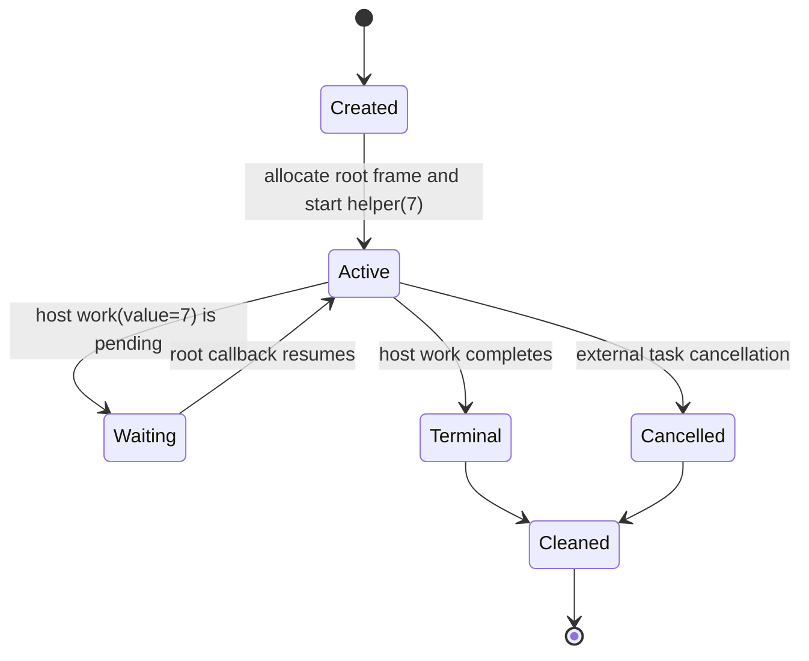

# Async Host Scalar-Argument ABI Probe

Date: 2026-08-09  
Status: design approved; probe-only, no compiler promotion

## Goal

Measure one private Component shape in which a private asynchronous host
operation receives one `u32` argument from a colorless Do helper. The probe
must prove the argument's canonical flat representation, root-owned frame
storage, callback continuation, and ready/pending/cancel cleanup before any
registry, semantic admission, or codegen change is considered.

## Exact Source Shape

The hand-authored Do source is intentionally fixed:

```do
work = @host_async_func(
    "do:async-call-arg-probe/host@0.1.0",
    "work",
    (u32) -> nil
)

helper(value u32) -> nil {
    pending Future<nil> = work(value)
    @await(pending)
}

run() -> nil {
    child Future<nil> = @async(helper(7))
    @await(child)
}

start() {}
```

The helper is an internal continuation. It is not exported and has no
independent `[task-return]helper` endpoint. The literal `7` is part of the
probe contract; arbitrary expressions and runtime fan-out are outside this
shape.

## Pinned WIT Shape

The probe uses a new private package and does not modify the compiler registry:

```wit
package do:async-call-arg-probe@0.1.0;

interface host {
  work: async func(value: u32);
}

world probe {
  import host;
  export run: async func();
}
```

The WIT file hash is recorded after it is created. The canonical Core WAT
must use the measured async import and callback metadata from the pinned
toolchain; the design does not assume a flat parameter count before the
probe runs.

## Architecture

The root task owns one frame and one waitable set. The helper receives the
frame and its `u32` value, stores the value in the frame before invoking the
host async import, and resumes through the root callback. The callback loads
the stored value only to prove it survived the suspension boundary; the host
oracle independently records the value received by `work`.



The frame layout is measured by the canonical WAT and recorded as explicit
offsets. At minimum it contains:

```text
root waitable-set handle
active host subtask/future handle
helper continuation state
one u32 argument slot
```

The existing scalar child probe's `u32@12` slot is a reference point only. A
new probe must record its own frame size, alignment, argument offset, and
canonical import words rather than copying those values as a formula.

## Ownership And Cancellation

The terminal cleanup order is fixed:

1. finish or cancel the active host subtask;
2. drop the subtask when the Component ABI reports guest ownership;
3. drop the waitable set after no callback can access the frame;
4. clear the root context slot;
5. free the root frame exactly once;
6. call root `task.return` for completion or root `task.cancel` for external
   cancellation.

The Rust/Wasmtime oracle must observe:

| Mode | Required observation |
| --- | --- |
| `ready` | one host call with argument `7`, one completion, one cleanup path |
| `pending` | one host call with argument `7`, one external wake, one completion, one cleanup path |
| `cancel` | one host call with argument `7`, active subtask cancellation/drop, no completion after cancellation |

Every mode must report an empty `ResourceTable` and no duplicate future,
subtask, waitable-set, context, or frame release. Cancellation terminates
live guest/Component state only; it never rolls back an external host effect
that was already issued.

## Probe Artifacts

Create only these artifacts in this phase:

- `examples/p3-runtime/wit/async-call-arg-probe.wit`
- `examples/p3-runtime/async-call-arg-probe-canonical.wat`
- `examples/p3-runtime/test_async_call_arg_probe.sh`
- `examples/p3-runtime/rust-host-runner/src/bin/async_call_arg_probe.rs`

The existing compiler-generated scalar argument fixtures remain unchanged.
The probe script must pin and print the exact versions and SHA-256 values for
`wasm-tools 1.255.0` and the legacy `wasm-tools 1.254.0` route used for async
assembly, plus Rust `1.97.1` and Wasmtime `47.0.2` where applicable.

## Verification Gate

The probe is green only when all of the following pass:

1. The WIT package, world, import, export, and hash match the checked-in
   source.
2. The canonical Core WAT parses, embeds the async custom section, and
   assembles into a Component with the pinned toolchain route.
3. Component validation succeeds with `cm-async,cm-more-async-builtins`.
4. The WAT contains explicit argument-store, argument-load, parent-resume,
   host-call, subtask-drop, waitable-drop, context-clear, and frame-free
   markers.
5. The WAT contains no `[task-return]helper` import and no resource-drop
   import.
6. The Rust/Wasmtime runner passes `ready`, `pending`, and `cancel`, records
   the exact host argument `7`, and reports an empty `ResourceTable`.
7. The default compiler regression suite remains unchanged and green.
8. The probe's negative checks reject the following before Component assembly:
   - two host parameters;
   - a host parameter other than `u32`;
   - a missing or extra call argument;
   - a non-literal root argument;
   - helper payload return;
   - two live child operations or a second await;
   - list, stream, resource, borrowed, or future payloads;
   - an independent helper task-return endpoint;
   - legacy `async` declaration syntax.

## No-Go And Promotion Boundary

This phase must not:

- add a descriptor row to `src/build/p3_async_registry.json`;
- change `sema_imports.zig`, `codegen_component_async_call.zig`, or any
  default/v1/v2 dispatcher;
- widen `@host_async_func`, `@async`, `@await`, or `@cancel` semantics;
- add public `own<T>`, `borrow<T>`, `ref<T>`, pointer, reference, lifetime,
  `externref`, `anyref`, or `funcref` syntax;
- infer a generic host argument area from the measured probe;
- accept arbitrary producer expressions, multiple arguments, multiple live
  operations, payloads, or borrowed/resource values.

A failed pinned assembly, missing argument value, ambiguous frame ownership,
or cleanup mismatch is a recorded no-go. The exact command and stderr must be
kept in `doc/pending_blocked.md`, and the existing bounded async-call targets
must remain unchanged.

Only a green probe authorizes a separate implementation plan. That future
plan must add a new private descriptor, exact semantic admission, an isolated
emitter, positive and negative compiler fixtures, and a fresh Component/
Rust/Wasmtime promotion gate. This document alone does not authorize compiler
promotion.

## Expected Outcome

The successful outcome is evidence that one scalar argument can cross a
host-async suspension boundary under the current root-owned continuation
architecture. It is not evidence for generic async lowering, arbitrary host
signatures, public ownership syntax, or general WASI/HTTP support.
