# Inline Scalar Async-Call Design

Status: approved design; implementation pending.

Date: 2026-08-09

## Goal

Extend the opt-in `--p3-async-call-component` target from a no-argument inline
helper to one inline helper call with exactly one `u32` parameter, while
preserving Do's colorless async semantics and the existing child-only scalar
slice.

This is an ABI and frame-storage probe. It is not a claim that `u32` is the
only scalar type the language will support, and it does not generalize async
call composition.

## Baseline

The current bounded target has three relevant shapes:

- a unit helper used by one explicit `@async(helper())` child;
- a unit helper called once inline and once through `@async(helper())`;
- a helper with one `u32` parameter used by one explicit
  `@async(helper(7))` child.

The inline template already uses a root-owned frame with a waitable set,
current host future, and phase. The scalar child template already reserves a
`u32` slot at frame offset `12`. The next slice combines those two existing
capabilities without adding a new WIT descriptor or public ownership syntax.

## Exact Source Contract

The positive fixture uses this shape:

```do
work = @host_async_func("do:generic-async-call-probe/host@0.1.0", "work", () -> nil)

helper(value u32) -> nil {
    pending Future<nil> = work()
    @await(pending)
}

run() -> nil {
    helper(7)
    child Future<nil> = @async(helper(7))
    @await(child)
}

start() {}
```

The analyzer must require all of the following:

1. `helper` has exactly one named parameter of type `u32` and returns `nil`.
2. `run` remains a colorless `() -> nil` function.
3. `run` contains exactly one leading inline `helper(<u32 literal>)` call,
   followed by exactly one `Future<nil> = @async(helper(<u32 literal>))`
   declaration and one `@await(child)`.
4. The inline and child argument values are recorded independently in the
   plan, even though the positive fixture uses `7` for both calls. This keeps
   the single frame slot explicitly phase-local and prevents the emitter from
   silently inventing an argument value.
5. The helper body remains the existing exact host-work/await body. The
   parameter is deliberately unused in this probe; the gate verifies argument
   materialization and frame reuse, not a new host ABI parameter.

The normal compiler path, `--p3-async-component`, and
`--p3-async-component-v2` must retain their existing behavior.

## Lowering Architecture

### Plan contract

`GuestAsyncCallPlan` retains the existing child `argument_value: ?u32` field
and gains an `inline_argument_value: ?u32` field. The existing child-only unit
and scalar plans set `inline_argument_value` to `null`. The new inline scalar
plan sets both values to the parsed literals.

The plan remains token-exact. It must reject a non-literal argument before WAT
emission and must never infer an argument from a function name or a `Future`
type.

### Frame layout

The inline scalar template uses a 20-byte root-owned frame:

```text
offset 0: waitable-set handle
offset 4: current host future/subtask handle
offset 8: continuation phase
offset 12: current helper u32 argument
```

The argument slot is reused sequentially. It is written before the inline
phase and written again before the child phase. No two helper invocations are
live at the same time, so no ownership or aliasing protocol is introduced.

### Phase flow

```mermaid
stateDiagram-v2
    [*] --> InlinePending: store inline u32; host.work()
    InlinePending --> ChildPending: callback; drop inline future once
    ChildPending --> Terminal: callback; drop child future once
    InlinePending --> Cancelled: external task cancel
    ChildPending --> Cancelled: external task cancel
    Cancelled --> [*]: release active future, waitable set, frame once
    Terminal --> [*]: task-return run
```



The inline call remains a local continuation. It must not emit
`[task-return]helper` or `[async-lift]helper`, and it must not add a helper WIT
export. The root task owns the frame and receives both callback phases.

### Cancellation

Cancellation follows the current Component protocol. It releases the active
future/subtask and frame state exactly once, drops the waitable set, and does
not roll back a host effect already issued by `work`. The source fixture does
not add a new cancellation syntax or operation.

## Rejected Shapes

The opt-in target must continue to reject these forms with
`UnsupportedP3AsyncCallComponent` before producing a partial WAT file:

- zero parameters in the new inline scalar shape;
- two or more parameters;
- a parameter type other than `u32`;
- a variable, call, arithmetic expression, or other non-literal argument;
- helper payload returns;
- list, record, resource, stream, or future payloads;
- a second inline call, a second child, nested helper calls, branches, loops,
  recursion, or arbitrary producer expressions;
- independent guest child-task exports;
- `own<T>`, `borrow<T>`, `ref<T>`, pointer, reference, or lifetime syntax.

The existing child-only scalar fixture remains accepted. Existing unit inline
and child-only fixtures remain byte-for-byte compatible except for tests that
intentionally inspect the new markers.

## Verification Gates

The implementation is complete only when all gates pass:

1. Plan unit tests prove the exact positive shape, independent inline/child
   literals, preservation of the old scalar plan, and all rejected shapes.
2. Emitter tests prove the 20-byte frame, argument stores/loads in both
   phases, two host call sites, no helper export, and terminal cleanup markers.
3. Compile fixtures include the positive inline scalar source and negative
   payload, dynamic-argument, multiple-inline, and multiple-child sources.
4. The pinned legacy `wasm-tools` assembly and validation gate succeeds, with
   the generated WIT sidecar unchanged.
5. Rust/Wasmtime runs `ready`, `pending`, `cancel-inline`, and `cancel-child`.
   Every mode must report the expected host future drops, no duplicate drop,
   and an empty resource table.
6. `./src/build/test/run_tests.sh` remains green, and the existing v1/v2
   component gates remain green.
7. `doc/master_plan.md` and `doc/pending_blocked.md` record this as a bounded
   scalar inline checkpoint. They must continue to list general async-call,
   arbitrary producers, payload/resource/stream futures, ownership syntax,
   general filesystem async, external HTTP, and independent guest child tasks
   as pending.

## Non-Goals and Follow-Up Boundary

This design does not add `own<T>`, `borrow<T>`, `ref<T>`, references,
lifetime checking, general host argument lowering, or a new async ABI. It also
does not unblock the pinned independent guest child-task endpoint. Those
capabilities require separate design, pinned WIT/WAT probes, and cleanup gates;
they must not be inferred from this scalar frame-storage result.
